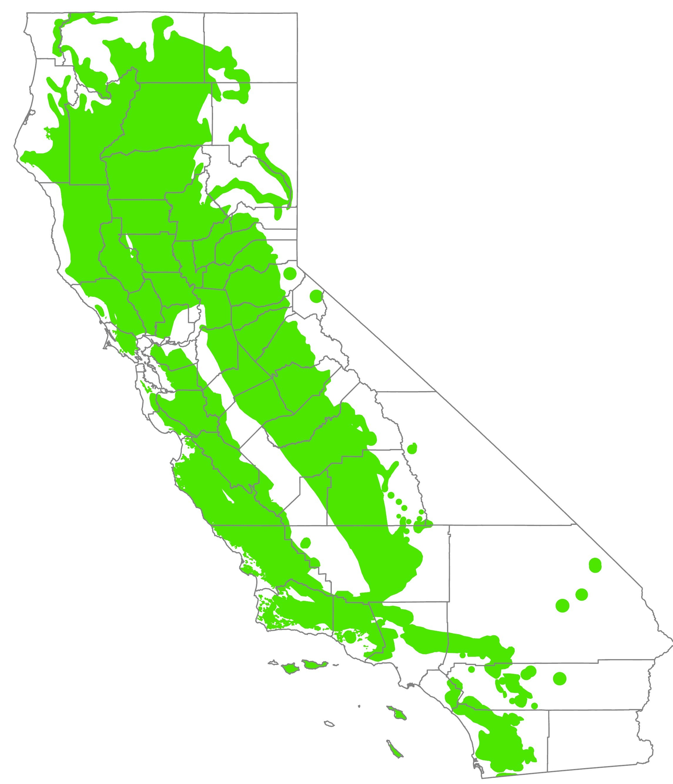

# (PART\*) Introduction {-}
# Introduction {#Intro}

```{r setup, include=FALSE}
knitr::opts_chunk$set(echo = FALSE)
```

California has at least 29 native species and varieties of oaks (*Quercus* species), as well as many natural interspecies hybrids. California native oaks ranges from large trees, up to about 25 m tall, to shrubs no taller than about 1.5 m. Traditionally, California native oaks have been assigned to three subgroups commonly referred to as white oaks (including *Q. douglasii*, *Q. engelmanii*, *Q. lobata*, *Q. garryana* and various scrub oaks), black oaks (including *Q. agrifolia*, *Q. kelloggii*, *Q. parvula*, and *Q. wislizeni*), and intermediate oaks (including *Q. chrysolepis* and *Q. vaccinifolia*). More recent infrageneric classification of oaks (subgenera, sections, and subsections) has reshuffled some of these groups as shown in the Table 1.1 below [@Manos2021]. These subgeneric classifications are significant because hybridization only occurs between oaks in the same subgroups. Furthermore, some insects, pathogens, and other agents may selectively colonize or damage oaks in certain subgroups.

```{r import}
library(readr)
options(readr.show_col_types = FALSE)
CA_Oak_species_table <- read_csv("CA Oak species table.csv")

```

```{r nice-tab, message=TRUE, warning=TRUE, tidy=FALSE}
library(kableExtra)
options(knitr.kable.NA = '')

Oakspp <- CA_Oak_species_table
kbl(Oakspp[1:28,2:6], booktabs = TRUE, caption = "California native oak species and varieties grouped by subspecies") %>% 
  pack_rows("Subspecies Lobatae", 1, 8 ) %>%
  pack_rows("Subspecies Quercus", 9, 28)

```

Oak woodlands and other vegetation types dominated by oak trees cover about 3 million hectares in California or roughly 7.5% of the state’s land area (Bolsinger 1988).  California native oaks also occur as components in desert plant communities, chaparral, and conifer-dominated forest ecosystems (figure \@ref(fig:Oakrng)).

(ref:Oakrng) Approximate range of native oak species in California compiled from multiple sources.

```{r Oakrng, fig.align='center', fig.asp=.75, fig.cap="(ref:Oakrng)", out.width='60%'}

```


Remnant native oaks have also become incorporated into developed areas within many California communities.  The importance of oaks in the California landscape is reflected in the large number of California cities, localities, and geographic features that include references to oaks in either English or Spanish (encina, roble). In many urbanized landscapes, as in wildlands throughout much of California, individual oaks and oak woodlands are critical elements of the ecosystem.

Oak woodlands provide extremely important wildlife habitat and have higher levels of biodiversity than virtually any other terrestrial ecosystem in California.  At least 300 terrestrial vertebrate species (Guisti and others 1996), 1,100 native vascular plant species (CalFlora 1998), 370 fungal species, and an estimated 5,000 arthropod species (Swiecki and others 1997) are associated with California oak woodlands.

This publication focuses on the relatively small number of microorganisms (primarily fungi) and arthropods (primarily insects) that are capable of causing noticeable damage to oaks in California.  We have included agents that cause serious damage to oaks, as well as some common agents that are assocaited with obvious symptoms even if they are not especially detrimental to oak health.  Conspicuous but relatively inconsequential agents, such as cynipid gall wasps, often attract more attention than more cryptic agents that can severely impact oak health and structural integrity, such as canker rot fungi. However, some agents that have little or no impact on oak health may still create a nuisance in urban settings as the result of materials that are shed (e.g., sap) or because they adversely affect the appearance of oaks in the landscape.

Sudden oak death, caused by the introduced pathogen *Phytophthora ramorum*, emerged as a major disease of several California oaks around 1995 and highlighted the need for information about agents that damage oaks in California. Since then, an increasing number of invasive organisms that cause oak mortality or degrade oak health, including the goldspotted oak borer (*Agrilus auroguttatus*), have become established in California. This publication is primarily intended to help arborists, land managers, pest management specialists, and other professionals identify and assess the likely impacts of common, mostly endemic agents that attack oaks in California, as well as more exotic agents that have been more recently introduced. We have incorporated enough technical information to make this document useful for professionals, but property owners and other members of the general public can also use this publication to better understand common oak diseases and pests. A much more comprehensive compilation of agents that feed on, colonize, and/or damage can be found in the California Oak Disease and Arthropod (CODA) database (http://coda.phytosphere.com).

Due to a lack of detailed range data for most agents on California oaks, the included range maps are approximate.  For most agents, the documented range (blue in range maps) is based on multicounty regions (fig. 2).  The likely but unconfirmed range (magenta in range maps) is based on both the likely distribution of the agents and the range of the known oak hosts. More detailed range data was available for a few agents, and for these species, we have generally used specific county boundaries to show the reported range.  Agents may also occur beyond the illustrated ranges and are not necessarily found in all portions of the illustrated ranges.

Information on agent biology, host range, and importance provided in this publication will be helpful for determining whether management actions are likely to be necessary or practical. However, this publication does not provide specific recommendations for the management of the described pests and diseases. Readers interested in current management recommendations should consult the University of California Integrated Pest Management website (http://www.ipm.ucdavis.edu/) or their local University of California Cooperation Extension office.