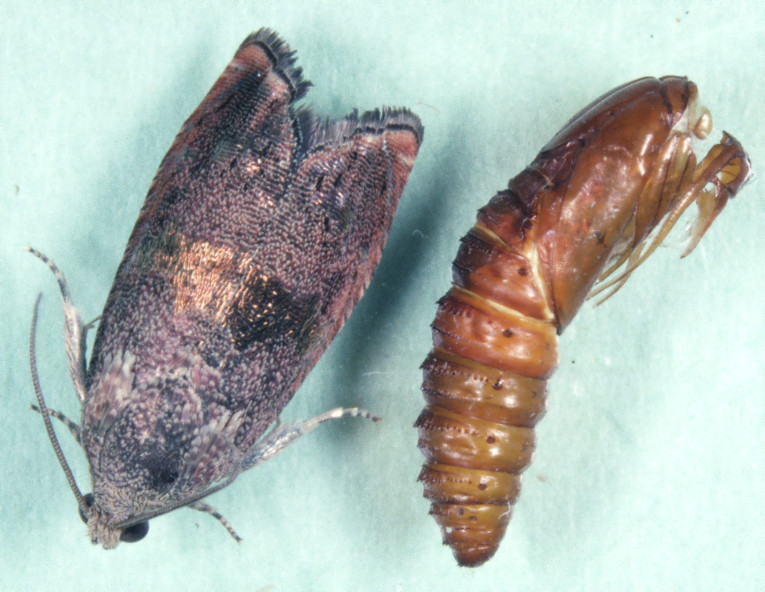

# (PART) Insects and Mites {.unnumbered}

# Acorn feeders {#Acorninsect}

## Filbert weevils {#Filberweevils .unnumbered}

### *Curculio aurivestis*, *C. occidentis*, *C. pardus* (Curculionidae) {.unnumbered}

```{r setup, include=FALSE}
knitr::opts_chunk$set(echo = FALSE)
```

### Distribution / Hosts {.unnumbered}

*Curculio aurivestis* occurs from Victoria, British Columbia to southern California. It is reported on canyon live, Oregon white, and other oaks. *C. occidentis* is widely distributed throughout the western U.S. and California. It is reported on a wide variety of oaks as well as tanoak and California hazelnut. *C. pardus* occurs from Washington to Los Angeles County, California. It is reported from coast live, interior live, canyon live, blue, valley, and other oak species.

```{r, fig.align='center', fig.asp=.75, fig.cap="Filbert weevil range", out.width='30%'}
knitr::include_graphics("images/distributions/statewide.gif")
```

### Symptoms {.unnumbered}

Pinhead size oviposition wounds on acorns are commonly surrounded by a discolored and/or raised area and may exude small amounts of sap. Round, open holes (about 1—2 mm diameter) are left in the acorn seed coat when larvae exit. When infested acorns are cut open, dark brown granular frass caused by larvae tunneling throughout the interior of the acorn is visible. One or more (up to at least eight) filbert weevil larvae may be found in a single acorn. Filbert weevil and filbertworm larvae may occur in the same acorn (figure \@ref(fig:AcIns1)). Filbert weevil exit holes and tunneling favor secondary colonization of the acorn cotyledons by various fungi.

(ref:AcIns1) This valley oak acorn contained larvae of five filbert weevils and one filbertworm (second from left). The exit hole (right) indicates that at least one additional larva has already exited the acorn.

```{r AcIns1, fig.align='center', fig.asp=.75, fig.cap="(ref:AcIns1)", out.width='80%'}

```

### Agent Description {.unnumbered}

Larvae are white to cream-colored and about 6—8 mm long; the head is small and brown. They are legless, plump, and relatively sluggish, and assume a curved C-shape when removed from an acorn (figure \@ref(fig:AcIns2)). Adults weevils are about 5.5—6.5 mm long, yellowish-brown, and have long slender snouts (figure \@ref(fig:AcIns3)).

(ref:AcIns2) Filbert weevil and associated damage to a blue oak acorn.

```{r AcIns2, out.width='80%', fig.asp=.75, fig.align='center', fig.cap = "(ref:AcIns2)"}

```

(ref:AcIns3) Adult filbert weevil.

```{r AcIns3, out.width='80%', fig.asp=.75, fig.align='center', fig.cap = "(ref:AcIns3)"}

```

### Biology {.unnumbered}

Adult weevils emerge from pupae in debris or soil beneath trees in summer. Oviposition occurs in summer and fall. The female weevil chews a small hole in the shell of a developing acorn and lays eggs in these holes. Larvae tunnel throughout the acorn. Heavily damaged acorns drop early, beginning in August or earlier. Larval feeding and development continues after the acorns have fallen. When the larva matures in the fall and winter, it bores an exit hole through the acorn seed coat and enters the ground, where it spends the winter. Larvae pupate in spring or summer.Only one generation occurs per year.

### Importance {.unnumbered}

Severely damaged acorns are unable to sprout. Acorns without damage near the embryo axis at the pointed end of the acorn may still germinate, but seedling survivability may be reduced. Infestation levels can vary substantially with locality, year, oak species, and between individual trees at a particular locality. Infestation levels among acorns from a single tree can range up to at least 75%.

### Citation {.unnumbered}

Swiecki, T.J.; Bernhardt, E.A. 2006. Filbert weevils - *Curculio aurivestis*, *C. occidentis*, *C. pardus* (Curculionidae). In Swiecki, T.J., et al. (Eds.) Field Guide to Insects and Diseases of California Oaks, Online edition 2025.

## Filbertworm {#Filbertworm .unnumbered}

### *Cydia latiferreana* (Tortricidae) {.unnumbered}

### Distribution / Hosts {.unnumbered}

Filbertworm is widely distributed throughout the U.S. and California. It attacks the acorns of most oak species as well as hazelnuts or filberts.

```{r, fig.align='center', fig.asp=.75, fig.cap="Filbertworm range", out.width='30%'}
knitr::include_graphics("images/distributions/statewide.gif")
```


### Symptoms {.unnumbered}

Larvae tunnel throughout the interior of acorns (figure \@ref(fig:AcIns4)), leaving brown granular frass and sometimes silken webbing. Round open holes (about 1—2 mm diameter) are left in acorn seed coats when larvae exit. Filbertworm exit holes and tunneling favor secondary colonization of the acorn cotyledons by various fungi.   

(ref:AcIns4) Filbertworm larva and damage to valley oak acorn.

```{r AcIns4, out.width='80%', fig.asp=.75, fig.align='center', fig.cap = "(ref:AcIns4)"}

```

### Agent Description {.unnumbered}

Larvae are beige to light gray, about 18—20 mm long at maturity, with three pairs of true legs; the head is dark brown. Usually only a single filbertworm larva colonizes an infested acorn, but filbert weevil larvae may occur in the same acorn (figure \@ref(fig:AcIns1)). Compared to the slow-moving larvae of the filbert weevil, filbertworm larvae are typically active when removed from an acorn and may drop down on a strand of silk when disturbed. Adults are small, stout-bodied moths with wingspans of 12—15 mm (figure \@ref(fig:AcIns5)). They have rust-brown forewings with several irregular dark or metallic bands and dark hindwings.

(ref:AcIns5) Filbertworm larva and damage to valley oak acorn.

```{r AcIns5, out.width='80%', fig.asp=.75, fig.align='center', fig.cap = "(ref:AcIns5)"}

```

### Biology {.unnumbered}

Moths emerge from pupal cases in litter beneath trees in late spring and early summer, up to about two months before oviposition occurs. Female moths lay eggs throughout the summer on acorns that are still attached to the tree. Eggs are laid singly on the acorn surface. Larvae bore into acorns and feed internally. Heavily damaged acorns drop early, beginning in August or earlier. Insect development continues after the acorns have fallen. When the larva matures in the fall or winter, it bores an exit hole through the acorn seed coat and pupates in plant debris on the ground. There is typically one generation per year, but two generations may be possible in some areas.

### Importance {.unnumbered}

Heavily damaged acorns are unable to sprout. Acorns without damage near the embryo axis at the pointed end of the acorn may still germinate, but seedling survivability may be compromised. Infestation levels can vary substantially with locality, year, oak species, and between individual trees at a particular locality. Infestation levels among acorns from a single tree can range up to at least 80%.

### Citation {.unnumbered}

Swiecki, T.J.; Bernhardt, E.A. 2006. Filbertworm - *Cydia latiferreana* (Tortricidae). In Swiecki, T.J., et al. (Eds.) Field Guide to Insects and Diseases of California Oaks, Online edition 2025.