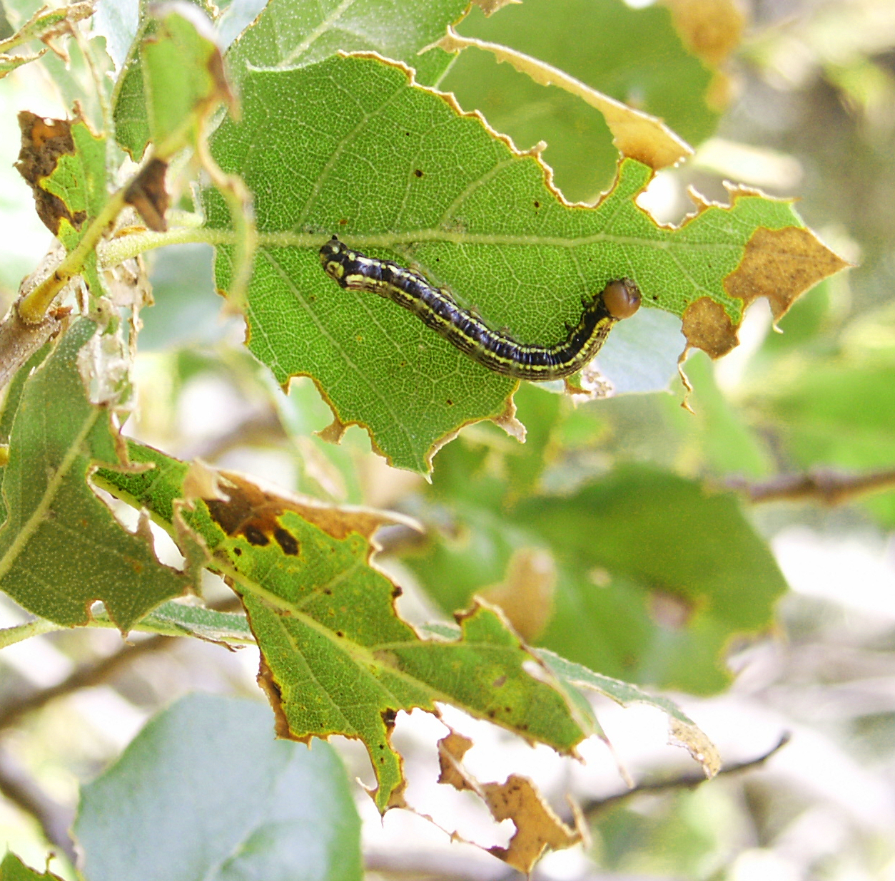

# General foliar feeders {#foliarfeeder}

## California oakworm / California oakmoth {-}

### *Phryganidia californica* (Dioptidae) {-}

#### Distribution / Hosts {-}

The California oakworm is generally found in coastal areas from Del Norte to San Diego County, and inland to near Riverside in the south and Davis in the north. It occurs on most oak species present within its range, as well as on tanoak.

```{r, fig.align='center', fig.asp=.75, fig.cap="California oakworm range", out.width='30%'}
knitr::include_graphics("images/distributions/oakworm.GIF")
```

#### Symptoms {-}

Young larvae feed between veins on the lower leaf surface. Although the upper leaf surface is left intact, it dries out and turns brown. Larvae in later instars chew completely through
the leaf blade, often leaving only major leaf veins. Small frass pellets drop from the canopy as larvae feed. In outbreak years, individual trees or groups of trees may be almost entirely defoliated, typically by late summer or early fall.

(ref:LfIns1) California oakworm larva and feeding damage on coast live oak leaves. Photo: Phytosphere Research.

```{r LfIns1, fig.align='center', fig.asp=.75, fig.cap="(ref:LfIns1)", out.width='75%'}

```

#### Agent Description {-}

Eggs are round and clustered in groups of 20 or more. Eggs are initially white, but develop red centers that become pinkish to brownish before hatching occurs. Larvae (figure  \@ref(fig:LfIns1)) are black with lengthwise yellow stripes, and are about 3 cm long at maturity; the head is large, globose, and brown. Pupae are white or yellow with black markings. Adults are tan to gray moths with  prominent wing veins. Moths are about 15 mm long with wingspans of about 25 mm (figure  \@ref(fig:LfIns2)).

(ref:LfIns2) California oakworm adult moth and empty pupal case on tanoak twig. Photo: Phytosphere Research.

```{r LfIns2, fig.align='center', fig.asp=.75, fig.cap="(ref:LfIns2)", out.width='75%'}
knitr::include_graphics("images/Insect-leaf/Phrcal_AdPupcase_ND_5-2007-PR.jpg")
```

#### Biology {-}

Young larvae overwinter on the lower leaf surfaces of evergreen oaks. In northern California, overwintering larvae mature in May to June. First generation adults are present in June and
July and lay eggs for the second generation of larvae. The second larval generation defoliates trees from July through September. Second generation adults are present in October and November and lay eggs that give rise to overwintering larvae. Evergreen or live oaks are attacked by both spring (first) and summer (second) generations; deciduous oaks normally avoid attack by the spring (first) generation. Development is more variable in southern California where three generations can occur per year and moths may be present at various times between March and November. Oakworm population levels cycle over a period of years, so that numbers may range from very high to nearly absent in any given year.

#### Importance {-}

Within its range, oakworm is probably the most serious defoliator of oaks in California. When defoliation is severe, tree appearance is degraded and frass production may be a nuisance. In years with high oakworm populations, all trees in affected areas may be infested. However, defoliation seldom, if ever, kills affected trees.

#### Citation {-}

Swiecki, T.J.; Bernhardt, E.A. 2025. California oakworm / California oakmoth. In Swiecki, T.J., et al. (Eds.) Field Guide to Insects and Diseases of California Oaks, Online edition 2025.

## Fruit tree leafroller and similar insects {-}

### *Archips argyrospila* (Tortricidae) and others {-}

#### Distribution / Hosts {-}


#### Symptoms {-}


#### Agent Description {-}


#### Biology {-}


#### Importance {-}


#### Citation {-}

Swiecki, T.J.; Bernhardt, E.A. 2025. Fruit tree leafroller and similar insects. In Swiecki, T.J., et al. (Eds.) Field Guide to Insects and Diseases of California Oaks, Online edition 2025.

## Oak ribbed casemaker {-}

### *Bucculatrix albertiella* (Lyonetiidae)  {-}

#### Distribution / Hosts {-}


#### Symptoms {-}


#### Agent Description {-}


#### Biology {-}


#### Importance {-}


#### Citation {-}

Swiecki, T.J.; Bernhardt, E.A. 2025. Oak ribbed casemaker. In Swiecki, T.J., et al. (Eds.) Field Guide to Insects and Diseases of California Oaks, Online edition 2025.

## Tent caterpillars {-}

### Western tent caterpillar - *Malacosoma californicum*, Pacific tent caterpillar - *M. constrictum*, Forest tent caterpillar - *M. disstria* (Lasiocampidae) {-}

#### Distribution / Hosts {-}


#### Symptoms {-}


#### Agent Description {-}


#### Biology {-}


#### Importance {-}

#### Citation {-}

Swiecki, T.J.; Bernhardt, E.A. 2025. Tent caterpillars. In Swiecki, T.J., et al. (Eds.) Field Guide to Insects and Diseases of California Oaks, Online edition 2025.

## Western tussock moth {-}

### *Orgyia vetusta* (Lymantriidae) {-}

#### Distribution / Hosts {-}


#### Symptoms {-}


#### Agent Description {-}


#### Biology {-}


#### Importance {-}


#### Citation {-}

Swiecki, T.J.; Bernhardt, E.A. 2025. Western tussock moth. In Swiecki, T.J., et al. (Eds.) Field Guide to Insects and Diseases of California Oaks, Online edition 2025.


