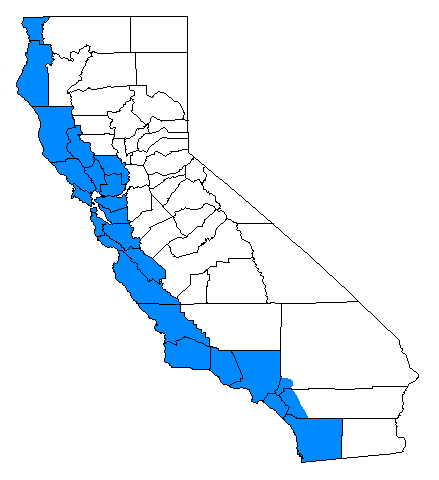

# General foliar feeders {#foliarfeeder}

## California oakworm, California oakmoth - *Phryganidia californica* (Dioptidae) {-}

### Distribution / Hosts {-}

```{r, fig.align='center', fig.asp=.75, fig.cap="California oakworm range", out.width='30%'}

```


### Symptoms {-}


### Agent Description {-}


### Biology {-}


### Importance {-}

### Citation {.unnumbered}

Swiecki, T.J.; Bernhardt, E.A. 2006. California oakworm, California oakmoth - *Phryganidia californica* (Dioptidae). In Swiecki, T.J., et al. (Eds.) Field Guide to Insects and Diseases of California Oaks, Online edition 2025.

## Tent caterpillars (Lasiocampidae): Western tent caterpillar - *Malacosoma californicum*, Pacific tent caterpillar - *M. constrictum*, Forest tent caterpillar - *M. disstria* {-}

### Distribution / Hosts {-}


### Symptoms {-}


### Agent Description {-}


### Biology {-}


### Importance {-}

## Western tussock moth - *Orgyia vetusta* (Lymantriidae) {-}

### Distribution / Hosts {-}


### Symptoms {-}


### Agent Description {-}


### Biology {-}


### Importance {-}

## Fruit tree leafroller - *Archips argyrospila* (Tortricidae) and others {-}

### Distribution / Hosts {-}


### Symptoms {-}


### Agent Description {-}


### Biology {-}


### Importance {-}

## Oak ribbed casemaker - *Bucculatrix albertiella* (Lyonetiidae) {-}

### Distribution / Hosts {-}


### Symptoms {-}


### Agent Description {-}


### Biology {-}


### Importance {-}

