# General foliar feeders {#foliarfeeder}

## California oakworm / California oakmoth {-}

### *Phryganidia californica* (Dioptidae) {-}

#### Distribution / Hosts {-}

The California oakworm is generally found in coastal areas from Del Norte to San Diego County, and inland to near Riverside in the south and Davis in the north. It occurs on most oak species present within its range, as well as on tanoak.


```{r, fig.align='center', fig.asp=.75, fig.cap="Counties with known detections of California oak worm (orange shading) and native oak species (green) in California.", out.width='30%'}
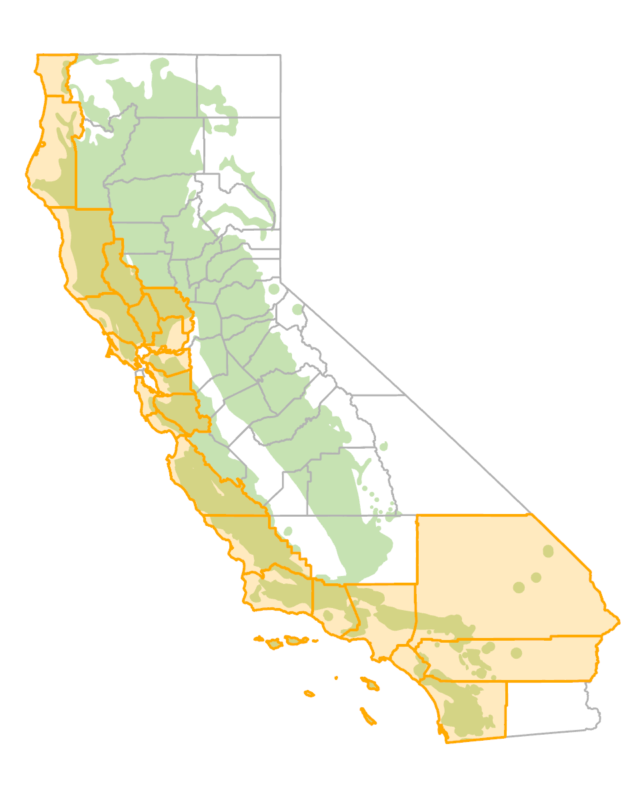
```


#### Symptoms {-}

Young larvae feed between veins on the lower leaf surface. Although the upper leaf surface is left intact, it dries out and turns brown. Larvae in later instars chew completely through
the leaf blade, often leaving only major leaf veins. Small frass pellets drop from the canopy as larvae feed. In outbreak years, individual trees or groups of trees may be almost entirely defoliated, typically by late summer or early fall.

(ref:LfIns1) California oakworm larva and feeding damage on coast live oak leaves. Photo: Phytosphere Research.

```{r LfIns1, fig.align='center', fig.asp=.75, fig.cap="(ref:LfIns1)", out.width='75%'}
knitr::include_graphics("images/Insect-leaf/Phrcal_larv_QA_Phytosphere.jpg")
```

#### Agent Description {-}

Eggs are round and clustered in groups of 20 or more. Eggs are initially white, but develop red centers that become pinkish to brownish before hatching occurs. Larvae (figure  \@ref(fig:LfIns1)) are black with lengthwise yellow stripes, and are about 3 cm long at maturity; the head is large, globose, and brown. Pupae are white or yellow with black markings. Adults are tan to gray moths with  prominent wing veins. Moths are about 15 mm long with wingspans of about 25 mm (figure  \@ref(fig:LfIns2)).

(ref:LfIns2) California oakworm adult moth and empty pupal case on tanoak twig. Photo: Tedmund J. Swiecki and Elizabeth A. Bernhardt, Phytosphere Research.

```{r LfIns2, fig.align='center', fig.asp=.75, fig.cap="(ref:LfIns2)", out.width='75%'}
knitr::include_graphics("images/Insect-leaf/Phrcal_AdPupcase_ND_5-2007-Phytosphere.jpg")
```

#### Biology {-}

Young larvae overwinter on the lower leaf surfaces of evergreen oaks. In northern California, overwintering larvae mature in May to June. First generation adults are present in June and
July and lay eggs for the second generation of larvae. The second larval generation defoliates trees from July through September. Second generation adults are present in October and November and lay eggs that give rise to overwintering larvae. Evergreen or live oaks are attacked by both spring (first) and summer (second) generations; deciduous oaks normally avoid attack by the spring (first) generation. Development is more variable in southern California where three generations can occur per year and moths may be present at various times between March and November. Oakworm population levels cycle over a period of years, so that numbers may range from very high to nearly absent in any given year.

#### Importance {-}

Within its range, oakworm is probably the most serious defoliator of oaks in California. When defoliation is severe, tree appearance is degraded and frass production may be a nuisance. In years with high oakworm populations, all trees in affected areas may be infested. However, defoliation seldom, if ever, kills affected trees.

#### Citation {-}

Swiecki, T.J.; Bernhardt, E.A. 2025. California oakworm / California oakmoth. In Swiecki, T.J., et al. (Eds.) Field Guide to Insects and Diseases of California Oaks, Online edition 2025.

## Fruit tree leafroller and similar insects {-}

### *Archips argyrospila* (Tortricidae) and others {-}

#### Distribution / Hosts {-}

Fruit tree leafroller is found throughout the U. S.  In California, it is found from Siskiyou County southward to San Diego County and occurs on almost all oak species as well as pome fruits, shade, and ornamental plants.  The obliquebanded leafroller (*Choristoneura rosaceana*), which has similar larvae, has been reported on coast live oak in California.  It occurs on many hosts throughout the U.S.  Other larvae that cause similar damage on oaks in California include the European leafroller (*A. rosana*), the oak leaftier (*Croesia semipurpurana*), the stenomid oak leaf tier (*Setiostoma fernaldella*), and the phycitid oak leaf tier (*Trachycera caliginella*).


```{r, fig.align='center', fig.asp=.75, fig.cap="Approximate ranges of fruit tree leafroller (orange shading) and native oak species (green) in California.", out.width='30%'}
knitr::include_graphics("images/distributions/statewide.png")
```


#### Symptoms {-}

Larvae feed only in the spring on new leaves.  Feeding occurs in young leaves that are rolled and tied with silk.  Larvae chew through the entire leaf blade.  Damaged leaves become distorted and ragged in appearance as the uneaten portions of the leaf continue to grow (figure  \@ref(fig:LfIns3)).  During a heavy infestation, most or all trees in a local area may be severely defoliated.  In most instances, trees outgrow the damage by producing new leaves.


(ref:LfIns3) Damage to newly expanding valley oak leaves from feeding of fruit tree leafroller larvae. Photo: Tedmund J. Swiecki and Elizabeth A. Bernhardt, Phytosphere Research.

```{r LfIns3, fig.align='center', fig.asp=.75, fig.cap="(ref:LfIns3)", out.width='75%'}
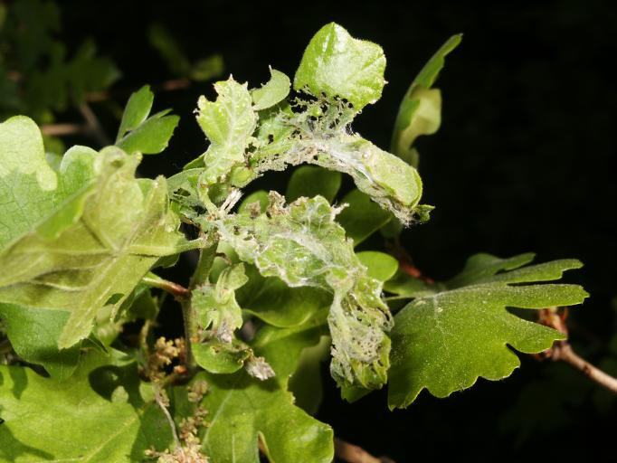
```


#### Agent Description {-}

Eggs are cemented together into flat, grayish to whitish masses that become riddled with small holes when larvae emerge.  Larvae are green and 1.5—2.5 cm long at maturity; the head is shiny and black (figure  \@ref(fig:LfIns4)).  Larvae have a dark band behind the head on the prothorax; this band may be absent in the last larval instar.  If disturbed, larvae wriggle actively and may drop from the leaf on a strand of silk.  Obliquebanded leafroller larvae resemble late-instar larvae of the fruit tree leafroller, but do not react vigorously when disturbed.  Adult fruit tree leafroller moths are bullet-shaped when viewed from above with variegated dark brown or yellowish tan wings; the wingspan is 20—25 mm.  


(ref:LfIns4) Fruit tree leafroller caterpillar hanging from silken thread. Photo: Tedmund J. Swiecki and Elizabeth A. Bernhardt, Phytosphere Research.

```{r LfIns4, fig.align='center', fig.asp=.75, fig.cap="(ref:LfIns4)", out.width="284px"}
knitr::include_graphics("images/Insect-leaf/ArcArg-QL-b-Phytosphere.jpg")
```

#### Biology {-}

The insect overwinters as masses of eggs on twigs and branches.  Eggs hatch in the spring, usually at the same time that new leaves emerge.  Larvae construct nests by rolling or tying young leaves together and feed within the nests.  At maturity they pupate inside the nests or on bark in thin brown cocoons.  Adult moths emerge eight to 12 days after pupation.  After adult moths mate, females lay the overwintering egg masses.  There is one generation per year.

#### Importance {-}

This is a common, well-known, and important insect pest of oaks.  A severe multiyear outbreak affecting California black oaks in the San Bernardino Mountains of southern California was reported in 1999—2003.  Before this, the last serious outbreak in southern California was in 1951—1953.  In some trees, repeated defoliation combined with drought and high levels of leafy mistletoe infection has reportedly increased overall mortality rates.

#### Citation {-}

Swiecki, T.J.; Bernhardt, E.A. 2025. Fruit tree leafroller and similar insects. In Swiecki, T.J., et al. (Eds.) Field Guide to Insects and Diseases of California Oaks, Online edition 2025.

## Oak ribbed casemaker {-}

### *Bucculatrix albertiella* (Lyonetiidae)  {-}

#### Distribution / Hosts {-}

The oak ribbed casemaker occurs throughout California.  It is reported on coast live, interior live, valley, and California black oak, but probably occurs on other oak species as well. The related *B. zophopasta* has been recorded from *Q. douglasii*, *Q. garryana*, *Q. lobata*, and *Quercus sp.* (Braun 1963, Powell 1988). 

```{r, fig.align='center', fig.asp=.75, fig.cap="Approximate ranges of oak ribbed casemaker (orange shading) and native oak species (green) in California.", out.width='30%'}
knitr::include_graphics("images/distributions/statewide.png")
```

#### Symptoms {-}

Young larvae feed within the leaf, creating a linear leaf mine.  Older larvae cause necrotic windowing:  they feed on the undersides of the oak leaves, sparing the upper epidermis and veins, which become brown and somewhat translucent.  Small, flat circles of webbing (molting shelters) and small, white, narrow-cylindrical cocoons with longitudinal ribs may be present on the undersides of affected leaves (figure  \@ref(fig:LfIns5)). 

(ref:LfIns5) Oak ribbed casemaker cocoons and feeding on coast live oak.  Note the round first-instar larval molting shelter to the left near the midrib.  Photo: Bruce Hagen, CalFire, retired.

```{r LfIns5, fig.align='center', fig.asp=.75, fig.cap="(ref:LfIns5)", out.width="75%"}
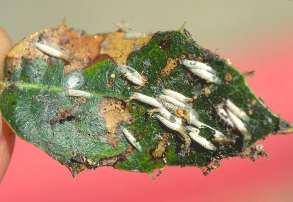
```

#### Agent Description {-}

Mature larvae are yellowish to olive green with rows of pale spots and are about 6 mm long.  Adult moths are mottled white, brown, and black, with a wingspan of 8—9 mm.

#### Biology {-}

The oak ribbed casemaker overwinters as pupae inside cocoons.  Adult moths emerge in early spring, mate, and lay eggs on oak leaves.  Eggs hatch and the young larvae mine inside the leaf.  After the first molt, larvae feed on the lower epidermis and interior tissues of leaves.  Larval instars molt within flat, rounded shelters.  Mature third-instar larvae spin the characteristic white ribbed cocoon.  Adults emerge from cocoons, mate and lay eggs that hatch into the second (summer) generation.  Larvae of the summer generation form overwintering pupae.  There are two generations per year.

#### Importance {-}

The oak ribbed case maker is one of the more common insects affecting oaks and may cause serious leaf damage over large geographic areas in some years.

#### Citation {-}

Swiecki, T.J.; Bernhardt, E.A. 2025. Oak ribbed casemaker. In Swiecki, T.J., et al. (Eds.) Field Guide to Insects and Diseases of California Oaks, Online edition 2025.

## Tent caterpillars {-}

### Western tent caterpillar - *Malacosoma californicum*, Pacific tent caterpillar - *M. constrictum*, Forest tent caterpillar - *M. disstria* (Lasiocampidae) {-}

#### Distribution / Hosts {-}

The western tent caterpillar occurs west of the Rocky Mountains and in New York.  Four subspecies (*Malacosoma californicum* ssp. *ambisimilis*, *californicum*, , *fragile*, and *recenseo*) with distinct geographic ranges are reported in California.  The species is reported on oak, willow, poplar, birch, alder, madrone, ceanothus, redbud, hazel, ash, toyon, apple, almond, apricot, cherry, prune, plum, coffeeberry, currant, antelope bitterbrush, and apple.

The Pacific tent caterpillar occurs in California, Oregon, and Washington and is reported only on oaks.  In California, subspecies *M. constrictum austrinum* is found from Santa Barbara County southward; *M. constrictum constrictum* occurs from Los Angeles County northward.

The forest tent caterpillar is widespread throughout the entire U.S.  Its host plants include oak, poplar, birch, alder, willow, cherry, peach, plum, prune, pear, apple, quince, hawthorn, and rose.

```{r, fig.align='center', fig.asp=.75, fig.cap="Approximate ranges of tent caterpillars (orange shading) and native oak species (green) in California.", out.width='30%'}
knitr::include_graphics("images/distributions/statewide.png")
```

#### Symptoms {-}

Larvae feed on leaves, often defoliating affected branches.  Western tent caterpillar larvae spin large tents of silk (figure  \@ref(fig:LfIns6)) and the larvae do most of their feeding in the tents.  Pacific tent caterpillars spin more rudimentary tents that can be up to 10 cm wide (figure  \@ref(fig:LfIns7)).  The larvae feed in groups outside the tent, entering it only to molt.  Sometimes tents are absent in local populations of both the Pacific and the western tent caterpillar.  Forest tent caterpillars do not construct tents; they construct silken mats on branches or the trunk where the larvae congregate when at rest or during molting.

(ref:LfIns6) Tent created by the larvae of the western tent caterpillar on  coast live oak  Photo: Tedmund J. Swiecki and Elizabeth A. Bernhardt, Phytosphere Research.

```{r LfIns6, fig.align='center', fig.asp=.75, fig.cap="(ref:LfIns6)", out.width="75%"}
knitr::include_graphics("images/Insect-leaf/MalCal-QA_Phytosphere.jpg")
```

(ref:LfIns7) Pacific tent caterpillar tent on blue oak. Photo:  Don Owen, CalFire, retired.

```{r LfIns7, fig.align='center', fig.asp=.75, fig.cap="(ref:LfIns7)", out.width="75%"}
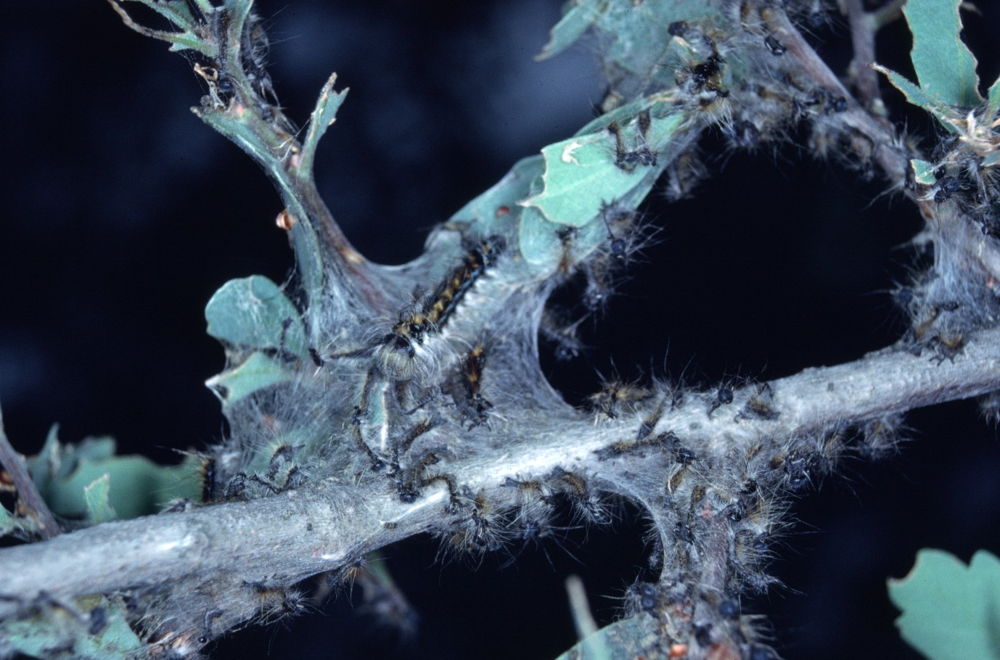
```


#### Agent Description {-}

Tent caterpillar larvae are fairly large, 40—50 mm in length at maturity (figure  \@ref(fig:LfIns8)), (figure  \@ref(fig:LfIns9)).  Adult moths have stout bodies and are tan to brownish, with two oblique lines on each forewing (figure  \@ref(fig:LfIns10)).

(ref:LfIns8) Western tent caterpillar on coast live oak. Photo: Tedmund J. Swiecki and Elizabeth A. Bernhardt, Phytosphere Research.

```{r LfIns8, fig.align='center', fig.asp=.75, fig.cap="(ref:LfIns8)", out.width="75%"}
knitr::include_graphics("images/Insect-leaf/MalCal-Malacosoma californicum QA6_Phytosphere.jpg")
```

(ref:LfIns9) Pacific tent caterpillar larva on blue oak (Photo:  Don Owen, CDF; www.forestryimages.org).

```{r LfIns9, fig.align='center', fig.asp=.75, fig.cap="(ref:LfIns9)", out.width="75%"}
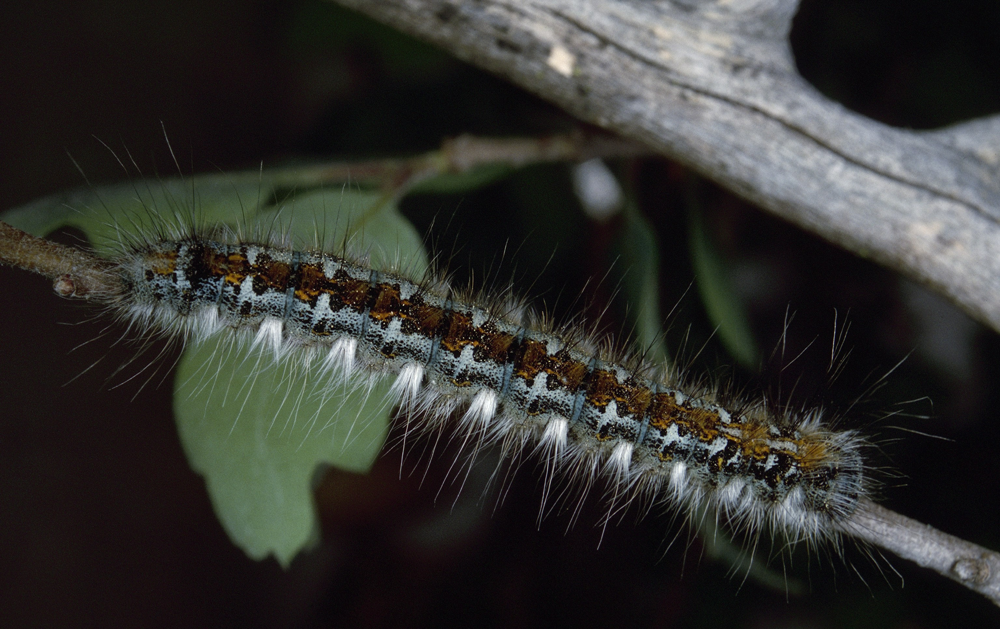
```


(ref:LfIns9-1) Forest tent caterpillar larvae. Photo: Ronald S. Kelley, Vermont Department of Forests, Parks and Recreation; www.forestryimages.org.

```{r LfIns9-1, fig.align='center', fig.asp=.75, fig.cap="(ref:LfIns9)-1", out.width="75%"}
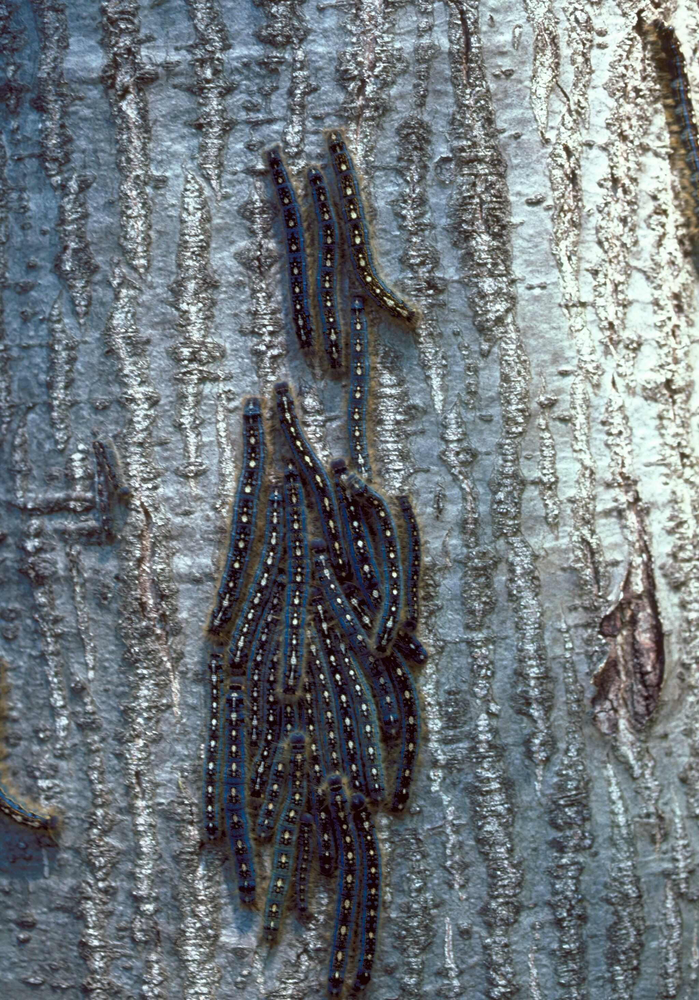
```


(ref:LfIns10) Pinned specimen of the Pacific tent caterpillar female moth. Photo:  Don Owen, CDF, retired.

```{r LfIns10, fig.align='center', fig.asp=.75, fig.cap="(ref:LfIns10)", out.width="75%"}
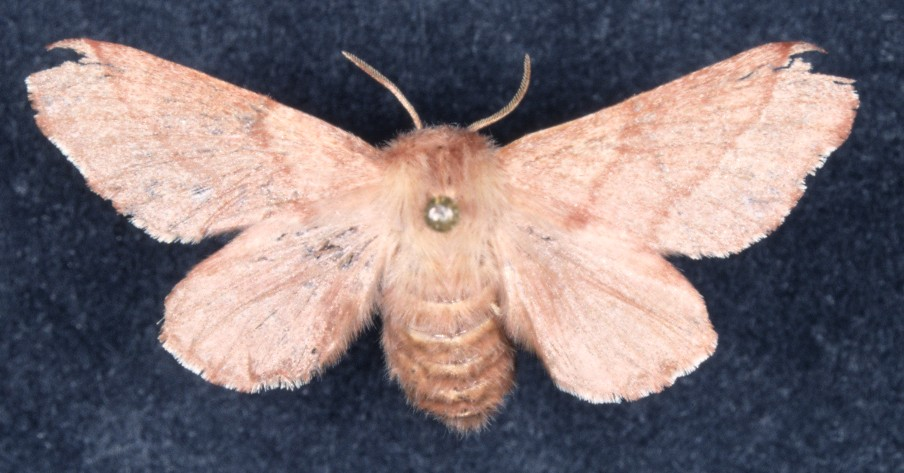
```


#### Biology {-}

Overwintering eggs are laid during the summer in masses that encircle twigs (figure  \@ref(fig:LfIns11)).  Eggs are coated with a varnish-like substance called spumaline.  The young larvae are active from early to late spring.  Young larvae congregate and spin communal tents.  Mature larvae may spin cocoons (figure  \@ref(fig:LfIns12)) in folded leaves, or under bark or litter.  Adult moths emerge in mid-summer, mate, and lay eggs.  There is one generation a year. 


(ref:LfIns11) Pacific tent caterpillar egg mass cut away to show individual eggs. Photo:  Don Owen, CalFire, retired.

```{r LfIns11, fig.align='center', fig.asp=.75, fig.cap="(ref:LfIns11)", out.width="75%"}
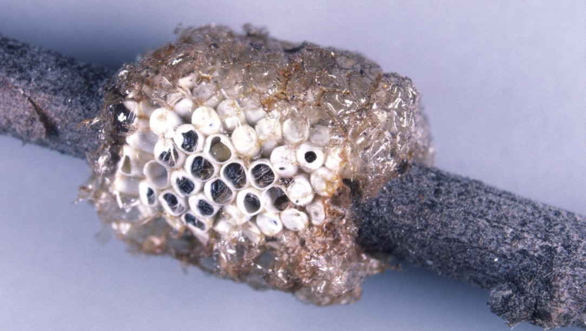
```


(ref:LfIns12) Pacific tent caterpillar cocoons (Photo:  Don Owen, CalFire, retired)).

```{r LfIns12, fig.align='center', fig.asp=.75, fig.cap="(ref:LfIns12)", out.width="75%"}
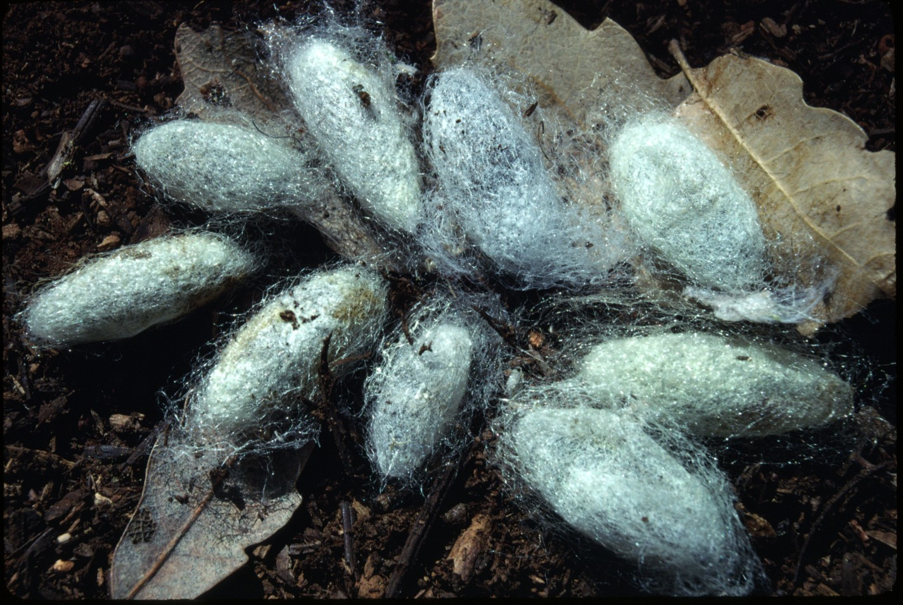
```

#### Importance {-}

Other than obvious aesthetic impacts, tent caterpillars typically do not cause major damage on California oaks.  When present in high numbers, caterpillars may be a nuisance.

#### Citation {-}

Swiecki, T.J.; Bernhardt, E.A. 2025. Tent caterpillars. In Swiecki, T.J., et al. (Eds.) Field Guide to Insects and Diseases of California Oaks, Online edition 2025.

## Western tussock moth {-}

### *Orgyia vetusta* (Lymantriidae) {-}

#### Distribution / Hosts {-}

Western tussock moth occurs from southern California to British Columbia.  It is reported on virtually all California oak species as well as various fruit and nut trees, ceanothus, hawthorn, manzanita, pyracantha, toyon, walnut, and willow. 


```{r, fig.align='center', fig.asp=.75, fig.cap="Approximate ranges of western tussock moth (orange shading) and native oak species (green) in California.", out.width='30%'}
knitr::include_graphics("images/distributions/statewide.png")
```


#### Symptoms {-}

Larvae feed on leaves, especially young growth, sometimes causing substantial defoliation.  Masses of cocoons may be present on branches in late spring (figure  \@ref(fig:LfIns13)).

(ref:LfIns13) Western tussock moth cocoons on coast live oak. Photo: Tedmund J. Swiecki and Elizabeth A. Bernhardt, Phytosphere Research.


```{r LfIns13, fig.align='center', fig.asp=.75, fig.cap="(ref:LfIns13)", out.width="75%"}
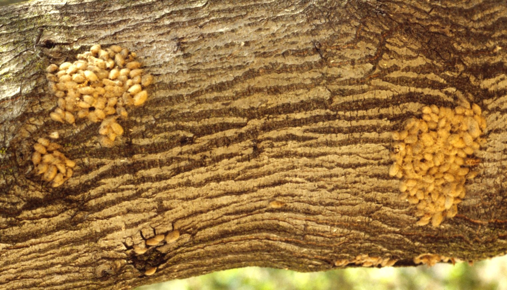
```

#### Agent Description {-}

Eggs are white, nearly spherical, 1.2 mm in diameter, and depressed on top.  Egg masses may contain over 100 eggs.  Egg masses are gray and felt-like, and include hairs and scales from the adult female’s body.  Mature larvae are 13—22 mm long, hairy, and have red spots on their sides and four prominent white tufts of hair (tussocks) on their backs (figure  \@ref(fig:LfIns14)).  The adult male moth is about 2.5 cm across when at rest.  Its wings are brown and have two evenly spaced irregular dark brown lines which run perpendicular to the body.  The female is covered with wavy light gray hair, has greatly reduced wings, and cannot fly

(ref:LfIns14) Western tussock moth larva on blue oak. Photo: Tedmund J. Swiecki and Elizabeth A. Bernhardt, Phytosphere Research.


```{r LfIns14, fig.align='center', fig.asp=.75, fig.cap="(ref:LfIns14)", out.width="75%"}
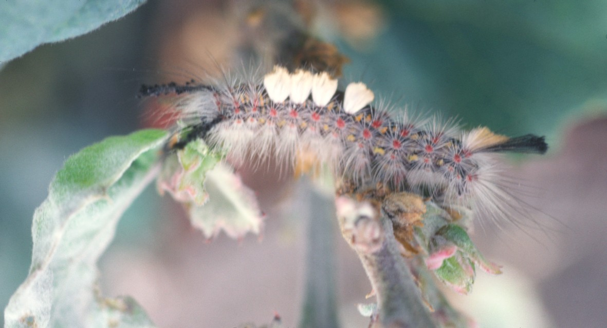
```

#### Biology {-}

Western tussock moth overwinters as eggs laid in masses on twigs, on bark of larger stems, or on old cocoons.  Eggs hatch from March through early June.  Larvae are present for six to eight weeks.  Mature larvae spin loosely woven grayish-white cocoons that may contain larval hairs (figure  \@ref(fig:LfIns13).  Pupae mature in two to three weeks.  Adult moths are active from May to July.  There is usually one generation a year, but two generations can occur in southern California.  Where the second generation occurs, larvae are present late August through October, and adults lay overwintering eggs in September and October.

#### Importance {-}

Oaks may occasionally be seriously defoliated.  Damage on other hosts can sometimes cause branch dieback.  Hairs from western tussock moth larvae can be very irritating to humans.  Frass may be a nuisance when larval populations are high.

#### Citation {-}

Swiecki, T.J.; Bernhardt, E.A. 2025. Western tussock moth. In Swiecki, T.J., et al. (Eds.) Field Guide to Insects and Diseases of California Oaks, Online edition 2025.


