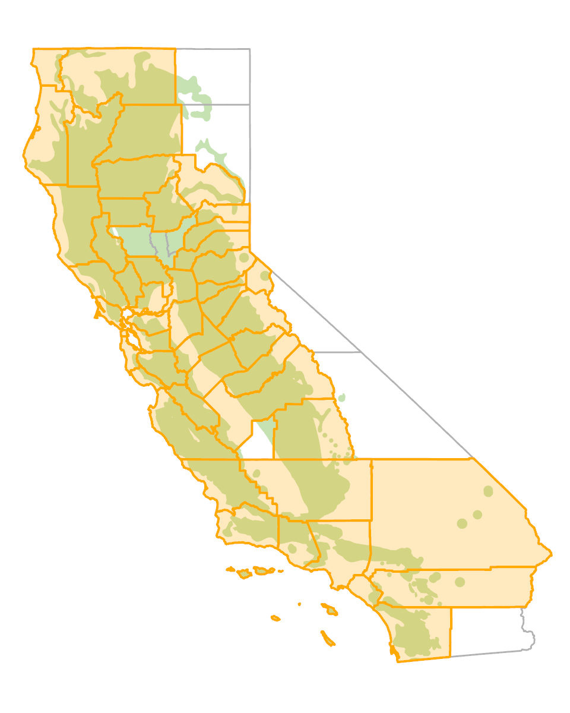
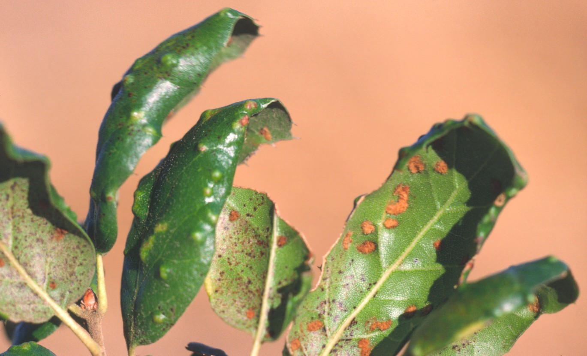
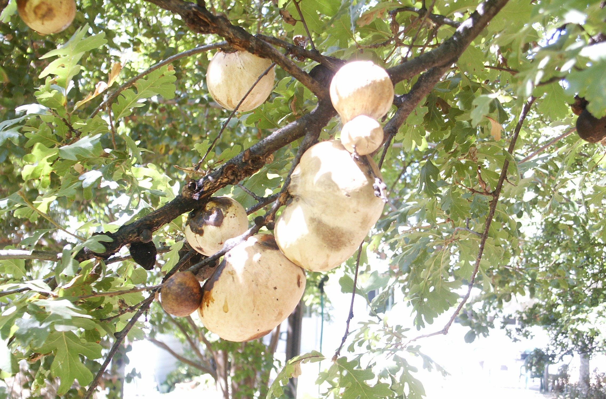
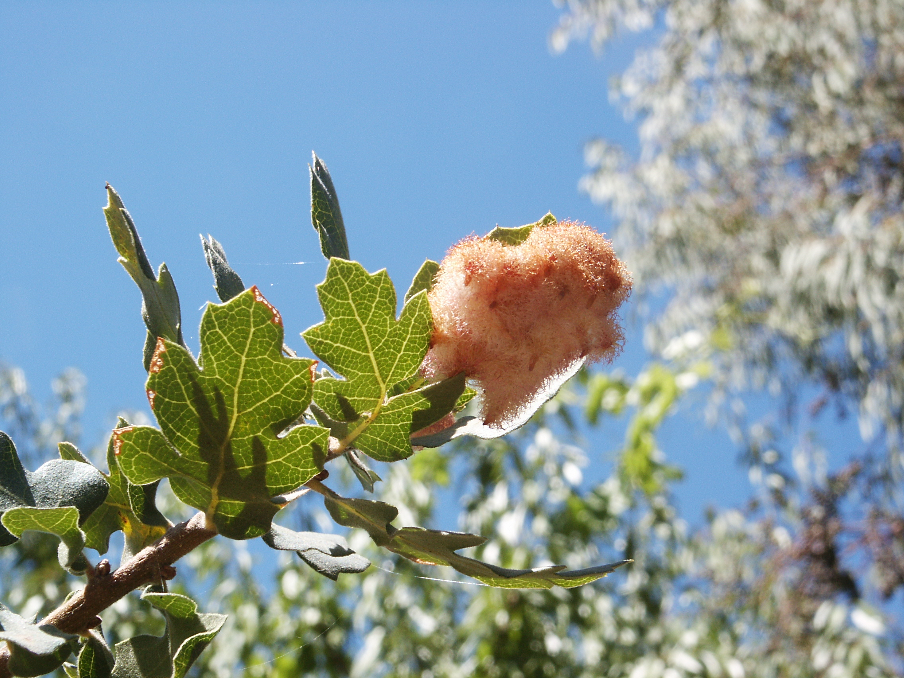
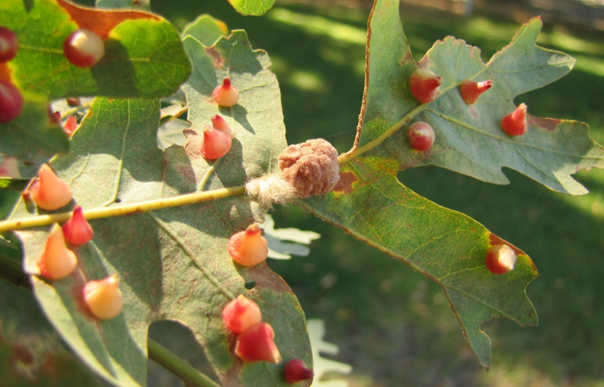
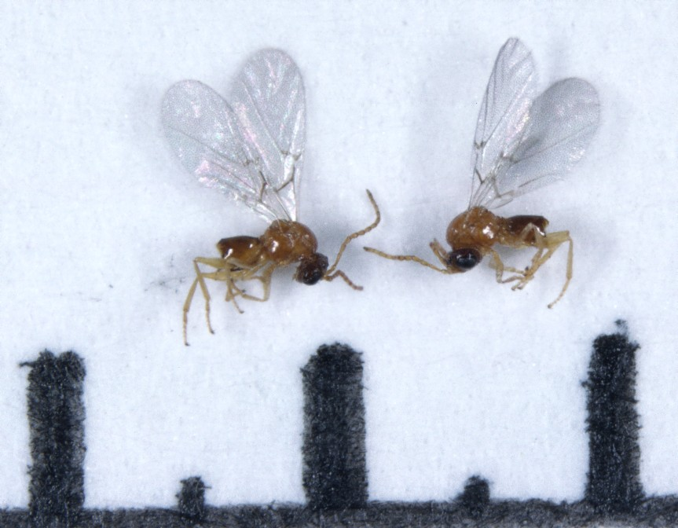
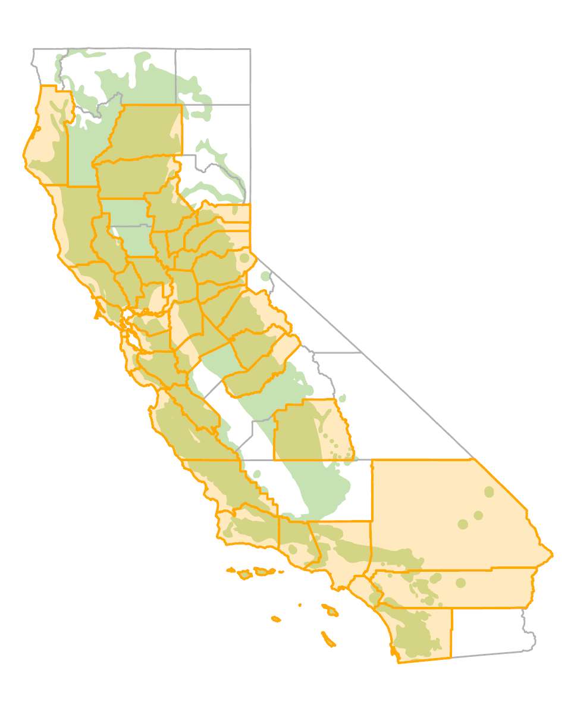

# Gall formers {#gall}

## Erineum mite  {-}

### *Aceria* (=*Eriophyes*) *mackiei* (Eriophyidae) {-}

#### Distribution / Hosts {-}

*Aceria mackiei* is distributed through much of California.  It is reported on evergreen oaks in the black/red oak subgroup (coast live and interior live oak) and  the intermediate oak subgroup (canyon live and huckleberry oak).


```{r, fig.align='center', fig.asp=.75, fig.cap="Approximate ranges of Erineum mite (orange shading) and native oak species (green) in California.", out.width='30%'}

```


#### Symptoms {-}

The mites cause blisterlike swellings (erinea), 1—12 mm long, that protrude from the upper leaf surface (figures  \@ref(fig:LfGalls1A), \@ref(fig:LfGalls1B)). On the lower leaf surface, the blisters appear as depressions or pockets filled with mats of hairs that are typically rusty brown but may be lighter in color or have a reddish tinge (figure   \@ref(fig:LfGalls1B)). The blisters are initially green but later become brown. Leaves may become distorted if large populations of mites are present. A related species, *Aceria paramackiei*, causes a witches broom type of galling of coast live oak buds, resulting in tightly packed heads of multiple buds. 

(ref:LfGalls1A) Symptoms of erineum mite on coast live oak. Raised blisters on the leaf upper surface appear as hair-filled pockets on the lower leaf surface.  Photo: Tedmund J. Swiecki and Elizabeth A. Bernhardt, Phytosphere Research.

```{r LfGalls1A, fig.align='center', fig.asp=.75, fig.cap="(ref:LfGalls1A)", out.width="75%"}

```


(ref:LfGalls1B) Symptoms of erineum mite on oracle oak (*Quercus* x *morehus*). Raised blisters on the leaf upper surface (left) appear as hair-filled pockets (center, right) on the lower leaf surface.   Photo: Tedmund J. Swiecki and Elizabeth A. Bernhardt, Phytosphere Research.

```{r LfGalls1B, fig.align='center', fig.asp=.75, fig.cap="(ref:LfGalls1B)", out.width="95%"}
knitr::include_graphics("images/Insect-galls/Aceria mackiei QxM Phytosphere.jpg")
```


#### Agent Description {-}

Mites are 0.2 mm long and difficult to see without magnification. They are whitish or yellowish, slender and wormlike, and have two pairs of legs. 

#### Biology {-}

Erineum mites overwinter in leaf blisters or in leaf buds. They establish new colonies on the underside of spring foliage. The mites induce the host leaf to produce the characteristic erinea, which are pockets on the underside of leaves that appear as blisters on the upper leaf surface. Mites feed and reproduce among the hairs in the erinea.

#### Importance {-}

The damage caused by erineum mites is generally limited and of little or no consequence to affected trees, though some leaves may become highly distorted.

#### Citation {-}

Swiecki, T.J.; Bernhardt, E.A. 2026. Erineum mite. In Swiecki, T.J., et al. (Eds.) Field Guide to Insects and Diseases of California Oaks, Online edition `r Sys.Date()`.

## Gall wasps {-}


### Oak gall wasps

#### Over 100 species in about 20 genera including *Andricus*, *Antron*, *Callirhytis*, *Disholcaspis*, *Dros*, *Neuroterus* (Cynipidae) {-}

#### Distribution / Hosts {-}

Many gall wasp species are found throughout the range of their hosts, whereas others are more limited in distribution.  Virtually all native California oak species are hosts to one or more gall wasp species [@Russo2021].  Most gall wasp species can colonize several to many oak species within a given subgroup such as the white oaks, red/black oaks, or intermediate oaks.  *Andricus quercuscalifornicus*, the California gallfly, produces galls known as oak apples on at least eight species in the white oak subgroup (figure  \@ref(fig:LfGalls2)).  Others, such as *Andricus chrysobalani*, which causes galls on canyon live oak acorns, are reported only from a single host species.

```{r, fig.align='center', fig.asp=.75, fig.cap="Approximate ranges of wasps  (orange shading) and native oak species (green) in California.", out.width='30%'}
knitr::include_graphics("images/distributions/statewide.png")
```

#### Symptoms {-}

Galls may be produced on catkins, acorns, leaves, petioles, or twigs (figures  \@ref(fig:LfGalls2) - \@ref(fig:LfGalls6)).  They appear as simple swellings, amorphous growths, or unique, highly organized structures, often with strange shapes and bright coloration.  Galls may be detachable (distinct structures that are readily removable from underlying tissues) or integral (swellings or distortions of the plant part itself that cannot be removed without cutting or breaking the affected part).  Galls range from 1 mm to more than 50 mm across. Some galls are associated with localized chlorosis or necrosis of underlying host tissue.  Galls affecting branches or major leaf veins may interfere with water and food transport within the branch or leaf, causing tissues beyond the gall to decline or die. 

(ref:LfGalls2) Oak apple galls on valley oak produced by *Andricus quercuscalifornicus*. Photo: Tedmund J. Swiecki and Elizabeth A. Bernhardt, Phytosphere Research.

```{r LfGalls2, fig.align='center', fig.asp=.75, fig.cap="(ref:LfGalls2)", out.width="75%"}

```

(ref:LfGalls3) Agamic generation galls of *Feron* (=*Andricus*) *crystallinus* on blue oak leaf. Photo: Tedmund J. Swiecki and Elizabeth A. Bernhardt, Phytosphere Research.

```{r LfGalls3, fig.align='center', fig.asp=.75, fig.cap="(ref:LfGalls3)", out.width="75%"}

```


(ref:LfGalls3A) *Antron douglasii* agamic generation galls on valley oak leaf. Photo: Tedmund J. Swiecki and Elizabeth A. Bernhardt, Phytosphere Research.

```{r LfGalls3A, fig.align='center', fig.asp=.75, fig.cap="(ref:LfGalls3)", out.width="75%"}
knitr::include_graphics("images/Insect-galls/Vacaville QL Antron douglasii galls_20130907_15 Phytosphere.JPG")
```


(ref:LfGalls4) Galls of *Feron* (=*Andricus*) *kingi* (cone shaped), *Druon* (=*Andricus*) *fullawayi* (hairy), and *Andricus confertus* (irregular) on leaves of valley oak. Galls of the  latter two species are formed only on the leaf midrib. All three galls are detachable.  Photo: Photos: Tedmund J. Swiecki and Elizabeth A. Bernhardt, Phytosphere Research.

```{r LfGalls4, fig.align='center', fig.asp=.75, fig.cap="(ref:LfGalls4)", out.width="75%"}

```


(ref:LfGalls5) Integral stem galls produced by *Andricus chrysolepidicola* on blue oak. Photo: Tedmund J. Swiecki and Elizabeth A. Bernhardt, Phytosphere Research.

```{r LfGalls5, fig.align='center', fig.asp=.75, fig.cap="(ref:LfGalls5)", out.width="75%"}
knitr::include_graphics("images/Insect-galls/AndChr-QD_andricus chrysolepidicola_Phytosphere.JPG")
```

(ref:LfGalls6) Bud galls caused by *Burnettweldia* (=*Disholcaspis*) *plumbella* on a twig of *Quercus berberidifolia* (left) and by *Heteroecus sanctae-clarae* on the trunk of a young canyon live oak. Photos: Tedmund J. Swiecki and Elizabeth A. Bernhardt, Phytosphere Research.

```{r LfGalls6, fig.align='center', fig.asp=.75, fig.cap="(ref:LfGalls6)", out.width="95%"}
knitr::include_graphics("images/Insect-galls/bud galls Disholcaspis  plumbella QB Heteroecus sanctaeclarae QC Phytosphere.JPG")
```


#### Agent Description {-}

Adults are small wasps, typically no more than about 4 mm long (figure  \@ref(fig:LfGalls7)).  Larvae are small, whitish, and legless and develop completely inside larval chambers that form within the galls.  Depending on the wasp species, each gall may have either one (monothalamous galls) or many (polythalamous galls) larval chambers.

(ref:LfGalls7) Adult gall wasps (large divisions 0.125 inch = 3.2 mm). Photo: Don Owen, CalFire, retired.

```{r LfGalls7, fig.align='center', fig.asp=.75, fig.cap="(ref:LfGalls7)", out.width="75%"}

```

#### Biology {-}

Gall wasp larvae can apparently only induce galls in undifferentiated meristematic or cambial cells, so female wasps must lay eggs in specific host tissues (buds, leaves, etc.) when the tissues are at the correct growth stage.  Developing larvae produce substances that induce the plant to form a larval chamber with a structure that is unique to the wasp species and generation.  The gall wasp larvae typically remain small while they induce the gall to grow rapidly.  As the gall nears its mature size, larvae feed on nutritive tissue produced in the center of the gall and begin to grow rapidly.  As the larvae mature, they induce lignification of the gall.  In detachable galls, lignification may induce the gall to fall off the plant.  Larvae pupate within the gall and adult wasps emerge from the galls to initiate the next generation. 

Many oak gall wasp species have two alternating generations; a bisexual generation with females and males followed by a unisexual (agamic) generation with only females that can lay fertile eggs without mating.  Each of these generations produces a unique gall, often on different parts of an oak.  Galls produced by the bisexual generation are usually found during winter on permanent parts of the tree, such as twigs. The agamic generation typically is produced during spring and summer and galls are often on leaves and catkins.  Some oak gall wasps are known to produce only a single generation, which is typically agamic.


#### Importance {-}

Most wasp galls, especially foliar galls, cause little or no lasting damage to oaks. A few wasp galls, such as the two-horned oak gall wasp (below), cause limited leaf or twig dieback by blocking the vascular tissue. 

#### Citation {-}

Swiecki, T.J.; Bernhardt, E.A. 2026. Gall wasps. In Swiecki, T.J., et al. (Eds.) Field Guide to Insects and Diseases of California Oaks, Online edition `r Sys.Date()`.

### Two-horned oak gall wasp

#### *Dryocosmus dubiosus* (Cynipidae) {-}

#### Distribution / Hosts {-}

Widely distributed in California, also observed in Oregon. Common on coast live and interior live oak, also occurs on California black oak.

```{r, fig.align='center', fig.asp=.75, fig.cap="Approximate ranges of the two-horned oak gall wasp (orange shading) and native oak species (green) in California.", out.width='30%'}

```

#### Symptoms {-}

Wasps of the unisexual (agamic) generation induce detachable galls, about 3 mm long, on the leaf underside (abaxial surface) along leaf veins, including the midrib. Galls are oblong with a short horn-like projection at each end along the top. Fresh galls are whitish to greenish, sometimes with a red tinge, and may develop reddish to brownish flecks or spots. Older galls become tan or brownish. These galls can disrupt water and nutrient transport in affected veins, causing chorosis and necrosis to develop in leaf tissues beyond the galls (figure  \@ref(fig:LfGalls10)). Leaves develop conspicuous yellowing and dead spots that are evident from a distance when multiple galls develop on each leaf and many leaves are colonized. Visible damage from the agamic generation peaks in fall or early winter. Most galls may fall off by the time that damage becomes severe, but some galls persist on leaves into fall or winter. Many of the galls that persist on leaves may be parasitized [@Doutt1959]. Small scars remain on veins where galls were attached. 


(ref:LfGalls10) Damage to coast live oak leaves caused by the agamic generation of the two-horned oak gall wasp (January, Solano County). On upper leaf surfaces, damage appears as irregular areas of chlorosis and necrosis, mostly toward the leaf tip or margins. On leaf undersides, multiple agamic generation galls are visible along leaf veins. Brown scars are visible on veins where galls have detached. Necrotic areas developed mostly beyond points where galls were attached. Photos: Barry Hill, Solano Land Trust.


```{r LfGalls10, fig.align='center', fig.asp=.75, fig.cap="(ref:LfGalls10)", out.width="75%"}
knitr::include_graphics("images/Insect-galls/Twohorned oak gall waspBarry Hill QA KingRch.jpg")
```

(ref:LfGalls10B) Two-horned oak gall wasp agamic generation galls on the undesides of oracle oak leaves (January, Solano County). Note scars on veins where galls are attached.  Photos: Tedmund J. Swiecki and Elizabeth A. Bernhardt, Phytosphere Research.


```{r LfGalls10B, fig.align='center', fig.asp=.75, fig.cap="(ref:LfGalls10B)", out.width="95%"}
knitr::include_graphics("images/Insect-galls/Twohorned oak gall wasp QxM Vv Phytosphere.jpg")
```


#### Agent Description {-}

Adult wasps are tiny (about 2-3 mm long) and dark colored with long antennae. A single larva develops within each gall. 

#### Biology {-}

Adult female wasps emerge from the bisexual generation galls on catkins or early season leaves by mid to late April, but some emerge earlier or later depending on the timing of flowering [@Doutt1959]. These adults live for about 7 days [@Russo2021]. Females oviposit in leaf veins or midribs on the underside of leaves. The egg remains dormant in the leaf vein for an extended period (at least 65 to over 80 days [@Doutt1959] before a larva emerges and induces the typically two-horned gall of the unisexual (agamic) generation. The gall develops rapidly after the larva hatches, reaching its maximum size in 5 days and becoming fully mature and detachable in 10-11 days. At this point, the larva is fully mature and contained in a hard central spherical cavity. Galls drop off leaves and larvae overwinter in diapause within galls and pupate in spring when catkins are emerging. Only female wasps emerge from these galls and are of two types: one type that produces only males, the other type produces only females. Mated females oviposit in developing catkins or along the margins of young leaves and developing larvae induce the club-shaped galls of the bisexual generation. The agamic generation was originally described as a separate species (*D. bicornis*).

Several chalcid wasps, including  *Eupelmus*, parasitize the agamic generation. The chalcid wasp *Torymus fullawayi* parasitizes both the bisexual and agamic generations. The cynipid wasp  *Synergus* is a kleptoparasite that forms its gall within the galls of the agamic generation  [@Doutt1959]. 

#### Importance {-}

The agamic generation of *D. dubiosus* is among the most damaging of the native oak gall wasps. In heavy infestations, the level of leaf damage negatively affects tree appearance. However, high levels of damage develop late in the season and typically affects only a part of a tree's foliage. Damage intensity also varies from year to year due to the influences of climate and parasitism. As a result, this insect agent does not pose a significant threat to tree health.

#### Citation {-}

Swiecki, T.J.; Bernhardt, E.A. 2026. Two-horned oak gall wasp. In Swiecki, T.J., et al. (Eds.) Field Guide to Insects and Diseases of California Oaks, Online edition `r Sys.Date()`.


