# Sap feeders {#sap}

## Oak leaf phylloxera {-}

### *Phylloxera* spp. (Phylloxeridae) {-}

#### Distribution / Hosts {-}

One or more *Phylloxera* spp. are found through much of California west of the Sierra Nevada, as well as in the southeastern U.S. and the Pacific Northwest to British Columbia.  Oaks in the white oak subgroup are attacked, including valley, Oregon white, Engelmann, and blue oak.


```{r, fig.align='center', fig.asp=.75, fig.cap="Approximate ranges of *Phylloxera* spp. (orange shading) and native oak species (green) in California.", out.width='30%'}
knitr::include_graphics("images/distributions/Tapcae.png")
```

#### Symptoms {-}

Small (about 1 mm diameter) yellow and brown spots are visible on the upper and lower surfaces of affected leaves (figure  \@ref(fig:SapFdrs1)); spots are most noticeable in mid summer to early fall.  Spots form where the small, yellow to brownish, wingless insects feed.  Spots may be located primarily along veins or spread over the entire leaf surface.  Different species may have different distribution patterns on leaves.  If population levels are high enough, part or all of an affected leaf may turn brown and die (figure  \@ref(fig:SapFdrs2)).  Symptoms are commonly most severe on oak seedlings and saplings.

(ref:SapFdrs1) Oak leaf phylloxera symptoms on valley oak; this unidentified species tends to congregate along veins. Photo: Tedmund J. Swiecki and Elizabeth A. Bernhardt, Phytosphere Research.

```{r SapFdrs1, fig.align='center', fig.asp=.75, fig.cap="(ref:SapFdrs1)", out.width="75%"}
knitr::include_graphics("images/Insect-sap/Phyll-QL_Vacaville Nov 18 2003 h_Phytosphere.jpg")
```

(ref:SapFdrs2) Damage associated with high oak leaf phylloxera populations, here on valley oak, may include leaf scorch (right).  Pupal case and adult of a lady beetle, which prey on phylloxera, are also visible. Photo: Tedmund J. Swiecki and Elizabeth A. Bernhardt, Phytosphere Research.

```{r SapFdrs2, fig.align='center', fig.asp=.75, fig.cap="(ref:SapFdrs2)", out.width="75%"}
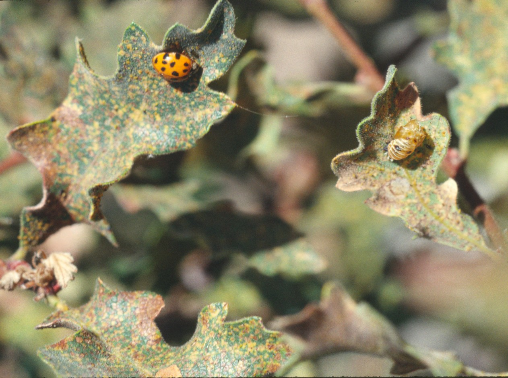
```


#### Agent Description {-}

Eggs are oval, about 0.3 mm long.  Nymphs and adults are oval, with fine ridges and short spine-like projections (tubercles), and very short legs (figure  \@ref(fig:SapFdrs3)).  The taxonomic status of some species reported in California is not completely resolved.  The species described on oaks in California include: 
*P. davidsoni* wingless adults (apterae) are light orange to yellowish-brown and about 0.7 mm long.  Winged adults (alatae) are orange with a black thorax.  Immatures are pale yellow.
*P. querceti* apterae are yellow to orange and 0.6—1 mm long.
*P. reticulata* apterae are bright orange-yellow, about 0.8 mm long, and have reddish eyes.
*P. rileyi* apterae are dark brown with almost black dorsal tubercles and are about 0.6 mm long.  Paler forms also occur.
*P. stanfordiana* apterae are pale yellow and about 0.75 mm long


(ref:SapFdrs3) Close-up of several phylloxera nymphs on the underside of a valley oak leaf. Photo: Tedmund J. Swiecki and Elizabeth A. Bernhardt, Phytosphere Research.

```{r SapFdrs3, fig.align='center', fig.asp=.75, fig.cap="(ref:SapFdrs3)", out.width="60%"}
knitr::include_graphics("images/Insect-sap/Phyll-QL_ Nov 17 03 a_Phytosphere.jpg")
```

#### Biology {-}

Life cycles of these species have not been studied in California.  Data from other locations indicate that overwintering occurs as eggs or first-instar nymphs in sheltered locations on the branches.  Multiple generations occur over the spring and summer, some of which involve asexual reproduction.  Winged adults develop in at least some species.  Populations build up over the summer and are highest in September and October.

#### Importance {-}

The species of oak leaf phylloxera known from California are apparently of minor importance, although damage to seedlings may be significant in some situations.  The oak leaf phylloxera (*P. glabra*) is reported to be a severe pest of Oregon white oak in British Columbia, causing significant scorching and defoliation of mature trees.  *P. glabra* has not been reported in California as of 2006.

#### Citation {-}

Swiecki, T.J.; Bernhardt, E.A. 2025. Oak leaf phylloxera. In Swiecki, T.J., et al. (Eds.) Field Guide to Insects and Diseases of California Oaks, Online edition 2025.

## Woolly oak aphids {-}
### *Stegophylla querci*, *S. quercifoliae*, *S. essigi* (Aphididae) {-}

#### Distribution / Hosts {-}

*Stegophylla querci* (=*S. quercicola*) is widely distributed in North America and much of California.  In California, it occurs on blue, valley, coast live, interior live, California black, and scrub oak and probably other oaks.  

```{r, fig.align='center', fig.asp=.75, fig.cap="Approximate ranges of *Stegophylla querci* (orange shading) and native oak species (green) in California.", out.width='30%'}
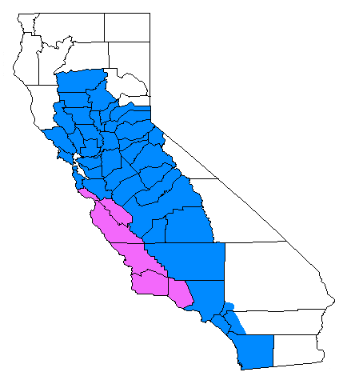
```

*S. quercifoliae* is found in the San Francisco Bay Area on at least blue oak and coast live oak.  It occurs on other oak species in other portions of the U.S. 


```{r, fig.align='center', fig.asp=.75, fig.cap="Approximate ranges of *Stegophylla quercifoliae* (orange shading) and native oak species (green) in California.", out.width='30%'}
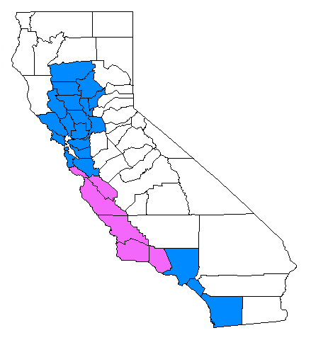
```

*S. essigi* is known only from the West Coast, and is reported from many California oaks, including blue, valley, Oregon white, coast live, interior live, California black, and scrub oak.  However, there is only limited information on its distribution.

```{r, fig.align='center', fig.asp=.75, fig.cap="Approximate ranges of *Stegophylla essigi* (orange shading) and native oak species (green) in California.", out.width='30%'}
knitr::include_graphics("images/distributions/S essigi.png")
```

#### Symptoms {-}

Masses of white wax filaments produced by *S. querci* and *S. quercifoliae* nymphs and adults are visible on infested leaves (figure  \@ref(fig:SapFdrs4)).  *S. querci* forms small, scattered colonies on upper or lower leaf surfaces.  *S. quercifoliae* infests the undersides of leaves.  Large colonies may cause leaves to curl.

(ref:SapFdrs4) Woolly oak aphid (*Stegophylla querci*) colonies on valley oak. Photo: Tedmund J. Swiecki and Elizabeth A. Bernhardt, Phytosphere Research.

```{r SapFdrs4, fig.align='center', fig.asp=.75, fig.cap="(ref:SapFdrs4)", out.width="75%"}
knitr::include_graphics("images/Insect-sap/SteQue-QL_Stegophylla querci valley oak 9-5-2003b_Phytosphere.jpg")
```


Feeding by first generation *S. essigi* in spring causes the edges of young leaves to fold over to the upper side of the leaf, forming a protective shelter in which the aphids feed and where wax accumulates (figure  \@ref(fig:SapFdrs5)).  The folded leaf area may show a reddish discoloration initially and eventually may die.

(ref:SapFdrs5) Symptoms of *Stegophylla essigi* on coast live oak; affected leaf margins are folded upward and become reddish. Photo: Tedmund J. Swiecki and Elizabeth A. Bernhardt, Phytosphere Research.

```{r SapFdrs5, fig.align='center', fig.asp=.75, fig.cap="(ref:SapFdrs5)", out.width="75%"}
knitr::include_graphics("images/Insect-sap/SteEss-QA_S essigi Q agrifolia 3-12-04 c_Phytosphere.jpg")
```

#### Agent Description {-}

Wingless adults (apterae) of all species are covered in white wax wool.
*S. querci* apterae are oval, pale greenish- or brownish-yellow, 1—1.5 mm long, and have dense wax wool (figure  \@ref(fig:SapFdrs6)).
*S. quercifoliae* apterae are yellowish to yellowish green with a brown head, 1.1—1.5 mm long, and have loose wax wool.
*S. essigi* apterae are broadly oval, pale gray-green to olive and 1.2—1.8 mm long.


(ref:SapFdrs6) Close-up of *Stegophylla querci* nymph. Photo: Tedmund J. Swiecki and Elizabeth A. Bernhardt, Phytosphere Research.

```{r SapFdrs6, fig.align='center', fig.asp=.75, fig.cap="(ref:SapFdrs6)", out.width="75%"}
knitr::include_graphics("images/Insect-sap/SteQue-QL_Stegophylla querci valley oak 10-22-2003c_Phytosphere.jpg")
```


#### Biology {-}

Woolly oak aphids overwinter as eggs.  Several generations develop each year.  In the spring, females reproduce parthenogenically (without mating).  In the fall, male and female aphids are produced.  Adult males may be either winged or wingless. *S. querci* has sexual females (oviparae) and both wingless and winged males in September and October. For *S. essigi*, oviparae and both wingless and winged males are produced in November.  Populations of *S. essigi* may continue to reproduce parthenogenically on evergreen oaks such as *Q. agrifolia*, especially in leaves tied together by caterpillar silk.

#### Importance {-}

Woolly wax deposits may become conspicuous and possibly unsightly, especially late in the season.  Damage to trees is normally minimal.

#### Citation {-}

Swiecki, T.J.; Bernhardt, E.A. 2025. Woolly oak aphids. In Swiecki, T.J., et al. (Eds.) Field Guide to Insects and Diseases of California Oaks, Online edition 2025.

## Whiteflies {-}

### Crown whitefly - *Aleuroplatus coronata*, Gelatinous whitefly - *A. gelatinosus*, Stanford’s whitefly - *Tetraleurodes stanfordi* (Aleyrodidae) {-}

#### Distribution / Hosts {-}

Crown whitefly is found throughout California.  It prefers coast live oak, but is also reported on canyon live, interior live, valley, and scrub oak, as well as chinquapin, tanoak, coffeeberry, toyon, madrone, and Rhus.

```{r, fig.align='center', fig.asp=.75, fig.cap="Approximate ranges of crown whiteflies (orange shading) and native oak species (green) in California.", out.width='30%'}
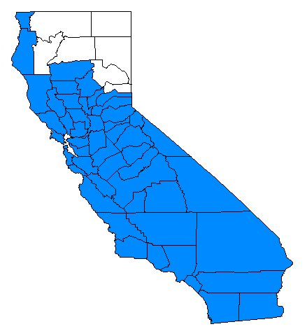
```

Gelatinous whitefly is reported from the San Francisco Bay Area southward through the San Joaquin Valley and southern California on coast live and interior live oak.

```{r, fig.align='center', fig.asp=.75, fig.cap="Approximate ranges of gleatinous whiteflies   (orange shading) and native oak species (green) in California.", out.width='30%'}
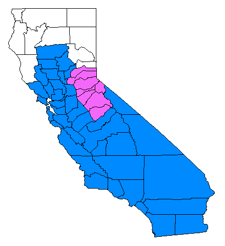
```

Stanford’s whitefly is found mainly throughout coastal California.  It is reported on coast live, California black, and interior live oak as well as chinquapin, tanoak, and coffeeberry.

```{r, fig.align='center', fig.asp=.75, fig.cap="Approximate ranges of Standord's whiteflies   (orange shading) and native oak species (green) in California.", out.width='30%'}
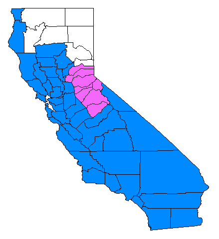
```

#### Symptoms {-}

Non-mobile nymphs and pupae on leaves are the most conspicuous and identifiable sign of an infestation.  They appear as small (less than 1 mm) black or black and white spots on leaves which can be wiped off.  Crown and gelatinous whiteflies occur only on lower leaf surfaces, whereas Stanford’s whitefly mostly feeds on the upper leaf surface.  At certain times of the year, the adult whiteflies may fly around infested plants, sometimes in great numbers.  The honeydew secreted by nymphs accumulates on leaves and supports the growth of black sooty mold.  Very heavy infestations may cause some leaf distortion, yellowing, and premature leaf drop.

#### Agent Description {-}

Adult whiteflies look like tiny (about 1 mm) white moths.  Eggs are white to pink and are attached to the leaf surface by a short stalk.  Nymphs are initially translucent but become black as they mature.  Pupae are tiny, black, oval, and flat.  Species differ in the amount and color (clear or white) of wax associated with the pupae.  Crown whitefly pupae are covered with somewhat rectangular plates of white wax that project outward in all directions (figure  \@ref(fig:SapFdrs7),  \@ref(fig:SapFdrs8)).  Gelatinous whitefly pupae are surrounded by a matrix of clear, gelatinous wax.  Stanford’s whitefly pupae are surrounded by a flat fringe of white waxy plates (figure  \@ref(fig:SapFdrs9)).  Nymphs of crown whitefly resemble Stanford’s whitefly pupae.


(ref:SapFdrs7) Crown whitefly pupae on the underside of a coast live oak leaf. Photo: Tedmund J. Swiecki and Elizabeth A. Bernhardt, Phytosphere Research.

```{r SapFdrs7, fig.align='center', fig.asp=.75, fig.cap="(ref:SapFdrs7)", out.width="75%"}
knitr::include_graphics("images/Insect-sap/AleCor-QA_crown whitefly QA 12-3-2003_Phytosphere.jpg")
```


(ref:SapFdrs8) Close-up of a crown whitefly pupa on a coast live oak leaf. Photo: Tedmund J. Swiecki and Elizabeth A. Bernhardt, Phytosphere Research.

```{r SapFdrs8, fig.align='center', fig.asp=.75, fig.cap="(ref:SapFdrs8)", out.width="75%"}
knitr::include_graphics("images/Insect-sap/AleCor-QA_crown whitefly q agrifolia Nov 18 2003 Vacaville c_Phytosphere.jpg")
```


(ref:SapFdrs9) Stanford’s whitefly pupae on coast live oak. Photo: Bruce Hagen, CalFire, retired.

```{r SapFdrs9, fig.align='center', fig.asp=.75, fig.cap="(ref:SapFdrs9)", out.width="75%"}
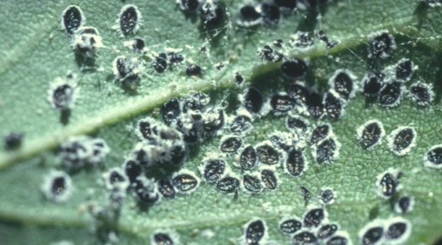
```

#### Biology {-}

Adults emerge from overwintering pupae in spring and lay eggs on the lower leaf surface.  Eggs hatch to give rise to tiny mobile nymphs called crawlers.  Within hours, crawlers settle down and insert their mouthparts into the leaf to suck plant sap from phloem cells.  Whitefly nymphs remain immobile as they go through successive molts.  The last molt gives rise to pupae which overwinter.  Crown whitefly has a single generation per year.

#### Importance {-}

Whiteflies do not cause significant damage to oaks and are typically of little or no importance.  Crown whitefly populations can sometimes reach high enough populations to pose a nuisance, mainly due to honeydew production and related sooty mold growth.  The gelatinous and Standford’s whitefly generally occur in lower numbers than the crown whitefly

#### Citation {-}

Swiecki, T.J.; Bernhardt, E.A. 2025. Whiteflies. In Swiecki, T.J., et al. (Eds.) Field Guide to Insects and Diseases of California Oaks, Online edition 2025.

## Treehoppers {-}
### *Platycotis vittata*, *P. vittata quadrivittata*, *P. minax* (Membracidae) {-}

#### Distribution / Hosts {-}

*Platycotis vittata* is widely distributed in California and is found throughout the U.S.  It is reported on various oaks in California, including coast live and valley oak.  In other parts of the U.S., *P. vittata* is reported on oaks, birch, chestnut, and other hardwoods.  *P. minax* occurs on coast live oak and possibly other oaks in southern California.

```{r, fig.align='center', fig.asp=.75, fig.cap="Approximate ranges of *Platycotis* spp. (orange shading) and native oak species (green) in California.", out.width='30%'}
knitr::include_graphics("images/distributions/Tapcae.png")
```

#### Symptoms {-}

Slit-like egg-laying (oviposition) wounds on fine branches can cause leaves to wilt and die and may cause twig dieback.  Callus developing around these longitudinal oviposition slits may leave scars on affected twigs.  Honeydew produced by treehoppers drips on foliage and branches and can support growth of black sooty mold on these surfaces.

#### Agent Description {-}

*P. vittata* nymphs are black with yellow and red markings (figure  \@ref(fig:SapFdrs10)).  Adults are 9—12 mm long, and have an enlarged hardened plate (pronotum) on the back of the thorax.  The pronotum covers the insect’s head, much of its abdomen, and part of the prominently-veined wings (figure  \@ref(fig:SapFdrs11)).  In *P. vittata*, two lateral horns project from the pronotum; between these two horns there may be a central forward facing horn.  *P. vittata* adults vary in color (dull olive, bronzy, or sea green) and have small red pits on the pronotum.  *P. vittata quadrivittata* adults are a pale blue color with four red longitudinal stripes and usually have well-developed central and lateral pronotal horns.  Both immatures and adults jump.


(ref:SapFdrs10) *Platycotis vittata* adults and nymphs. CDF Photo: Bruce Hagen, CalFire, retired.

```{r SapFdrs10, fig.align='center', fig.asp=.75, fig.cap="(ref:SapFdrs10)", out.width="50%"}
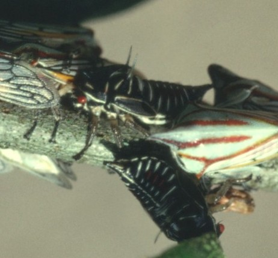
```


(ref:SapFdrs11)  *Platycotis vittata* adults. Photo: Bruce Hagen, CalFire, retired.

```{r SapFdrs11, fig.align='center', fig.asp=.75, fig.cap="(ref:SapFdrs11)", out.width="75%"}
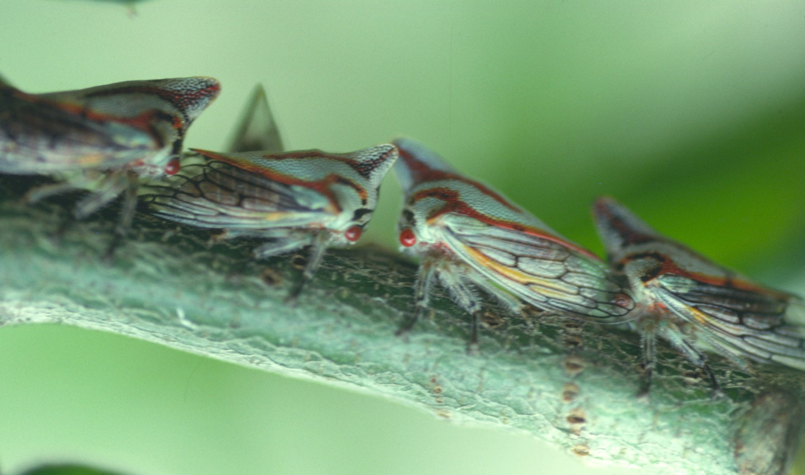
```

#### Biology {-}

*P. vittata* adult females overwinter and oviposit in slits or crescent-like punctures they cut in the bark of twigs in spring.  Females remain with eggs and nymphs as they mature.  In the spring generation, nymphs are gregarious and aggregate along twigs.  Spring-generation adults give rise to a second generation later in the summer.

#### Importance {-}

Although damage may sometimes be conspicuous, damage to mature trees is generally minor.  Large amounts of twig dieback may stunt affected seedlings or saplings.

#### Citation {-}

Swiecki, T.J.; Bernhardt, E.A. 2025. Treehoppers. In Swiecki, T.J., et al. (Eds.) Field Guide to Insects and Diseases of California Oaks, Online edition 2025.

## Kuwana oak scale {-}

### *Kuwania quercus* (Margarodidae) {-}

#### Distribution / Hosts {-}

In California, *Kuwania quercus* has been found in Amador, Napa, San Joaquin, San Mateo, Santa Clara, Solano, Sonoma, and Yolo Counties, but may be more widespread.  It has been observed on blue oak and unidentified live oaks (probably coast live and/or interior live oak) and in an American chestnut orchard.  It was originally described on oaks in Japan, but also occurs on oaks in China and Formosa.  Gill (1993) indicates that California specimens may actually be a different species from the Asian species

```{r, fig.align='center', fig.asp=.75, fig.cap="Approximate ranges of Kuwana oak scale (orange shading) and native oak species (green) in California.", out.width='30%'}
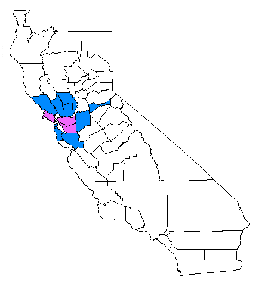
```

#### Symptoms {-}

In blue oak, infestations are associated with obvious roughening and exfoliation of bark (figure  \@ref(fig:SapFdrs12),  \@ref(fig:SapFdrs13)).  The ground close to the trunk of infected trees may be covered with pieces of bark that have flaked off the tree.  Hard grayish or whitish waxen capsules that surround the pre-adult females can be seen under loose bark in spring.


(ref:SapFdrs12) Exfoliating bark of blue oaks infested with Kuwana oak scale. Photo: Tedmund J. Swiecki and Elizabeth A. Bernhardt, Phytosphere Research.

```{r SapFdrs12, fig.align='center', fig.asp=.75, fig.cap="(ref:SapFdrs12)", out.width="75%"}
knitr::include_graphics("images/Insect-sap/KuwQue-QD_Kuwana oak scale blue oak Pope Valley Nov 18 2003 d_Phytosphere.jpg")
```

(ref:SapFdrs13) Exfoliating bark of blue oaks infested with Kuwana oak scale. Photo: Tedmund J. Swiecki and Elizabeth A. Bernhardt, Phytosphere Research.

```{r SapFdrs13, fig.align='center', fig.asp=.75, fig.cap="(ref:SapFdrs13)", out.width="75%"}
knitr::include_graphics("images/Insect-sap/KuwQue-QD_Kuwana oak scale_Ione 5-27-04_Phytosphere.jpg")
```

#### Agent Description {-}

Bright red ovate-shaped adults are about 1.75—2.25 mm long.  Adult females produce a dorsal mass of white, waxy threads.  They are secretive and often hide under rough, loosened bark.  The pre-adult female is bright red, legless and covered with a hard grayish or whitish waxy capsule. Only waxy residue may be visible on the bark of affected trees through much of the summer and fall (figure  \@ref(fig:SapFdrs14),  \@ref(fig:SapFdrs15)).

(ref:SapFdrs14) Reddish Kuwana oak scale females and associated waxy filaments under blue oak bark. Photo: Tedmund J. Swiecki and Elizabeth A. Bernhardt, Phytosphere Research.

```{r SapFdrs14, fig.align='center', fig.asp=.75, fig.cap="(ref:SapFdrs14)", out.width="75%"}
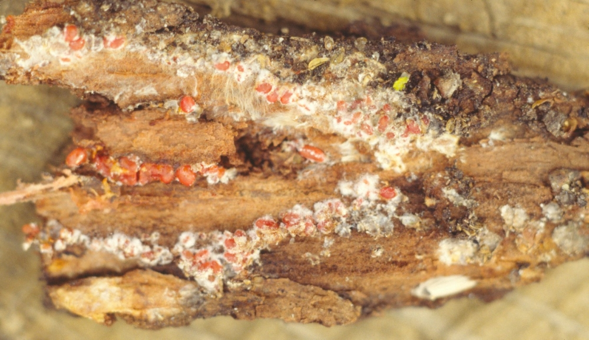
```


(ref:SapFdrs15) Reddish Kuwana oak scale females and associated waxy filaments (arrows). Photo: Tedmund J. Swiecki and Elizabeth A. Bernhardt, Phytosphere Research.

```{r SapFdrs15, fig.align='center', fig.asp=.75, fig.cap="(ref:SapFdrs13)", out.width="75%"}
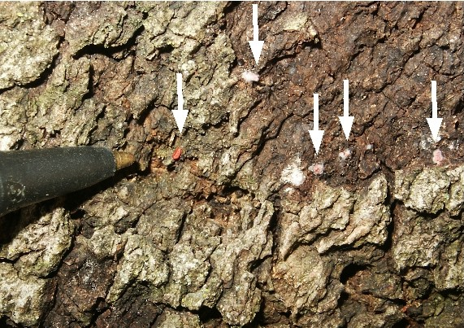
```

#### Biology {-}

The life cycle of this insect in California is unknown.  In Solano County, pre-adult females have been observed in mid-March; mature females laid eggs by mid- to late April.

#### Importance {-}

Infestations tend to be highly localized in distribution.  Other than obvious visual impacts due to bark flaking, long-term impacts on tree health are unknown.

#### Citation {-}

Swiecki, T.J.; Bernhardt, E.A. 2025. Kuwana oak scale. In Swiecki, T.J., et al. (Eds.) Field Guide to Insects and Diseases of California Oaks, Online edition 2025.

## Oak lecanium scale {-}

### *Parthenolecanium quercifex* (Coccidae) {-}

#### Distribution / Hosts {-}

Oak lecanium scale is found on oaks in many parts of the eastern U.S.  In California, it is reported on coast live and valley oak from the Sacramento Valley and the San Francisco Bay Area to southern California.  Other reported hosts include other oak species, sycamore, pecan, chestnut, birch, persimmon, and pricklyash.

The very similar and related European fruit lecanium, *P. corni*, is reported on California black oak in the northern Sierra Nevada.  *P. corni* is common throughout California and the U.S. on many hosts.

```{r, fig.align='center', fig.asp=.75, fig.cap="Approximate ranges of oak lecanium scale (orange shading) and native oak species (green) in California.", out.width='30%'}
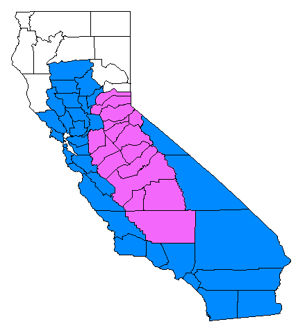
```
#### Symptoms {-}

Globose brown scale insects occur on twigs and produce honeydew.  Black sooty mold grows on the honeydew that drips on leaves and twigs.  Very heavy infestations can cause twig dieback and stunted leaves.

#### Agent Description {-}

Mobile nymphs (crawlers) are flat and orangish and occur on leaves or twigs. Adult scales are immobile and occur on twigs.  Adults are hemispherical, 4—6 mm long, brown, and have a smooth, shiny surface that may include some white powdery material (figure  \@ref(fig:SapFdrs16),  \@ref(fig:SapFdrs17)). Females have a pair of lateral bumps. 


(ref:SapFdrs16) Close-up of oak lecanium scale. Photo: Bruce Hagen, CalFire, retired.

```{r SapFdrs16, fig.align='center', fig.asp=.75, fig.cap="(ref:SapFdrs16)", out.width="50%"}
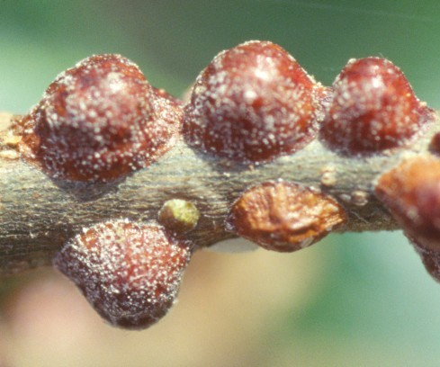
```


(ref:SapFdrs17) Oak lecanium scale. Photo: Don Owen, CalFire, retired.

```{r SapFdrs17, fig.align='center', fig.asp=.75, fig.cap="(ref:SapFdrs17)", out.width="75%"}
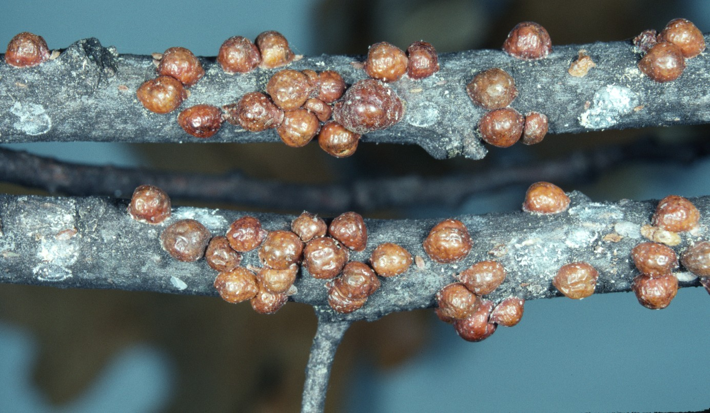
```


#### Biology {-}

Nymphs overwinter and mature into adults in the spring.  Winged adult males mate with wingless females.  Eggs are laid beneath the female in late spring.  First-instar nymphs emerge from beneath the female and crawl to the leaves where they feed.  After settling they retain their tiny legs and antennae and are able to move very slowly.  The second-instar nymphs migrate back to twigs in late summer, where they overwinter.  This insect has one generation per year.

#### Importance {-}

Honeydew dripping and subsequent sooty mold growth may become a nuisance.  Greatest impacts of this insect reportedly occur on coast live oak in southern California.

#### Citation {-}

Swiecki, T.J.; Bernhardt, E.A. 2025. Oak lecanium scale (Coccidae). In Swiecki, T.J., et al. (Eds.) Field Guide to Insects and Diseases of California Oaks, Online edition 2025.


## Obscure scale {-}

### *Melanaspis obscura* (Diaspididae) {-}

#### Distribution / Hosts {-}

Obscure scale is widely distributed in the eastern and southeastern U.S, particularly in warmer areas.  It has been established in Sacramento, CA for an extended period, but is now controlled by an introduced parasitoid.  Infestations in San Diego and Los Angeles Counties occurring before 1940 were eradicated.  In California, obscure scale has been reported on native coast live, interior live, and oracle oak, and the introduced pin, willow, and northern red oaks.  It prefers oak and pecan, but is found on many other woody species including hickory and walnut.


```{r, fig.align='center', fig.asp=.75, fig.cap="Range of obscure scale (blue color) in California.", out.width='30%'}
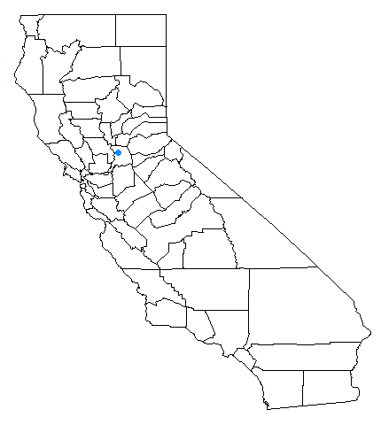
```

#### Symptoms {-}

These scale insects are inconspicuous due to gray covers and may be found on twigs, branches, trunks, and exposed roots, sometimes under loose bark.  They often settle close together, resulting in masses of overlapping scale insects.  Heavy infestations may cause twig and branches dieback, which can weaken trees, increasing their susceptibility to other opportunistic agents.  Obscure scale does not produce honeydew.

#### Agent Description {-}

Adult scale covers are gray, circular to oval, 2—3 mm in diameter, flat to slightly convex, and may have an off-center dark spot, which is the first-instar cast skin.  Scales are often in overlapping clusters (figure  \@ref(fig:SapFdrs18)).  A noticeable white spot is left on the host stem if the scale is removed.


(ref:SapFdrs18) Overlapping clusters of obscure scale on an infested twig.  Photo:  John A. Weidhass, Virginia Tech, www.forestryimages.org.

```{r SapFdrs18, fig.align='center', fig.asp=.75, fig.cap="(ref:SapFdrs18)", out.width="75%"}
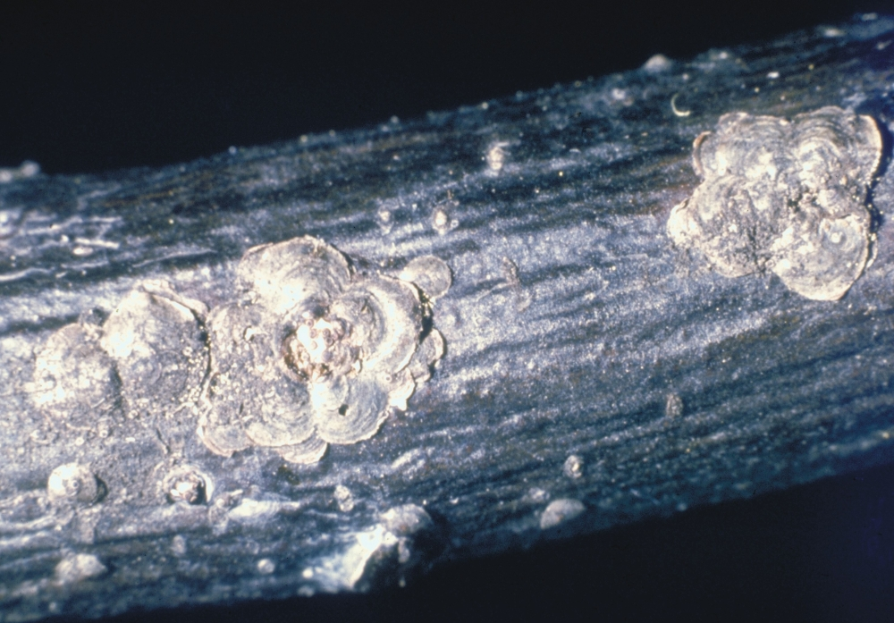
```

#### Biology {-}

Eggs hatch beneath females in mid summer.  Crawlers (mobile nymphs) are very tiny, about the size of a period, and flat.  They settle close together on the bark of the host, often under existing adult shells.  Once the crawler begins to feed it produces a clear wax shell.  Nymphs continue to grow to adulthood beneath the protective wax shell.  Winged adult males crawl out from under their armored shells in the spring to mate with immobile females, which lay eggs beneath their bodies.  Egg laying can last for an extended period.  There is one generation per year.

#### Importance {-}

This scale was introduced to California from the eastern U.S., where it is a significant pest of oaks in landscapes, but is not a forest pest.  It was originally discovered in 1933 in southern California infesting pecans, although the Sacramento infestation may date to 1897, when trees from Civil War battlefields were transplanted into Capitol Park.  In Sacramento, a tiny wasp parasitoid (*Encarsia aurantii*) introduced from Texas has provided complete biological control (Ehler 2005).

#### Citation {-}

Swiecki, T.J.; Bernhardt, E.A. 2025. Obscure scale. In Swiecki, T.J., et al. (Eds.) Field Guide to Insects and Diseases of California Oaks, Online edition 2025.

## Pit scales {-}

### Oak pit scale - *Asterolecanium minus*, *A. quercicola*, Golden oak scale - *A. variolosum* (Asterolecaniidae) {-}

#### Distribution / Hosts {-}

*Asterolecanium minus* and *A. quercicola* are widely distributed in California but *A. variolosum* is reportedly rare (Gill 1993).  All three species are common in other parts of the U.S. on oaks.  In California, *A. minus* and *A. quercicola* prefer white oaks including valley, blue, and Engelmann oak, and some non-native white oaks, but are also found on coast live and California black oak.  *A. variolosum* is reportedly restricted to English oak and California black oak in California.  Reports of this species on other oaks may be due to confusion between the three species of *Asterolecanium.*  Additional oaks in the white and red/black oak subgroups are hosts of these pit scales in the eastern U.S.


```{r, fig.align='center', fig.asp=.75, fig.cap="Approximate ranges of pit scales (orange shading) and native oak species (green) in California.", out.width='30%'}
knitr::include_graphics("images/distributions/statewide.png")
```


#### Symptoms {-}

Pinhead-sized scales are found on twigs and small branches. A ring of swollen bark forms around each scale so that it becomes embedded in the center of a depression or 'pit'  (figure  \@ref(fig:SapFdrs19), \@ref(fig:SapFdrs20)).  Heavy infestations cause the normally smooth bark of young twigs to become rough.  Poor twig growth and dieback is a common result of pit scale infestation.  Deciduous oaks retain dead leaves on killed twigs throughout the winter.  Damage to oaks is caused by the removal of plant fluids and perhaps the injection of toxins into twigs (figure  \@ref(fig:SapFdrs21)).  Pit scales do not produce honeydew.

(ref:SapFdrs19) Oak pit scale.  Swellings that give rise to pitted appearance have not yet formed around some of the younger scales. Photo: Bruce Hagen, CalFire, retired.

```{r SapFdrs19, fig.align='center', fig.asp=.75, fig.cap="(ref:SapFdrs19)", out.width="50%"}
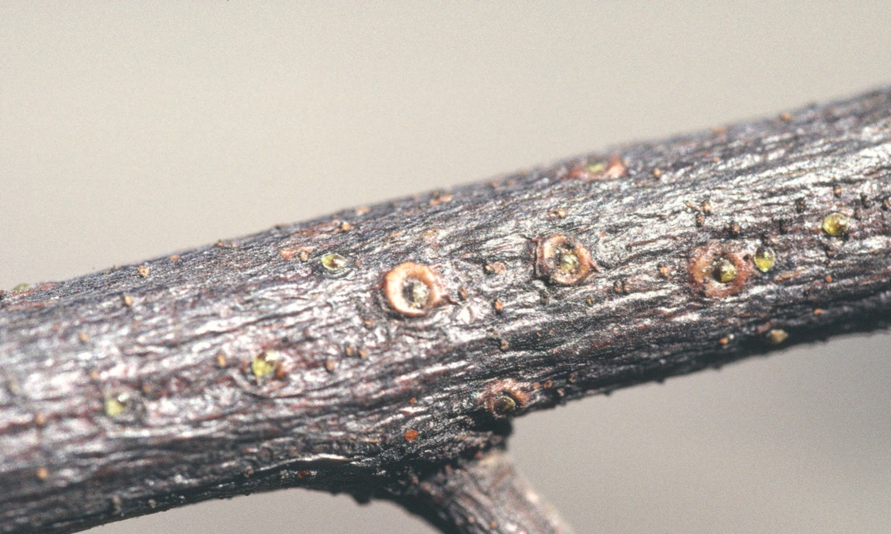
```


(ref:SapFdrs20) Golden oak scale.  Pits have not yet formed around these scales.  Photo: Jack Kelly Clark, courtesy UC Statewide IPM Program.

```{r SapFdrs20, fig.align='center', fig.asp=.75, fig.cap="(ref:SapFdrs20)", out.width="75%"}
knitr::include_graphics("images/Insect-sap/AstVar_Asterolecanium variolosum_UCIPM_I-HO-AVAR-AD.003.jpg")
```


(ref:SapFdrs21) Small coast live oak branch with tangential slice of bark and wood removed showing necrosis associated with oak pit scales. Photo: Tedmund J. Swiecki and Elizabeth A. Bernhardt, Phytosphere Research.

```{r SapFdrs21, fig.align='center', fig.asp=.75, fig.cap="(ref:SapFdrs21)", out.width="75%"}
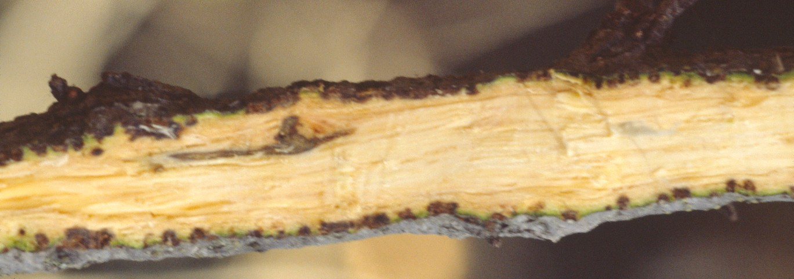
```


#### Agent Description {-}

Diameters of adults vary somewhat by species: 1—1.5 mm for *A. minus*, 1.25—1.75 mm for *A. quercicola*, 1.75—2.25 mm for *A. variolosum*.  All three species are otherwise similar in appearance.  Scales are rounded and green, gold, or brown, depending on age. 

#### Biology {-}

Only females are known.  There is only one generation a year, but an individual female may produce young for up to five months.  Females overwinter in pits on twigs.  Eggs are laid beneath the female's protective cover.  Most mobile nymphs (crawlers) emerge from beneath the females from April to June, but some may emerge as late as October.  The crawlers settle near the parent on twigs not more than a year old.  Once settled, the scale remains immobile for the rest of its life.

#### Importance {-}

Pit scales are serious pests of oaks in California, especially in southern California.  Pit scales tend to be more common on deciduous oaks than on live oaks, and more common on oaks in landscapes than in wildlands.

#### Citation {-}

Swiecki, T.J.; Bernhardt, E.A. 2025. Pit scales. In Swiecki, T.J., et al. (Eds.) Field Guide to Insects and Diseases of California Oaks, Online edition 2025.


