# Sap feeders {#sap}

## Oak leaf phylloxeras {-}

### *Phylloxera* spp. (Phylloxeridae) {-}

#### Distribution / Hosts {-}

The family Phylloxeridae (phylloxerans) are a group of sap-sucking insects related to aphids. It includes seven genera and about 70 species.  The genus *Phylloxera* includes about 55 species in North America and Europe that occur on trees in the Juglandaceae and Fagaceae [@Favret2026]. Most North American *Phylloxera* species form galls on *Carya* (hickory and pecan). Others cause leaf folding or small yellow or brown spots on chestnuts (*Castanea*) and oaks. The best known phylloxeran is the grape phylloxera, *Daktulsphaira vitifoliae*, which attacks roots and can cause leaf galls in grape (*Vitis*) species.

Eight *Phylloxera* spp. have been recorded feeding on oaks in California west of the Sierra Nevada. Information on the California oak hosts of these *Phylloxera* spp. is incomplete. Seven of these occur on white oaks (subgenus *Quercus*), one (*P. reticulata*) occurs on black oaks (subgenus *Lobatae*). 

Three *Phylloxera* spp. were originally described on oaks in California: *P. davidsoni* on *Q. engelmannii*;  *P. stanfordiana* on *Q. douglasii*; and *P. reticulata* on *Q. kelloggii*. 
Four species were originally described from white oaks in other areas of the US:  *P. stellata* and *P. tuberculifera* - Texas;  *P. rileyi* - Missouri; and *P. querceti* - Washington DC. In California, these four species have been observed on scrub oaks (may include *Q. berberidifolia*, *Q. dumosa*, and others) and other undetermined oak species. The eighth phylloxera, *P. glabra*, is a European species that occurs on various white oaks, including blue, Oregon, and valley oak. It was first reported in California in 2018 but was likely present well before then. *P. glabra* was first detected in North America in Victoria, British Columbia, in 1961. It was found in Washington and New Zealand by the 1990s.  


```{r, fig.align='center', fig.asp=.75, fig.cap="Approximate aggregate range of *Phylloxera* spp. (orange shading) and native oak species (green) in California.", out.width='30%'}
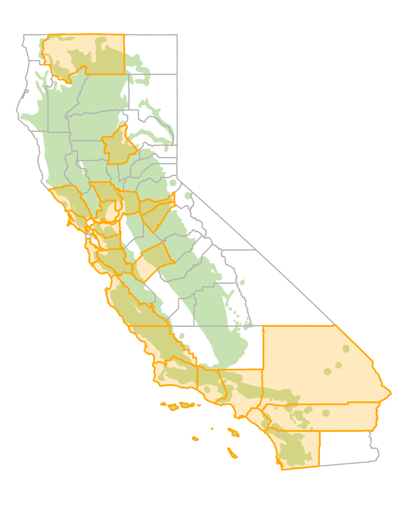
```

#### Symptoms {-}

In California, feeding by most oak phylloxeras induces small (1 mm diameter or less), yellow or brownish spots on oak leaves that are visible on both the upper and lower surfaces (figure  \@ref(fig:SapFdrs1)). Depending on the *Phylloxera* species, spots may be located primarily along veins or spread over the entire leaf surface. Closely-spaced spots can merge together, especially along leaf veins. Spots become most noticeable in mid summer to early fall. If population levels are high enough, part or all of an affected leaf may turn brown and die (figure  \@ref(fig:SapFdrs2)). 

In addition to causing chlorotic spots, feeding by *P. glabra* first generation nymphs and adults (fundatrices) near leaf edges causes the leaf edge to fold over. Unlike the leaf edge pseudogalls caused by the woolly oak aphid *Stegophylla essigi* (figure  \@ref(fig:SapFdrs5)), there is no distinct thickening or reddish discoloration of the folded tissue. 

*P. stanfordiana* differs from other California oak phylloxeras in that it was described as occurring on twigs of *Q. douglasii* [@ferris1919]. However, other *Phylloxera* species, such as *P. glabra*, overwinter as eggs or first instar nymphs in sheltered locations on twigs [@Duncan1997]   

Wingless adults and immatures (nymphs) normally occur on the undersides of affected leaves. All are less than 1 mm long, somewhat pear-shaped, and mostly orange to yellow, but one species is brownish. Small ovoid yellowish to orange eggs may also be present, either scattered or in circular patterns.    

(ref:SapFdrs1) Oak leaf phylloxera symptoms on valley oak; this unidentified species tends to congregate along veins. Photo: Tedmund J. Swiecki and Elizabeth A. Bernhardt, Phytosphere Research.

```{r SapFdrs1, fig.align='center', fig.asp=.75, fig.cap="(ref:SapFdrs1)", out.width="75%"}
knitr::include_graphics("images/Insect-sap/Phyll-QL_Vacaville Nov 18 2003 h_Phytosphere.jpg")
```

(ref:SapFdrs2) Damage associated with high oak leaf phylloxera populations, here on valley oak, may include leaf scorch (right).  Pupal case and adult of a lady beetle, which prey on phylloxera, are also visible. Photo: Tedmund J. Swiecki and Elizabeth A. Bernhardt, Phytosphere Research.

```{r SapFdrs2, fig.align='center', fig.asp=.75, fig.cap="(ref:SapFdrs2)", out.width="75%"}
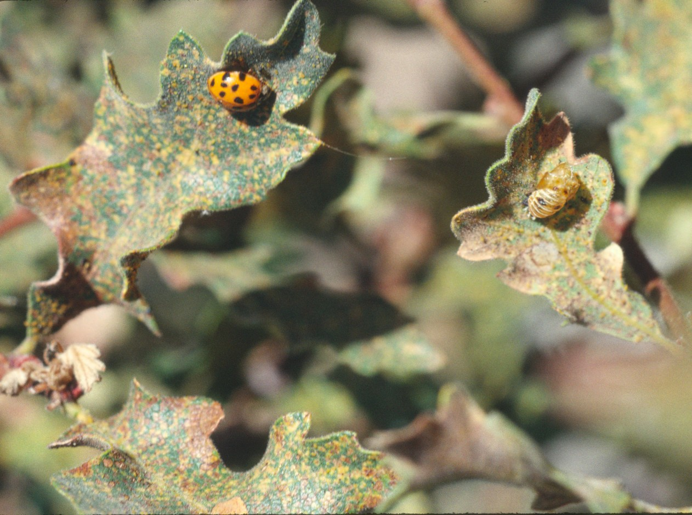
```


#### Agent Description {-}

Eggs are oval, about 0.3 mm long.  Nymphs and adults are oval to pyriform (pear-shaped), with fine ridges and short spine-like projections (tubercles), and very short legs (figure  \@ref(fig:SapFdrs3A)). Species descriptions are primarily based on the wingless (apterous) asexually-reproducing (agamic) females. Characteristics such as the length of the beak-like mouthpart  (rostrum), dorsal tubercles, etc., are based on the relative lengths compared to other body parts on the same insect [@Duncan1922]. Because species descriptions were mostly made from  specimens mounted on microscope slides, not all field-observable characteristics (e.g., body and eye color, egg laying pattern, distribution on leaf) are recorded for each species.  

*P. davidsoni* wingless adults (apterae) are about 0.73 mm long and light orange to yellowish-brown, with prominent elongate conical tubercles. Winged adults (alatae) are orange with a black thorax.  Immatures are pale yellow.

*P. glabra* apterae are 0.7—0.85 mm long, yellowish orange and may have reddish flecks. Tubercles are sparse and small. On smooth leaves, eggs are laid in concentric patterns, but on oaks such as *Q. garryana*, dense hairs on the bottom leaf surface interfere with the pivoting that produces this pattern and eggs are laid singly [@Duncan1997]. Damage is dispersed across the leaf. Alatae are orange with wings held flat over the abdomen. 

*P. querceti* apterae are 0.45—0.5 mm long, yellow to orange, with prominent elongate conical tubercles. Damage is mainly along veins.

*P. reticulata* apterae are about 0.75 mm long, bright orange-yellow. Adults have reddish eyes. Tubercles are elongate conical with many tiny, spirally-arranged spiny points. Damage is mainly along veins.

*P. rileyi* apterae are about 0.6 mm long, dark brown with almost black dorsal tubercles. A paler form was also described. Tubercles are very conspicuous with many spirally-arranged points. 

*P. stanfordiana* apterae are about 0.75 mm long and pale yellow. Tubercles are very small and sparse. Reported to occur on twigs, especially in sheltered spots, including under egg masses of moths. 

*P. stellata* apterae are about 0.45 mm long, color not noted in original description. Tubercles are large and globular, each 
with a multiple knob-like secondary projections and small spines,  giving a stellate appearance. Damage is dispersed across the leaf.

*P. tuberculifera* apterae are about 0.5 mm long, color not noted in original description. Tubercles are very small, slightly taller than their basal diameter. Damage is dispersed across the leaf.

(ref:SapFdrs3A) Diagrams of the seven North American *Phylloxera* species recorded on oaks in California from original drawings by @ferris1919 (*P. stanfordiana*) and @Duncan1922 (all others). The dorsal side of each insect is drawn left of the center line; the ventral side is drawn on the right. Scale bar to the left of each species is the reported body length.  Graphic (using published images): Tedmund J. Swiecki and Elizabeth A. Bernhardt, Phytosphere Research.

```{r SapFdrs3A, fig.align='center', fig.asp=.75, fig.cap="(ref:SapFdrs3A)", out.width="90%"}
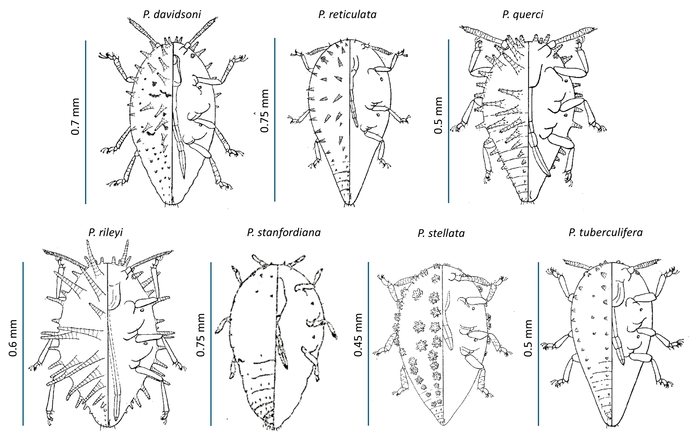
```


(ref:SapFdrs3) Close-up of several phylloxera nymphs on the underside of a valley oak leaf. Photo: Tedmund J. Swiecki and Elizabeth A. Bernhardt, Phytosphere Research.

```{r SapFdrs3, fig.align='center', fig.asp=.75, fig.cap="(ref:SapFdrs3)", out.width="60%"}
knitr::include_graphics("images/Insect-sap/Phyll-QL_ Nov 17 03 a_Phytosphere.jpg")
```

#### Biology {-}

Life cycles of these species have not been studied in California, but are expected to generally correspond with that observed in other oak-infesting species. Overwintering occurs as eggs or first-instar nymphs in sheltered locations on the bark of branches. When buds break in the spring, nymphs of the first overwintered generation (fundatrices) migrate to expanding leaves where they either disperse or move to preferred locations, such as leaf veins. One or more asexually reproducing generations may develop over the spring and summer. Populations build up over the summer and are highest in September and October. A sexual generation may be involved in the production of overwintering eggs.

In *P. glabra*, fundatrix adults move to leaf edges, where eggs are laid in the folded edge that develops. Nymphs from that asexual generation disperse across the leaf lower surface to feed. Winged (alate) females develop in mid to late summer and disperse via flight. These sexuparae lay eggs that give rise to a nonfeeding sexual generation (sexuales) in early fall. Mated females from this generation lay a single overwintering egg [@Duncan1997].

In nurseries, high populations of oak phylloxera can build up due to cultural conditions, including prolonged production of new leaves and overlapping canopies that facilitate spread between plants. The winged sexuparae generation may be delayed until later in the fall. Dispersal of winged phylloxeras is very limited, but long-range spread occurs readily through the movement of infested nursery stock. Initial spread of the invasive *P. glabra* in British Columbia was associated with the planting of English oak (*Q. robur*) as an ornamental [@Duncan1997]. 

Oak phylloxera populations can be held in check by natural enemies, which include predators such as ladybird beetles and lacewings. No parasitoids of oak phylloxeras found in California are reported.  

#### Importance {-}

The North American species of oak leaf phylloxera found in California are usually of minor importance to mature trees. However, heavy infestations on oak seedlings and saplings can  reduce growth and vigor. High populations that develop in oak nursery stock can seriously weaken or damage seedlings. 

The invasive *P. glabra* is reported to be a severe pest of Oregon white oak in British Columbia, causing significant scorching and defoliation of mature trees. Repeated defoliation of *Q. garryana* can lead to poor growth, canopy dieback, epicormic sprouting, and tree decline. Individual trees within a given oak species vary in their susceptibility to severe damage by *P. glabra*. In Victoria, British Columbia, about 10% of *Q. garryana* were subject to repeated, severe infestations, whereas others developed localized infestations on specific branches or had low overall levels of damage [@Duncan1997].   

#### Citation {-}

Swiecki, T.J.; Bernhardt, E.A. 2026. Oak leaf phylloxeras. In Swiecki, T.J., et al. (Eds.) Field Guide to Insects and Diseases of California Oaks, Online edition `r Sys.Date()`.

## Woolly oak aphids {-}
### *Stegophylla essigi*, *S. quercifoliae* (Aphididae) {-}

#### Distribution / Hosts {-}

*Stegophylla essigi* is widespread in California, occurring in both coastal and inland counties, and has been reported from Oregon. It occurs on many California oaks, including blue, Engelmann, valley, Oregon white, coast live, interior live, California black, and scrub oak.

```{r, fig.align='center', fig.asp=.75, fig.cap="Approximate ranges of *Stegophylla essigi* (orange shading) and native oak species (green) in California.", out.width='30%'}
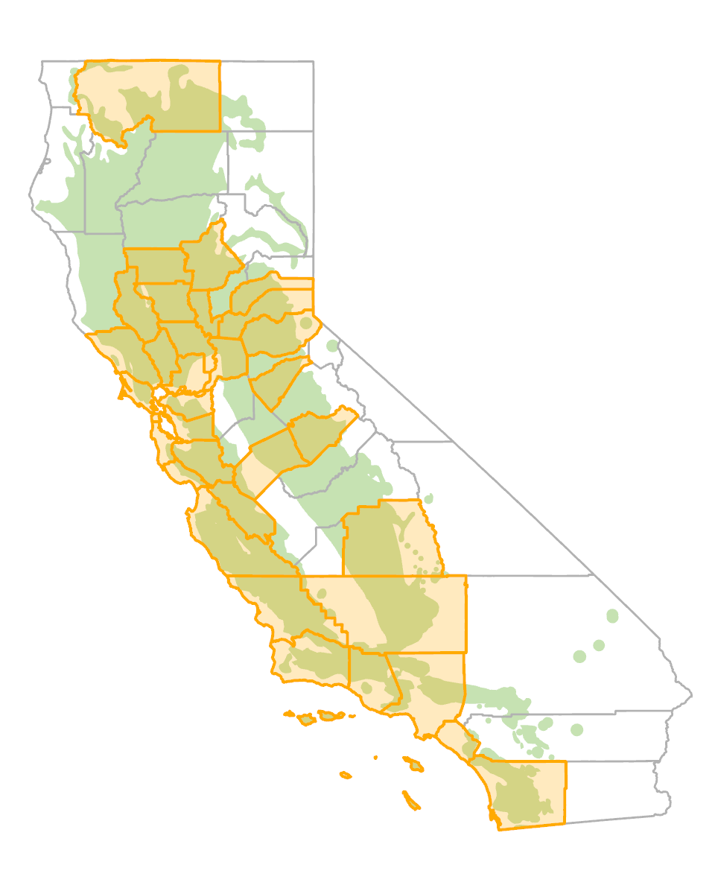
```


*S. quercifoliae* is widely distributed in California but has been under-reported to date due to the taxonomic confusion discussed below. Verified collections of *S. quercifoliae* have been made from blue, Engelmann, valley, coast live, interior live, and scrub oak. This aphid was originally described from specimens on scrub oak species in Colorado, and is also reported from Washington.    


```{r, fig.align='center', fig.asp=.75, fig.cap="Approximate ranges of *Stegophylla quercifoliae* (orange shading) and native oak species (green) in California.", out.width='30%'}
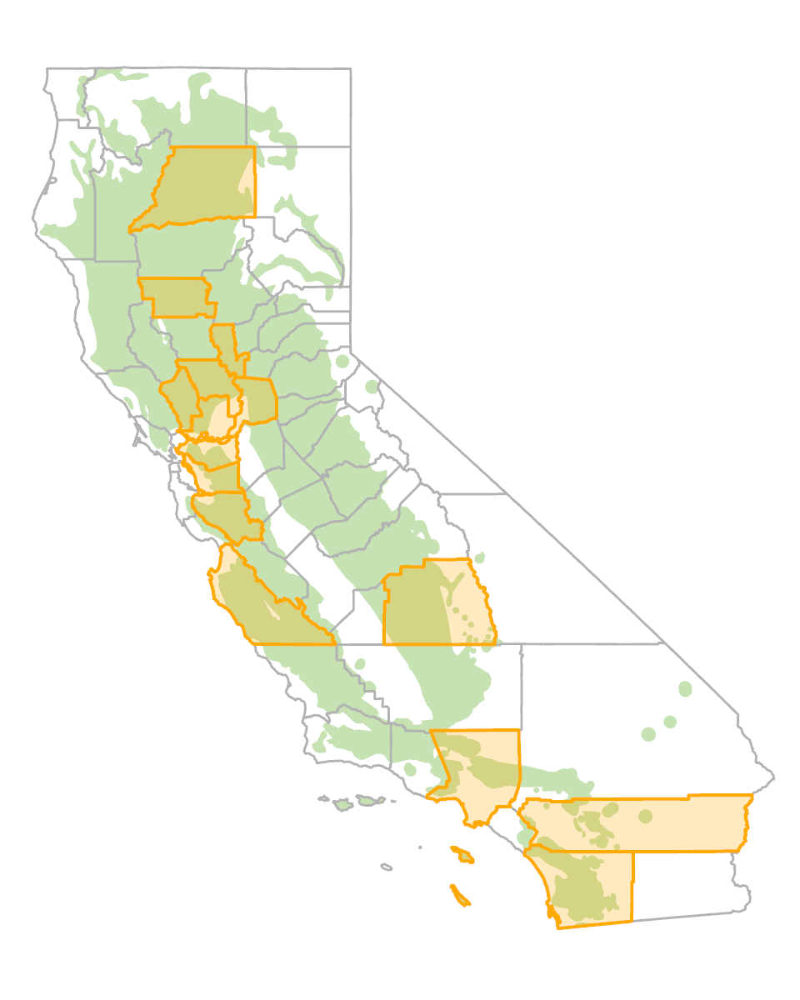
```

As detailed by @hillerislambers1966, the taxonomy of the *Stegophylla* species on oaks in California and elsewhere in North America has been confused through a series of misidentifications and misclassifications.  A woolly aphid on twigs of oaks in northern Illinois was named *Eriosoma querci* Fitch in 1859. However, Fitch described winged (alate) forms for this aphid that were actually a  different, non-woolly species on non-oak hosts. This initiated a series of confused and conflicting reclassifications resulting in *E. querci* being eventually transferred to the invalid name *Stegophylla querci* (Fitch), which was then incorrectly synonymized with a separate species, *Stegophylla quercicola*. @swain1919 described woolly oak aphids occurring on several California oaks   that formed pesudogalls on leaf edges. He classified these as *Phyllaphis* (later *Stegophylla*) *quercicola*, although he indicated that the  "identity of this species has never been definitely established" and noted that *S. quercicola*  was thought to differ from the woolly oak aphids in California. @hillerislambers1966 determined that Swain's California aphids were a distinct species, which he named *Stegophylla essigi*, but did not definitively resolve the nomenclature issues involving  *Stegophylla querci* and *S. quercicola*.  @quednau2010 replaced the invalid name *S. querci* with *S. davisi*, described as a species that occurs on oaks in eastern North America. He also clarified that *S. quercicola* applied to oak woolly aphids in eastern North America.

@gillette1914 described *Phyllaphis* (later *Stegophylla*) *quercifoliae* on leaves of scrub oaks in Colorado. This species does not form pseudogalls but seemed to prefer leaves folded by leafrollers or other causes. When first described in Colorado, this aphid was thought to be *Eriosoma querci* Fitch (also referred to as *Schizoneura querci* Fitch). Many California woolly oak aphid collections identified as *S. quercifoliae* before 1950 were subsequently determined to be *E. essigi* [@idigbio022026], but other collections made during and after this period were correctly assigned to *S. quercifoliae*.

In summary, past California records of *S. querci* and *S. quercicola* refer to *S. essigi* or *S. quercifoliae*, which are the two common and widespread woolly oak aphids in California.

#### Symptoms {-}

Feeding by first generation  *S. essigi* in spring on upper leaf surfaces induces the edges of young leaves to fold over onto the upper side of the leaf. This forms a protective shelter referred to as a pseudogall or gall in which the aphids feed and where woolly wax produced by the aphids accumulates (figure  \@ref(fig:SapFdrs5)). Pseudogalls may show a reddish discoloration initially and may die eventually. Generations of aphids produced later in the season form unprotected small colonies on the lower and upper leaf surfaces (@hillerislambers1966, @swain1919).   

*S. quercifoliae* infests the undersides of leaves. It does not form pseudogalls but can frequently be found in leaves folded by leafrolling caterpillars [@gillette1914]. Colonies produce profuse amounts of cottony white wool (figure  \@ref(fig:SapFdrs4)). Wingless females have bright red eyes.  Heavy infestations on young leaves may induce some curling or distortion.  

(ref:SapFdrs5) Leaf edge pseudogalls produced by the feeding of *Stegophylla essigi* on coast live oak . Affected leaf margins are folded upward and become reddish.   Photo: Tedmund J. Swiecki and Elizabeth A. Bernhardt, Phytosphere Research.

```{r SapFdrs5, fig.align='center', fig.asp=.75, fig.cap="(ref:SapFdrs5)", out.width="75%"}
knitr::include_graphics("images/Insect-sap/SteEss-QA_S essigi Q agrifolia 3-12-04 c_Phytosphere.jpg")
```


(ref:SapFdrs4) Woolly oak aphid (*Stegophylla quercifoliae*) colonies on the undersides of valley oak leaves. Note heavy deposits of waxy flocculence. Photo: Tedmund J. Swiecki and Elizabeth A. Bernhardt, Phytosphere Research.

```{r SapFdrs4, fig.align='center', fig.asp=.75, fig.cap="(ref:SapFdrs4)", out.width="75%"}
knitr::include_graphics("images/Insect-sap/SteQue-QL_Stegophylla quercifoliae valley oak 9-5-2003b_Phytosphere.jpg")
```


#### Agent Description {-}
In both species, all females are wingless (apterous). Males may be either winged (alate) or wingless.

*S. essigi* : Fundatrices (1st generation from overwintering eggs) are dark green, covered with curly white wax wool. Viviparous (asexually reproducing) females are broadly oval, light gray-green to pale olive, and covered with woolly wax, about 1.2—1.8 mm long. Oviparous (sexually reproducing) females are dirty obscure green with paler center, rarely pink, not woolly dorsally but with conspicuous wax beards distal to the cornicles (siphunculi). Alate males lack wax wool, are shorter, and have blackish head, thorax, antennae and legs, and blackish green abdomen [@hillerislambers1966].

*S. quercifoliae*: Viviparous females are yellowish to light green, 1.1—1.5 mm long, and covered more or less densely with loose cottony wax. Eyes are bright red. Head, thorax and antennae are yellowish to yellowish brown (figure  \@ref(fig:SapFdrs6)). Oviparous females vary in color (straw yellow, pale yellowish green, or pink) and are about 1.3-1.6 mm long. They have the same loose cottony wax covering and bright red eyes as viviparous females. Head, antennae, legs, anal and gland plates are dusky in color. Alate males are very slender and 0.95 - 1.05 mm long with bright red eyes. Their body color is variable and similar to oviparous females, but with head, thorax, antennae and wing veins blackish. Bodies of winged males have some waxy threads or a powdery wax layer. Eggs (0.5 x 0.3 mm) are pale green and covered with short fragments of wax [@gillette1914].    


(ref:SapFdrs6) Viviparous female of *Stegophylla quercifoliae*. Note red eyes and copious wax wool. Photo: Tedmund J. Swiecki and Elizabeth A. Bernhardt, Phytosphere Research.

```{r SapFdrs6, fig.align='center', fig.asp=.75, fig.cap="(ref:SapFdrs6)", out.width="75%"}
knitr::include_graphics("images/Insect-sap/SteQue-QL_Stegophylla quercifoliae valley oak 10-22-2003c_Phytosphere.jpg")
```


#### Biology {-}

*S. essigi* overwinters as eggs, although populations may continue to reproduce asexually on evergreen oaks such as *Q. agrifolia*, especially in leaves tied together by caterpillar silk. Only the first generation that overwinters as eggs induces leaf edge pseudogalls. Several asexually-reproducing (viviparous) generations develop over the spring and summer, with sexual (oviparous) females and males being produced in fall. 

*S. quercifoliae* presumably overwinters as eggs. Multiple asexually-reproducing (viviparous) generations develop over the spring and summer, with sexual (oviparous) females and males being produced in late fall.    


#### Importance {-}

Early season damage from *S. essigi* pseudogalls on developing leaves. Heavy infestations of *S. quercifoliae* can produce conspicuous and possibly unsightly deposits of loose wax, especially late in the season. Feeding by woolly oak aphids has no substantial impact on tree condition.

#### Citation {-}

Swiecki, T.J.; Bernhardt, E.A. 2026. Woolly oak aphids. In Swiecki, T.J., et al. (Eds.) Field Guide to Insects and Diseases of California Oaks, Online edition `r Sys.Date()`.

## Whiteflies {-}

### Crown whitefly - *Aleuroplatus coronata*, Gelatinous whitefly - *A. gelatinosus*, Stanford’s whitefly - *Tetraleurodes stanfordi* (Aleyrodidae) {-}

#### Distribution / Hosts {-}

Crown whitefly is found throughout California.  It prefers coast live oak, but is also reported on canyon live, interior live, valley, and scrub oak, as well as chinquapin, tanoak, coffeeberry, toyon, madrone, and Rhus.

```{r, fig.align='center', fig.asp=.75, fig.cap="Approximate ranges of crown whiteflies (orange shading) and native oak species (green) in California.", out.width='30%'}
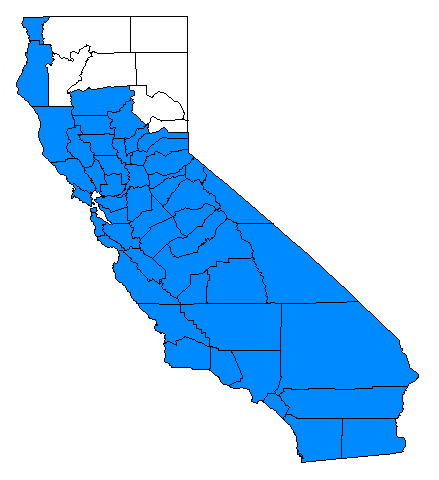
```

Gelatinous whitefly is reported from the San Francisco Bay Area southward through the San Joaquin Valley and southern California on coast live and interior live oak.

```{r, fig.align='center', fig.asp=.75, fig.cap="Approximate ranges of gleatinous whiteflies   (orange shading) and native oak species (green) in California.", out.width='30%'}
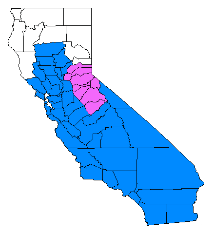
```

Stanford’s whitefly is found mainly throughout coastal California.  It is reported on coast live, California black, and interior live oak as well as chinquapin, tanoak, and coffeeberry.

```{r, fig.align='center', fig.asp=.75, fig.cap="Approximate ranges of Standord's whiteflies   (orange shading) and native oak species (green) in California.", out.width='30%'}
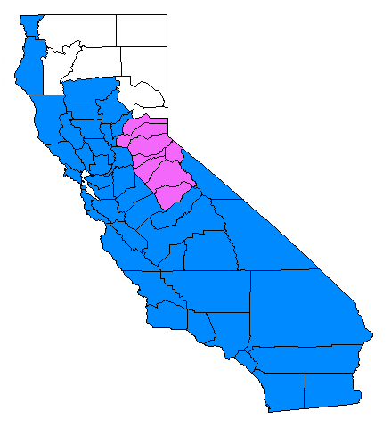
```

#### Symptoms {-}

Non-mobile nymphs and pupae on leaves are the most conspicuous and identifiable sign of an infestation.  They appear as small (less than 1 mm) black or black and white spots on leaves which can be wiped off.  Crown and gelatinous whiteflies occur only on lower leaf surfaces, whereas Stanford’s whitefly mostly feeds on the upper leaf surface.  At certain times of the year, the adult whiteflies may fly around infested plants, sometimes in great numbers.  The honeydew secreted by nymphs accumulates on leaves and supports the growth of black sooty mold.  Very heavy infestations may cause some leaf distortion, yellowing, and premature leaf drop.

#### Agent Description {-}

Adult whiteflies look like tiny (about 1 mm) white moths.  Eggs are white to pink and are attached to the leaf surface by a short stalk.  Nymphs are initially translucent but become black as they mature.  Pupae are tiny, black, oval, and flat.  Species differ in the amount and color (clear or white) of wax associated with the pupae.  Crown whitefly pupae are covered with somewhat rectangular plates of white wax that project outward in all directions (figure  \@ref(fig:SapFdrs7),  \@ref(fig:SapFdrs8)).  Gelatinous whitefly pupae are surrounded by a matrix of clear, gelatinous wax.  Stanford’s whitefly pupae are surrounded by a flat fringe of white waxy plates (figure  \@ref(fig:SapFdrs9)).  Nymphs of crown whitefly resemble Stanford’s whitefly pupae.


(ref:SapFdrs7) Crown whitefly pupae on the underside of a coast live oak leaf. Photo: Tedmund J. Swiecki and Elizabeth A. Bernhardt, Phytosphere Research.

```{r SapFdrs7, fig.align='center', fig.asp=.75, fig.cap="(ref:SapFdrs7)", out.width="75%"}
knitr::include_graphics("images/Insect-sap/AleCor-QA_crown whitefly QA 12-3-2003_Phytosphere.jpg")
```


(ref:SapFdrs8) Close-up of a crown whitefly pupa on a coast live oak leaf. Photo: Tedmund J. Swiecki and Elizabeth A. Bernhardt, Phytosphere Research.

```{r SapFdrs8, fig.align='center', fig.asp=.75, fig.cap="(ref:SapFdrs8)", out.width="75%"}
knitr::include_graphics("images/Insect-sap/AleCor-QA_crown whitefly q agrifolia Nov 18 2003 Vacaville c_Phytosphere.jpg")
```


(ref:SapFdrs9) Stanford’s whitefly pupae on coast live oak. Photo: Bruce Hagen, CalFire, retired.

```{r SapFdrs9, fig.align='center', fig.asp=.75, fig.cap="(ref:SapFdrs9)", out.width="75%"}
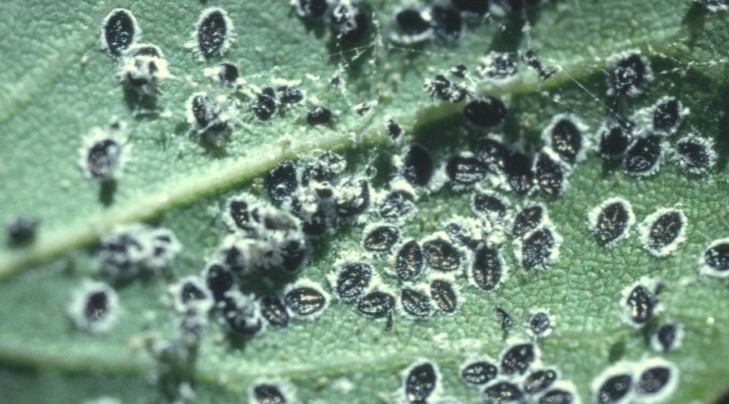
```

#### Biology {-}

Adults emerge from overwintering pupae in spring and lay eggs on the lower leaf surface.  Eggs hatch to give rise to tiny mobile nymphs called crawlers.  Within hours, crawlers settle down and insert their mouthparts into the leaf to suck plant sap from phloem cells.  Whitefly nymphs remain immobile as they go through successive molts.  The last molt gives rise to pupae which overwinter.  Crown whitefly has a single generation per year.

#### Importance {-}

Whiteflies do not cause significant damage to oaks and are typically of little or no importance.  Crown whitefly populations can sometimes reach high enough populations to pose a nuisance, mainly due to honeydew production and related sooty mold growth.  The gelatinous and Standford’s whitefly generally occur in lower numbers than the crown whitefly

#### Citation {-}

Swiecki, T.J.; Bernhardt, E.A. 2025. Whiteflies. In Swiecki, T.J., et al. (Eds.) Field Guide to Insects and Diseases of California Oaks, Online edition `r Sys.Date()`.

## Treehoppers {-}
### *Platycotis vittata*, *P. vittata quadrivittata*, *P. minax* (Membracidae) {-}

#### Distribution / Hosts {-}

*Platycotis vittata* is widely distributed in California and is found throughout the U.S.  It is reported on various oaks in California, including coast live and valley oak.  In other parts of the U.S., *P. vittata* is reported on oaks, birch, chestnut, and other hardwoods.  *P. minax* occurs on coast live oak and possibly other oaks in southern California.

```{r, fig.align='center', fig.asp=.75, fig.cap="Approximate ranges of *Platycotis* spp. (orange shading) and native oak species (green) in California.", out.width='30%'}
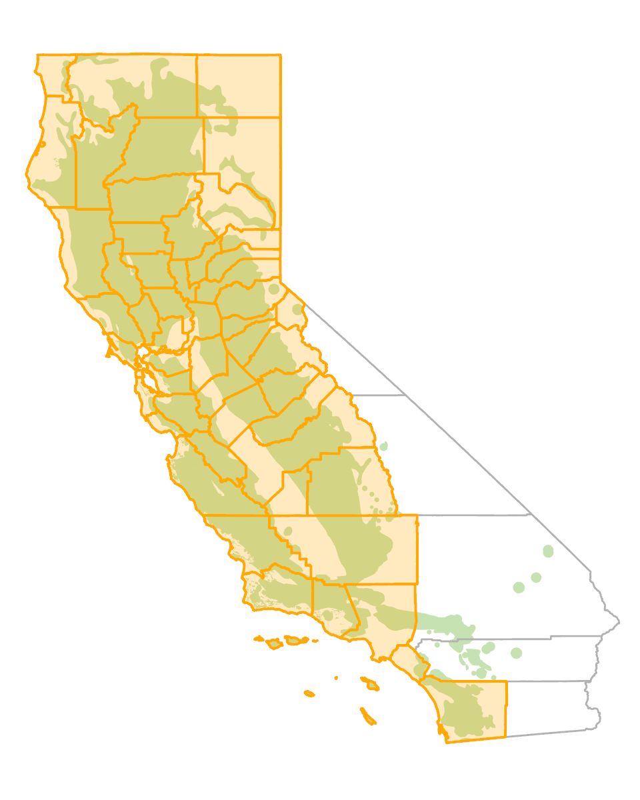
```

#### Symptoms {-}

Slit-like egg-laying (oviposition) wounds on fine branches can cause leaves to wilt and die and may cause twig dieback.  Callus developing around these longitudinal oviposition slits may leave scars on affected twigs.  Honeydew produced by treehoppers drips on foliage and branches and can support growth of black sooty mold on these surfaces.

#### Agent Description {-}

*P. vittata* nymphs are black with yellow and red markings (figure  \@ref(fig:SapFdrs10)).  Adults are 9—12 mm long, and have an enlarged hardened plate (pronotum) on the back of the thorax.  The pronotum covers the insect’s head, much of its abdomen, and part of the prominently-veined wings (figure  \@ref(fig:SapFdrs11)).  In *P. vittata*, two lateral horns project from the pronotum; between these two horns there may be a central forward facing horn.  *P. vittata* adults vary in color (dull olive, bronzy, or sea green) and have small red pits on the pronotum.  *P. vittata quadrivittata* adults are a pale blue color with four red longitudinal stripes and usually have well-developed central and lateral pronotal horns.  Both immatures and adults jump.


(ref:SapFdrs10) *Platycotis vittata* adults and nymphs. CDF Photo: Bruce Hagen, CalFire, retired.

```{r SapFdrs10, fig.align='center', fig.asp=.75, fig.cap="(ref:SapFdrs10)", out.width="50%"}
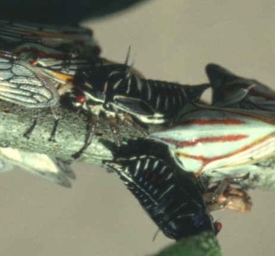
```


(ref:SapFdrs11)  *Platycotis vittata* adults. Photo: Bruce Hagen, CalFire, retired.

```{r SapFdrs11, fig.align='center', fig.asp=.75, fig.cap="(ref:SapFdrs11)", out.width="75%"}
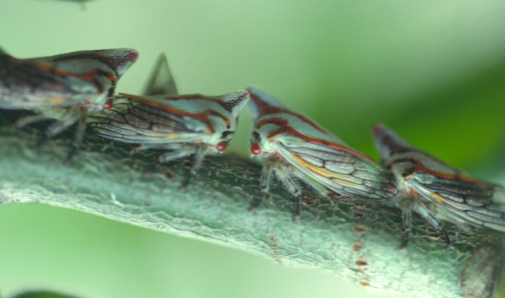
```

#### Biology {-}

*P. vittata* adult females overwinter and oviposit in slits or crescent-like punctures they cut in the bark of twigs in spring.  Females remain with eggs and nymphs as they mature.  In the spring generation, nymphs are gregarious and aggregate along twigs.  Spring-generation adults give rise to a second generation later in the summer.

#### Importance {-}

Although damage may sometimes be conspicuous, damage to mature trees is generally minor.  Large amounts of twig dieback may stunt affected seedlings or saplings.

#### Citation {-}

Swiecki, T.J.; Bernhardt, E.A. 2025. Treehoppers. In Swiecki, T.J., et al. (Eds.) Field Guide to Insects and Diseases of California Oaks, Online edition `r Sys.Date()`.

## Kuwana oak scale {-}

### *Kuwania quercus* (Margarodidae) {-}

#### Distribution / Hosts {-}

In California, *Kuwania quercus* has been found in Amador, Napa, San Joaquin, San Mateo, Santa Clara, Solano, Sonoma, and Yolo Counties, but may be more widespread.  It has been observed on blue oak and unidentified live oaks (probably coast live and/or interior live oak) and in an American chestnut orchard.  It was originally described on oaks in Japan, but also occurs on oaks in China and Formosa.  Gill (1993) indicates that California specimens may actually be a different species from the Asian species

```{r, fig.align='center', fig.asp=.75, fig.cap="Approximate ranges of Kuwana oak scale (orange shading) and native oak species (green) in California.", out.width='30%'}
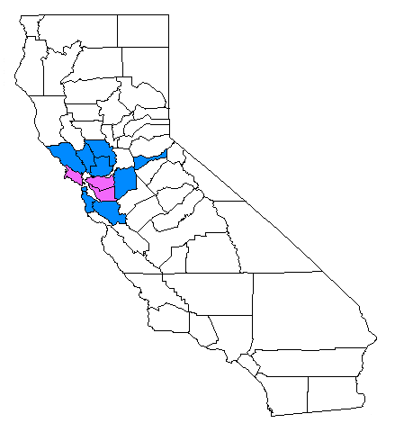
```

#### Symptoms {-}

In blue oak, infestations are associated with obvious roughening and exfoliation of bark (figure  \@ref(fig:SapFdrs12),  \@ref(fig:SapFdrs13)).  The ground close to the trunk of infected trees may be covered with pieces of bark that have flaked off the tree.  Hard grayish or whitish waxen capsules that surround the pre-adult females can be seen under loose bark in spring.


(ref:SapFdrs12) Exfoliating bark of blue oaks infested with Kuwana oak scale. Photo: Tedmund J. Swiecki and Elizabeth A. Bernhardt, Phytosphere Research.

```{r SapFdrs12, fig.align='center', fig.asp=.75, fig.cap="(ref:SapFdrs12)", out.width="75%"}
knitr::include_graphics("images/Insect-sap/KuwQue-QD_Kuwana oak scale blue oak Pope Valley Nov 18 2003 d_Phytosphere.jpg")
```

(ref:SapFdrs13) Exfoliating bark of blue oaks infested with Kuwana oak scale. Photo: Tedmund J. Swiecki and Elizabeth A. Bernhardt, Phytosphere Research.

```{r SapFdrs13, fig.align='center', fig.asp=.75, fig.cap="(ref:SapFdrs13)", out.width="75%"}
knitr::include_graphics("images/Insect-sap/KuwQue-QD_Kuwana oak scale_Ione 5-27-04_Phytosphere.jpg")
```

#### Agent Description {-}

Bright red ovate-shaped adults are about 1.75—2.25 mm long.  Adult females produce a dorsal mass of white, waxy threads.  They are secretive and often hide under rough, loosened bark.  The pre-adult female is bright red, legless and covered with a hard grayish or whitish waxy capsule. Only waxy residue may be visible on the bark of affected trees through much of the summer and fall (figure  \@ref(fig:SapFdrs14),  \@ref(fig:SapFdrs15)).

(ref:SapFdrs14) Reddish Kuwana oak scale females and associated waxy filaments under blue oak bark. Photo: Tedmund J. Swiecki and Elizabeth A. Bernhardt, Phytosphere Research.

```{r SapFdrs14, fig.align='center', fig.asp=.75, fig.cap="(ref:SapFdrs14)", out.width="75%"}
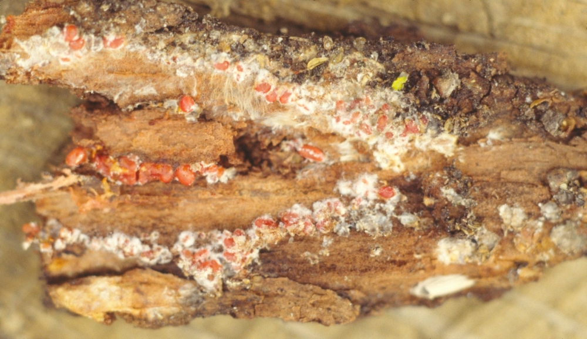
```


(ref:SapFdrs15) Reddish Kuwana oak scale females and associated waxy filaments (arrows). Photo: Tedmund J. Swiecki and Elizabeth A. Bernhardt, Phytosphere Research.

```{r SapFdrs15, fig.align='center', fig.asp=.75, fig.cap="(ref:SapFdrs13)", out.width="75%"}
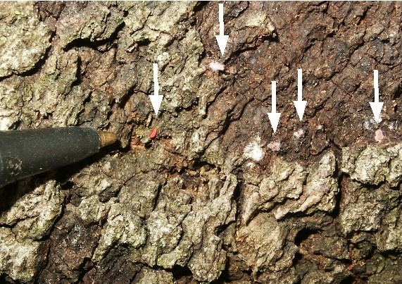
```

#### Biology {-}

The life cycle of this insect in California is unknown.  In Solano County, pre-adult females have been observed in mid-March; mature females laid eggs by mid- to late April.

#### Importance {-}

Infestations tend to be highly localized in distribution.  Other than obvious visual impacts due to bark flaking, long-term impacts on tree health are unknown.

#### Citation {-}

Swiecki, T.J.; Bernhardt, E.A. 2025. Kuwana oak scale. In Swiecki, T.J., et al. (Eds.) Field Guide to Insects and Diseases of California Oaks, Online edition `r Sys.Date()`.

## Oak lecanium scale {-}

### *Parthenolecanium quercifex* (Coccidae) {-}

#### Distribution / Hosts {-}

Oak lecanium scale is found on oaks in many parts of the eastern U.S.  In California, it is reported on coast live and valley oak from the Sacramento Valley and the San Francisco Bay Area to southern California.  Other reported hosts include other oak species, sycamore, pecan, chestnut, birch, persimmon, and pricklyash.

The very similar and related European fruit lecanium, *P. corni*, is reported on California black oak in the northern Sierra Nevada.  *P. corni* is common throughout California and the U.S. on many hosts.

```{r, fig.align='center', fig.asp=.75, fig.cap="Approximate ranges of oak lecanium scale (orange shading) and native oak species (green) in California.", out.width='30%'}
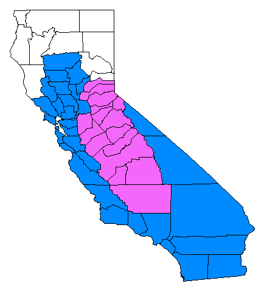
```
#### Symptoms {-}

Globose brown scale insects occur on twigs and produce honeydew.  Black sooty mold grows on the honeydew that drips on leaves and twigs.  Very heavy infestations can cause twig dieback and stunted leaves.

#### Agent Description {-}

Mobile nymphs (crawlers) are flat and orangish and occur on leaves or twigs. Adult scales are immobile and occur on twigs.  Adults are hemispherical, 4—6 mm long, brown, and have a smooth, shiny surface that may include some white powdery material (figure  \@ref(fig:SapFdrs16),  \@ref(fig:SapFdrs17)). Females have a pair of lateral bumps. 


(ref:SapFdrs16) Close-up of oak lecanium scale. Photo: Bruce Hagen, CalFire, retired.

```{r SapFdrs16, fig.align='center', fig.asp=.75, fig.cap="(ref:SapFdrs16)", out.width="50%"}
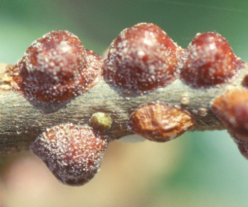
```


(ref:SapFdrs17) Oak lecanium scale. Photo: Don Owen, CalFire, retired.

```{r SapFdrs17, fig.align='center', fig.asp=.75, fig.cap="(ref:SapFdrs17)", out.width="75%"}
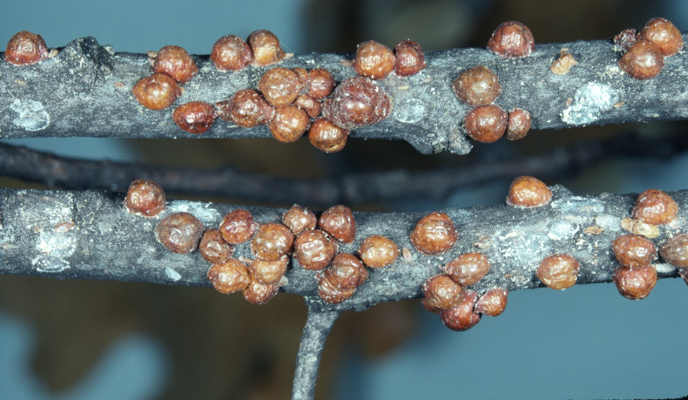
```


#### Biology {-}

Nymphs overwinter and mature into adults in the spring.  Winged adult males mate with wingless females.  Eggs are laid beneath the female in late spring.  First-instar nymphs emerge from beneath the female and crawl to the leaves where they feed.  After settling they retain their tiny legs and antennae and are able to move very slowly.  The second-instar nymphs migrate back to twigs in late summer, where they overwinter.  This insect has one generation per year.

#### Importance {-}

Honeydew dripping and subsequent sooty mold growth may become a nuisance.  Greatest impacts of this insect reportedly occur on coast live oak in southern California.

#### Citation {-}

Swiecki, T.J.; Bernhardt, E.A. 2025. Oak lecanium scale (Coccidae). In Swiecki, T.J., et al. (Eds.) Field Guide to Insects and Diseases of California Oaks, Online edition `r Sys.Date()`.


## Obscure scale {-}

### *Melanaspis obscura* (Diaspididae) {-}

#### Distribution / Hosts {-}

Obscure scale is widely distributed in the eastern and southeastern U.S, particularly in warmer areas.  It has been established in Sacramento, CA for an extended period, but is now controlled by an introduced parasitoid.  Infestations in San Diego and Los Angeles Counties occurring before 1940 were eradicated.  In California, obscure scale has been reported on native coast live, interior live, and oracle oak, and the introduced pin, willow, and northern red oaks.  It prefers oak and pecan, but is found on many other woody species including hickory and walnut.


```{r, fig.align='center', fig.asp=.75, fig.cap="Range of obscure scale (blue color) in California.", out.width='30%'}
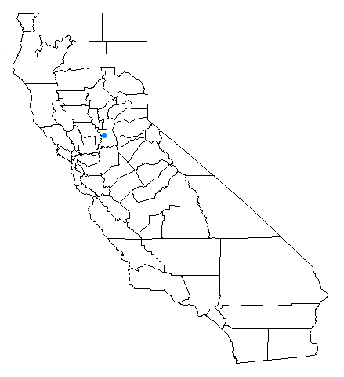
```

#### Symptoms {-}

These scale insects are inconspicuous due to gray covers and may be found on twigs, branches, trunks, and exposed roots, sometimes under loose bark.  They often settle close together, resulting in masses of overlapping scale insects.  Heavy infestations may cause twig and branches dieback, which can weaken trees, increasing their susceptibility to other opportunistic agents.  Obscure scale does not produce honeydew.

#### Agent Description {-}

Adult scale covers are gray, circular to oval, 2—3 mm in diameter, flat to slightly convex, and may have an off-center dark spot, which is the first-instar cast skin.  Scales are often in overlapping clusters (figure  \@ref(fig:SapFdrs18)).  A noticeable white spot is left on the host stem if the scale is removed.


(ref:SapFdrs18) Overlapping clusters of obscure scale on an infested twig.  Photo:  John A. Weidhass, Virginia Tech, www.forestryimages.org.

```{r SapFdrs18, fig.align='center', fig.asp=.75, fig.cap="(ref:SapFdrs18)", out.width="75%"}
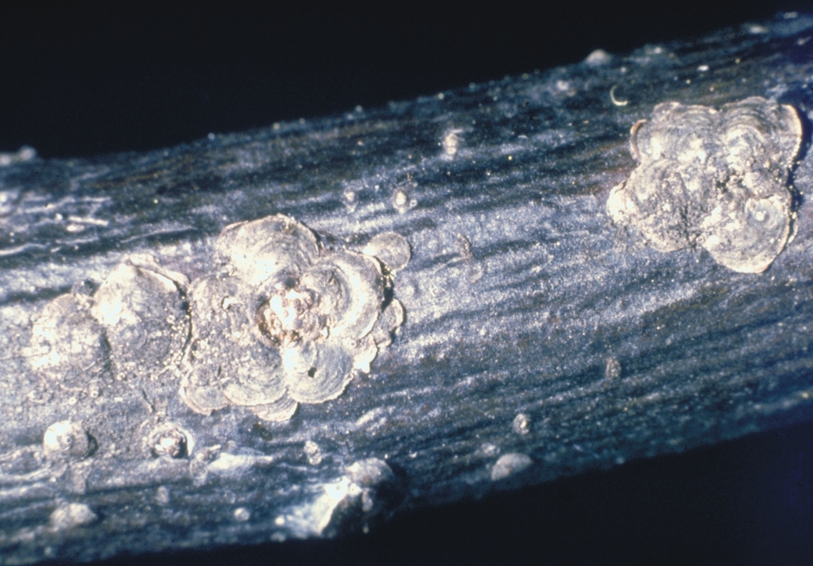
```

#### Biology {-}

Eggs hatch beneath females in mid summer.  Crawlers (mobile nymphs) are very tiny, about the size of a period, and flat.  They settle close together on the bark of the host, often under existing adult shells.  Once the crawler begins to feed it produces a clear wax shell.  Nymphs continue to grow to adulthood beneath the protective wax shell.  Winged adult males crawl out from under their armored shells in the spring to mate with immobile females, which lay eggs beneath their bodies.  Egg laying can last for an extended period.  There is one generation per year.

#### Importance {-}

This scale was introduced to California from the eastern U.S., where it is a significant pest of oaks in landscapes, but is not a forest pest.  It was originally discovered in 1933 in southern California infesting pecans, although the Sacramento infestation may date to 1897, when trees from Civil War battlefields were transplanted into Capitol Park.  In Sacramento, a tiny wasp parasitoid (*Encarsia aurantii*) introduced from Texas has provided complete biological control (Ehler 2005).

#### Citation {-}

Swiecki, T.J.; Bernhardt, E.A. 2025. Obscure scale. In Swiecki, T.J., et al. (Eds.) Field Guide to Insects and Diseases of California Oaks, Online edition `r Sys.Date()`.

## Pit scales {-}

### Oak pit scale - *Asterolecanium minus*, *A. quercicola*, Golden oak scale - *A. variolosum* (Asterolecaniidae) {-}

#### Distribution / Hosts {-}

*Asterolecanium minus* and *A. quercicola* are widely distributed in California but *A. variolosum* is reportedly rare (Gill 1993).  All three species are common in other parts of the U.S. on oaks.  In California, *A. minus* and *A. quercicola* prefer white oaks including valley, blue, and Engelmann oak, and some non-native white oaks, but are also found on coast live and California black oak.  *A. variolosum* is reportedly restricted to English oak and California black oak in California.  Reports of this species on other oaks may be due to confusion between the three species of *Asterolecanium.*  Additional oaks in the white and red/black oak subgroups are hosts of these pit scales in the eastern U.S.


```{r, fig.align='center', fig.asp=.75, fig.cap="Approximate ranges of pit scales (orange shading) and native oak species (green) in California.", out.width='30%'}
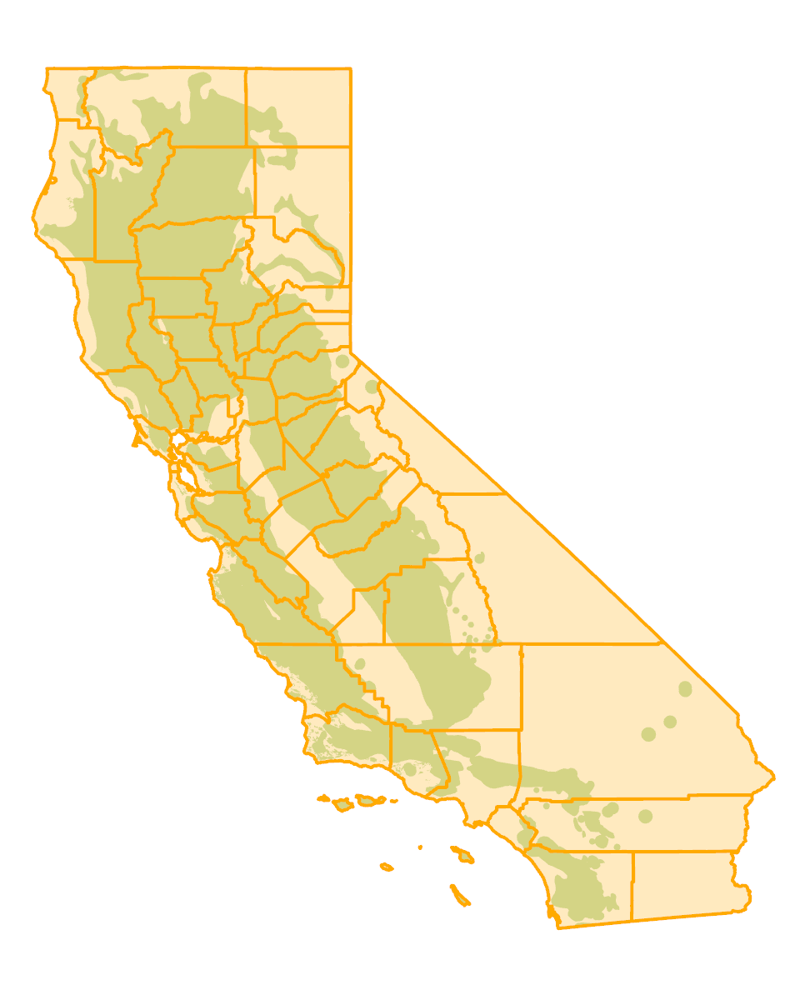
```


#### Symptoms {-}

Pinhead-sized scales are found on twigs and small branches. A ring of swollen bark forms around each scale so that it becomes embedded in the center of a depression or 'pit'  (figure  \@ref(fig:SapFdrs19), \@ref(fig:SapFdrs20)).  Heavy infestations cause the normally smooth bark of young twigs to become rough.  Poor twig growth and dieback is a common result of pit scale infestation.  Deciduous oaks retain dead leaves on killed twigs throughout the winter.  Damage to oaks is caused by the removal of plant fluids and perhaps the injection of toxins into twigs (figure  \@ref(fig:SapFdrs21)).  Pit scales do not produce honeydew.

(ref:SapFdrs19) Oak pit scale.  Swellings that give rise to pitted appearance have not yet formed around some of the younger scales. Photo: Bruce Hagen, CalFire, retired.

```{r SapFdrs19, fig.align='center', fig.asp=.75, fig.cap="(ref:SapFdrs19)", out.width="50%"}
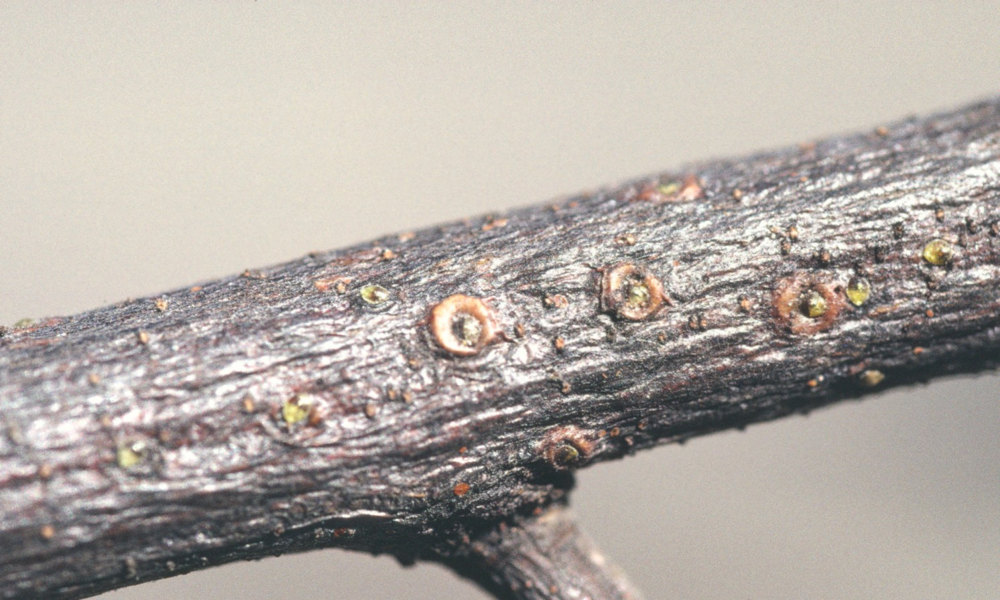
```


(ref:SapFdrs20) Golden oak scale.  Pits have not yet formed around these scales.  Photo: Jack Kelly Clark, courtesy UC Statewide IPM Program.

```{r SapFdrs20, fig.align='center', fig.asp=.75, fig.cap="(ref:SapFdrs20)", out.width="75%"}
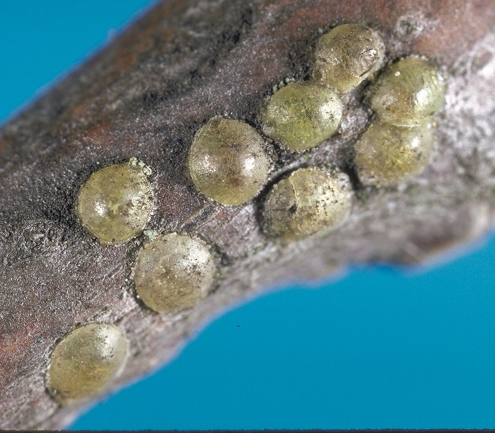
```


(ref:SapFdrs21) Small coast live oak branch with tangential slice of bark and wood removed showing necrosis associated with oak pit scales. Photo: Tedmund J. Swiecki and Elizabeth A. Bernhardt, Phytosphere Research.

```{r SapFdrs21, fig.align='center', fig.asp=.75, fig.cap="(ref:SapFdrs21)", out.width="75%"}
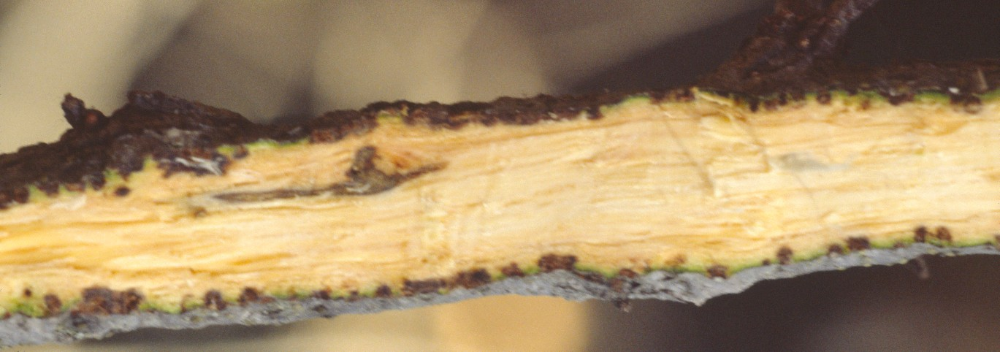
```


#### Agent Description {-}

Diameters of adults vary somewhat by species: 1—1.5 mm for *A. minus*, 1.25—1.75 mm for *A. quercicola*, 1.75—2.25 mm for *A. variolosum*.  All three species are otherwise similar in appearance.  Scales are rounded and green, gold, or brown, depending on age. 

#### Biology {-}

Only females are known.  There is only one generation a year, but an individual female may produce young for up to five months.  Females overwinter in pits on twigs.  Eggs are laid beneath the female's protective cover.  Most mobile nymphs (crawlers) emerge from beneath the females from April to June, but some may emerge as late as October.  The crawlers settle near the parent on twigs not more than a year old.  Once settled, the scale remains immobile for the rest of its life.

#### Importance {-}

Pit scales are serious pests of oaks in California, especially in southern California.  Pit scales tend to be more common on deciduous oaks than on live oaks, and more common on oaks in landscapes than in wildlands.

#### Citation {-}

Swiecki, T.J.; Bernhardt, E.A. 2025. Pit scales. In Swiecki, T.J., et al. (Eds.) Field Guide to Insects and Diseases of California Oaks, Online edition `r Sys.Date()`.


