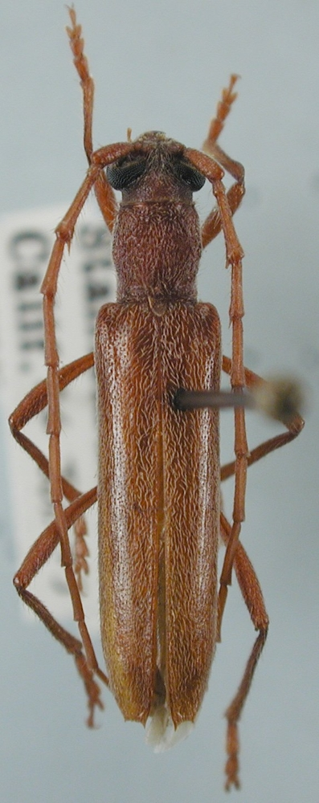
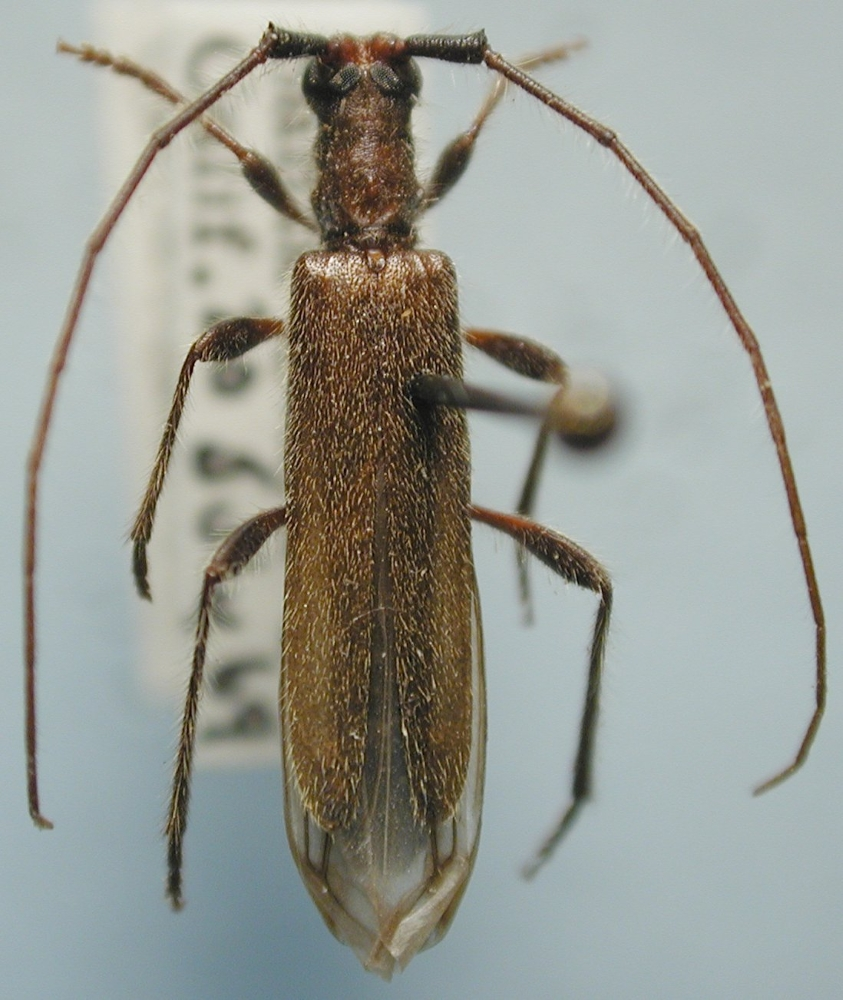
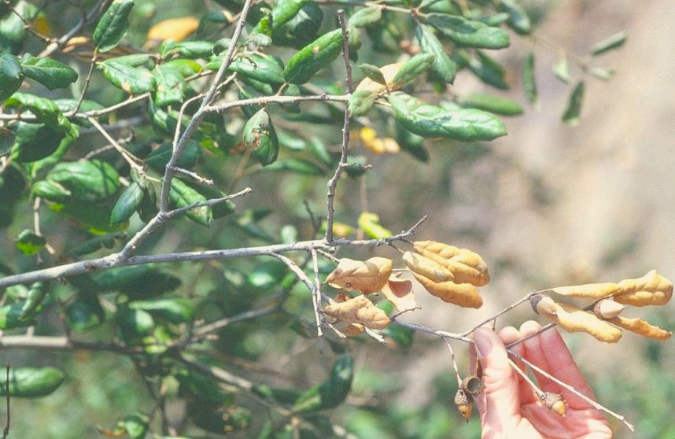
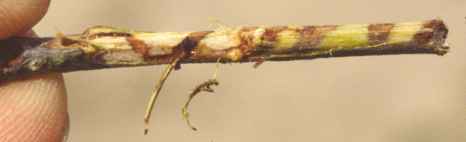
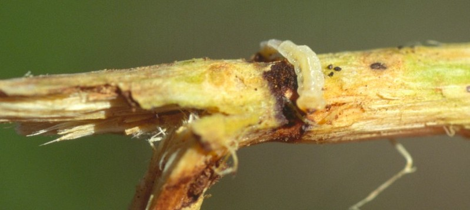

# Twig borers {#twigborer}

### *Aneflomorpha linearis* (Cerambycidae) {-}

*Aneflomorpha linearis* is a twig borer that has been found in locations throughout the state and also in Oregon. It is reported on coast live and scrub oak in southern California. Other hosts include bitterbrush and chamise.  Larvae of *A. linearis* bore through small branches, making holes at frequent intervals through which frass is expelled. Upon reaching the point where the branch diameter is about 2—4 cm in diameter, larvae construct tunnels that spiral outward from the center of the branch.  Adults are slender and brown (figure  \@ref(fig:TwgBor1)).  Adults are present from July to September and are attracted to light. 

 
(ref:TwgBor1) Pinned specimen of adult *Aneflomorpha linearis*.  Photo: Larry G. Bezark, CDFA (retired).

```{r TwgBor1, fig.align='center', fig.asp=.75, fig.cap="(ref:TwgBor1)", out.width="75%"}

```


#### Citation {-}

Swiecki, T.J.; Bernhardt, E.A. 2025. *Aneflomorpha linearis* (Cerambycidae). In Swiecki, T.J., et al. (Eds.) Field Guide to Insects and Diseases of California Oaks, Online edition `r Sys.Date()`.

## Oak twig borer {-}

### *Styloxus fulleri californicus* (Cerambycidae) {-}

The California subspecies of oak twig borer (*Styloxus fulleri californicus*) is widespread in California and has been reported on coast live, interior live, and California black oak.  *S. fulleri californicus* makes a large, oval, frass-filled tunnel in the heartwood of twigs, particularly those that are 0.5—1.25 cm in diameter.  Larvae are yellowish roundheaded borers, 12.5—19 mm long.  Adult beetles (figure  \@ref(fig:TwgBor2)) are slender and greenish brown.

```{r, fig.align='center', fig.asp=.75, fig.cap="Approximate ranges of pit scales (orange shading) and native oak species (green) in California.", out.width='30%'}
knitr::include_graphics("images/distributions/statewide.png")
```

(ref:TwgBor2) Pinned specimen of adult *Styloxus fulleri californicus*.  Photo: Larry G. Bezark, CDFA (retired).

```{r TwgBor2, fig.align='center', fig.asp=.75, fig.cap="(ref:TwgBor2)", out.width="75%"}

```

#### Citation {-}

Swiecki, T.J.; Bernhardt, E.A. 2025. Oak twig borer. In Swiecki, T.J., et al. (Eds.) Field Guide to Insects and Diseases of California Oaks, Online edition `r Sys.Date()`.

## Oak twig girdler {-}

### *Agrilus angelicus* (Buprestidae) {-}

#### Distribution / Hosts {-}

The oak twig girdler is widespread in California and is reported from other states including Oregon and Nebraska.  In California, coast live oak may be the most commonly affected species, but oak twig girdler is also reported on canyon live, interior live, California black, Engelmann, leather, and valley oak.

```{r, fig.align='center', fig.asp=.75, fig.cap="Approximate ranges of the oak twig girdler  (orange shading) and native oak species (green) in California.", out.width='30%'}
knitr::include_graphics("images/distributions/Tapcae.png")
```

#### Symptoms {-}

Mining by the oak twig girdler beneath the bark girdles small diameter twigs, causing the portion of the twig beyond the mine to die.  Heavy infestations of oak twig girdler, which are relatively common on coast live oak in southern California, give rise to numerous patches of dry, dead leaves scattered in the canopy (figure  \@ref(fig:TwgBor3)).  Because other twig borers and agents such as twig blight fungi can cause similar symptoms, it is necessary to remove the bark from affected twigs at the junction between live and dead tissues to determine the cause of the damage.  Oak twig girdler larvae form flattened tunnels under the bark that spiral around the twig from the younger (typically dead) portion of the twig toward the point of branch origin (figure  \@ref(fig:TwgBor4)).  Dark brown granular frass and whitish larvae may be found in the tunnel.


(ref:TwgBor3) Twig dieback due to oak twig girdler damage on coast live oak. Photo: Tedmund J. Swiecki and Elizabeth A. Bernhardt, Phytosphere Research.

```{r TwgBor3, fig.align='center', fig.asp=.75, fig.cap="(ref:TwgBor3)", out.width="75%"}

```


(ref:TwgBor4) Oak twig girdler boring on coast live oak; bark has been removed to show the spiraling larval tunnel.  Photo: Tedmund J. Swiecki and Elizabeth A. Bernhardt, Phytosphere Research.

```{r TwgBor4, fig.align='center', fig.asp=.75, fig.cap="(ref:TwgBor4)", out.width="75%"}

```


#### Agent Description {-}

Oak twig girdler adults are 7 mm long and dark metallic brownish bronze.  The larvae are up to 19 mm long, white, legless, somewhat flattened, and constricted at each body segment (figure  \@ref(fig:TwgBor5))  The flattened head is large relative to the body.


(ref:TwgBor5) Oak twig girdler larva.  Photo: Bruce Hagen, CalFire, retired.

```{r TwgBor5, fig.align='center', fig.asp=.75, fig.cap="(ref:TwgBor5)", out.width="75%"}

```


#### Biology {-}

Adults emerge from pupae between May and September.  Adults mate and the female lays eggs singly on the youngest twigs.  Eggs hatch after two weeks and larvae bore directly into twigs.  The young larva makes a slender linear tunnel for up to three to six months as it moves toward the older portion of the twig.  The tunnel then begins to spiral around the twig.  The larva feeds for two years in spiral tunnels, which can extend 30 cm or more down the twig.  The larva then bores to the center of the twig and tunnels up to 15 cm back toward the killed portion, where it pupates near the twig surface.  After several weeks it emerges as an adult.  A single generation thus requires about two years.

#### Importance {-}

Oak twig girdler is believed to be attracted to trees weakened by drought.  High levels of damage can be unsightly, but overall impacts to tree health are minor to insignificant.

#### Citation {-}

Swiecki, T.J.; Bernhardt, E.A. 2025. Oak twig girdler. In Swiecki, T.J., et al. (Eds.) Field Guide to Insects and Diseases of California Oaks, Online edition `r Sys.Date()`.

## *Scobicia suturalis* (Bostrichidae) {-}

*Scobicia suturalis*, a false powder post beetle, is reported from the San Francisco Bay Area.  It mines the small branches and twigs of coast live oak, California black oak, and acacia, as well as grape canes.  Adults of *S. suturalis* are cylindrical and 5 mm long.  The head and abdomen are black, the prothorax and posterior half of the elytra are dark reddish brown, and the antennae, legs, and front half of the elytra are pale amber in color.


```{r, fig.align='center', fig.asp=.75, fig.cap="Approximate ranges of *Scobicia suturalis*, a false powder post beetle, (orange shading) and native oak species (green) in California.", out.width='30%'}
knitr::include_graphics("images/distributions/Chryphonectira map.gif")
```


#### Citation {-}

Swiecki, T.J.; Bernhardt, E.A. 2025. *Scobicia suturalis* (Bostrichidae). In Swiecki, T.J., et al. (Eds.) Field Guide to Insects and Diseases of California Oaks, Online edition `r Sys.Date()`.
