# Bark and wood boring insects {#woodborer}

## Ambrosia and bark beetles (Curculionidae:Scolytinae) {-}

### Invasive shot hole borers (ISHB) {-}

#### *Euwallacea fornicatus*, *E. kuroshio* {-}

Needs to be drafted.

#### Distribution / Hosts  {-}


```{r, fig.align='center', fig.asp=.75, fig.cap="Approximate ranges of pit scales (orange shading) and native oak species (green) in California.", out.width='30%'}
knitr::include_graphics("images/distributions/statewide.png")
```


#### Symptoms  {-}

#### Agent Description  {-}

#### Biology  {-}

#### Importance  {-}

#### Citation  {-}

_____________ 2025. Invasive shot hole borers (ISHB). In Swiecki, T.J., et al. (Eds.) Field Guide to Insects and Diseases of California Oaks, Online edition 2025.

### Mediterranean oak borer (MOB) {-}

#### *Xyleborus monographus* {-}

Needs to be drafted.


#### Distribution / Hosts {-}

#### Symptoms {-}

#### Agent Description {-}

#### Biology {-}

#### Importance {-}

#### Citation {-}

_____________ 2025. Mediterranean oak borer (MOB). In Swiecki, T.J., et al. (Eds.) Field Guide to Insects and Diseases of California Oaks, Online edition 2025.

### *Monarthrum dentiger*, *M. scutellare* {-}

#### Distribution / Hosts {-}

*Monarthrum scutellare* is widespread throughout California and Oregon on various oak species, including coast live, California black, and valley oak.  It also occurs on tanoak.


```{r, fig.align='center', fig.asp=.75, fig.cap="Approximate ranges of *Monarthrum scutellare*  (orange shading) and native oak species (green) in California.", out.width='30%'}
knitr::include_graphics("images/distributions/statewide.png")
```

*M. dentiger* is less common than *M. scutellare* and is reported in Arizona and California.  It occurs on coast live and valley oak, and probably on other oak species.  It has also been reported on avocado and walnut.

```{r, fig.align='center', fig.asp=.75, fig.cap="Approximate ranges of *Monarthrum dentiger*  (orange shading) and native oak species (green) in California.", out.width='30%'}
knitr::include_graphics("images/distributions/Monarthrum dentiger.gif")
```

#### Symptoms {-}

The most obvious symptom of infestation is fine, light-colored boring dust that accumulates on the bark surface and/or around the tree's base (figure  \@ref(fig:WdBorMon1)).  Small, cone-shaped piles of boring dust, which are pushed out of small (about 1—1.5 mm diameter) holes in the bark, may be visible on the surface of infested trunks and branches.  In cross-sections through affected areas, thin, black-stained tunnels can be seen extending 2—15 cm into the wood (figure  \@ref(fig:WdBorMon2), \@ref(fig:WdBorMon3)). Tunnels often branch from a single point near the cambium or at the end of a short length of tunnel that extends into the outer sapwood.

(ref:WdBorMon1) White boring dust produced by ambrosia beetles on the surface of a tanoak infected with *Phytophthora ramorum*.  Photo: Tedmund J. Swiecki and Elizabeth A. Bernhardt, Phytosphere Research.

```{r WdBorMon1, fig.align='center', fig.asp=.75, fig.cap="(ref:WdBorMon1)", out.width="75%"}
knitr::include_graphics("images/Insect-wood/Ambrosia boring dust Stewart's Pt May 05_Phytosphere.jpg")
```


(ref:WdBorMon2) Broken trunk of a failed coast live oak that was killed by *Phytophora ramorum* (sudden oak death) shows a very high density of ambrosia beetle galleries.  Although ambrosia beetle galleries are common in trees with this disease, only some trees show such high gallery densities. Photo: Tedmund J. Swiecki and Elizabeth A. Bernhardt, Phytosphere Research.


```{r WdBorMon2, fig.align='center', fig.asp=.75, fig.cap="(ref:WdBorMon2)", out.width="75%"}
knitr::include_graphics("images/Insect-wood/Ambrosia beetles_3F97 11-11-02b_Phytosphere.jpg")
```


(ref:WdBorMon3) Detail showing ambrosia beetle larval tunnels branching from the end of the main entrance tunnel excavated by the adult male.  Photo: Tedmund J. Swiecki and Elizabeth A. Bernhardt, Phytosphere Research.

```{r WdBorMon3, fig.align='center', fig.asp=.75, fig.cap="(ref:WdBorMon3)", out.width="50%"}
knitr::include_graphics("images/Insect-wood/Ambrosia beetle gallery closeup_5F197 11-19-02b_Phytosphere.jpg")
```

#### Agent Description {-}

Adults are small dark brown to blackish cylindrical beetles (figure  \@ref(fig:WdBorMon4)).  From above, the head is completely hidden beneath a bullet-shaped plate (pronotum) over the thorax.  *M. scutellare* adults are 3.5—4.1 mm long.  The smaller *M. dentiger* adults are 1.9—2.4 mm long.

(ref:WdBorMon4) *Monarthrum scutellare* adult beetle. Photo: Jack Kelly Clark, courtesy UC Statewide IPM Program.

```{r WdBorMon4, fig.align='center', fig.asp=.75, fig.cap="(ref:WdBorMon4)", out.width="75%"}
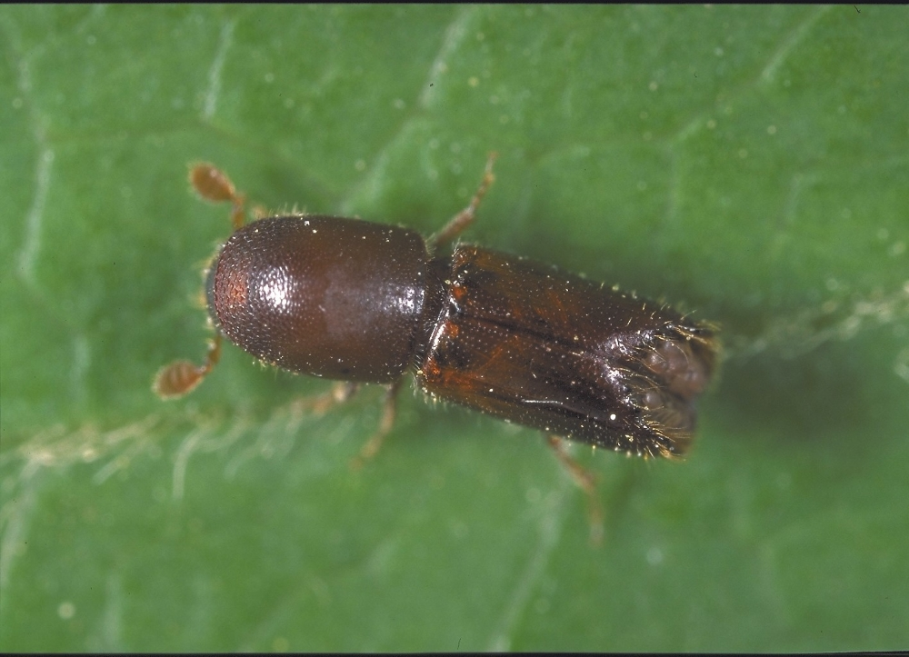
```

#### Biology {-}

Both species tunnel into the wood of trunks or branches that are severely stressed, diseased, dying, or recently dead.  Ambrosia beetles commonly invade trees with *Phytophthora ramorum* cankers (sudden oak death), initially in the vicinity of cankers.  As diseased trees decline, parts of the tree well away from cankers may be colonized.  Ambrosia beetles bore galleries in wood, but feed on ambrosia fungus (*Ambrosiella brunnea*) that grows on the inner surfaces of the galleries after it is introduced by the adult female.  Galleries are maintained free of frass, resulting in accumulations seen outside the bark.

In *M. scutellare*, the adult male initiates colonization by tunneling up to about 6 cm into the wood and excavating a chamber.  The male is joined by a female, who carries the inoculum of the ambrosia fungus in specialized leg cavities.  After mating, eggs are laid in niches along the sides of the chamber where the fungus also becomes established.  Gallery extension and oviposition may last two to four months.  Larvae extend the niches into “larval cradles” that branch off of the chamber.  Larval development lasts six to eight weeks and pupation takes two to three weeks.  Two generations occur per year in California.  Most egg laying takes place in March and October, but adults may be found much of the year.  The biology of *M. dentiger* is presumed to be similar to that of *M. scutellare*.


#### Importance {-}

Ambrosia beetles only attack trees or branches that are already dead, diseased, or declining.  Heavy attacks commonly occur on oaks and tanoak with trunk cankers caused by the sudden oak death pathogen, *Phytophthora ramorum*.  In some situations, heavy attacks appear to hasten the decline of dying trees or branches, but the effects of beetle attacks are difficult to separate from those of wood decay fungi that are also common in declining trees.  Extensive ambrosia beetle tunneling may increase the risk of branch or bole failure, especially in branches and boles less than about 30 cm in diameter.

#### Citation {-}

Swiecki, T.J.; Bernhardt, E.A. 2025. *Monarthrum dentiger*,  *M. scutellare*. In Swiecki, T.J., et al. (Eds.) Field Guide to Insects and Diseases of California Oaks, Online edition 2025.

### Western oak bark beetle and other oak bark beetles {-}

#### *Pseudopityophthorus pubipennis*, *P. agrifoliae*, *P. pruinosus* {-}

#### Distribution / Hosts {-}

*Pseudopityophthorus pubipennis* is reported throughout California from the coast to the western slopes of the Sierra Nevada and Cascade Range.  It occurs north to southern British Columbia, at least in the coastal zone.  It is common on various oaks, including coast live, California black, and Oregon white oak, but has also been reported on tanoak, chestnut, and California buckeye.  

```{r, fig.align='center', fig.asp=.75, fig.cap="Approximate ranges of *Pseudopityophthorus pubipennis*  (orange shading) and native oak species (green) in California.", out.width='30%'}
knitr::include_graphics("images/distributions/Western oak bark beetle.gif")
```

*P. agrifoliae* is reported from at least Marin to Los Angeles County on coast live, California black, and canyon live oak.  Both *P. agrifoliae* and *P. pubipennis* are often very abundant in oak firewood.  

```{r, fig.align='center', fig.asp=.75, fig.cap="Approximate ranges of *Pseudopityophthorus agrifoliae*  (orange shading) and native oak species (green) in California.", out.width='30%'}
knitr::include_graphics("images/distributions/P agrifoliae.gif")
```

*P. pruinosus* (=*P. pulvereus*) is reported as uncommon in southern California, and occurs on various oaks.  *P. pruinosus* also occurs in Arizona, Texas, Mexico, and some states in the eastern U.S.

```{r, fig.align='center', fig.asp=.75, fig.cap="Approximate ranges of *Pseudopityophthorus pruinosus*  (orange shading) and native oak species (green) in California.", out.width='30%'}
knitr::include_graphics("images/distributions/P pruinosus.gif")
```

#### Symptoms {-}

Oak bark beetles colonize the bark of branches and trunks.  The outermost sapwood just under the bark may be extensively engraved due to tunneling by the adult beetles.  The engravings score the wood surface across the grain but do not enter deeply into wood (figure  \@ref(fig:WdBorMon5)). Tunnels produced by *P. pubipennis* adults are limited to the inner bark and do not score the sapwood (Bright and Stark 1973).  In dry, dead stems, deposits of sawdust-like frass and/or pinhead sized emergence holes are typical symptoms.  
Oak bark beetle boring dust is typically dark or reddish due to the feeding of the beetles in the phloem.  Ambrosia beetles, *Monarthrum* spp., which bore deeply into the wood, produce light-colored boring dust (figure  \@ref(fig:WdBorMon6)).  On live stems, bleeding sap or foam may be associated with oak bark beetle attack (figure  \@ref(fig:WdBorMon7)).

(ref:WdBorMon5) *Pseudopityophthorus* engraving in outer sapwood of oak branch with bark removed.  Photo: Don Owen, CalFire, retired.


```{r WdBorMon5, fig.align='center', fig.asp=.75, fig.cap="(ref:WdBorMon5)", out.width="75%"}
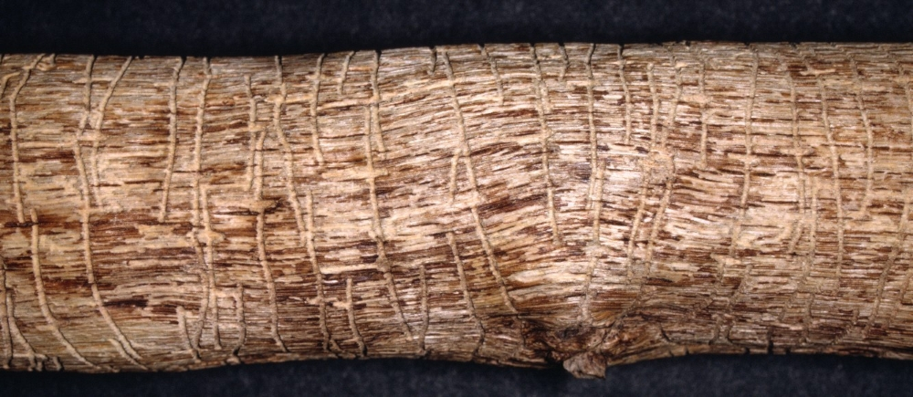
```


(ref:WdBorMon6) Boring dust on bark of coast live oak resulting from infestation by bark beetles (darker brown dust) and ambrosia beetles (lighter boring dust). Photo: Bruce Hagen, CalFire, retired.

```{r WdBorMon6, fig.align='center', fig.asp=.75, fig.cap="(ref:WdBorMon6)", out.width="50%"}
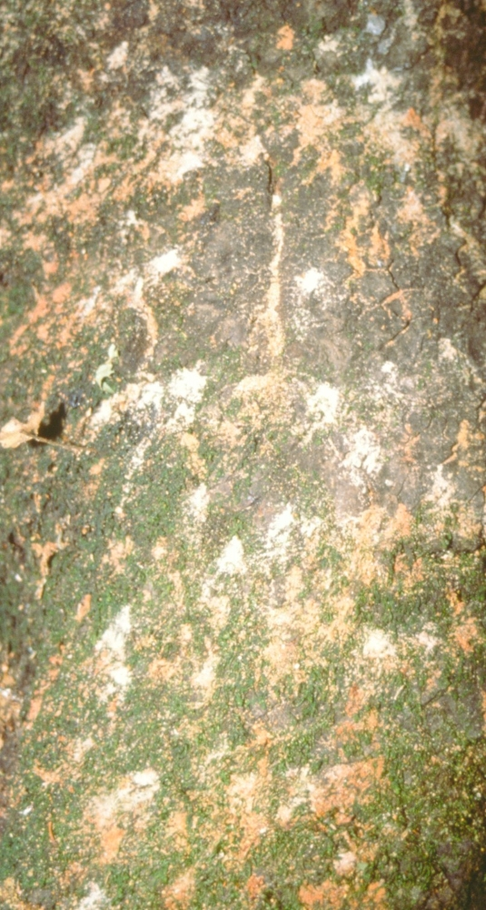
```


(ref:WdBorMon7) White ooze associated with oak bark beetle attack on interior live oak. Photo: Don Owen, CalFire, retired.

```{r WdBorMon7, fig.align='center', fig.asp=.75, fig.cap="(ref:WdBorMon7)", out.width="50%"}
knitr::include_graphics("images/Insect-wood/D OWEN Interior live oak Pseudopityophthorus.jpg")
```


#### Agent Description {-}

Larvae are whitish, legless grubs, 1—2.5 mm long.  Adult beetles are very small (1.7—2.3  mm long), cylindrical, dark brown to black, and shiny (figure  \@ref(fig:WdBorMon8)).  The pronotum and elytra are finely and densely punctate and covered with fine hairs (pubescent). 


(ref:WdBorMon8) *Pseudopityophthorus pubipennis* adult beetle. Photo: Jack Kelly Clark, courtesy UC Statewide IPM Program.

```{r WdBorMon8, fig.align='center', fig.asp=.75, fig.cap="(ref:WdBorMon8)", out.width="75%"}
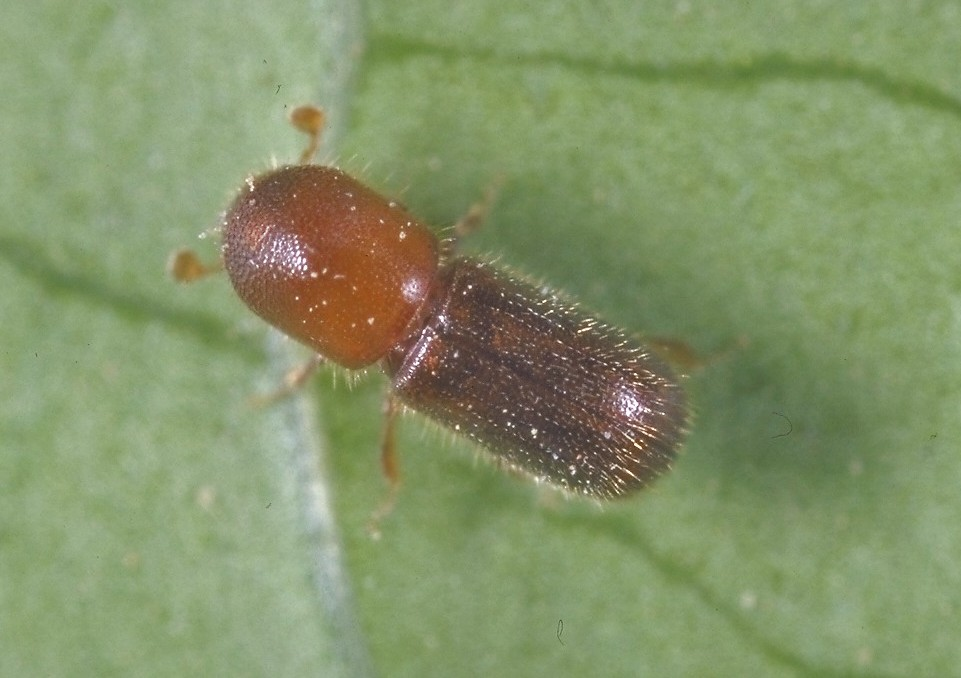
```                                                                                                                    

#### Biology {-}

Adults bore through the bark to the interface with the sapwood.  From the entrance hole, two tunnels, about 5 cm long combined, are excavated in the inner bark perpendicular to the wood grain.  Eggs are laid in niches along these tunnels.  As larvae hatch they begin tunneling in the inner bark (phloem) at right angles to the adult gallery, i.e., with the wood grain.  Larval tunnels are up to 2.5 cm long for *P. pubipennis* and 1—2 cm long for *P. agrifoliae*.  At maturity, the larvae tunnel to just below the bark surface and pupate at the end of the tunnel.  Adults emerge and chew through the bark, leaving behind small exit holes (“shotholes”).  Depending on the location, there may be two or more generations per year.  Generations overlap, so adult beetles are always present during the growing season.  Larvae and adults overwinter under bark.

#### Importance {-}

Oak bark beetles colonize trees or parts of trees that are severely weakened, dying, or dead.  Beetles may also colonize freshly cut oak firewood.  When adult beetles emerge from cut logs, they may attack nearby healthy oaks.  *P. pubipennis* is commonly found in association with trunk cankers caused by the sudden oak death pathogen, *Phytophthora ramorum*, in coast live oak, California black oak, and tanoak.  Attacks by oak bark beetles may hasten the decline of dying branches and trees.  Healthy, non-stressed trees are not likely to be substantially harmed by oak bark beetle attack.

#### Citation {-}

Swiecki, T.J.; Bernhardt, E.A. 2025. Western oak bark beetle and other oak bark beetles. In Swiecki, T.J., et al. (Eds.) Field Guide to Insects and Diseases of California Oaks, Online edition 2025.

## Flatheaded borers / Metallic wood boring beetles (Buprestidae) {-}

### Flatheaded appletree borer and Pacific flatheaded borer {-}

#### *Chrysobothris femorata* and *C. mali* {-}

#### Distribution / Hosts {-}

*Chrysobothris femorata* occurs throughout the U.S. and southern Canada.  *C. mali* occurs in western North America from the Rocky Mountains and southern Canada to the Pacific Coast.  Both species attack a wide variety of woody plants, including both young and mature shrubs and trees.  They primarily attack plants that are stressed, diseased, or injured.  


```{r, fig.align='center', fig.asp=.75, fig.cap="Approximate ranges of *Chrysobothris femorata* and *C. mali*, (orange shading) and native oak species (green) in California. Both *Chrysobothris* species are found throughout California.", out.width='30%'}
knitr::include_graphics("images/distributions/statewide.png")
```


Eggs are laid singly in bark crevices or near injuries.  Larvae emerge from the egg by boring through the bottom of the shell directly into the bark.  Larvae are whitish to yellowish, legless, and have a wide, flattened segment near the head (figure  \@ref(fig:WdBorMon9)).  They mine the inner bark, sapwood, and heartwood of trees forming tunnels that are wide and flattened in cross section (figure  \@ref(fig:WdBorMon10)).  The tunnels are partially filled with powderlike frass.  Sap may ooze from the affected area.  In vigorous trees, heavy sap flow can kill invading borers.  Tunneling may girdle and kill trees, especially young trees.  


(ref:WdBorMon9) Flat-headed borer and frass-packed tunnels in the outer sapwood of a recently-cut coast live oak log.  The enlarged thoracic segments give the larva a “flat-headed” appearance. Photo: Tedmund J. Swiecki and Elizabeth A. Bernhardt, Phytosphere Research.

```{r WdBorMon9, fig.align='center', fig.asp=.75, fig.cap="(ref:WdBorMon9)", out.width="75%"}
knitr::include_graphics("images/Insect-wood/Flatheaded borer QA3_Phytosphere.jpg")
```

(ref:WdBorMon10) Flat-headed borer tunnels in coast live oak wood. Photo: Tedmund J. Swiecki and Elizabeth A. Bernhardt, Phytosphere Research.

```{r WdBorMon10, fig.align='center', fig.asp=.75, fig.cap="(ref:WdBorMon10)", out.width="75%"}
knitr::include_graphics("images/Insect-wood/QA bupresitd holes2_Phytosphere.jpg")
```


Larvae construct a chamber for pupation in the outer wood or heartwood and overwinter as larvae in the chamber.  They pupate in the spring or early summer.  Adults chew oval holes through the bark as they emerge.  One generation is produced per year, although in cooler areas more than a year may be required to complete a generation (Solomon 1995).


Pacific flatheaded borer (*C. femorata*) adults emerge from March through September and feed at the bases of twigs.  Adult beetles are 7—16 mm long, and dark metallic brown to dull gray, with greenish blue mottled areas (figure  \@ref(fig:WdBorMon11)).  Mature larvae reach 25 mm in length.  Larvae feed in the inner bark and surface of the sapwood, migrating into the sapwood when they reach maturity.


(ref:WdBorMon11) Pinned specimen of adult Pacific flatheaded borer. Photo: Larry G. Bezark, CDFA, retired.

```{r WdBorMon11, fig.align='center', fig.asp=.75, fig.cap="(ref:WdBorMon11)", out.width="50%"}
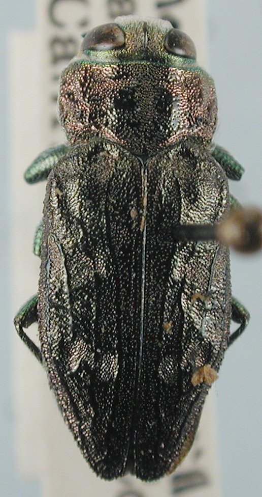
```

Flatheaded appletree borer (*C. mali*) adults, found from April to August, are about 6—11 mm long and dark bronze, gray, or a mottled copper color (figure  \@ref(fig:WdBorMon12)).  Mature larvae reach 15—18 mm long.  Larvae feed in both the phloem and the sapwood.

(ref:WdBorMon12) Pinned specimen of adult flatheaded appletree borer. Photo: Larry G. Bezark, CDFA, retired.

```{r WdBorMon12, fig.align='center', fig.asp=.75, fig.cap="(ref:WdBorMon12)", out.width="50%"}
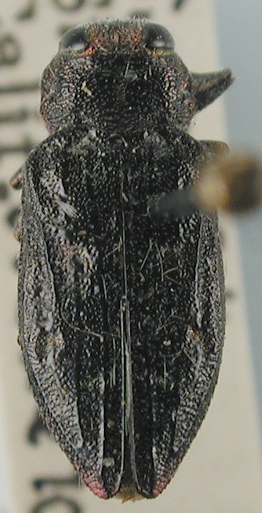
```


#### Citation {-}

Swiecki, T.J.; Bernhardt, E.A. 2025. Flatheaded appletree borer and Pacific flatheaded borer. In Swiecki, T.J., et al. (Eds.) Field Guide to Insects and Diseases of California Oaks, Online edition 2025.

### Goldspotted oak borer (GSOB) {-}

#### *Agrilus auroguttatus*{-}

#### Distribution / Hosts {-}

*Agrilus auroguttatus*, the goldspotted oak borer (GSOB), appears to be native to southern Arizona and California Baja Sur, Mexico.  This species is similar to *A. coxalis*, which ranges from central Mexico to Guatemala.  The two species were previously combined under the name *A. coxalis*, but are now considered distinct species.  GSOB was apparently introduced into California in the vicinity of Descanso (San Diego County) before 2002.  It is likely that GSOB was transported to the area in infested firewood.  As of 2011, GSOB had only been detected in eastern San Diego County south of Lake Henshaw, with one outlying coastal detection near La Jolla.  Based on its distribution in Arizona, it appears that GSOB could become much more widely distributed in California.  In California, GSOB primarily attacks coast live, California black, and canyon live oak, but has also been found on Engelmann oak.  Hosts in Arizona include emory (*Q. emoryi*) and silverleaf oak (*Q. hypoleucoides*).


```{r, fig.align='center', fig.asp=.75, fig.cap="Approximate ranges of *Agrilus auroguttatus* (orange shading) and native oak species (green) in California.", out.width='30%'}
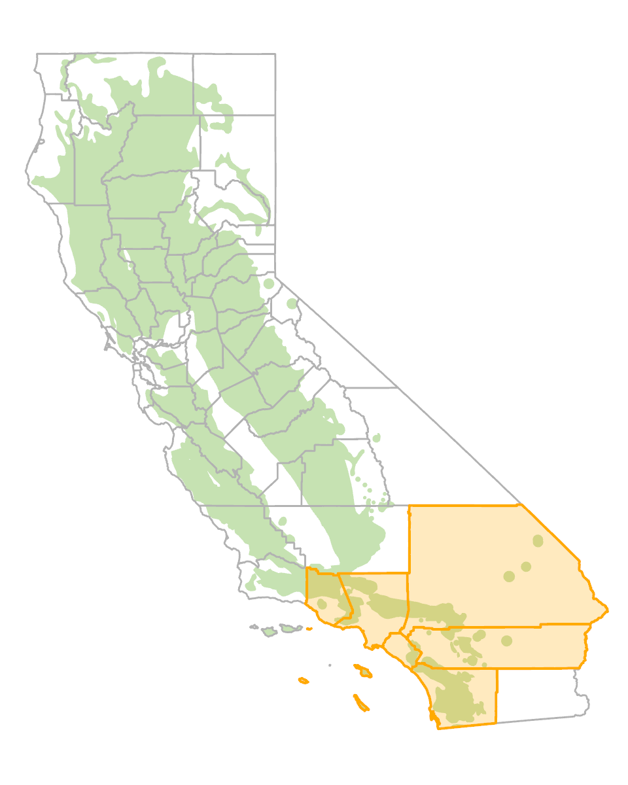
```


#### Symptoms {-}

The first visible symptoms of attack are D-shaped exit holes (about 3 mm wide) in areas where adult GSOB beetles have emerged (figure  \@ref(fig:WdBorMon13)).  When the infestation level increases and internal injury becomes more extensive, fluid begins to ooze from infested areas.  The ooze is initially light colored and watery, but can become dark amber to brownish black and viscous, and stains the bark surface (figure  \@ref(fig:WdBorMon14)).  In coast live oak, and sometimes in black oak, woodpeckers searching for GSOB larvae and pupae remove chips of outer bark and may expose tunnels beneath the bark surface (figure  \@ref(fig:WdBorMon14)).  Large-diameter trees are commonly attacked, and may develop high densities of exit holes and oozing spots.  GSOB generally does not infest stems less than 12.5 cm in diameter.


(ref:WdBorMon13) D-shaped exit hole of *Agrilus auroguttatus* on coast live oak. Photo: Tedmund J. Swiecki and Elizabeth A. Bernhardt, Phytosphere Research.

```{r WdBorMon13, fig.align='center', fig.asp=.75, fig.cap="(ref:WdBorMon13)", out.width="75%"}
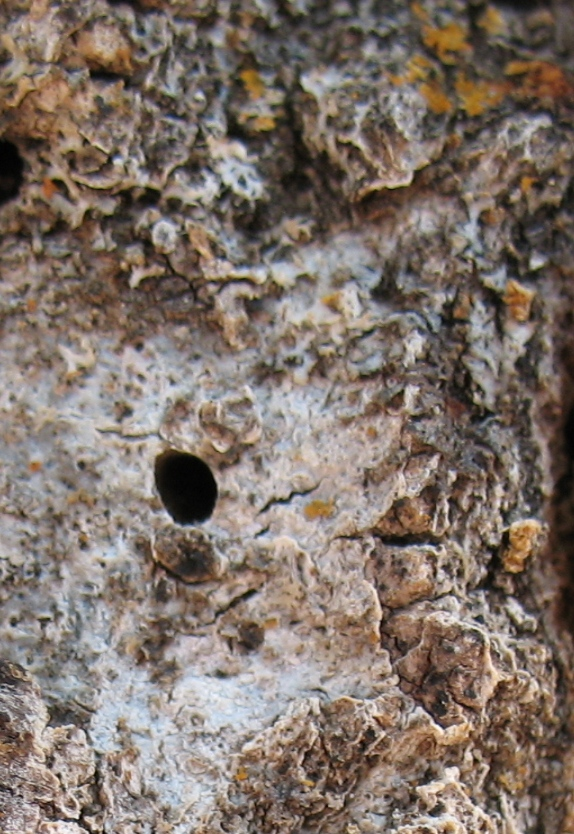
```


(ref:WdBorMon14) Coast live oak with bleeding and woodpecker chipping associated with GSOB infestation. Photo: Tedmund J. Swiecki and Elizabeth A. Bernhardt, Phytosphere Research.

```{r WdBorMon14, fig.align='center', fig.asp=.75, fig.cap="(ref:WdBorMon14)", out.width="75%"}
knitr::include_graphics("images/Insect-wood/AgrAug_EB_USFS San Diego field trip_008_Phytosphere.jpg")
```

Cutting away the outer bark in infested areas reveals the larval galleries (figure  \@ref(fig:WdBorMon15)).  The galleries appear as dark winding tunnels up to 4 mm wide that are packed with dark, granular frass.  Galleries are most extensive in the cambium area, the interface between the live bark (phloem) and underlying sapwood (figure  \@ref(fig:WdBorMon15)). Galleries are initially surrounded by healthy tissue, but dark, water-soaked cankers later develop around heavily-infested areas.  Dark-colored flattened cavities eventually develop beneath the bark surface in association with large GSOB larval galleries.  These cavities, which may have host callus tissue around the edges, are commonly filled with watery fluid that flows out when the outer bark is chipped.  When affected bark dies and falls off, old galleries are visible as scoring of the exposed outer sapwood.

(ref:WdBorMon15) Bark of this coast live oak has been cut away to reveal dark stained GSOB galleries causing this watery canker.  A single larva bent in hairpin shape is visible to left. Photo: Kim Corella, CalFire.

```{r WdBorMon15, fig.align='center', fig.asp=.75, fig.cap="(ref:WdBorMon15)", out.width="75%"}
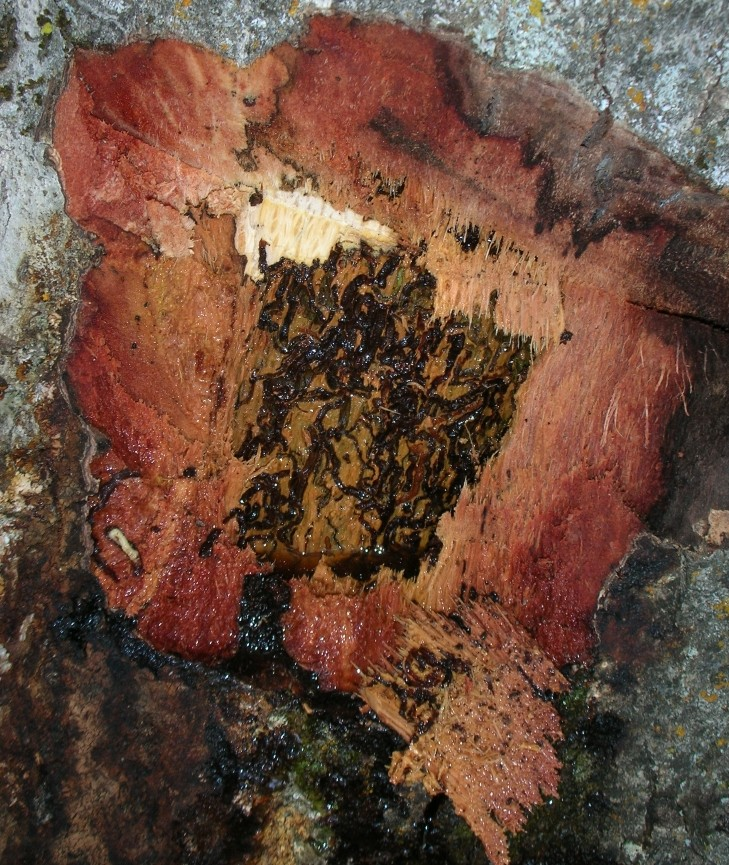
```

Heavily infested trees commonly develop canopy thinning and dieback. This is first visible as defoliation and dieback of small twigs and branches in the upper canopy.  Progressive canopy defoliation, thinning, and dieback may occur over several years, although spring growth flushes may still occur.  In final stages of tree decline, the remaining leaves of coast live and canyon live oak turn brown and remain attached (figure  \@ref(fig:WdBorMon16)).  In California black oak, leaves turn brown and drop early before tree death.  Adult beetles also feed on oak foliage, making small notches along the leaf edges, but this feeding is inconsequential.

(ref:WdBorMon16) Coast live oak (right, between pines) killed by GSOB infestation shows evidence of previous canopy thinning near top and retains dead leaves.  Oak at far left does not show canopy symptoms. Photo: Tedmund J. Swiecki and Elizabeth A. Bernhardt, Phytosphere Research.

```{r WdBorMon16, fig.align='center', fig.asp=.75, fig.cap="(ref:WdBorMon16)", out.width="75%"}
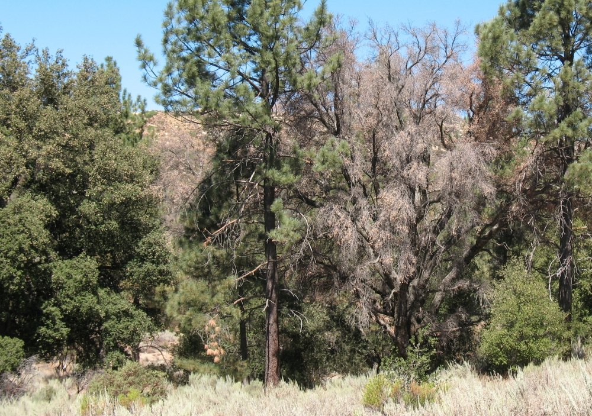
```

#### Agent Description {-}

*Agrilus auroguttatus* adults (figure  \@ref(fig:WdBorMon17)). are slender, about 9.5 mm long and 2 mm wide.  They are dull metallic green with six golden yellow spots on the wing covers (elytra), and are agile flyers.  Eggs are tiny (0.3 mm), dull colored, and rarely observed.  Mature larvae are legless, yellowish-white and about 18 mm long and 3 mm wide.  The segment at the head end is widened into an oval shape and two pincher-like spines are located at the tip of the abdomen.  Mature larvae in the outer bark are bent in a hairpin shape (figure  \@ref(fig:WdBorMon18)).  These transform into pupae, which resemble adults, but are white and soft-bodied.


(ref:WdBorMon17) *Agrilus auroguttatus* adult beetles shown in top and side views.  Photo: Tom Coleman, USDA-FS.

```{r WdBorMon17, fig.align='center', fig.asp=.75, fig.cap="(ref:WdBorMon17)", out.width="50%"}
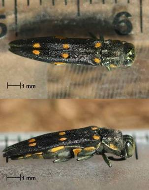
```


(ref:WdBorMon18) Mature *Agrilus auroguttatus* larva showing hairpin bend in a tunnel just below the bark surface in a coast live oak. Photo: Tedmund J. Swiecki and Elizabeth A. Bernhardt, Phytosphere Research.

```{r WdBorMon18, fig.align='center', fig.asp=.75, fig.cap="(ref:WdBorMon18)", out.width="75%"}
knitr::include_graphics("images/Insect-wood/AgrAug_EB_USFS San Diego field trip_018_Phytosphere.jpg")
```

#### Biology {-}

Observations to date indicate that GSOB typically completes one generation per year in San Diego County.  Initial GSOB attacks commonly occur on apparently healthy trees.  Eggs are laid in bark cracks on the trunk and large branches in summer.  Larvae tunnel though the bark and feed primarily near the cambium.  Mature larvae migrate back toward the bark surface, where they assume a bent hairpin shape in the outer bark.  Pupae are found in the outer bark from late spring through early summer.  Emerging adult beetles chew a D-shaped exit hole in the bark.  In San Diego County, adults are present from mid May into November.  The peak flight period is late June to early July.

#### Importance {-}

GSOB has been associated with extensive mortality of coast live and California black oak in the infested area since its introduction.  Factors associated with attack are still under investigation.  GSOB may pose a significant threat to coast live and California black oak throughout their range in California and may impact other California oak species as well. 

#### Citation {-}

Swiecki, T.J.; Bernhardt, E.A. 2025. Goldspotted oak borer (GSOB). In Swiecki, T.J., et al. (Eds.) Field Guide to Insects and Diseases of California Oaks, Online edition 2025.

## Roundheaded borers / Long-horned beetles (Cerambycidae) {-}

### Banded alder borer or California laurel borer {-}

#### *Rosalia funebris* {-}

The banded alder borer is found along the Pacific Coast from southern Alaska to southern California and the Rocky Mountains south to New Mexico.  The larvae bore in dead or declining hardwoods including oak, alder, willow, ash, and California bay. Adults are 25—38 mm long, with alternating bands of black and light blue, gray, or white on their wing covers (elytra) and long antennae (figure  \@ref(fig:WdBorMon19)).  Adults are attracted to fresh paint and are also occasionally found in large numbers on alder or California bay.


```{r, fig.align='center', fig.asp=.75, fig.cap="Approximate ranges of banded alder borer  (*Rosalia funebris*)  (orange shading) and native oak species (green) in California.", out.width='30%'}
knitr::include_graphics("images/distributions/statewide.png")
```

(ref:WdBorMon19) Adult banded alder borer. Photo: Tedmund J. Swiecki and Elizabeth A. Bernhardt, Phytosphere Research.

```{r WdBorMon19, fig.align='center', fig.asp=.75, fig.cap="(ref:WdBorMon19)", out.width="75%"}
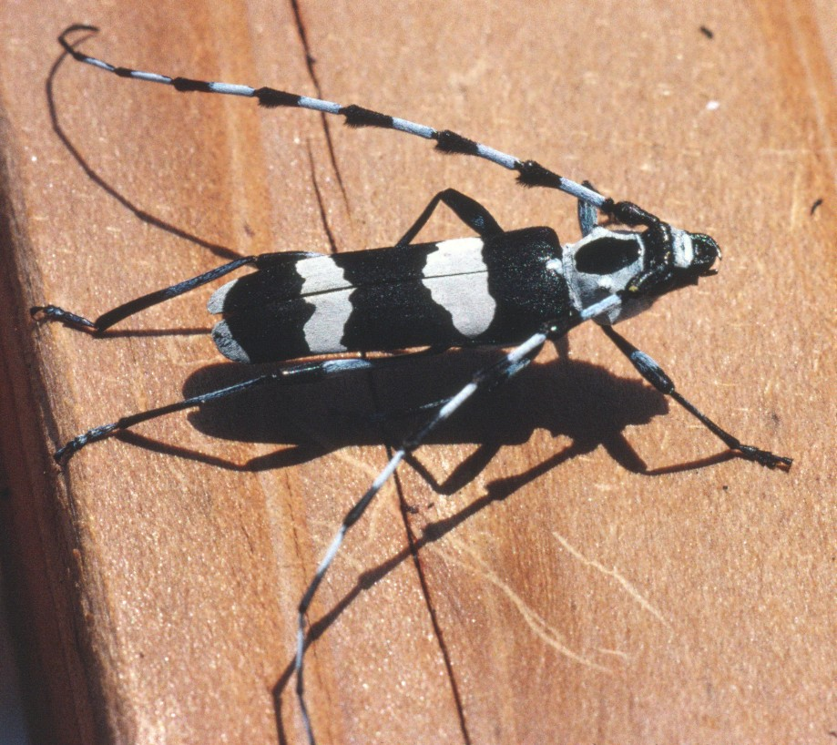
```

#### Citation {-}

Swiecki, T.J.; Bernhardt, E.A. 2025. Banded alder borer / California laurel borer. In Swiecki, T.J., et al. (Eds.) Field Guide to Insects and Diseases of California Oaks, Online edition 2025.

### California prionus {-}

#### *Prionus californicus* {-}

The California prionus, *Prionus californicus*, is found along the Pacific Coast from Alaska to Sonora, Baja California, and the Rocky Mountains south to New Mexico.  Larvae feed in the lower trunk and roots of oaks and many other hardwood trees, conifers, and woody shrubs.  Eggs are laid in the soil near host roots.  Larvae are large white grubs up to 60—75 mm long that tunnel in the wood and sometimes in the bark of roots.  Larvae attack living roots, but also feed in dead and decaying roots.  The mature larva leaves the root and constructs a pupation tunnel up to 1 m long in the soil.  Adult beetles are 40—60 mm long, shining, dark reddish brown, with three sharp teeth on each lateral margin of the prothorax (figure  \@ref(fig:WdBorMon20)).  Adults are active in twilight hours and at night, and are attracted to light.  The adult flight period is from June to September.  The life cycle takes three to five years.  Extensive feeding by larvae can completely girdle the bole of the host tree just below the ground.  Injury is greater among trees growing in light, well-drained soil.

*Prionus lecontei* larvae also tunnel within living oak roots.  This species is found from British Columbia to Baja California.  *P. lecontei* adults fly from June to August and are sometimes captured with *P. californicus* adults.

```{r, fig.align='center', fig.asp=.75, fig.cap="Approximate ranges of California prionus  (orange shading) and native oak species (green) in California.", out.width='30%'}
knitr::include_graphics("images/distributions/statewide.png")
```

(ref:WdBorMon20) Adult California prionus.  Illustration by John Muir Laws, California Academy of Sciences.
.
```{r WdBorMon20, fig.align='center', fig.asp=.75, fig.cap="(ref:WdBorMon20)", out.width="75%"}
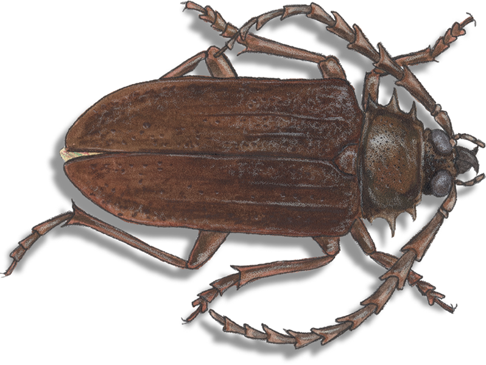
```

#### Citation {-}

Swiecki, T.J.; Bernhardt, E.A. 2025. California prionus. In Swiecki, T.J., et al. (Eds.) Field Guide to Insects and Diseases of California Oaks, Online edition 2025.

### Nautical borer {-}

#### *Xylotrechus nauticus* {-}

The nautical borer is common throughout California on oaks and other hardwoods. This beetle colonizes dead or declining trunks and limbs but normally does not attack healthy trees.  Larvae, which grow to a length of about 18 mm, bore into the inner bark, producing an engraved pattern on the surface of the sapwood.  Tunnels differ from those of bark beetles in that no central egg gallery is formed, and the larval tunnels are longer, larger in diameter, and oval in cross-section.  Larvae also tunnel into heartwood and pack the tunnels with dry, powder-like frass.  Adult beetles may emerge in large numbers from infested wood.  Adults are about 8—15 mm long and dark gray (figure  \@ref(fig:WdBorMon21)).  The elytra (hard outer forewings) are crossed with three light-colored zigzag-shaped markings.  Antennae are relatively short.  Adult beetles are found in homes when they emerge from firewood stored indoors. 

```{r, fig.align='center', fig.asp=.75, fig.cap="Approximate ranges of nautical borer (orange shading) and native oak species (green) in California.", out.width='30%'}
knitr::include_graphics("images/distributions/statewide.png")
```

(ref:WdBorMon21) Pinned specimen of adult nautical borer - *Xylotrechus nauticus*. Photo: T.W. Davis, California Academy of Sciences.
.
```{r WdBorMon21, fig.align='center', fig.asp=.75, fig.cap="(ref:WdBorMon21)", out.width="75%"}
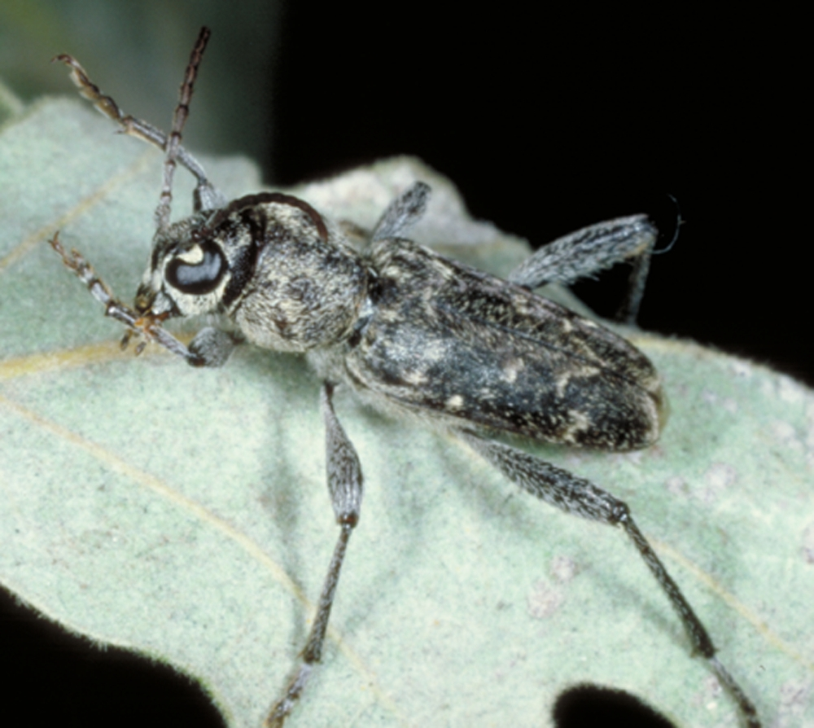
```


#### Citation {-}

Swiecki, T.J.; Bernhardt, E.A. 2025. Nautical borer - *Xylotrechus nauticus*. In Swiecki, T.J., et al. (Eds.) Field Guide to Insects and Diseases of California Oaks, Online edition 2025.

### *Neoclytus conjunctus* {-}

This beetle is found along the Pacific Coast from British Columbia to southern California. Hosts of this borer include oak, eucalyptus, ash, pear, manzanita, and madrone. The larvae are common in freshly-cut deciduous trees and adults may emerge from firewood. The larvae initially tunnel under the bark before progressing to the sapwood and outer heartwood, which are extensively tunneled. The adult flight period is March to June. Adults have light-colored markings on the black elytra (figure  \@ref(fig:WdBorMon22)). The pronotum is broadly rounded with many elevated ridges. Antennae are long and clubbed.  


```{r, fig.align='center', fig.asp=.75, fig.cap="Approximate ranges of *Neoclytus conjunctus* (orange shading) and native oak species (green) in California.", out.width='30%'}
knitr::include_graphics("images/distributions/statewide.png")
```


(ref:WdBorMon22) Pinned specimen of adult *Neoclytus conjunctus*. Photo: Larry G. Bezark, CDFA, retired.
.
```{r WdBorMon22, fig.align='center', fig.asp=.75, fig.cap="(ref:WdBorMon22)", out.width="75%"}
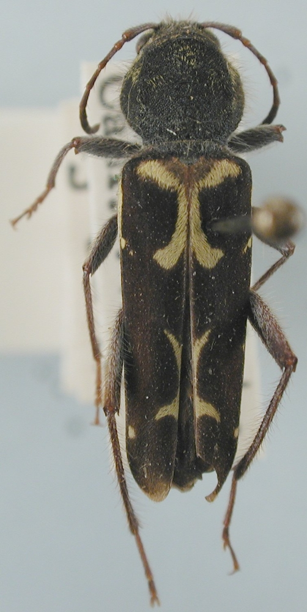
```


#### Citation {-}

Swiecki, T.J.; Bernhardt, E.A. 2025. *Neoclytus conjunctus*. In Swiecki, T.J., et al. (Eds.) Field Guide to Insects and Diseases of California Oaks, Online edition 2025.

## Other wood borers {-}

### Carpenterworm  {-}

#### *Prionoxystus robiniae* (Cossidae, cossid moths, carpenter millers)  {-}

#### Distribution / Hosts {-}

The carpenterworm feeds on wood of decidous trees throughout the U. S., including ash, aspen, cottonwood, poplar, elm, locust, oak, and willow.  In California, coast live, and California black oak are the most common oak hosts.

```{r, fig.align='center', fig.asp=.75, fig.cap="Approximate ranges of carpenterworm (orange shading) and native oak species (green) in California.", out.width='30%'}
knitr::include_graphics("images/distributions/Tapcae.png")
```

#### Symptoms {-}

The larvae of this moth feed by tunneling through the inner bark and into the wood of trees.  Larvae keep the tunnels open to the outside of the tree.  Tunnel ends appear as 13—18 mm diameter holes in the bark.  Bleeding often occurs from the infested area and sawdust-like frass accumulates below the open-ended tunnels.  The bark over tunneled areas is sometimes roughened or missing in patches (figure  \@ref(fig:WdBorMon23)).  After adult moths emerge, empty pupal cases may be found protruding from tunnel openings.

(ref:WdBorMon23) Areas of roughened and missing bark on this valley oak are symptoms of carpenterworm damage.  Photo:  Bruce Hagen, CalFire, retired.

```{r WdBorMon23, fig.align='center', fig.asp=.75, fig.cap="(ref:WdBorMon23)", out.width="75%"}
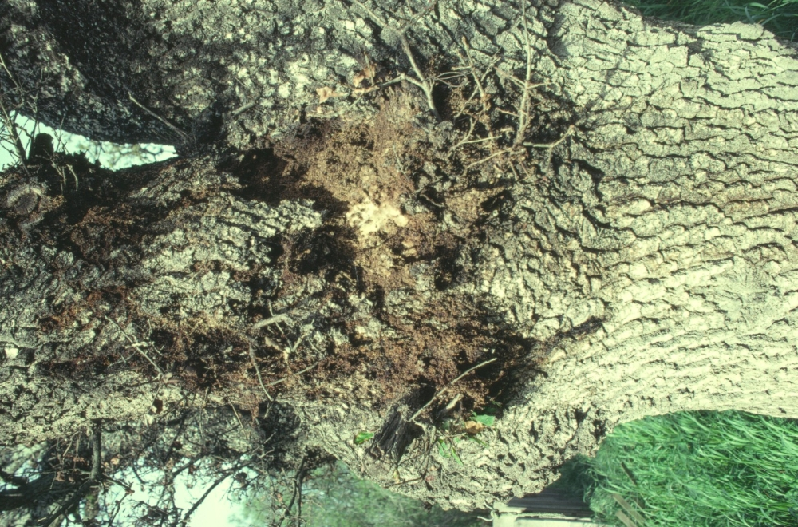
```

#### Agent Description {-}

Larvae are off-white, pinkish, or greenish-white, and up to 64 mm long at maturity; the head is dark (figure  \@ref(fig:WdBorMon24)). Unlike larvae of wood-boring beetles, carpenterworm larvae have abdominal prolegs, each of which has a band of hooks (crochets) at the bottom.  Pupae are shiny, dark brown, and have a double row of spines (figure  \@ref(fig:WdBorMon25)). Adults are large, heavy-bodied moths with mottled grayish forewings (figure  \@ref(fig:WdBorMon26)). Female moths are large, with a wingspan of about 75 mm and grayish hindwings.  Male moths are about two-thirds the size of females, generally darker, and have an orange to red area on their hindwings.  The male’s antennae are more comb-like (pectinate) than the female’s.

(ref:WdBorMon24) Carpenterworm larva.  Photo:  Bruce Hagen, CalFire, retired.

```{r WdBorMon24, fig.align='center', fig.asp=.75, fig.cap="(ref:WdBorMon24)", out.width="75%"}
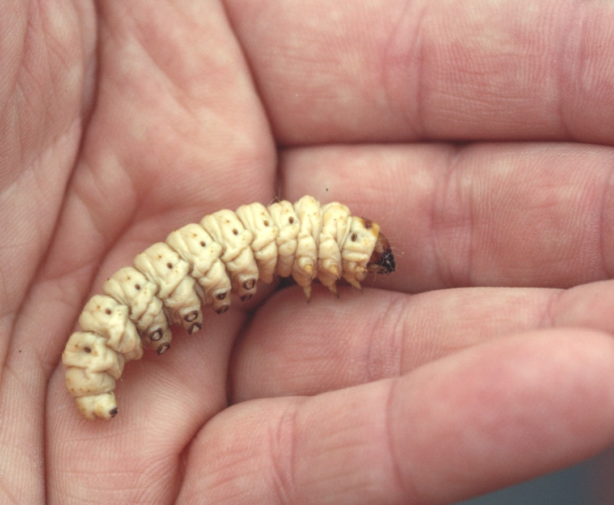
```


(ref:WdBorMon25) Carpenterworm pupal case.  Photo:  Bruce Hagen, CalFire, retired.

```{r WdBorMon25, fig.align='center', fig.asp=.75, fig.cap="(ref:WdBorMon25)", out.width="75%"}
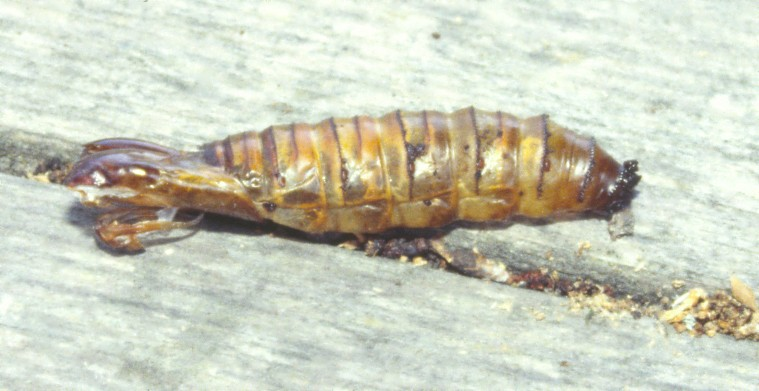
```


(ref:WdBorMon26) Carpenterworm adult female moth.  Photo:  Bruce Hagen, CalFire, retired.

```{r WdBorMon26, fig.align='center', fig.asp=.75, fig.cap="(ref:WdBorMon26)", out.width="75%"}
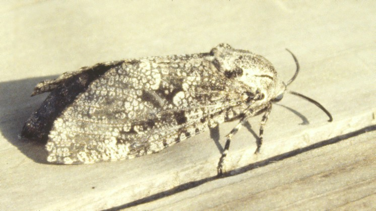
```

#### Biology {-}

Adult moths emerge from pupal cases from May through July, or as early as April in southern California.  Females are poor fliers and frequently lay eggs on the same tree from which they have emerged.  Eggs are laid in sticky clumps of two to six on the bark, often in cracks or crevices or in areas of rough bark from previous infestations.  After hatching, the larva immediately bores through the bark.  Larval feeding initially occurs mostly in the sapwood, but later instars tunnel into the heartwood, returning to the tunnel entrance to expel frass.  The gallery is mostly vertical and about 15—25 cm long.  After the mature larva pupates, the pupa wiggles toward the bark surface, where the adult emerges.  The larval stage takes up most of the two to four year life cycle.

#### Importance {-}

Bleeding and scarring of the affected area may be unsightly.  Girdling associated with tunneling may induce branch dieback.  Wounds may also serve as an entry point for wood decay fungi or canker pathogens.  Extensive boring and associated wood decay can make trees more susceptible to breakage.  

#### Citation {-}

Swiecki, T.J.; Bernhardt, E.A. 2025. Carpenterworm. In Swiecki, T.J., et al. (Eds.) Field Guide to Insects and Diseases of California Oaks, Online edition 2025.

### Lead cable borer {-}

#### *Scobicia declivis* (Bostrichidae, powderpost beetles)  {-}
 
The lead cable borer, *Scobicia declivis*, is common throughout California and southern Oregon. Larvae mine and completely destroy dead and seasoned wood, but also attack living hardwoods including oak. The larvae are heavy bodied, 10 mm long at maturity, white to pale yellow, C-shaped, and enlarged at the front end.  They have three pairs of true legs. Frass-filled tunnels produced by larvae are mostly aligned along the wood grain. Adult beetles are 5—6 mm long, cylindrical, and dark brown to black (figure  \@ref(fig:WdBorMon27)). Antennae and portions of the legs and mouthparts are reddish in color. The head is bent downward and completely hidden by the prothorax when viewed from above. Adults emerge from April through September, and are most common in July and August.  Adults sometimes bore through non-wood materials, including the sheathing of aerial telephone cables.


```{r, fig.align='center', fig.asp=.75, fig.cap="Approximate ranges of lead cable borer (orange shading) and native oak species (green) in California.", out.width='30%'}
knitr::include_graphics("images/distributions/statewide.png")
```


(ref:WdBorMon27) Adult lead cable borer.  Illustration: John Muir Laws, California Academy of Sciences.

```{r WdBorMon27, fig.align='center', fig.asp=.75, fig.cap="(ref:WdBorMon27)", out.width="75%"}
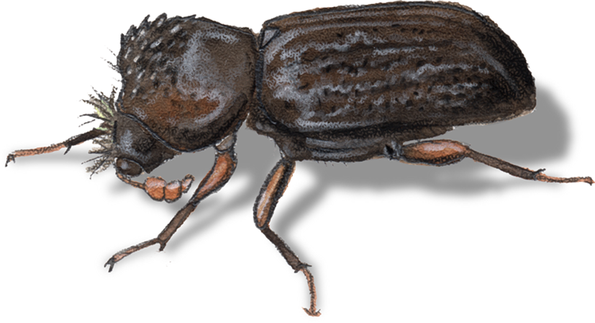
```


#### Citation {-}

Swiecki, T.J.; Bernhardt, E.A. 2025. Lead cable borer. In Swiecki, T.J., et al. (Eds.) Field Guide to Insects and Diseases of California Oaks, Online edition 2025.

### Pigeon tremex {-}

#### *Tremex columba* (Siricidae, horntails or wood wasps) {-}
 
The Pigeon tremex, *Tremex columba*, is a wood-boring wasp found in the northern part of the U.S. from coast to coast and throughout California. Larvae bore almost perfectly round tunnels, 6—7 mm in diameter, through the heartwood of declining and dead hardwoods including oak, pear, apple, beech, sycamore, hickory, elm, and maple.  Tunnels are not open to the outside of the tree.  Larvae are up to about 50 mm long.  Adults are 25—38 mm long and have golden-yellow wings and a yellow abdomen with black bands (figure  \@ref(fig:WdBorMon28)).  The adult female pigeon tremex inserts her ovipositor into solid wood to a depth of 13 mm and deposits a single egg.  Often, the ovipositor cannot be extracted and the female dies on the tree.     


```{r, fig.align='center', fig.asp=.75, fig.cap="Approximate ranges of pigeon tremex (orange shading) and native oak species (green) in California.", out.width='30%'}
knitr::include_graphics("images/distributions/statewide.png")
```


(ref:WdBorMon28) Adult pigeon tremex.  Illustration: John Muir Laws, California Academy of Sciences.

```{r WdBorMon28, fig.align='center', fig.asp=.75, fig.cap="(ref:WdBorMon28)", out.width="75%"}
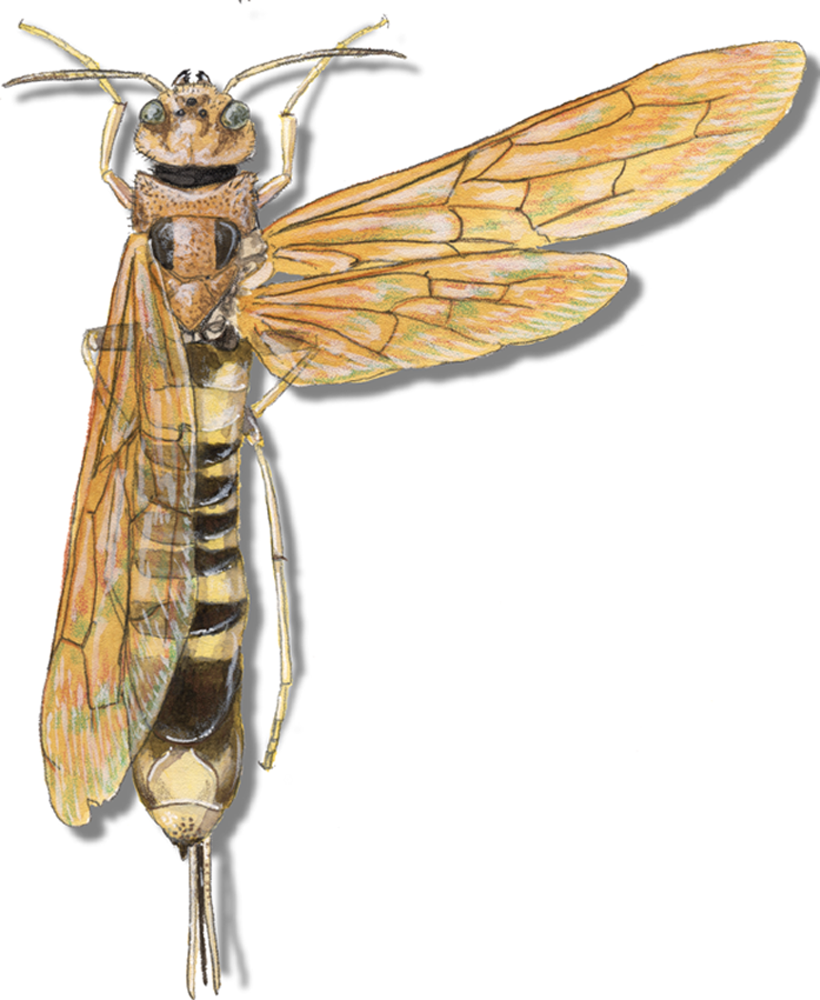
```

#### Citation {-}

Swiecki, T.J.; Bernhardt, E.A. 2025. Pigeon tremex. In Swiecki, T.J., et al. (Eds.) Field Guide to Insects and Diseases of California Oaks, Online edition 2025.

### Western sycamore borer {-}

#### *Synanthedon resplendens* (Sesiidae, clearwing moths) {-}

#### Distribution / Hosts {-}

The western sycamore borer occurs from Washington to California and east to New Mexico.  It is reported on sycamore, ceanothus, and coast live oak and other oaks.  It is reported to be more common on oaks in southern than in northern California.  A related species, *Synanthedon mellinipennis*, has been reported on coast live oak and possibly other oaks in California along the Central Coast and San Francisco Bay Area.

```{r, fig.align='center', fig.asp=.75, fig.cap="Approximate ranges of western sycamore borer (orange shading) and native oak species (green) in California.", out.width='30%'}
knitr::include_graphics("images/distributions/statewide.png")
```

#### Symptoms {-}

Larvae mine the bark below the surface, producing numerous meandering feeding tunnels (figure  \@ref(fig:WdBorMon29)).  Reddish sawdust-like frass, which larvae expel from tunnels, accumulates in branch crotches or on the ground below the infested area.  The outer bark surface over the tunnels becomes roughened after repeated infestations and may produce wet ooze (figure  \@ref(fig:WdBorMon30)).  Pupal skins may be visible in emergence holes, which are 3 mm in diameter.


(ref:WdBorMon29) Western sycamore borer damage on coast live oak.  The outer surface of bark has been cut away to show tunneling in inner bark. Photo: Tedmund J. Swiecki and Elizabeth A. Bernhardt, Phytosphere Research.

```{r WdBorMon29, fig.align='center', fig.asp=.75, fig.cap="(ref:WdBorMon29)", out.width="75%"}
knitr::include_graphics("images/Insect-wood/sycamore borer QA SRSP plot 216 6-24-04 c_Phytosphere.jpg")
```


(ref:WdBorMon30) Symptoms of western sycamore borer damage on coast live oak. Photo: Bruce Hagen, CalFire, retired.

```{r WdBorMon30, fig.align='center', fig.asp=.75, fig.cap="(ref:WdBorMon30)", out.width="75%"}
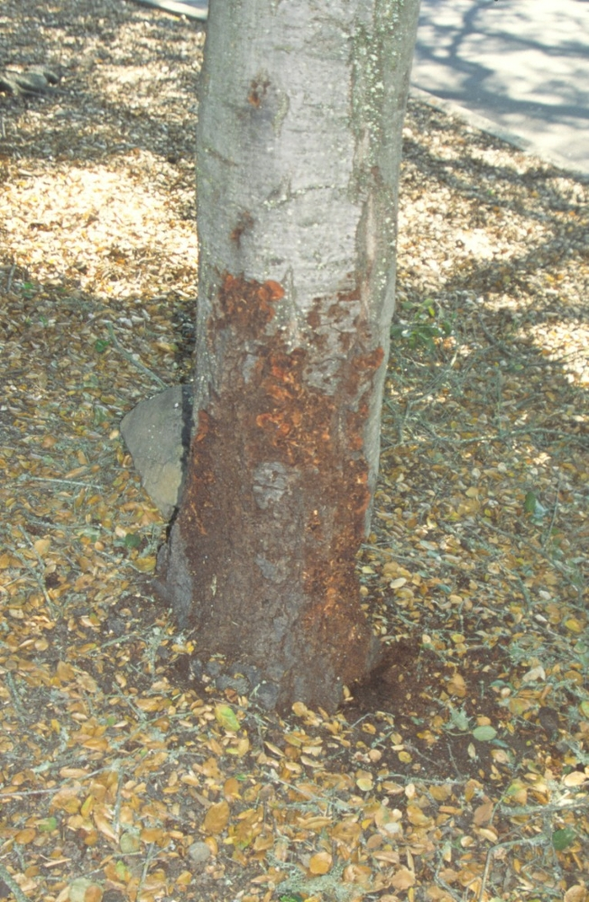
```

#### Agent Description {-}

Adult moths resemble yellowjacket wasps and have a wingspan of about 18 mm (figure  \@ref(fig:WdBorMon31)).  Adults are mostly yellow with black markings on the thorax and abdomen; the head is brownish black.  Wings are mostly clear with yellow to orange edges.  Larvae are pinkish to whitish and reach 18 mm in length; the head is brown (figure  \@ref(fig:WdBorMon32)).


(ref:WdBorMon31) Western sycamore borer adult.  Illustration: John Muir Laws, California Academy of Sciences.

```{r WdBorMon31, fig.align='center', fig.asp=.75, fig.cap="(ref:WdBorMon31)", out.width="75%"}
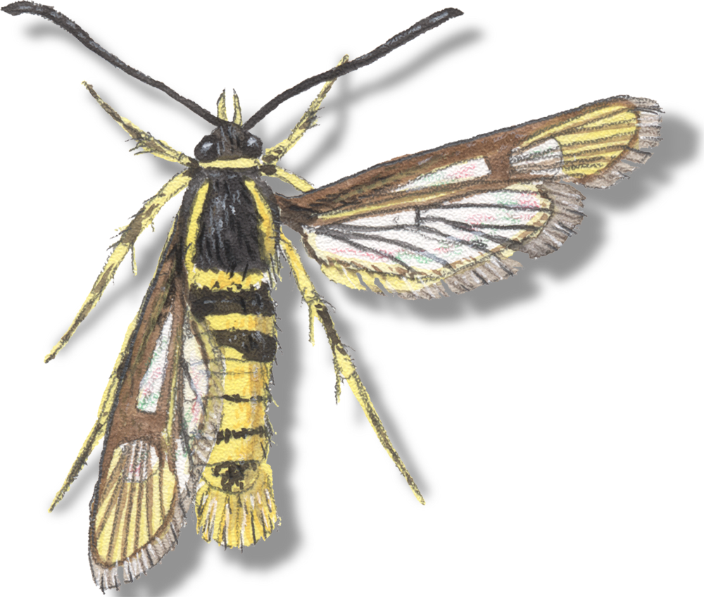
```

(ref:WdBorMon32) Western sycamore borer larva. Photo: Bruce Hagen, CalFire, retired.

```{r WdBorMon32, fig.align='center', fig.asp=.75, fig.cap="(ref:WdBorMon32)", out.width="75%"}
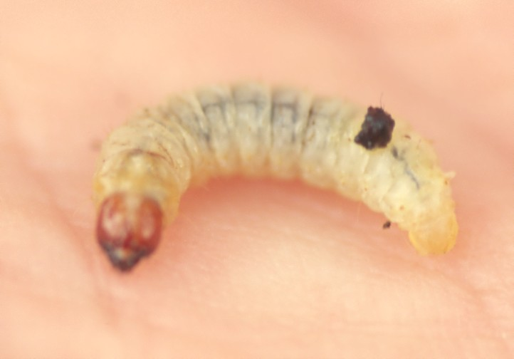
```

#### Biology {-}

One generation occurs per year.  Adults emerge from May through early August, with greatest emergence in June and July.  The ovoid, gold-colored eggs are laid singly on the bark in small cracks or depressions.  Old or slow-growing trees and injured tissues are favored sites for egg laying and feeding.  The larva tunnels into the inner bark after hatching, creating winding tunnels that extend over about 100 cm2.  Larvae rarely damage the cambium or feed in the wood.  Pupae are formed just below the bark surface, and protrude through the bark when the adult is ready to emerge.  Overwintering occurs as larvae or pupae within the bark tunnels.  In southern California, larvae feed though most of the winter months and pupate in early spring.

#### Importance {-}

Bark of infested trees may become unsightly, but the amount of damage caused by this insect is generally considered to be of minor importance.  Repeated infestations may retard tree growth.

#### Citation {-}

Swiecki, T.J.; Bernhardt, E.A. 2025. Western sycamore borer. In Swiecki, T.J., et al. (Eds.) Field Guide to Insects and Diseases of California Oaks, Online edition 2025.

