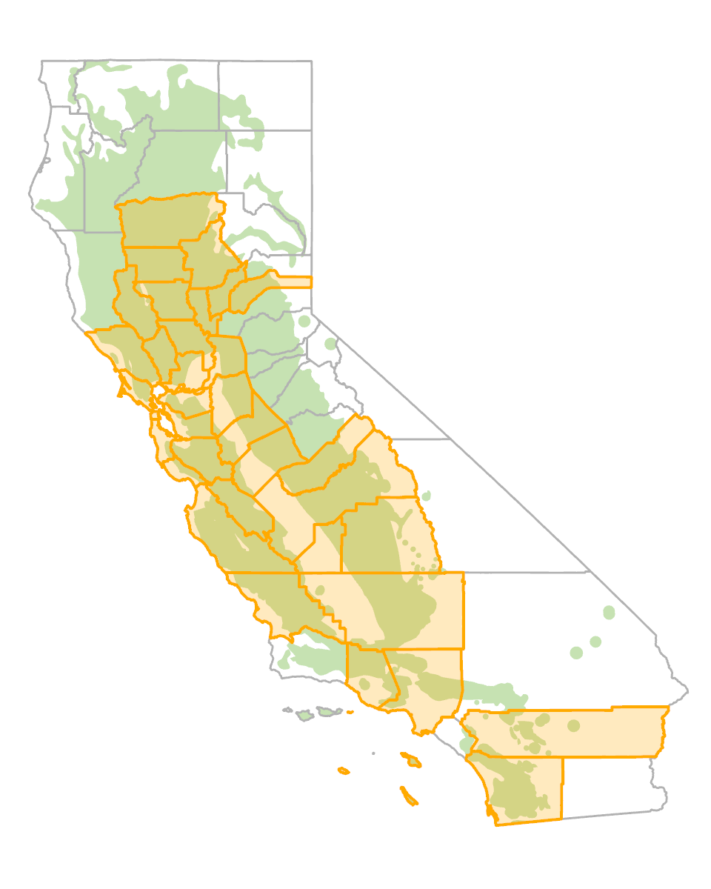

# (PART) Diseases {-}

# Acorn diseases {#Acorndis}

## Drippy nut {-}

### *Lonsdalea quercina* {#Drippynut .unnumbered}


#### Distribution / Hosts {-}

Drippy nut was originally reported on both coast live and interior live oak, but the disease has since been confimed to occur in Shreve oak also. Drippy nut occurs throughout most of the ranges of these species in California and is especially common in counties in the San Francisco Bay Area. It is commonly present at noticeable levels in relatively few trees within a general location.  

```{r, fig.align='center', fig.asp=.75, fig.cap="Counties with orange shading represent the approximate range of *Lonsdalea quercina* in California. The approximate distribution of native oak species is shown in green.", out.width='30%'}

```


#### Symptoms {-}

The most obvious symptom is copious oozing of frothy, sticky sap from affected acorns (figure \@ref(fig:AcDis1)).  Sap may continue to drip from acorn caps attached to the tree after acorns have dropped.  The ooze is more watery under humid conditions.  In affected trees, the total amount of dripping sap tends to increase with the size of the acorn crop.  Affected acorns may show discoloration at insect oviposition wounds and evidence of internal decay.  


(ref:AcDis1) Frothy sap oozing from coast live oak acorns affected by drippy nut. Photo: Tedmund J. Swiecki and Elizabeth A. Bernhardt, Phytosphere Research.

```{r AcDis1, out.width='75%', fig.asp=.75, fig.align='center', fig.cap = "(ref:AcDis1)"}
knitr::include_graphics("images/Disease-acorn/drippy nut QA buckeye CCSP 9-15-03 a_Phytosphere.jpg")
```


(ref:AcDis2) Frothy sap oozing from coast live oak acorns affected by drippy nut. Photo: Tedmund J. Swiecki and Elizabeth A. Bernhardt, Phytosphere Research.

```{r AcDis2, out.width='75%', fig.asp=.75, fig.align='center', fig.cap = "(ref:AcDis2)"}
knitr::include_graphics("images/Disease-acorn/drippy nut QA buckeye CCSP 9-15-03 d_Phytosphere.jpg")
```


#### Agent Description {-}

The bacterial pathogen is visible only with a high-magnification microscope. The causal bacterium, was originally described under the name *Erwinia quercina*, was transferred to the genus *Brenneria*, and more recently to the new genus *Lonsdalea* [@Brady2012]. It is a non-spore forming, gram negative rod with flagella distributed over the entire cell surface (i.e., peritrichous flagella). Other species of *Lonsdalea* that are oak pathogens include *L. iberica*, which causes bark cankers and drippy nut disease in Spain, and *L. britannica*, which is associated with acute oak decline in Britain. In Colorado, a bacterium currently referred to as *L. quercina* causes drippy blight of planted non-native red oak species (*Quercus rubra*, *Q. palustris*) and has also been found in native *Q. gambelli*. This disease is associated with the kermes scale (*Allokermes galliformis*) [@Sitz2018]. The California and Colorado isolates of *L. quercina* are genetically distinct and the Colorado isolates are genetically more similar to *L. iberica* than to the California *L. quercina* isolates [@Kozhar2023]. Notably, the California *L. quercina* isolates show very little genetic variation, much less than the more recently detected Colorado isolates. 

#### Biology {-}

Bacteria apparently enter the acorn through insect oviposition wounds, including those caused by acorn weevils, filbertworms, and some cynipid wasps. The disease is typically more severe during warm weather. Drippy nut disease severity varies from year to year, but the disease is more likely to recur in trees that have shown symptoms in previous years.

#### Importance {-}

In California, this disease has not been associated with any obvious damage to trees, although the seed crop is reduced. The sticky sap can be abundant and can pose a substantial nuisance, especially around dwellings.

#### Citation {-}

Swiecki, T.J.; Bernhardt, E.A. 2026. Drippy nut. In Swiecki, T.J., et al. (Eds.) Field Guide to Insects and Diseases of California Oaks, Online edition `r Sys.Date()`.
