# Leaf and twig diseases {#Lftwigdis}

## *Microstroma album*  {-}


#### Distribution / Hosts {-}


#### Symptoms {-}


#### Agent Description {-}


#### Biology {-}


#### Importance {-}


#### Citation {-}

---------------- 2026. *Microstroma album*.  In Swiecki, T.J., et al. (Eds.) Field Guide to Insects and Diseases of California Oaks, Online edition `r Sys.Date()`.

## Powdery mildews {-}

### *Erisyphe trina*, *Cystotheca lanestris*, *Erysiphe* species, *Phyllactinia angulata*  {-}

#### Distribution / Hosts {-}

Powdery mildews are widespread and occur on most oaks throughout California.  The taxonomy of the powdery mildews has undergone multiple revisions, with the most recent changes resulting in the rolling back of some previous name changes among those species affecting oaks. 


```{r, fig.align='center', fig.asp=.75, fig.cap="Approximate ranges of powdery mildew (orange shading) and native oak species (green) in California.", out.width='30%'}
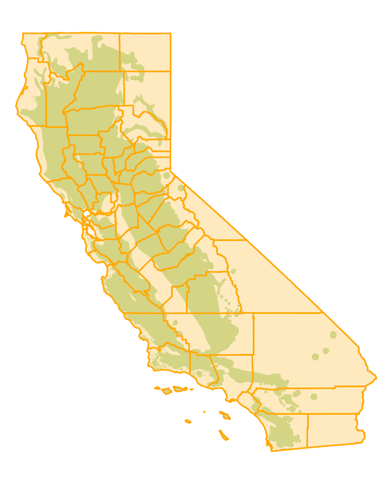
```


*Erisyphe trina* (formerly *Brasiliomyces trina*) is relatively uncommon and has been reported from coast live oak, canyon live oak, and tanoak. 

*Cystotheca lanestris* (previously *Sphaerotheca lanestris*) is widespread and has been reported from most oaks in California.

*Microsphaera penicillata* (current name *E. penicillata*) was split into four species,   all of which have been reassigned to *Erysiphe* (*Erysiphe alphitoides*, *E. abbreviata*, *E. calocladophora*, and *E. densissima* (Braun, U; Takamatsu, S. 2000. Phylogeny of *Erysiphe*, *Microsphaera*, *Uncinula* (Erysipheae) and *Cystotheca*, *Podosphaera*, *Sphaerotheca* (Cystotheceae) inferred from rDNA ITS sequences- some taxonomic consequences. Schlechtendalia. 4:1-33)).  As noted below, at least some of the records previously reported as *M. penicillata* were reassigned to *M. extensa* var. *curta*, now *E. densissima*.  However, most of the host/distribution reports based on  older names cannot be reassigned to one of the four new species without microscopic examination of the original specimens.  *M. penicillata* was reported on a wide variety of native oaks in California, including coast live, interior live, blue, valley, leather, Engelmann, Oregon white, California black, and various scrub oaks.  It was also reported on several cultivated non-native oaks in California, including English oak.

*Microsphaera extensa* var. *curta*, previously included within *M. penicillata*, is now *E. densissima*. *E. densissima* occurs on a wide variety of oak species in North America.  In California, it has been confirmed on blue, valley, Oregon white, and California black oak, but may occur on other species. 

*Phyllactinia angulata*  (= *Phyllactinia corylea*, *P. guttata*) is distributed throughout North America on trees in the families Fagaceae (includes oak, chestnut, beech) and Ulmaceae (includes elm, hackberry) and is reported in California on coast live, California black, and valley oak.  According to Braun (1987), the species of *Phyllactinia* previously identified as *P. corylea* on oaks in California should be assigned to this species. 


#### Symptoms {-}

All of the powdery mildews on California oaks produce dry, whitish fungal growth (mycelium) on leaf surfaces.  Young leaves are often affected more than mature leaves.  High infection levels may cause leaf distortion and discoloration.  Symptom location and appearance varies somewhat among the powdery mildew species:
B. trina produces well defined, grayish to brownish-white, rounded to irregular colonies on the upper leaf surface (figure \@ref(fig:LfDisPm1),  \@ref(fig:LfDisPm2)).


(ref:LfDisPm1) Brasiliomyces trina on coast live oak.  Photo: Tedmund J. Swiecki and Elizabeth A. Bernhardt, Phytosphere Research.

```{r LfDisPm1, out.width='75%', fig.asp=.75, fig.align='center', fig.cap = "(ref:LfDisPm1)"}
knitr::include_graphics("images/Disease-leaftwig/B trina QA china Camp 4-5-05d_Phytosphere.jpg")
```


(ref:LfDisPm2) Brasiliomyces trina on coast live oak.  Masses of brown cleistothecia give a mottled brown or grayish appearance to the fungal mycelium.  Photo: Tedmund J. Swiecki and Elizabeth A. Bernhardt, Phytosphere Research.

```{r LfDisPm2, out.width='75%', fig.asp=.75, fig.align='center', fig.cap = "(ref:LfDisPm2)"}
knitr::include_graphics("images/Disease-leaftwig/B trina QA china Camp 4-5-05b_Phytosphere.jpg")
```


*C. lanestris* mycelium primarily grows on the lower leaf surface  (figure \@ref(fig:LfDisPm3,  \@ref(fig:LfDisPm4)).  The white mycelium turns tan to brown with age.  The fungus can cause systemic infections that induce the formation of witches' brooms (abnormal clusters of shoots that are thickened, elongated, and highly branched).  Leaves on witches' brooms are small and senesce early (figure \@ref(fig:LfDisPm5)).  The entire broom becomes white when the fungus sporulates, and may either die out over the winter or produce either more brooms or normal shoots the following season. 


(ref:LfDisPm3) *Cystotheca lanestris* on lower surfaces of valley oak leaves.  Photo: Tedmund J. Swiecki and Elizabeth A. Bernhardt, Phytosphere Research.

```{r LfDisPm3, out.width='75%', fig.asp=.75, fig.align='center', fig.cap = "(ref:LfDisPm3)"}
knitr::include_graphics("images/Disease-leaftwig/Cystotheca lanestris valley oak underside Vacaville June 2004PICT0036_Phytosphere.jpg")
```


(ref:LfDisPm4) *Cystotheca lanestris* symptoms on upper surfaces of valley oak leaves; note leaf chlorosis and distortion.  Photo: Tedmund J. Swiecki and Elizabeth A. Bernhardt, Phytosphere Research.

```{r LfDisPm4, out.width='75%', fig.asp=.75, fig.align='center', fig.cap = "(ref:LfDisPm4)"}
knitr::include_graphics("images/Disease-leaftwig/Cystotheca lanestris on valley oak top side Vacaville June 2004_Phytosphere.jpg")
```


(ref:LfDisPm5) *Cystotheca lanestris* witches’ broom symptom on coast live oak.  Photo: Tedmund J. Swiecki and Elizabeth A. Bernhardt, Phytosphere Research.

```{r LfDisPm5, out.width='75%', fig.asp=.75, fig.align='center', fig.cap = "(ref:LfDisPm5)"}
knitr::include_graphics("images/Disease-leaftwig/Cystotheca lanestris on QA MMWD3 9-03f_Phytosphere.jpg")
```


*M. extensa* var. *curta* mycelium is normally present on the upper leaf surface.  It commonly forms a persistent thin whitish film over the entire leaf ((figure \@ref(fig:LfDisPm6,  \@ref(fig:LfDisPm7)).


(ref:LfDisPm6) Microsphaera extensa var. curta on valley oak .  Photo: Tedmund J. Swiecki and Elizabeth A. Bernhardt, Phytosphere Research.

```{r LfDisPm6, out.width='75%', fig.asp=.75, fig.align='center', fig.cap = "(ref:LfDisPm6)"}
knitr::include_graphics("images/Disease-leaftwig/powdery mildew valley oak Vacaville Nov 18 2003 b_Phytosphere.jpg")
```


(ref:LfDisPm7) Microsphaera extensa var. curta on blue oak.  Photo: Tedmund J. Swiecki and Elizabeth A. Bernhardt, Phytosphere Research.

```{r LfDisPm7, out.width='75%', fig.asp=.75, fig.align='center', fig.cap = "(ref:LfDisPm7)"}
knitr::include_graphics("images/Disease-leaftwig/Microsphaera extensa curta on Q douglasii Nov 18 2003 d_Phytosphere.jpg")
```


*P. angulata* mycelium primarily occurs on the lower leaf surface but is also found on the upper surface. 

#### Agent Description {-}

Powdery mildew fungi on California oaks are differentiated primarily on the basis of their sexual fruiting bodies (cleistothecia), which are just large enough to see without magnification, and to a lesser degree on their microscopic asexual spores (conidia).  
B. trina cleistothecia are abundant, yellow-brown, somewhat transparent, small (60 μm diameter) and lack appendages.  Each cleistothecium contains two to three saclike structures (asci), each of which contains two spores (ascospores).  B. trina produces almost no conidia.  


(ref:LfDisPm8) Micrograph of M. extensa var. curta cleistothecia with hyaline, dichotomously branched appendages; developing appendages are unbranched.  Photo: Tedmund J. Swiecki and Elizabeth A. Bernhardt, Phytosphere Research.

```{r LfDisPm8, out.width='75%', fig.asp=.75, fig.align='center', fig.cap = "(ref:LfDisPm8)"}
knitr::include_graphics("images/Disease-leaftwig/Microsphaera extensa curta from QL Nov-14-2003c_Phytosphere.jpg")
```


#### Biology {-}

Powdery mildew fungi derive nutrition from living host cells, so infected host tissues are generally not directly killed by these parasitic fungi.  Most powdery mildew leaf infections affect only the outermost layer of leaf cells (epidermis), but the systemic infections caused by C. lanestris affect multiple cell layers.

Powdery mildew fungi overwinter as cleistothecia or, in the case of C. lanestris, as mycelium in infected buds.  Cleistothecia may be less likely to form on evergreen oaks than on deciduous oaks.  In spring, ascospores are released from the cleistothecia and are blown or splashed onto host leaves.  After ascospores germinate, they form swollen structures (appressoria) on the leaf surface.  Hyphal pegs formed under the appressoria penetrate host epidermal cells.  Fungal structures (haustoria) are formed within living host cells and absorb nutrients that the fungus uses for growth and reproduction.  Most of the fungal mycelium grows on the outer surface of infected leaves and produces dry conidia.  Conidia are blown to young succulent shoots and initiate new infections throughout the growing season.  Powdery mildew infection is favored by warm days and cool nights and is inhibited by wet conditions.  Vigorous new growth produced late in the growing season, such as stump sprouts and epicormic shoots produced after heavy pruning, may develop severe powdery mildew infections.  Unlike the other powdery mildew infections, which are most noticeable in late summer and fall, infections by B. trina can be found in the spring


#### Importance {-}

Levels of infection are not normally severe enough to substantially affect plant health, except possibly in small seedlings.  Symptoms, including mycelium, witches’ brooms, and leaf distortion, may be unsightly.

#### Citation {-}

Swiecki, T.J.; Bernhardt, E.A. 2025. Powdery mildews. In Swiecki, T.J., et al. (Eds.) Field Guide to Insects and Diseases of California Oaks, Online edition `r Sys.Date()`.

## Oak leaf blister {-}

### *Taphrina caerulescens*  {-}

#### Distribution / Hosts {-}

*Taphrina caerulescens* is reported to affect more than 50 species of oaks in the North America, Mexico, Europe, and Asia. In California, this pathogen is reported on native blue, valley, Engelmann, California black, and coast live
oak and on some non-native oaks. Oaks in the subsection Lobatae (red/black oaks) are generally more susceptible than those in subsection Quercus (white oaks).


```{r, fig.align='center', fig.asp=.75, fig.cap="Approximate ranges of *Taphrina caerulescens* (orange shading) and native oak species (green) in California.", out.width='30%'}
knitr::include_graphics("images/distributions/Tapcae.png")
```


#### Symptoms {-}

Rounded, wrinkled blisters develop on the upper surface of young leaves (figure \@ref(fig:LfDis2A)). These blisters appear as depressions when the lower leaf surface is viewed. Blisters range in size from 3 to 30 mm and sometimes coalesce, affecting large areas of the leaf. Severe leaf distortion may result, and young leaves may drop if heavily infected. Blisters are initially light green, yellowish, or whitish on the upper leaf surface and yellow-brown to gray on the underside of the leaf (figure \@ref(fig:LfDis2B)). As blisters age, their upper surfaces may turn reddish or purplish and then brown. On coast live oak, symptoms caused by erineum mites mayappear similar to oak leaf blister. Inspection of symptomatic tissues under a microscope may be necessary to confirm whether symptoms are associated with erineum mites or *T. caerulescens*.

(ref:LfDis2A) Oak leaf blister symptoms on the upper surfaces of Oracle oak leaves. Photo: Phytosphere Research.

```{r LfDis2A, out.width='75%', fig.asp=.75, fig.align='center', fig.cap = "(ref:LfDis2A)"}
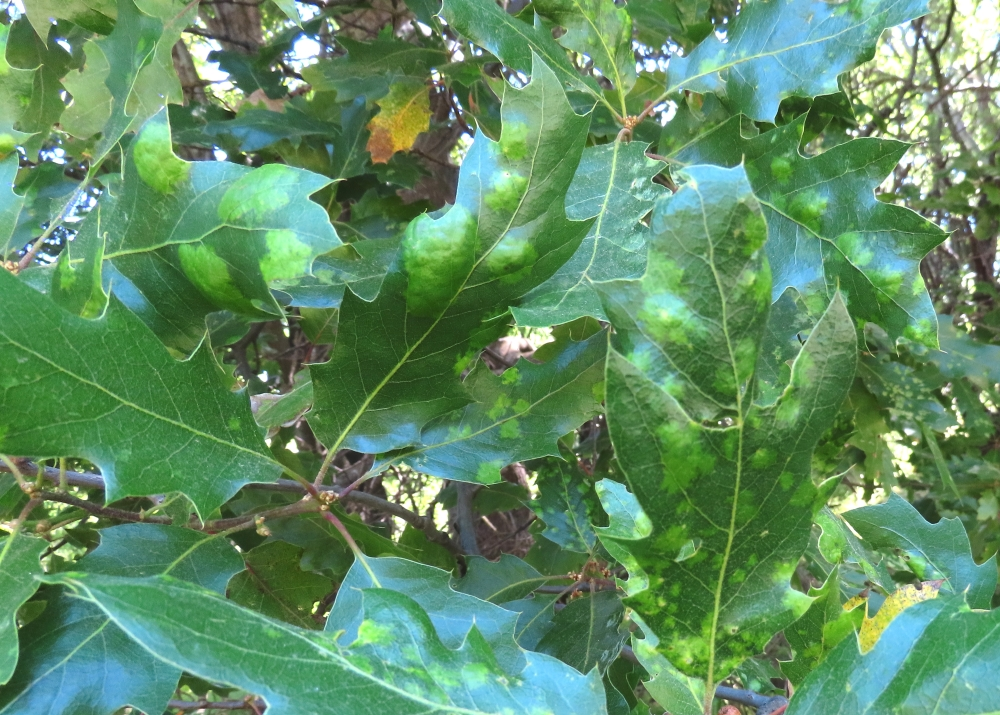
```

(ref:LfDis2B) Oak leaf blister symptoms on the lower surfaces of Oracle oak leaves. Photo: Phytosphere Research.

```{r LfDis2B, out.width='75%', fig.asp=.75, fig.align='center', fig.cap = "(ref:LfDis2B)"}
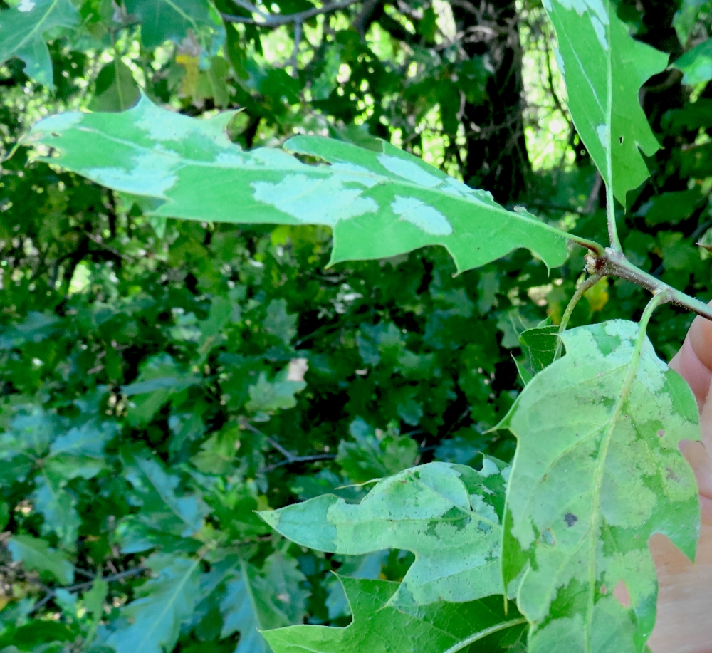
```

#### Agent Description {-}

All life stages of this fungus are microscopic. Fungal mycelium develops just below the leaf cuticle and between epidermal cells.No distinct fruiting body is formed. Sexual spores (ascospores) are produced in club-shaped, sac-like structures (asci) that form in a layer beneath the upper or lower leaf cuticle and eventually break through the leaf surface. Eight ascospores are formed in
each ascus, but ascospores can produce additional asexual spores (conidia) by budding, which may occur within the ascus. All fungal tissue is initially colorless, but the layer of asci darkens after spores are released.

#### Biology {-}

The fungus overwinters as spores (ascospores and conidia) in bark cracks and under bud scales. In the spring, young, germinating spores infect expanding leaves primarily through stomata. After ascospores are released, they may continue to grow as saprophytes on plant surfaces in a yeast-like
form, reproducing asexually by budding. Initial infection and subsequent saprophytic growth are favored by mild, wet conditions. Usually only one disease cycle occurs per year in California.

#### Importance {-}

In California, oak leaf blister is generally uncommon and typically does not cause substantial damage when present. In the southeastern U.S. and Gulf Coast states, disease is commonly more severe, leading to a high amount of early defoliation in some years.

#### Citation {-}

Swiecki, T.J.; Bernhardt, E.A. 2025. Oak leaf blister. In Swiecki, T.J., et al. (Eds.) Field Guide to Insects and Diseases of California Oaks, Online edition `r Sys.Date()`.


## Oak anthracnose, leaf spot, and twig blight {-}

### *Apiognomonia errabunda*, *Cryptocline cinerescens*, *Cylindrosporium kelloggii*, *Septoria quercicola*, and other fungi {-}

#### Distribution / Hosts {-}

A number of fungi cause necrotic spotting of leaves and/or twig dieback symptoms on oaks. The fruiting bodies of these fungi are minute, making them difficult to distinguish from each other.

*Apiognomonia errabunda* (asexual stage= *Discula umbrinella*, synonyms include *Discula quercina*, *Gnomonia errabunda*, *G. quercina*, *G. veneta*, *Gleosporium nervisequum*, *G. quercinum*, *G. quercuum*, and many others) is widely distributed across temperate North America and Europe and occurs on oaks, beech, and sycamore.  In California, it attacks both white oaks, including valley, Oregon white, and blue oak, and red/black oaks, including California black, coast live, and interior live oak.

*Cryptocline cinerescens* occurs on oaks in North America and Europe, and in California is reported on valley, coast live, and interior live oak.  Susceptibility varies across species and among individual plants.  In general, interior live oak may show less severe symptoms than valley, blue, California black, and coast live oak.

*Septoria quercicola* is distributed throughout temperate regions on oaks and is reported on 
California black, coast live, interior live, and canyon live oak.

Other leaf spotting fungi reported on native oaks in California include *Cercospora polytricha* on canyon live oak; *Colletotrichum gloeosporioides* on California black oak; *Cylindrosporium kelloggii* on coast live, California black, and Oregon white oak; *Dicarpella bina* on coast live oak; *Marssonina martinii* on blue and coast live oak; *Pseudomassaria agrifolia* on coast live oak; *Septoria dryina* on California black and possibly other oaks; and several other described fungi that may or may not be distinct from other species reported above.


```{r, fig.align='center', fig.asp=.75, fig.cap="Approximate ranges of anthracnose fungi (orange shading) and native oak species (green) in California.", out.width='30%'}

```


#### Symptoms {-}

Oak anthracnose is a term used to describe diseases caused by fungi that produce dark, pinpoint-sized asexual fruiting bodies and cause localized necrotic spots or lesions on leaves and young shoots (figure \@ref(fig:LfDis3AA), \@ref(fig:LfDis3B)).  Some of these fungi may completely kill young leaves and twigs under certain conditions.  Dead leaves may remain attached to killed twigs.  *C. cinerescens* has been associated primarily with twig dieback (figure \@ref(fig:LfDis3C)).  Symptoms are usually scattered throughout the canopy, and can resemble those caused by twig boring insects.  *C. cinerescens* symptoms are reported to be more severe in twigs colonized by oak pit scale.  *S. quercicola* produces small, circular to angular necrotic leaf spots visible on both leaf surfaces.  It may cause defoliation if disease levels are severe.


(ref:LfDis3AA) Anthracnose symptoms on California black oak. Photo:  Bruce Hagen, CalFire, retired.

```{r LfDis3AA, out.width='75%', fig.asp=.75, fig.align='center', fig.cap = "(ref:LfDis3AA)"}
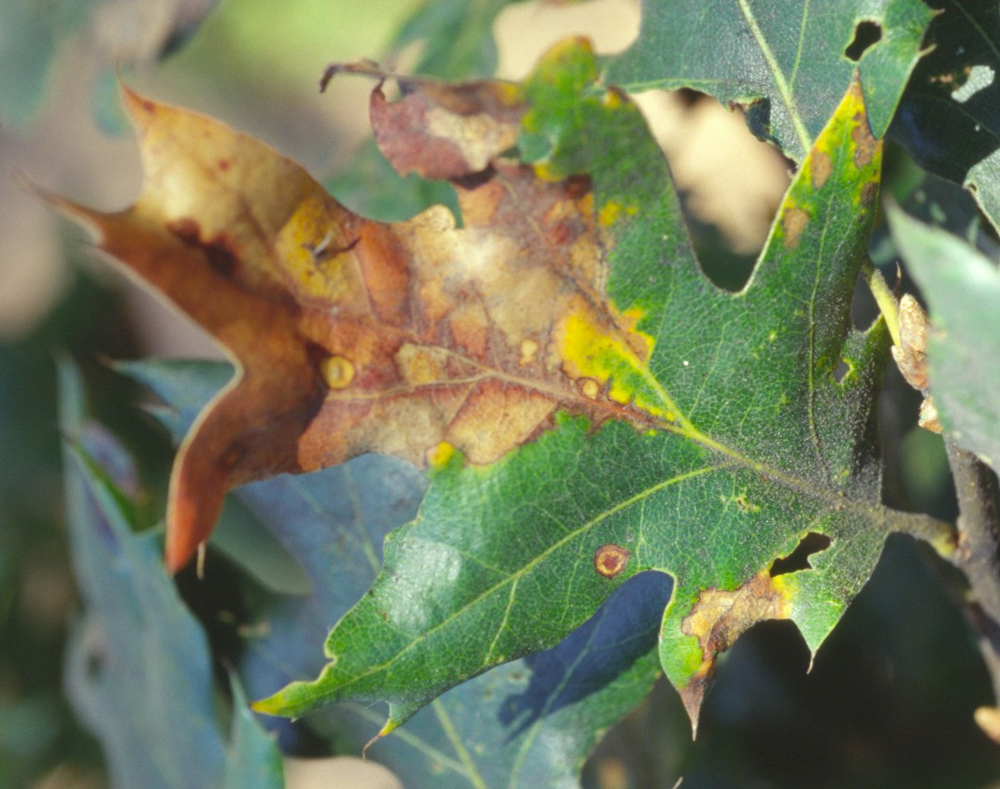
```


(ref:LfDis3B) Anthracnose symptoms on coast live oak. Photo: Tedmund J. Swiecki and Elizabeth A. Bernhardt, Phytosphere Research.

```{r LfDis3B, out.width='75%', fig.asp=.75, fig.align='center', fig.cap = "(ref:LfDis3B)"}
knitr::include_graphics("images/Disease-leaftwig/LEAFSPOT 2 QW_Phytosphere.jpg")
```


(ref:LfDis3C) Branch dieback of coast live oak caused by *Cryptocline cinerescens*. Photo:  Bruce Hagen, CalFire, retired.

```{r LfDis3C, out.width='75%', fig.asp=.75, fig.align='center', fig.cap = "(ref:LfDis3C)"}
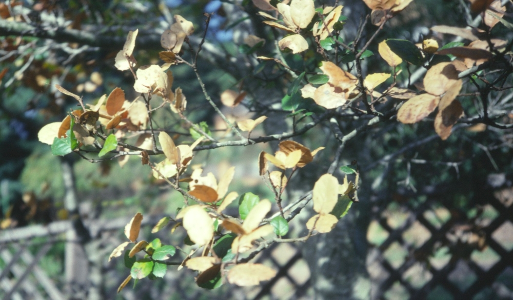
```


#### Agent Description {-}

The sexual stages of these anthracnose and leafspot fungi are in the Ascomycotina, which contains fungi that produce spores in microscopic saclike structures (asci).  For some anthracnose fungi (e.g., *C. cinerescens*) the sexual stage has not been observed.  Most anthracnose fungi produce asexual spores in acervuli (spore-bearing structures without distinct walls that arise beneath the epidermis) or in pycnidia (minute globose or flask-shaped fruiting bodies).  Active lesions usually show only asexual fruiting bodies.

*A. errabunda* is the sexual stage of *D. umbrinella*.  Asci are formed in long-necked black perithecia (nearly globose or flask-shaped fruiting bodies) that are 130—440 μm in diameter.  Ascospores are colorless and have two unequal sized cells.

*D. umbrinella* is the asexual stage of *A. errabunda* and forms acervuli in lesions on leaves, most commonly near major veins, or on dead twigs.  Acervuli on leaves appear as small (about 250 μm diameter) raised brown flecks.  On twigs they are orange-brown, turning dark with age.  Conidia (asexual spores) produced in acervuli are single celled, colorless, and elliptical (9—14 by 3.5—5 μm).  Microconidia half the size of these conidia are also produced. 

*C. cinerescens* acervuli occur within discolored areas of leaves and twigs.  They are round in outline, approximately 100—180 μm in diameter and rupture through the epidermis and cuticle.  Acervuli appear black on twigs (figure \@ref(fig:LfDis3D) and yellowish to light brown on leaves.  Conidia are elliptical to clavate with a truncate base, 10—25 by 3.5—5 μm, single-celled, clear, smooth-walled, and have internal oil droplets.


(ref:LfDis3D) Branch dieback of coast live oak caused by *Cryptocline cinerescens*. Photo:  Bruce Hagen, CalFire, retired

```{r LfDis3D, out.width='75%', fig.asp=.75, fig.align='center', fig.cap = "(ref:LfDis3D)"}
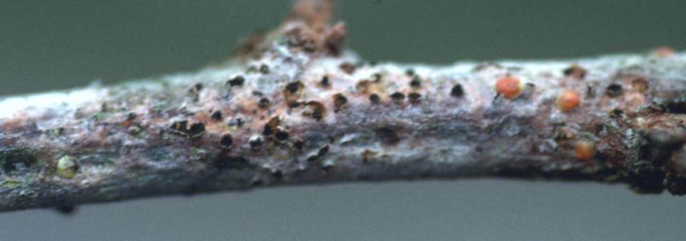
```


*S. quercicola* produces small, black pycnidia that are embedded in host tissue within lesions.  Conidia have several cells, and are colorless and narrowly elongate to filiform (thread-like). 


#### Biology {-}

Symptom severity and appearance can vary with host, time of season, and weather.  Spores of anthracnose and leaf spot fungi are primarily dispersed by splashing and wind-blown rain.  Wet conditions are required for infection to occur.  Immature host tissue is most susceptible, so disease severity is greatest if rains occur during spring growth flushes.  Prolonged periods of rain throughout the spring provide the optimum conditions for disease development.  Because such weather patterns are uncommon in California, severe disease levels rarely develop. 

For *A. errabunda/D. umbrinella*, perithecia of the sexual stage (*A. errabunda*) form in fallen leaves.  In cold winter areas, perithecia mature in spring and release ascospores during spring rains.  The fungus can also overwinter within lesions in infected twigs.  New infections occur when leaves and twigs remain wet for several hours.  Temperatures suitable for infection range from 15—27 C.  Wet conditions at 15—20 C are most favorable for infection and disease development.  Spores produced in acervuli initiate new infections and multiple disease cycles continue as long as moisture conditions are favorable.  Some acervuli produced on newly-infected tissue in spring do not produce mature spores until the following fall.

*C. cinerescens* and *S. quercicola* have similar disease cycles but do not produce the sexual perithecial stage.  In *S. quercicola*, asexual spores are produced in pycnidia rather than acervuli.  


#### Importance {-}

Anthracnose and leafspot diseases are generally of minor importance to California native oaks, but can cause substantial amounts of defoliation and dieback in years with frequent and abundant rainfall that continues through late spring.  Unless several wet years occur in succession, long-term impacts of a severe disease year are minimal.

#### Citation {-}

Swiecki, T.J.; Bernhardt, E.A. 2025. Oak anthracnose, leaf spot, and twig blight. In Swiecki, T.J., et al. (Eds.) Field Guide to Insects and Diseases of California Oaks, Online edition `r Sys.Date()`.


## *Tubakia californica* {-}

#### Distribution / Hosts {-}
*Tubakia californica* is widespread and likely native to California.  As of 2025,  it had not been reported outside the state. Reported hosts are all in the plant family Fagaceae, and include California black oak, coast live oak, interior live oak, and valley oak, as well as tanoak and golden chinquapin. 


```{r, fig.align='center', fig.asp=.75, fig.cap="Approximate ranges of *Tubakia californica* (orange shading) and native oak species (green) in California. (orange shading).", out.width='30%'}
knitr::include_graphics("images/distributions/Tubcal.png")
```


#### Symptoms {-}
Leaf spots, which begin either at the edge of the leaf or at the base of the petiole, appear in late summer to early fall depending on the climate zone and elevation. Spots coalesce to form larger necrotic areas along the leaf margins or veins, eventually killing the leaf.  Affected leaf veins become dark brown or black (figure \@ref(fig:LfDis5A), \@ref(fig:LfDis5A-1)). Infections may spread into the subtending twig, causing tip dieback (figure \@ref(fig:LfDis5C)).

(ref:LfDis5A) Symptoms of *Tubakia californica* on California black oak leaves. Photo: Suzanne Rooney-Latham and Cheryl Blomquist, CDFA.

```{r LfDis5A, out.width='75%', fig.asp=.75, fig.align='center', fig.cap = "(ref:LfDis5A)"}
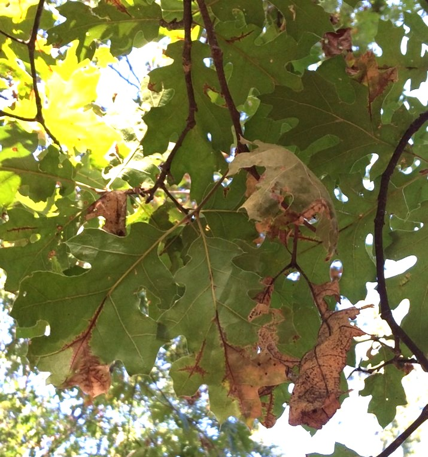
```

(ref:LfDis5A-1) Symptoms of *Tubakia californica* on interior live oak leaf.  Photo: Suzanne Rooney-Latham and Cheryl Blomquist, CDFA.

```{r LfDis5A-1, out.width='75%', fig.asp=.75, fig.align='center', fig.cap = "(ref:LfDis5A-1)"}
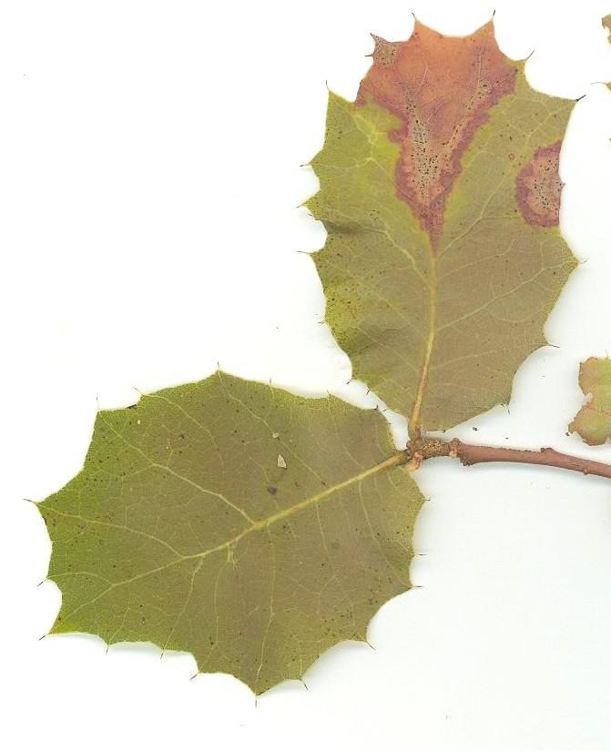
```


(ref:LfDis5C) Shoot tip dieback caused by *Tubakia californica* on California black oak. Photo: Phytosphere Research.

```{r LfDis5C, out.width='75%', fig.asp=.75, fig.align='center', fig.cap = "(ref:LfDis5C)"}
knitr::include_graphics("images/Disease-leaftwig/TubCal-QK-Phytosphere-Research-2.jpg")
```
On the deciduous California black oak, dead leaves remain attached and hanging from branches throughout the winter and through the next  year (figure \@ref(fig:LfDis5B)). On the evergreen tanoak, infected leaves drop. Defoliation is most severe in early spring before new leaves emerge. Severely affected trees can sometimes lose enough leaves in the lower three-quarters of the crowns that the lower crown appears noticeably sparse.

(ref:LfDis5B) Persistent previous year dead leaves (marcescence) infected by *Tubakia californica* on California black oak in August. Photo: Phytosphere Research.

```{r LfDis5B, out.width='75%', fig.asp=.75, fig.align='center', fig.cap = "(ref:LfDis5B)"}
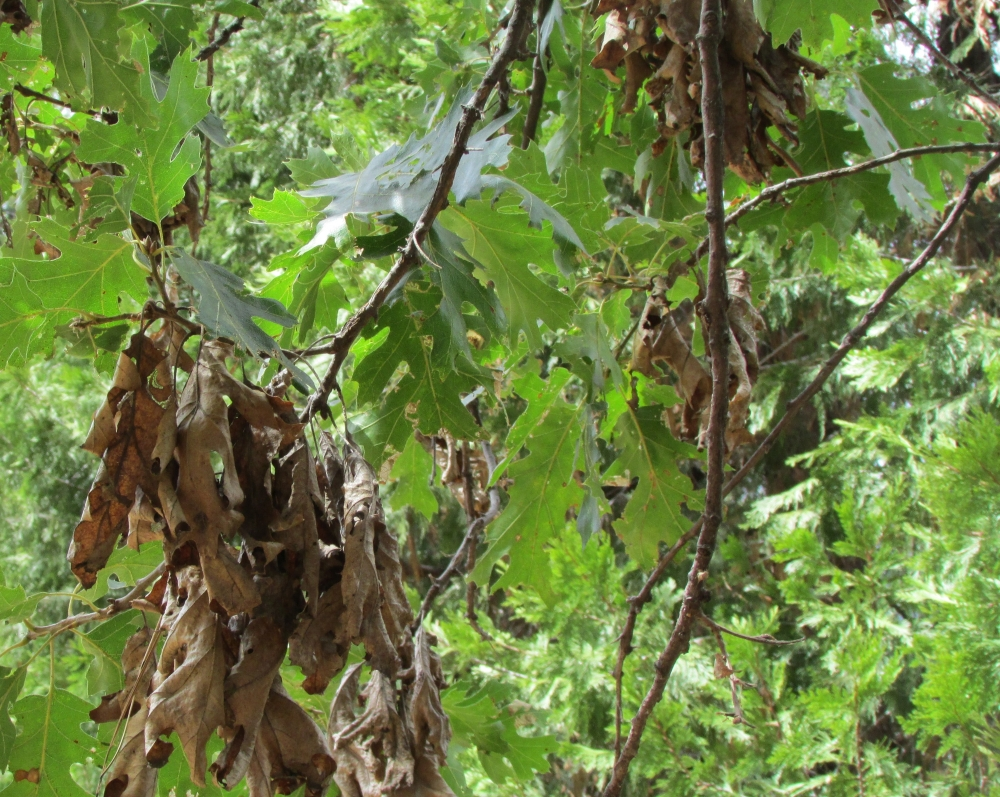
```


On coast live oak, symptoms appear low in the tree crown and are more severe in topographically low or humid areas (figure \@ref(fig:LfDis5D)). Symptoms can also be severe along road corridors, especially those that follow canyon bottoms.

(ref:LfDis5D) Lower crown leaf necrosis (death) and defoliation caused by *Tubakia californica* in coast live oak. Photo: Chris Lee, CalFire.

```{r LfDis5D, out.width='75%', fig.asp=.75, fig.align='center', fig.cap = "(ref:LfDis5D)"}
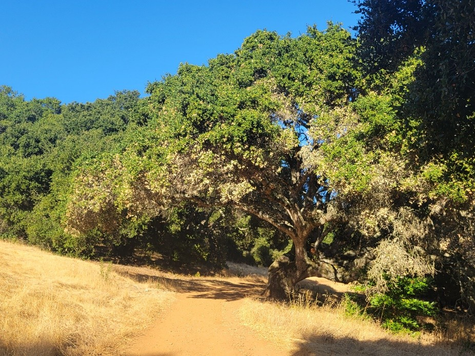
```
#### Agent Description {-}

Conidiomata (asexual fruiting structures)  on affected leaves and petioles are  tiny, black, and crustose, usually (50–)80–200(–220) μm diam (about the width of a human hair) and resemble pycnidia (flask-shaped fruiting bodies with a narrow opening). The conidiomata of *T. californica*  release conidia through irregular fissures. Conidia are 8-15 x 4.5-7 µm, ellipsoid to ellipsoid-oval, and initially subhyaline (not quite clear) becoming greenish as they age [@braun2018tubakia].

Most *Tubakia* species are characterized by the production of rounded, shield-shaped asexual fungal fruiting structures (pycnothyria) where asexual spores (conidia) are formed.  When *T. californica* was originally described, pycnothyria had not been observed and so were not included in the original description [@braun2018tubakia]. Small pycnothyria have since been found on petioles in a single location in Sonoma Co. 

Other fungi in the genus *Tubakia* that are well-known foliar and twig pathogens of oaks include *T. dryina* and *T. iowensis*.  Although *T. californica* appears to be common and widespread in California, it was not described until 2018 [@braun2018tubakia]. This may be because it was thought to be *T. dryina* or other fungal pathogens such as *Apiognomonia errabunda*, which can occur together with *T. californica* on the same leaf tissue. Conidia of *A. errabunda* are similar in length as *T. californica* but usually more narrow (3-5µm) and remain hyaline.


#### Biology {-}

*T. californica* most likely lives endophytically (inside host tissues without causing disease) in twig and leaf tissues. What causes it to become pathogenic is unknown. Disease incidence and severity appear to be associated with conditions that increase the frequency and duration of leaf wetness and promote the persistence and spread of spores. In California black oak, infections often result in trees not fully defoliating in late fall. These infected leaves with asexual fruiting structures overwinter and likely provide the primary inoculum (spores that initiate new infections) when new leaves emerge the following spring in years with plentiful spring rainfall.

#### Importance {-}

Dieback, dead leaf retention, and defoliation affect tree appearance, but typical levels of dieback and leaf loss caused by *T. californica* infections are generally tolerated by healthy trees. Repeated episodes of severe dieback or defoliation could make trees more susceptible to other opportunistic agents.  Repeated or severe *T. californica* infections might also contribute to decline in trees that are already under severe stress or affected by other pathogens or insects. 

#### Citation {-}

Lee, C., Rooney-Latham, S., Blomquist, C.L. 2025. *Tubakia californica*. In Swiecki, T.J., et al. (Eds.) Field Guide to Insects and Diseases of California Oaks, Online edition `r Sys.Date()`.

## Early defoliation due to drought stress {-}

### Abiotic {#drought .unnumbered}

#### Distribution / Hosts {-}

Early defoliation related to prolonged drought stress is most commonly seen in blue oak and can occur throughout its range, primarily in hotter, drier inland lower elevation sites. It is most common on drought-prone sites, such as areas with shallow or rocky soils, and more likely to occur in areas experiencing low rainfall and high summer temperatures. Other oak species can also be affected by severe drought stress, but early leaf browning and leaf drop is only commonly reported in blue oak.

```{r, fig.align='center', fig.asp=.75, fig.cap="Approximate ranges of early browning in blue oak (orange shading) and native oak species (green) in California.", out.width='30%'}
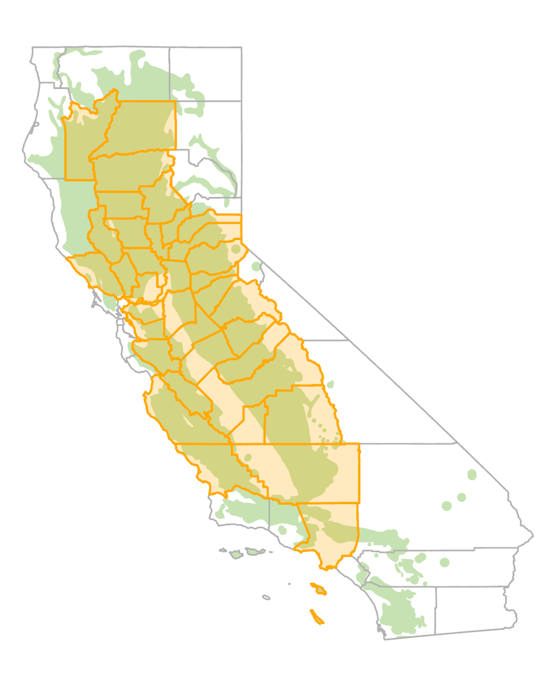
```


#### Symptoms {-}

In low rainfall years, leaves of mature trees turn brown prematurely and begin to drop well in advance of the normal November-December leaf drop period (figure \@ref(fig:LfDis1)). This drought–deciduous characteristic is seen in a more extreme form in California buckeye and is also common in chaparral and desert plants. Drought-induced defoliation can be differentiated from branch dieback by the fact that buds and twigs of drought-defoliated branches remain alive and normally leaf out the following spring. In 1987, following extreme drought conditions in the preceding rainy season, foliar browning and leaf drop in blue oak occurred by mid-August in affected areas. During droughts lasting multiple years, symptoms may be widespread. In less extreme drought years, only blue oaks growing in drought-prone areas may be affected, and defoliation may occur later in the season, but still earlier than the usual late fall leaf drop.

(ref:LfDis1) Early leaf browning and defoliation associated with drought stress in a stand of blue oaks. Photo: Phytosphere Research.

```{r LfDis1, out.width='75%', fig.asp=.75, fig.align='center', fig.cap = "(ref:LfDis1)"}
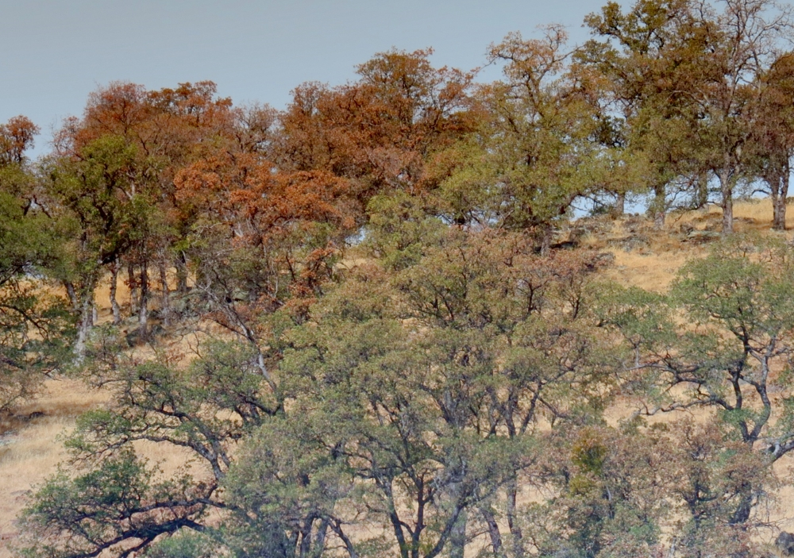
```

Blue oak seedling advance regeneration also undergoes early defoliation in response to drought stress. Blue oak advance regeneration typically consists of persistent understory seedlings less than about 10–15 cm tall that range in age from a few years to decades. Drought-stressed seedlings may begin losing leaves by June or July (figure \@ref(fig:LfDis2)). Drought stress in seedlings is strongly influenced by competition with both overstory trees and non-native understory grasses and forbs. Young seedling shoots may also die back partly or completely to ground level by midsummer in response to severe drought stress.


(ref:LfDis2) Early leaf browning and defoliation associated with drought stress in a stand of blue oaks. Photo: Phytosphere Research.

```{r LfDis2, out.width='75%', fig.asp=.75, fig.align='center', fig.cap = "(ref:LfDis2)"}
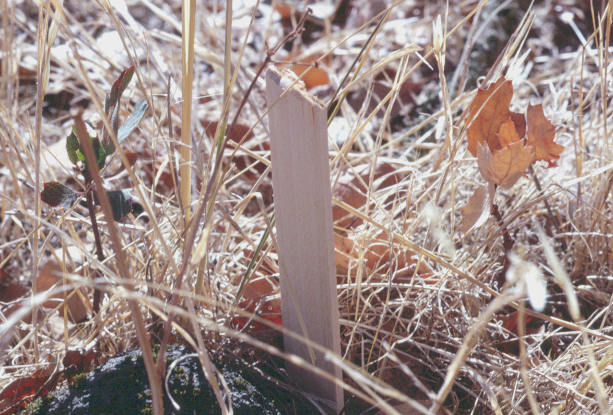
```


#### Biology {-}

Blue oak may be the most drought-tolerant of California’s tree-sized oaks. Early defoliation in response to extreme drought reduces water loss to a minimum and presumably favors tree survival under these conditions. One year of early defoliation had no discernable effect on tree health in one study [@mccreary1990blue]. Trees that defoliated early were among the earliest to leaf out the following spring. However, some trees that defoliated early in response to the extreme 1976–1977 drought (the most severe drought in California during the 20th century) were subsequently leafless for an entire growing season before leafing out in the following year. 

The combination of longer hotter summers and drought conditions, can increase water stress in blue oak and other oaks to lethal levels. Excessive levels of blue oak mortality were documented in the southern Sierra Nevada in response to the megadrought that affected much of California from 2013 through 2016 [@Das2020]. Drought-related oak decline and mortality are most likely to occur with low available water storage in surface soils and deeper subsoil or fractured rock layers, on hotter south and west-facingslopes, and where high stand densities create greater competition for moisture. Drought stress can also favor the activity and damage caused by various oak pests and pathogens, and these interactions may accelerate tree decline and mortality. 

Early seasonal defoliation is one of the factors that suppress understory advance regeneration. Well-established seedling advance regeneration can resprout from the base to produce new shoots if the previous season’s shoot has been completely killed by drought. However, successive years of early defoliation and shoot death are associated with reduced seedling survival.

#### Importance {-}

Climate change has increased temperatures for longer periods during the growing season, causing severe drought stress to occur progressively earlier in the season. When combined with multi-year droughts and poor site conditions, substantial negative effects on the health and survival of blue oak and other native oaks can occur. The magnitude of these effects can be lessened in more favorable sites, such as where deep soil or subsoil moisture reserves can be tapped by oak roots. Consequently, effects associated with drought-stress can vary both regionally and locally. 

Historically, mature blue oaks have periodically endured periods of severe water stress, which have induced early defoliation. If the frequency and duration of these events increase, blue oak may not be sustainable in some portions of its historic range. Other impacts, such as root damage due to construction-related activity, exacerbate drought-related effects and can accelerate tree decline. Drought-induced defoliation and shoot dieback reduce the survival of blue oak seedlings and are commonly a contributing factor to poor regeneration in blue oak stands.

#### Citation {-}

Swiecki, T.J.; Bernhardt, E.A. 2026. Early defoliation due to drought stress. In Swiecki, T.J., et al. (Eds.) Field Guide to Insects and Diseases of California Oaks, Online edition `r Sys.Date()`.


