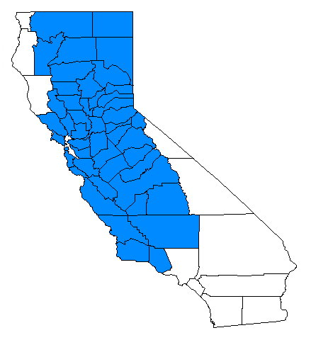

# Leaf and twig diseases {#Lftwigdis}

## Frosty mildew {-}

### *Microstroma album*  {-}

#### Distribution / Hosts {-}


#### Symptoms {-}


#### Agent Description {-}


#### Biology {-}


#### Importance {-}


#### Citation {-}

---------------- 2025. Frosty mildew.  In Swiecki, T.J., et al. (Eds.) Field Guide to Insects and Diseases of California Oaks, Online edition 2025.

## Powdery mildews {-}

### *Brasiliomyces trina*, *Cystotheca lanestris*, *Microsphaera* species, *Phyllactinia angulata*  {-}

#### Distribution / Hosts {-}


#### Symptoms {-}


#### Agent Description {-}


#### Biology {-}


#### Importance {-}


#### Citation {-}

Swiecki, T.J.; Bernhardt, E.A. 2025. Powdery mildews. In Swiecki, T.J., et al. (Eds.) Field Guide to Insects and Diseases of California Oaks, Online edition 2025.

## Oak leaf blister {-}

### *Taphrina caerulescens*  {-}

#### Distribution / Hosts {-}


#### Symptoms {-}


#### Agent Description {-}


#### Biology {-}


#### Importance {-}


#### Citation {-}

Swiecki, T.J.; Bernhardt, E.A. 2025. Oak leaf blister. In Swiecki, T.J., et al. (Eds.) Field Guide to Insects and Diseases of California Oaks, Online edition 2025.


## Oak anthracnose, leaf spot, and twig blight {-}

### *Apiognomonia errabunda*, *Cryptocline cinerescens*, *Cylindrosporium kelloggii*, *Septoria quercicola*, and other fungi {-}

#### Distribution / Hosts {-}


#### Symptoms {-}


#### Agent Description {-}


#### Biology {-}


#### Importance {-}


#### Citation {-}

Swiecki, T.J.; Bernhardt, E.A. 2025. Oak anthracnose, leaf spot, and twig blight. In Swiecki, T.J., et al. (Eds.) Field Guide to Insects and Diseases of California Oaks, Online edition 2025.


## *Tubakia californica* {-}

#### Distribution / Hosts {-}


#### Symptoms {-}


#### Agent Description {-}


#### Biology {-}


#### Importance {-}


#### Citation {-}

------------. 2025. *Tubakia californica*. In Swiecki, T.J., et al. (Eds.) Field Guide to Insects and Diseases of California Oaks, Online edition 2025.

## Early defoliation due to drought stress {-}

### Abiotic {#drought .unnumbered}

#### Distribution / Hosts {-}

Early defoliation related to prolonged drought stress is most commonly seen in blue oak and can occur throughout its range. It is most common on drought-prone sites, such as areas with shallow or rocky soils, and more likely to occur in areas experiencing low rainfall and high summer temperatures. Other oak species can also be affected by severe drought stress, but early leaf browning and leaf drop is only commonly reported in blue oak.

```{r, fig.align='center', fig.asp=.75, fig.cap="Range of early defoliation of blue oak", out.width='30%'}

```


#### Symptoms {-}

In low rainfall years, leaves of mature trees turn brown prematurely and begin to drop well in advance of the normal November-December leaf drop period (figure \@ref(fig:LfDis1)). This drought–deciduous characteristic is seen in a more extreme form in California buckeye and is also common in chaparral and desert plants. Drought-induced defoliation can be differentiated from branch dieback by the fact that buds and twigs of drought-defoliated branches remain alive and normally leaf out the following spring. In 1987, following extreme drought conditions in the preceding rainy season, foliar browning and leaf drop in blue oak occurred by mid-August in affected areas. During droughts lasting multiple years, symptoms may be widespread. In less extreme drought years, only blue oaks growing in drought-prone areas may be affected, and defoliation may occur later in the season, but still earlier than the usual late fall leaf drop.

(ref:LfDis1) Early leaf browning and defoliation associated with drought stress in a stand of blue oaks.

```{r LfDis1, out.width='75%', fig.asp=.75, fig.align='center', fig.cap = "(ref:LfDis1)"}
knitr::include_graphics("images/Disease-leaftwig/Defol-QDtree2-Phytosphere.jpg")
```

Blue oak seedling advance regeneration also undergoes early defoliation in response to drought stress. Blue oak advance regeneration typically consists of persistent understory seedlings less than about 10–15 cm tall that range in age from a few years to decades. Drought-stressed seedlings may begin losing leaves by June or July (figure \@ref(fig:LfDis2)). Drought stress in seedlings is strongly influenced by competition with both overstory trees and non-native understory grasses and forbs. Young seedling shoots may also die back partly or completely to ground level by midsummer in response to severe drought stress.


(ref:LfDis2) Early leaf browning and defoliation associated with drought stress in a stand of blue oaks.

```{r LfDis2, out.width='75%', fig.asp=.75, fig.align='center', fig.cap = "(ref:LfDis2)"}
knitr::include_graphics("images/Disease-leaftwig/Defol-QDseedling-Phytosphere.jpg")
```


#### Biology {-}

Blue oak may be the most drought-tolerant of California’s tree-sized oaks. Early defoliation in response to extreme drought reduces water loss to a minimum and presumably favors tree survival under these conditions. One year of early defoliation had no discernable effect on tree health in one study [@mccreary1990blue]. Trees that defoliated early were among the earliest to leaf out the following spring. However, some trees that defoliated early in response to the extreme 1976–1977 drought (the most severe drought in California during the 20th century) were subsequently leafless for an entire growing season before leafing out in the following year. 

The combination of longer hotter summers and drought conditions, can increase water stress in blue oak and other oaks to lethal levels. Excessive levels of blue oak mortality were documented in the southern Sierra Nevada in response to the megadrought that affected much of California from 2013 through 2016 [@Das2020]. Drought-related oak decline and mortality are most likely to occur with low available water storage in surface soils and deeper subsoil or fractured rock layers, on hotter south and west-facingslopes, and where high stand densities create greater competition for moisture. Drought stress can also favor the activity and damage caused by various oak pests and pathogens, and these interactions may accelerate tree decline and mortality. 

Early seasonal defoliation is one of the factors that suppress understory advance regeneration. Well-established seedling advance regeneration can resprout from the base to produce new shoots if the previous season’s shoot has been completely killed by drought. However, successive years of early defoliation and shoot death are associated with reduced seedling survival.

#### Importance {-}

Climate change has increased temperatures for longer periods during the growing season, causing severe drought stress to occur progressively earlier in the season. When combined with multi-year droughts and poor site conditions, substantial negative effects on the health and survival of blue oak and other native oaks can occur. The magnitude of these effects can be lessened in more favorable sites, such as where deep soil or subsoil moisture reserves can be tapped by oak roots. Consequently, effects associated with drought-stress can vary both regionally and locally. 

Historically, mature blue oaks have periodically endured periods of severe water stress, which have induced early defoliation. If the frequency and duration of these events increase, blue oak may not be sustainable in some portions of its historic range. Other impacts, such as root damage due to construction-related activity, exacerbate drought-related effects and can accelerate tree decline. Drought-induced defoliation and shoot dieback reduce the survival of blue oak seedlings and are commonly a contributing factor to poor regeneration in blue oak stands.

#### Citation {-}

Swiecki, T.J.; Bernhardt, E.A. 2025. Early defoliation due to drought stress. In Swiecki, T.J., et al. (Eds.) Field Guide to Insects and Diseases of California Oaks, Online edition 2025.


