# Branch and trunk diseases {#branchtrunkdis}

## Insect-pathogen complexes {-}

### Foamy bark canker {-} 

#### *Geosmithia* sp. - writeup needed {-}


#### Distribution / Hosts {-}


#### Symptoms {-}


#### Agent Description {-}


#### Biology {-}


#### Importance {-}


#### Citation {-}

------------------- 2025. Foamy bark canker. In Swiecki, T.J., et al. (Eds.) Field Guide to Insects and Diseases of California Oaks, Online edition 2025.

### Fusarium dieback {-}

#### *Fusarium* - writeup needed {-}


#### Distribution / Hosts {-}


#### Symptoms {-}


#### Agent Description {-}


#### Biology {-}


#### Importance {-}


#### Citation {-}

------------ 2025. Fusarium dieback. In Swiecki, T.J., et al. (Eds.) Field Guide to Insects and Diseases of California Oaks, Online edition 2025.

## Diseases affecting bark and sapwood {-}

### Bacterial canker of oak / "Acute oak decline" - writeup needed {-}

#### *Brennaria*, *Lonsdalea* , ... species  {-}


#### Distribution / Hosts {-}


#### Symptoms {-}


#### Agent Description {-}


#### Biology {-}


#### Importance {-}


#### Citation {-}

--------------. 2025. Bacterial canker of oak / "Acute oak decline". In Swiecki, T.J., et al. (Eds.) Field Guide to Insects and Diseases of California Oaks, Online edition 2025.

### Botryosphaeria (Diplodia) cankers {-}

#### *Diplodia agrifolia*, *D. corticola*, *D. quercina*, *Dothiorella iberica*, and others {-}


#### Distribution / Hosts {-}

Note- this writeup needs to be updated

*Diplodia quercina* has been reported only from oaks in California and Europe.  In California, it has been reported to occur on coast live, valley, and California black oak.


```{r, fig.align='center', fig.asp=.75, fig.cap="California counties with known occurences of *Diplodia quercina* branch canker (orange shading) and approximate range of native oak species (green).", out.width='30%'}
knitr::include_graphics("images/distributions/diplodia map.gif")
```


#### Symptoms {-}

Infections are normally found on branches up to 10 cm in diameter.  The fungus can girdle infected branches causing leaves beyond the point of infection to wilt and die.  Affected trees show discrete dead branches in the crown  (figure \@ref(fig:BrDis3H)),  (figure \@ref(fig:BrDis4H)) as opposed to the widely scattered twig dieback caused by anthracnose/twig blight fungi.  Infections cause extensive dark brown discoloration of the wood.  The border between discolored and healthy tissue is generally well-defined  (figure \@ref(fig:BrDis5A)).  Fruiting bodies emerge from the bark, causing a roughened appearance. 


(ref:BrDis3H) Dead branches on California black oak due to Diplodia canker. Photo:  Larry Costello, UCCE, retired.
 

```{r BrDis3H, out.width='75%', fig.asp=.75, fig.align='center', fig.cap = "(ref:BrDis3H)"}
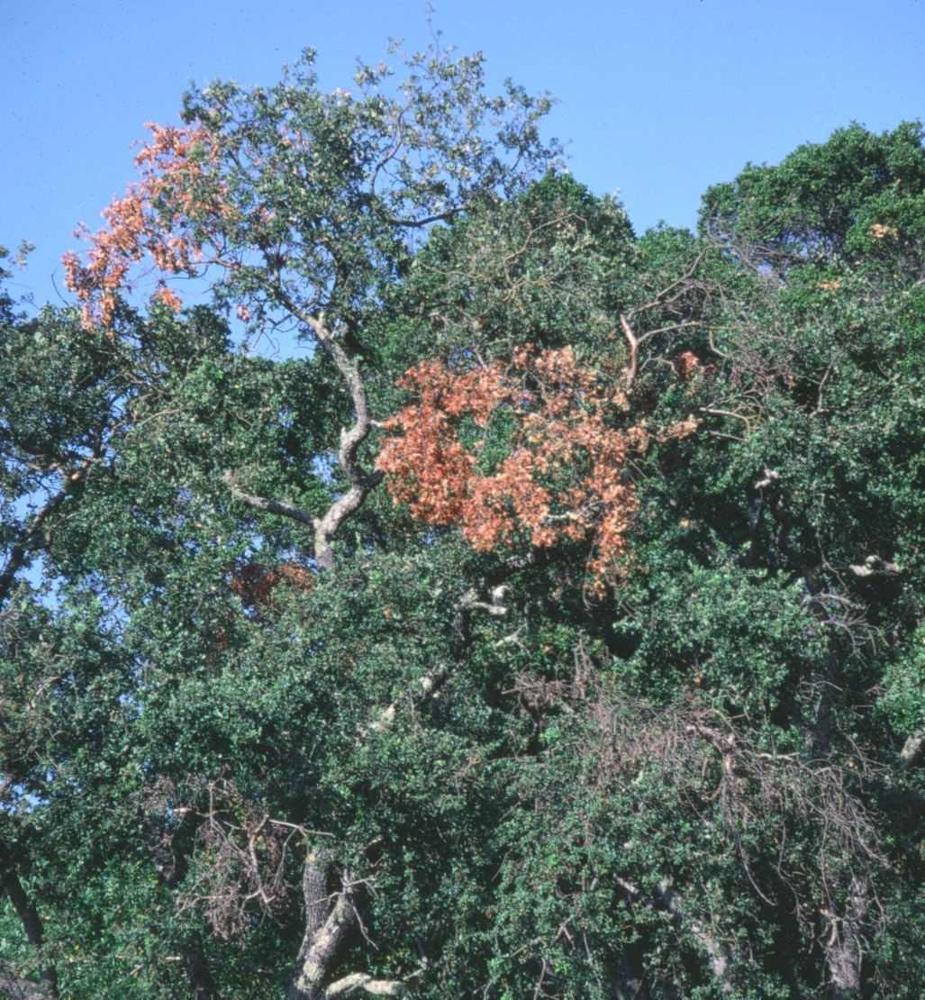
```


(ref:BrDis4H) Dead branches on  coast live oak due to Diplodia canker. Photo:  Larry Costello, UCCE, retired. 


```{r BrDis4H, out.width='75%', fig.asp=.75, fig.align='center', fig.cap = "(ref:BrDishH)"}
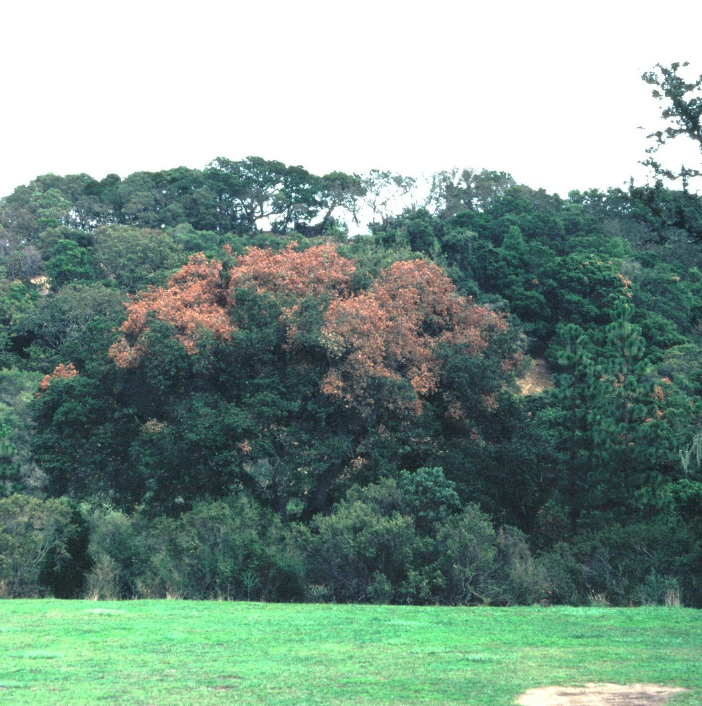
```


(ref:BrDis5A) Diplodia canker on an artificially inoculated, greenhouse-grown coast live oak seedling Photo: Steve Koike, UCCE, retired.
 

```{r BrDis5A, out.width='75%', fig.asp=.75, fig.align='center', fig.cap = "(ref:BrDis5A)"}
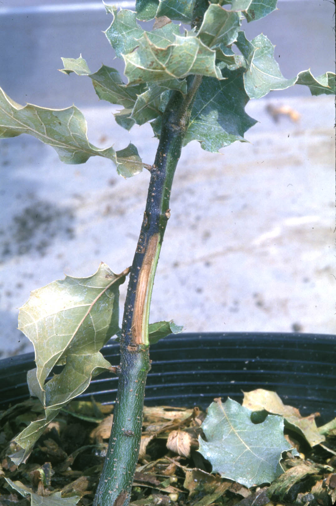
```

#### Agent Description {-}

*Diplodia quercina* produces tiny flask-shaped asexual fruiting bodies (pycnidia).  On branches with bark, pycnidia are in black masses of fungal tissue (stromata).  Pycnidia also occur singly on the surface of wood that has lost its bark.  Asexual spores (conidia) are about 30 by 15 μm or larger.  Conidia are initially one-celled and colorless but become dark with one or more cross walls (septae).  The sexual stage of *D. quercina* is reported to be *Botryosphaeria stevensii*, but this stage has not been reported on oaks in California.

#### Biology {-}

The fungus may enter branches through wounds and possibly natural openings such as leaf scars.  The fungus can only be recovered from within a few centimeters of the infection point even though discoloration may extend 0.6 — 1 m further (Hecht-Poinar and others 1987, Costello and others 1989).  In artificial inoculations, asexual fruiting bodies are produced within 24 weeks and continue to produce spores for about two years.  Spore production and germination are favored by moisture.
Drought stress may predispose trees to infection.  The disease became widespread following the extreme drought of 1976—1977.  


#### Importance {-}

Historically, this disease has been commonly reported only after severe drought conditions and is not a widespread problem in most years.  Drought-stressed trees with wounded branches are most likely to be affected.

#### Citation {-}

Swiecki, T.J.; Bernhardt, E.A. 2006. Botryosphaeria (Diplodia) cankers. In Swiecki, T.J., et al. (Eds.) Field Guide to Insects and Diseases of California Oaks, Online edition 2025.


### Sudden oak death and Phytophthora stem cankers {-}

#### *Phytophthora ramorum*, *P. nemorosa*, *P. pseudosyringae* {-}


#### Distribution / Hosts {-}

*Phytophthora ramorum* is currently known in California forests from the counties bordering the San Francisco Bay and the Coast Ranges from Humboldt to Monterey Counties, and Curry County in southern Oregon.  Future expansion of the known range in California is likely due to both spread of the pathogen and intensive efforts to detect infestations.  Main stem cankers occur in tanoak, coast live and California black oak, and less commonly on Shreve and canyon live oak.  *P. ramorum* also causes lesions on leaves, twigs, and/or small stems in a variety of native species, including tanoak, California bay, madrone, California huckleberry, manzanita, toyon, poison oak, Douglas-fir, and coast redwood.  In California, the disease is found in mixed hardwood forests containing oaks, usually in association with California bay, and in forests containing tanoak.  *P. ramorum* also causes foliar and stem diseases in a wide variety of ornamentals and has been found in nurseries in North America and Europe.  In Europe, disease caused by *P. ramorum* has also been found in some landscape plantings and in trees near these plantings.  


```{r, fig.align='center', fig.asp=.75, fig.cap="California counties with known occurences of *Phytophthora ramorum* branch canker (orange shading) and approximate range of native oak species (green).", out.width='30%'}
knitr::include_graphics("images/distributions/phyram.png")
```


*P. nemorosa* is currently known only from California coastal forests from Monterey County north to Central Oregon and from one location in Mariposa County in the Sierra Nevada.  It is common in redwood-tanoak forests, causing cankers on tanoak and foliar symptoms on redwood.  *P. nemorosa* is uncommon in coast live oak woodlands, where it primarily causes foliar symptoms on California bay.  It also causes foliar symptoms on manzanita and rarely causes stem cankers on coast live oak.  


```{r, fig.align='center', fig.asp=.75, fig.cap="California counties with known occurences of *Phytophthora nemorosa* branch canker (orange shading) and approximate range of native oak species (green).", out.width='30%'}
knitr::include_graphics("images/distributions/Phynemorosa.gif")
```


*P. pseudosyringae* is currently known to occur in California from San Luis Obispo County to Humboldt County and has been found at the same location in Mariposa County as noted for *P. nemorosa* above.  This species appears to occur in somewhat drier, more inland sites, almost exclusively in coast live oak woodlands, where it causes cankers on coast live oak and leaf lesions on California bay.  *P. pseudosyringae* also occurs in Europe where it is known to cause root and collar rot of oak, alder, and beech.


```{r, fig.align='center', fig.asp=.75, fig.cap="California counties with known occurences of *Phytophthora pseudosyringae* (orange shading) and approximate range of native oak species (green).", out.width='30%'}
knitr::include_graphics("images/distributions/Phypseudosyr.gif")
```

#### Symptoms {-}

*P. ramorum* causes small to extensive bark cankers.  In tanoak, *P. ramorum* also infects leaves and twigs, causing twig dieback on both mature trees and understory seedlings and saplings.  In oaks, cankers are normally confined to the lower trunk and sometimes low scaffold branches, but oak twigs, canopy branches, and main stems less than about 10 cm diameter are not affected.  Cankers do not extend more than a few cm below the soil line, but can occur on exposed buttress roots.  

Cankers generally ooze dark reddish brown to black sap (figure \@ref(fig:TrDis8A), \@ref(fig:TrDis9A)), but some cankers, especially on small diameter tanoak stems, do not ooze.  Shaving away outer bark in affected areas reveals a brownish discolored lesion in the bark, with a sharp margin generally delimited by a dark line (figure \@ref(fig:TrDis10A), \@ref(fig:TrDis11A))  Bark (phloem) tissues are killed and dark discoloration may extend a few mm to several cm into the wood.  Cankered areas are commonly attacked by secondary agents, including *Annulohypoxylon thouarsianum* (formerly *Hypoxylon thouarsianum*), *Fuscoporia  gilva*(formerly *Phellinus gilvus*), ambrosia beetles, and bark beetles.  

(ref:TrDis8A) Extensive older *Phytophthora ramorum* canker on coast live oak showing both recent bleeding and older area of killed bark that has begun to crack. Photo: Tedmund J. Swiecki and Elizabeth A. Bernhardt, Phytosphere Research.
 

```{r TrDis8A, out.width='75%', fig.asp=.75, fig.align='center', fig.cap = "(ref:TrDis8A)"}
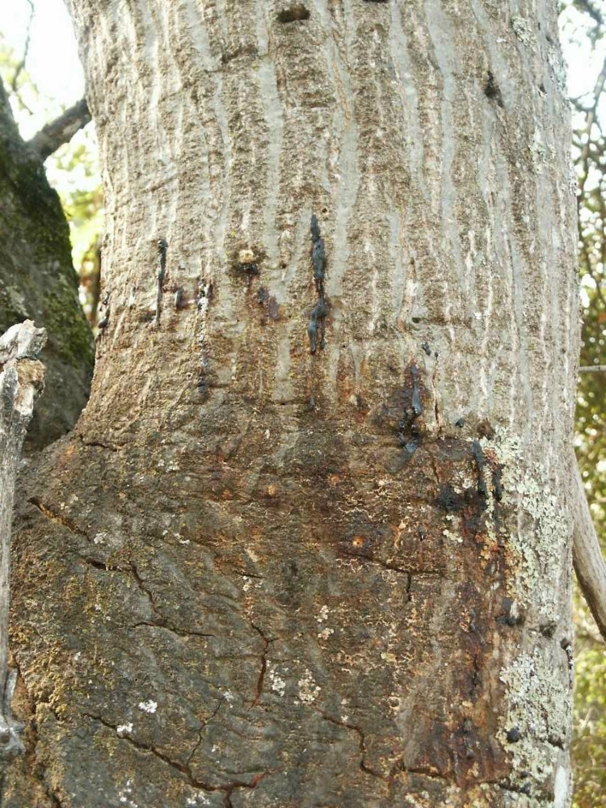
```


(ref:TrDis9A) Bleeding *Phytophthora ramorum* canker on coast live oak; this canker is less than one year old. Photo: Tedmund J. Swiecki and Elizabeth A. Bernhardt, Phytosphere Research.
 

```{r TrDis9A, out.width='75%', fig.asp=.75, fig.align='center', fig.cap = "(ref:TrDis9A)"}
knitr::include_graphics("images/Disease-trunk/PhyRam_3-100-8 canker 10-21-04a_Phytosphere.jpg")
```


(ref:TrDis10A) Same *Phytophthora ramorum* canker shown in Figure 122 with outer bark sliced away to show the dark canker margin.  Photo: Tedmund J. Swiecki and Elizabeth A. Bernhardt, Phytosphere Research.
 

```{r TrDis10A, out.width='75%', fig.asp=.75, fig.align='center', fig.cap = "(ref:TrDis10A)"}
knitr::include_graphics("images/Disease-trunk/PhyRam_3-100-8 canker 10-21-04b_Phytosphere.jpg")
```


(ref:TrDis11A) *Phytophthora ramorum* canker on coast live oak; outer bark has been sliced away showing the irregular margin of the canker. Photo: Tedmund J. Swiecki and Elizabeth A. Bernhardt, Phytosphere Research.
 

```{r TrDis11A, out.width='75%', fig.asp=.75, fig.align='center', fig.cap = "(ref:TrDis11A)"}
knitr::include_graphics("images/Disease-trunk/PhyRam_tree betw plot 701 702 b__Phytosphere.jpg")
```

Trees with extensive girdling cankers may die one to two years after cankers develop without showing substantial decline of the canopy beforehand.  Especially in warm weather, the drying foliage may turn brown over a period of a few weeks; the name “sudden oak death” was based on this pattern of symptom development.  In trees with less extensive or slower-spreading cankers, a gradual thinning and progressive dieback of the canopy may develop over several years.  Trees that have not been completely girdled by cankers may survive for a number of years after infection, but many eventually die once the stem is completely girdled or when the trunk fails due to wood decay below cankered areas.  Small cankers in some trees apparently become inactive and may not be colonized by secondary agents.  Inactive cankers cease bleeding, may become sunken, and are often bounded by host callus tissue (figure \@ref(fig:TrDis12A)).


(ref:TrDis12A) Coast live oak tree with extensive  *Phytophthora ramorum* cankers at least 4 years old; sunken canker at the base of the tree shows callus development along right side (arrows). Photo: Tedmund J. Swiecki and Elizabeth A. Bernhardt, Phytosphere Research.
 

```{r TrDis12A, out.width='75%', fig.asp=.75, fig.align='center', fig.cap = "(ref:TrDis12A)"}
knitr::include_graphics("images/Disease-trunk/PhyRam_10-231 canker 9-15-04b_Phytosphere.jpg")
```


*P. nemorosa* causes bark cankers similar to those described above on tanoak primarily, but appears to be less virulent than *P. ramorum*.

*P. pseudosyringae* causes bark canker symptoms similar to those caused by *P. ramorum* on coast live oak (figure \@ref(fig:TrDis13A).  Cankers can be quite extensive, occasionally girdling and killing trees (figure \@ref(fig:TrDis14A)).  Overall, this species appears to be somewhat less aggressive than *P. ramorum*.


(ref:TrDis13A) *Phytophthora pseudosyringae* canker on coast live oak, note beetle boring and bleeding. Photo: Tedmund J. Swiecki and Elizabeth A. Bernhardt, Phytosphere Research.

```{r TrDis13A, out.width='75%', fig.asp=.75, fig.align='center', fig.cap = "(ref:TrDis13A)"}
knitr::include_graphics("images/Disease-trunk/PhyPse_MROSD RSA ambrosia beetles P. pseudosyringae canker RSAQA01_20140428_22_Phytosphere.jpg")
```


(ref:TrDis14A) Dieback caused by *Phytophthora pseudosyringae* canker on coast live oak. Photo: Tedmund J. Swiecki and Elizabeth A. Bernhardt, Phytosphere Research.

```{r TrDis14A, out.width='75%', fig.asp=.75, fig.align='center', fig.cap = "(ref:TrDis14A)"}
knitr::include_graphics("images/Disease-trunk/PhyPse_RSA QA1 coast live oak upslope from __ MROSD RSA eb _20140428_05_Phytosphere.jpg")
```


#### Agent Description {-}

*Phytophthora* species fill an ecological niche similar to various fungi, but are members of the kingdom Chromista, which also includes diatoms and brown algae.  All structures of *Phytophthora* species are microscopic.  *Phytophthora* species reproduce asexually through production of swimming spores (zoospores) which are produced in sporangia.  Species are distinguished based on the sizes and characteristics of sexually produced spores (oospores), sporangia, thick-walled asexual spores (chlamydospores), and swellings in the vegetative filaments (hyphae).

*P. ramorum* produces abundant deciduous, nonpapillate sporangia singly or in clusters of two to 12 or more arranged sympodially on long stalks.  It produces numerous chlamydospores when grown on most synthetic media and on some foliar hosts.  Colony morphology on synthetic growth media is distinctive, with a highly branched growth pattern.  

*P. nemorosa* produces abundant deciduous, scarcely semipapillate sporangia in terminal clusters on stalks (sporangiophores) that branch sympodially.  No chlamydospores are produced.

*P. pseudosyringae* produces abundant deciduous, semipapillate, sporangia in loose to dense sympodially branched clusters.  It produces hyphal swellings but no chlamydospores.


#### Biology {-}

Disease caused by *P. ramorum* is favored by moderate temperatures (near 20 C) and rain or free surface moisture.  Sporangia are formed on the surface of leaves and on twigs of some host plants and can be detached and spread by rain splash and possibly air currents.  Infected California bay leaves are probably the most important source of sporangia in woodlands where coast live and California black oak are the main stem canker hosts.  Sporangia produced on tanoak twigs may be the most important source of inoculum for that host.  Sporangia may germinate as a unit and infect directly or, in the presence of free water, each sporangium can release multiple zoospores.  Zoospores swim in water and seek out suitable host tissues.  Flow of water down stems during rain storms may concentrate sporangia and zoospores in the lower trunks of oaks and tanoaks where most stem cankers are initiated.  Sporangia do not form on bleeding oak and tanoak stem cankers, so reproduction and spread of the pathogen depend primarily on spores produced on infected California bay leaves, tanoak twigs, and possibly some other foliar hosts.  *P. ramorum*  has been detected in streams and rivers and may also be able to reproduce in freshwater ecosystems on fallen leaves of foliar hosts or other substrates.  Unlike other *Phytophthora* species, *P. ramorum* does not appear to cause root disease in oak and tanoak stands, although root infections have been demonstrated in some nursery plants.  *P. ramorum* can be detected in soil during and after the wet season but it appears to die out after extended dry periods.

Less is currently known about the biology of *P. nemorosa* and *P. pseudosyringae* in California forests.  Both are favored by wet conditions, have deciduous sporangia, and produce zoospores that are likely to be dispersed by rainwater.  *P. nemorosa* is adapted to cooler temperatures, and grows optimally at 15 C on synthetic media.  For *P. pseudosyringae* optimum growth on synthetic media occurs at 20 C.  At least in Europe, *P. pseudosyringae* is capable of living in the soil and causing root disease.


#### Importance {-}

At present, *P. ramorum* is probably the most important agent causing mortality of coast live oak, California black oak, and tanoak in affected forests.  Compared with *P. ramorum*, *P. nemorosa* and *P. pseudosyringae* affect far fewer trees and are much less likely to kill trees.

#### Citation {-}

Swiecki, T.J.; Bernhardt, E.A. 2025. Sudden oak death and Phytophthora stem cankers. In Swiecki, T.J., et al. (Eds.) Field Guide to Insects and Diseases of California Oaks, Online edition 2025.

### Sunscald {-}

#### Abiotic {-}


#### Distribution / Hosts {-}

Sunscald can occur in most parts of California, but is more common in hot, interior valleys than along the coast.  Transplanted young oaks of most species can be affected.  Among mature trees, species with thin, smooth outer bark, including coast live and interior live oak, are more likely to develop sunscald.  


```{r, fig.align='center', fig.asp=.75, fig.cap="California counties likely to have sunscald (orange shading) and approximate range of native oak species (green).", out.width='30%'}
knitr::include_graphics("images/distributions/sunscald.gif")
```


#### Symptoms {-}

Symptoms appear on areas of bark that are exposed to the highest sunlight intensity, generally on the west or southwest side.  Affected bark may become sunken and darkened, and typically shrinks and cracks as it dries out (figure \@ref(fig:TrDis15A), \@ref(fig:TrDis16A)).  Dark sap commonly bleeds from recently affected bark or the margin of the affected area.  In mature trees with thick bark, only the outer layers of bark may be affected (figure \@ref(fig:TrDis17A).  Localized beetle boring or opportunistic decay fungi such as *Trametes versicolor* or *Stereum* spp. may colonize the wood in areas where the cambium is completely killed.  Over time, callus may develop around the affected area and eventually the dead bark falls off.  


(ref:TrDis15A) Lower trunk of a transplanted coast live oak shows evidence of abundant past oozing associated with sunburn injury. Photo: Tedmund J. Swiecki and Elizabeth A. Bernhardt, Phytosphere Research.

```{r TrDis15A, out.width='75%', fig.asp=.75, fig.align='center', fig.cap = "(ref:TrDis15A)"}
knitr::include_graphics("images/Disease-trunk/sunburn Helen putnam d_Phytosphere.jpg")
```


(ref:TrDis16A) Mature coast live oak stem sunburned due to loss of surrounding tree canopy shows darkening, cracking, and some bleeding. Photo: Tedmund J. Swiecki and Elizabeth A. Bernhardt, Phytosphere Research.

```{r TrDis16A, out.width='75%', fig.asp=.75, fig.align='center', fig.cap = "(ref:TrDis16A)"}
knitr::include_graphics("images/Disease-trunk/sunburn_6-193 sunburn canker 10-6-04c_Phytosphere.jpg")
```


(ref:TrDis17A) Bark cut away from bleeding area shows that bark tissue death (necrosis) is limited to the outermost layers of the inner bark. Photo: Tedmund J. Swiecki and Elizabeth A. Bernhardt, Phytosphere Research.

```{r TrDis17A, out.width='75%', fig.asp=.75, fig.align='center', fig.cap = "(ref:TrDis17A)"}
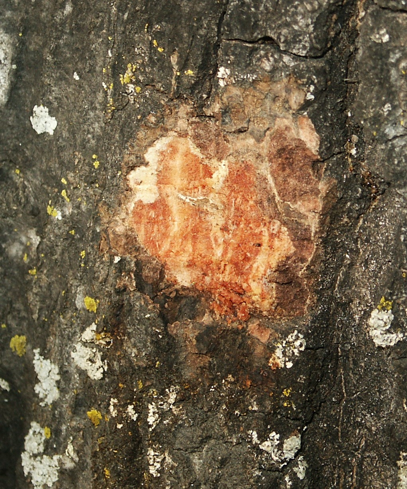
```


#### Biology {-}

Sunscald develops in trees whose bark is suddenly subjected to a greatly increased level of solar radiation.  This commonly occurs in newly transplanted young trees.  Nursery stock that is grown under relatively shaded conditions and/or lacks low branches needed to shade the trunk is most likely to develop sunscald when it is planted in hot, exposed landscape settings.  In mature trees, sunburn is most likely to develop where previously shaded bark is exposed to high sun intensity as the result of pruning, tree failure, or other rapid changes in canopy cover.  Sunscald is more likely to develop in water-stressed trees and following episodes of unusually high temperatures.

#### Importance {-}

Sunscald occurs most commonly on transplanted nursery stock and can contribute to poor health, decline, or death, especially in small trees.  It may develop in mature stems that have been overpruned or have lost overtopping canopy, especially in species such as coast and interior live oak, which have relatively thin outer bark.  Species with relatively thick outer layers of corky or flaky bark seldom develop sunscald.  Areas affected by sunscald may be susceptible to invasion by some wood decay fungi.

#### Citation {-}

Swiecki, T.J.; Bernhardt, E.A. 2025. Sunscald. In Swiecki, T.J., et al. (Eds.) Field Guide to Insects and Diseases of California Oaks, Online edition 2025.


### Wetwood {-}

#### Various bacteria and fungi {-}


#### Distribution / Hosts {-}

Wetwood is common in California and occurs worldwide on oak and many other tree species, especially ash, birch, elm, maple, poplar, and willow.  Wetwood that occurs in conifers appears to differ from that found in hardwoods.

#### Symptoms {-}

Cracks or wounds on branches or trunks of affected trees ooze a sour, rancid-smelling liquid, known as slime flux or wetwood slime, that is initially clear but darkens over time (figure \@ref(fig:TrDis18A),  \@ref(fig:TrDis19A)).  Microorganisms growing in the slime flux contribute to the foul odor and slimy texture of the ooze.  Slime flux oozing commonly lasts for years.  The slime flux stains the bark and other materials it contacts.  Affected wood, primarily heartwood, appears water-soaked and discolored (figure \@ref(fig:TrDis19A)).  Slime flux may kill cambium and bark (phloem) tissues it contacts, but necrosis (tissue death) associated with wetwood is typically discrete and restricted to areas contacted by the ooze.  Occasionally branches beyond the infected wood will wilt or die back.  


(ref:TrDis18A) Bleeding (slime flux) due to wetwood on coast live oak.  Ooze is initially clear and darkens with exposure to air.  Photo:  Steve Tjosvold, UCCE, retired.

```{r TrDis18A, out.width='75%', fig.asp=.75, fig.align='center', fig.cap = "(ref:TrDis18A)"}
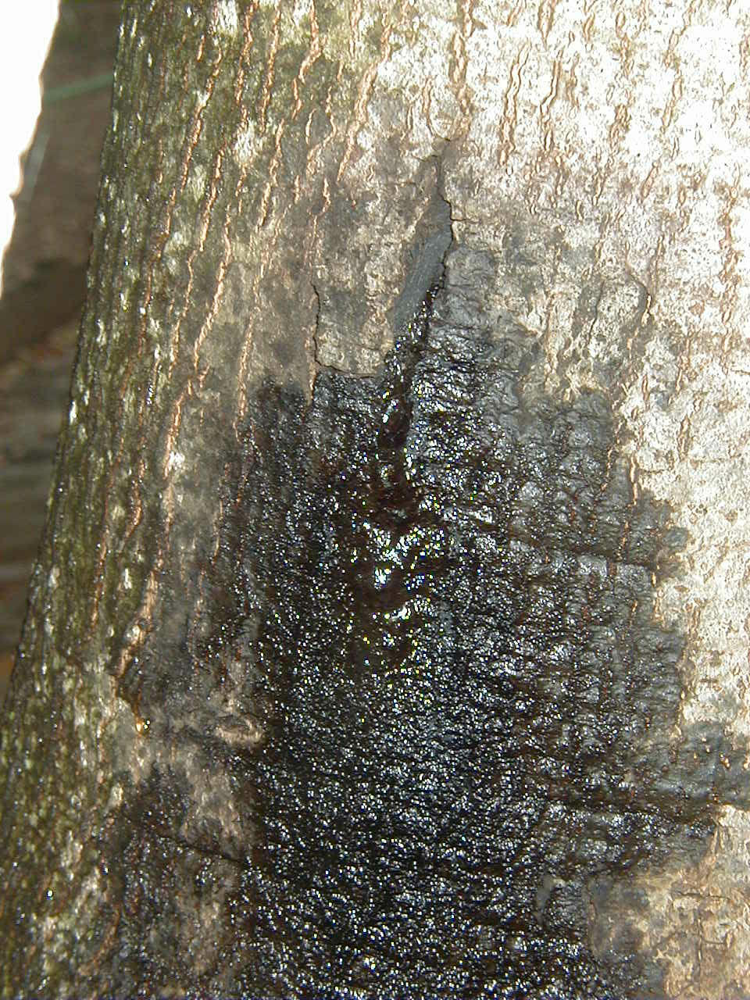
```


(ref:TrDis19A) Bark of this coast live oak was chipped away at the point where wetwood ooze originated to show a small area of watersoaked, necrotic bark.  Foul-smelling, clear liquid streamed from the area for several seconds when the bark was cut open. Photo: Tedmund J. Swiecki and Elizabeth A. Bernhardt, Phytosphere Research.

```{r TrDis19A, out.width='75%', fig.asp=.75, fig.align='center', fig.cap = "(ref:TrDis19A)"}
knitr::include_graphics("images/Disease-trunk/wetwood QA SRSP plot 203 6-23-04 c_Phytosphere.jpg")
```


#### Agent Description {-}

Wetwood is commonly caused by various species of anaerobic soil bacteria, including Clostridium spp. in oaks.

#### Biology {-}

Wetwood in oaks is a bacterial infection of the heartwood or inner sapwood.  Bacteria that normally live in the soil enter the wood through cracks in the bark or wounds.  Wood colonized by these bacteria develops a higher water content than normal wood.  Metabolic activity of the bacteria releases gases, especially methane, leading to a buildup in pressure within affected wood.  The elevated pressure helps force fluid out of affected wood through external openings in the tree.  The liquid contains bacteria and their metabolic products including rancid-smelling fatty acids.  Once the liquid is exposed to the air it can be colonized by a wide assortment of bacteria and fungi.  The fermentation of the ooze by these organisms may cause it to darken and bubble or froth.  Wetwood-infected wood is resistant to decay by fungi.


#### Importance {-}

Wetwood is not generally considered to have much impact on tree health, although the associated ooze may be considered a nuisance.  

#### Citation {-}

Swiecki, T.J.; Bernhardt, E.A. 2025. Wetwood. In Swiecki, T.J., et al. (Eds.) Field Guide to Insects and Diseases of California Oaks, Online edition 2025.


## Canker-associated wood decay fungi {-}


### *Annulohypoxylon thouarsianum* {-}


#### Distribution / Hosts {-}

*Annulohypoxylon thouarsianum* occurs throughout much of California.  Its reported range also includes the southeastern U.S., Central and South America, and parts of Africa, including South Africa and Tanzania.  It occurs on California black, blue, coast live, interior live, canyon live, and valley oak, as well as tanoak.  It is occasionally found on other species including hackberry and avocado.


```{r, fig.align='center', fig.asp=.75, fig.cap="California counties with known occurences of *Annulohypoxylon thouarsianum* (orange shading) and approximate range of native oak species (green).", out.width='30%'}
knitr::include_graphics("images/distributions/statewide.png")
```

#### Symptoms {-}

Black hemispherical fruiting bodies (stromata) of *A. thouarsianum* develop, sometimes in great numbers, on the surface of dead bark or wood (figure \@ref(fig:TrDis20A)).  The fungus causes a white rot of the sapwood of living trees and dead wood.  Sapwood decay caused by *A. thouarsianum* in trees affected by *Phytophthora ramorum* canker may be quite extensive and may lead to branch or bole failure.


(ref:TrDis20A) Mature *Annulohypoxylon thouarsianum* fruiting  bodies on coast live oak. Photo: Tedmund J. Swiecki and Elizabeth A. Bernhardt, Phytosphere Research.

```{r TrDis20A, out.width='75%', fig.asp=.75, fig.align='center', fig.cap = "(ref:TrDis20A)"}
knitr::include_graphics("images/Disease-trunk/AnnTho_QUAGHYTHO1__Phytosphere.jpg")
```


#### Agent Description {-}


Immature stromata that emerge through the bark over wood colonized by *A. thouarsianum* are initially rounded, black, smooth, and glossy and covered with a thin, fragile membrane.  This short-lived membrane ruptures, revealing a layer of powdery, dark olive green asexual spores (conidia) on the surface of the new stromata (figure \@ref(fig:TrDis21A), \@ref(fig:TrDis22A)).  Conidia are subglobose, about 6 μm in diameter, and are borne on densely packed specialized spore bearing hyphae (conidiophores).  Mature stromata are hard, hemispheric to nearly spherical, 1—4 cm in diameter, and blackish brown to black.  Stromata may occur singly or in merged overlapping clusters.  Internally, mature stromata are carbonaceous with some faint concentric zonation (figure \@ref(fig:TrDis23A).  Sexual spores (ascospores) are formed in flask-shaped structures (perithecia) arranged in a single layer just below the outer surface of the stroma.  The rounded openings of the perithecia are visible as fine bumps that cover the outer surface of the stroma.  Ascospores are dark brown, smooth, ellipsoidal, and 14—24 by 4—5.5 μm.


(ref:TrDis21A) Young *Annulohypoxylon thouarsianum* fruiting body on tanoak covered with powdery asexual spores (conidia). Photo: Tedmund J. Swiecki and Elizabeth A. Bernhardt, Phytosphere Research.

```{r TrDis21A, out.width='75%', fig.asp=.75, fig.align='center', fig.cap = "(ref:TrDis21A)"}
knitr::include_graphics("images/Disease-trunk/9-229 LD H thouarsianum conidia 9-11-04d_Phytosphere.jpg")
```


(ref:TrDis22A) Maturing *Annulohypoxylon thouarsianum* fruiting bodies (center) show remnants of conidia between bumps formed by the openings of the underlying perithecia.  Small newly emerging fruiting bodies to the left and below are still covered by a shiny thin membrane. Photo: Tedmund J. Swiecki and Elizabeth A. Bernhardt, Phytosphere Research.

```{r TrDis22A, out.width='75%', fig.asp=.75, fig.align='center', fig.cap = "(ref:TrDis22A)"}
knitr::include_graphics("images/Disease-trunk/AnnTho_9-229 LD H thouarsianum conidia 9-11-04c_Phytosphere.jpg")
```

(ref:TrDis23A) Sliced *Annulohypoxylon thouarsianum* fruiting body shows slightly zonate interior and outer layer of perithecia which contain sexual spores (ascospores). Photo: Tedmund J. Swiecki and Elizabeth A. Bernhardt, Phytosphere Research.

```{r TrDis23A, out.width='75%', fig.asp=.75, fig.align='center', fig.cap = "(ref:TrDis23A)"}
knitr::include_graphics("images/Disease-trunk/AnnTho_loc 11 Hypox thouarsianum inside QA5__Phytosphere.jpg")
```

#### Biology {-}

Little is known about the biology of this species.  Many *Annulohypoxylon*  species initiate latent (dormant or inactive) infections in healthy hosts or grow to a limited degree within host tissues without causing obvious disease symptoms.  When the host is severely stressed, some *Annulohypoxylon*  species become opportunistic pathogens, and may cause rapid and extensive decay of the sapwood.  *A.  thouarsianum* commonly fruits abundantly on or near bark cankers caused by *Phytophthora ramorum*.  It is also commonly found on dead or declining branches and on downed wood.  It is unclear whether conidia and/or ascospores establish infections, but infections are probably initiated during the wet season.


#### Importance {-}


This fungus appears to be of little consequence in healthy trees, but can quickly overrun severely stressed trees and trees with extensive *Phytophthora ramorum* cankers.  Sapwood decay caused by this pathogen probably plays a role in rapid tree death that occurs in some *P. ramorum*-infected trees.  *A. thouarsianum* contributes to the failure potential of both living and dead *P. ramorum*-infected stems.


#### Citation {-}

Swiecki, T.J.; Bernhardt, E.A. 2025. *Annulohypoxylon thouarsianum*. In Swiecki, T.J., et al. (Eds.) Field Guide to Insects and Diseases of California Oaks, Online edition 2025.

### *Biscogniauxia mediterranea* {-}


#### Distribution / Hosts {-}


#### Symptoms {-}


#### Agent Description {-}


#### Biology {-}


#### Importance {-}


#### Citation {-}

--------------- 2025. *Biscogniauxia mediterranea*. In Swiecki, T.J., et al. (Eds.) Field Guide to Insects and Diseases of California Oaks, Online edition 2025.


### Canker rots {-}

#### *Inonotus andersonii*, *Inocutis dryophila* {-}


#### Distribution / Hosts {-}

These canker rot fungi are distributed throughout oak woodlands in California, the Pacific Coast and the southwestern U.S. as well as in the oak-hardwood forests of the eastern U.S.

*Inonotus andersonii* is reported from coast live, California black, blue, and valley oak in California, but probably infects other oak species as well.  In addition to oaks, it reportedly occurs on *Carya*, *Populus*, and willow.
*Inocutis dryophilus* is reported on coast live, interior live, canyon live, California black, Oregon white, blue, and valley oak in California.  It is primarily found on living oaks, but is also reported on maple, *Populus*, *Prunus*, *Schinus*, and willow.


#### Symptoms {-}

These fungi cause a white rot of the heartwood of living oaks but also decay strips or sections of sapwood.  For *I. andersonii* especially, wood with advanced decay appears bleached, is very light weight, and crumbles easily.  Where sapwood decay reaches the cambium, the cambium may be killed, giving rise to an externally visible canker.  Cankers are commonly elongate and may become callused at the edges (figure  \@ref(fig:BrDis1B)).  Cankers are sometimes associated with an elongate, decayed cavity.  The bark near expanding or developing cankers may ooze varying amounts of dark sap. 
Affected branches or trees may show general symptoms of decline including poor growth, thinning, dieback, epicormic shoots (short twiggy branches arising from dormant buds on large-diameter stems) and branch or bole failures.  Generally, trees with canker rots decline slowly, often appearing to die from the top down as they slowly fall apart over a period of many years.  
The fruiting bodies (basidiocarps) may appear on living trees or on recently-failed stems. 


(ref:BrDis1B) Blue oak with typical elongate canker rot cankers and fruiting body of *Inocutis dryophilus*. Photo: Tedmund J. Swiecki and Elizabeth A. Bernhardt, Phytosphere Research. 

```{r BrDis1B, out.width='75%', fig.asp=.75, fig.align='center', fig.cap = "(ref:BrDis1B)"}
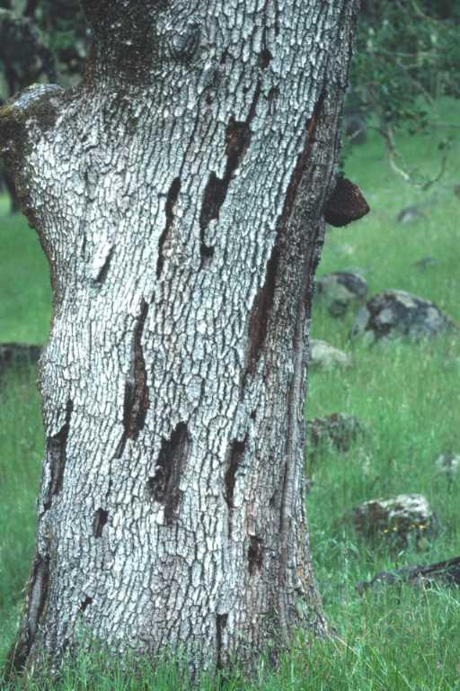
```


#### Agent Description {-}

*I. andersonii* produces a sheet-like (resupinate) annual basidiocarp on dead wood under the bark, or occasionally between outer sapwood layers.  Basidiocarps are commonly 0.3—1 m long.  Fresh basidiocarps are cinnamon brown (figure  \@ref(fig:BrDis2B)), but become black as they age (figure  \@ref(fig:BrDis3B)). The basidiocarp consists of two layers:  a thin (up to 1 mm thick) layer of sterile tissue (context) that is attached directly to the woody substrate and a layer of downward-pointing tubes (up to 1 to 2 cm long) attached to the context that terminate in an uneven layer of circular to angular pores (1—6 per mm).  Bright chrome yellow deposits of basidiospores develop on the inner surface of bark that initially covers new basiodiocarps (figure  \@ref(fig:BrDis2B),  \@ref(fig:BrDis4B)), .  Spore deposits become brown over time.  


(ref:BrDis2B) Close-up of *Inonotus andersonii* fruiting on blue oak, showing resupinate pore layer formed under bark on recently killed wood.  Bright yellow spores have been deposited on bark, which has been peeled away from the wood for the picture. Photo: Tedmund J. Swiecki and Elizabeth A. Bernhardt, Phytosphere Research. 

```{r BrDis2B, out.width='75%', fig.asp=.75, fig.align='center', fig.cap = "(ref:BrDis2B)"}
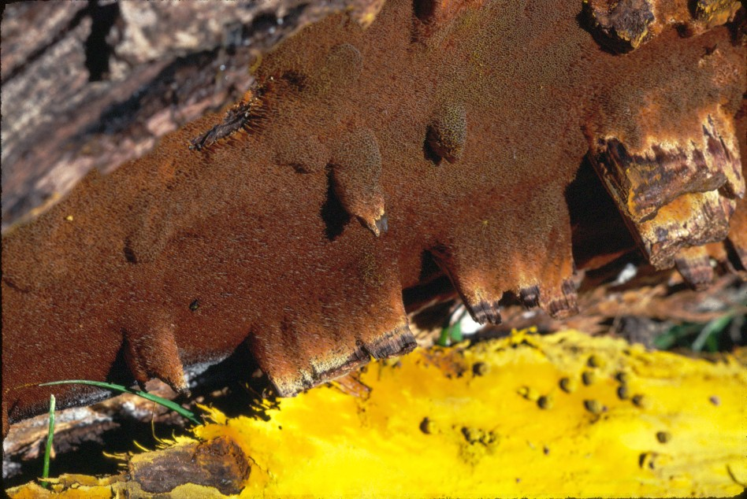
```


(ref:BrDis3B) Old resupinate pore layer of *Inonotus andersonii* has dark brown to black appearance. Photo: Tedmund J. Swiecki and Elizabeth A. Bernhardt, Phytosphere Research. 

```{r BrDis3B, out.width='75%', fig.asp=.75, fig.align='center', fig.cap = "(ref:BrDis3B)"}
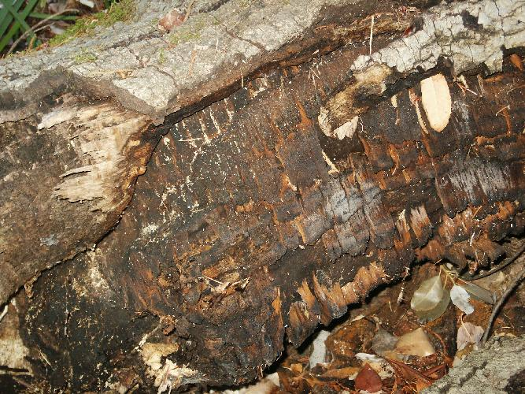
```


(ref:BrDis4B) Fallen coast live oak branch with distinctive deposit of chrome yellow *Inonotus andersonii* spores at the bark/wood interface. Photo: Tedmund J. Swiecki and Elizabeth A. Bernhardt, Phytosphere Research. 

```{r BrDis4B, out.width='75%', fig.asp=.75, fig.align='center', fig.cap = "(ref:BrDis4B)"}
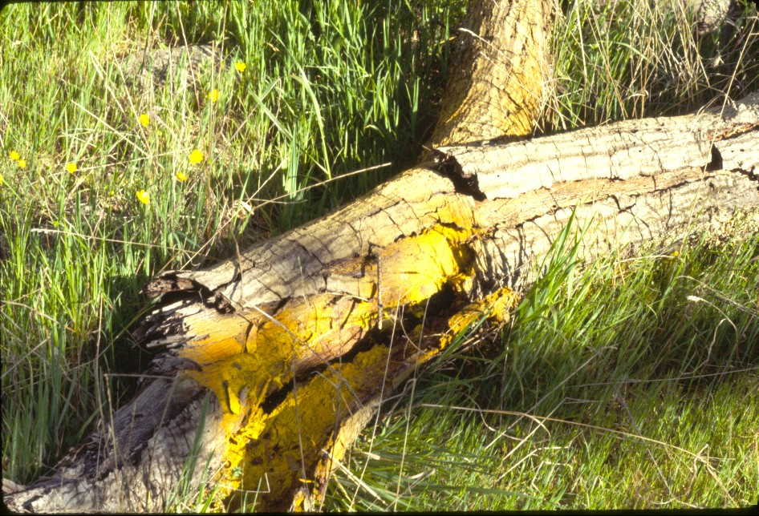
```

*Inocutis dryophilus* basidiocarps are annual, hoof-shaped, up to 11 by 19 by 9 cm, usually solitary, and firm and corky when fresh (figure  \@ref(fig:BrDis2B).  The upper surface of the basiodiocarp (pileus) is buff to reddish-brown.  The lower surface is covered with a layer of tubes up to 3 cm thick that terminate in a smooth layer of small angular pores (1—3 per mm).  The pore surface is white to buff at first, but becomes dark reddish-brown with age.  Basidiospores are brownish.  The context (sterile tissue between the tube layer and the pileus) mostly consists of a hard, granular core of intermixed brown and whitish mycelium.


(ref:BrDis5B) Close-up of *Inocutis dryophilus* fruiting on interior live oak. Photo: Tedmund J. Swiecki and Elizabeth A. Bernhardt, Phytosphere Research. 

```{r BrDis5B, out.width='75%', fig.asp=.75, fig.align='center', fig.cap = "(ref:BrDis5B)"}
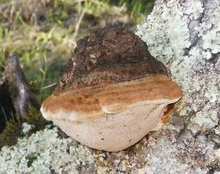
```


#### Biology {-}

Basidiocarps mature mainly between fall and spring.  *I. dryophilus* typically fruits on living stems.  *I. andersonii* only fruits on dead wood, including dead portions of living stems, dead branches, or on stems that have failed due to decay.  Basidiospores are produced along the inner walls of the tubes in the basidiocarp.  They are discharged though the pores on the lower surface of the basidiocarp and are disseminated by air currents.  Basidiospores initiate new infections, most likely by invading wounds such as broken branch stubs or pruning cuts.  

#### Importance {-}

*I. andersonii* and *I. dryophilus* are among the most frequently observed wood decay fungi on living oaks in many types of hardwood forests.  These fungi are serious pathogens of California oaks and are associated with oak decline, failure, and mortality in many California oak woodlands.

#### Citation {-}

Swiecki, T.J.; Bernhardt, E.A. 2025. Canker rots. In Swiecki, T.J., et al. (Eds.) Field Guide to Insects and Diseases of California Oaks, Online edition 2025.

## Orange hobnail canker {-}

### *Endothia gyrosa* {-}


#### Distribution / Hosts {-}

*Endothia gyrosa* has been reported on coast live oak in the San Francisco Bay Area but may also occur on other oaks and in other areas.  It has also been observed on tanoaks in coastal Sonoma County.  This pathogen is widespread in the eastern U.S. and the southeast from Virginia to Texas, where it occurs on many hardwood trees, including oaks, beech, sweetgum, American elm, and American chestnut.  Oak hosts are primarily in the red/black oak subgroup and include eastern black, cork, English, southern live, pin, post, northern red, southern red, scarlet, water, and willow oak.  The fungus is also reported from Europe, Asia, and New Zealand.


```{r, fig.align='center', fig.asp=.75, fig.cap="California counties with known occurences of orange hobnail canker (orange shading) and approximate range of native oak species (green).", out.width='30%'}
knitr::include_graphics("images/distributions/Chryphonectira map.gif")
```


#### Symptoms {-}

The fungus causes somewhat sunken, slowly expanding cankers which may girdle and kill branches and trunks of trees under stress.  Cankers sometimes extend from smaller branches to the larger parent branch.  Small (1—2 mm diameter), cushion-shaped masses of fungal tissue containing fruiting structures (stromata) erupt from the bark of killed stems (figure \@ref(fig:BrDis1A)).  Stromata are initially bright orange but become cinnamon brown with age.  Stromata remain bright orange internally and release a beet-red pigment when wetted with a solution of potassium hydroxide (figure \@ref(fig:BrDis2A)).  The common name, hobnail canker, refers to the masses of rounded, bumpy stromata that appear on affected stems.


(ref:BrDis1A) *Endothia gyrosa* stromata on coast live oak. Photo: Photo: Tedmund J. Swiecki and Elizabeth A. Bernhardt, Phytosphere Research. 

```{r BrDis1A, out.width='75%', fig.asp=.75, fig.align='center', fig.cap = "(ref:BrDis1A)"}
knitr::include_graphics("images/Disease-branch/endothia gyrosa 10-13-04c_Phytosphere.jpg")
```


(ref:BrDis2A) Close-up of *Endothia gyrosa* stromata.  At right is a slide mount of stromata in a solution of potassium hydroxide, showing the characteristic release of red pigment. Photo: Photo: Tedmund J. Swiecki and Elizabeth A. Bernhardt, Phytosphere Research. 

```{r BrDis2A, out.width='75%', fig.asp=.75, fig.align='center', fig.cap = "(ref:BrDis2A)"}
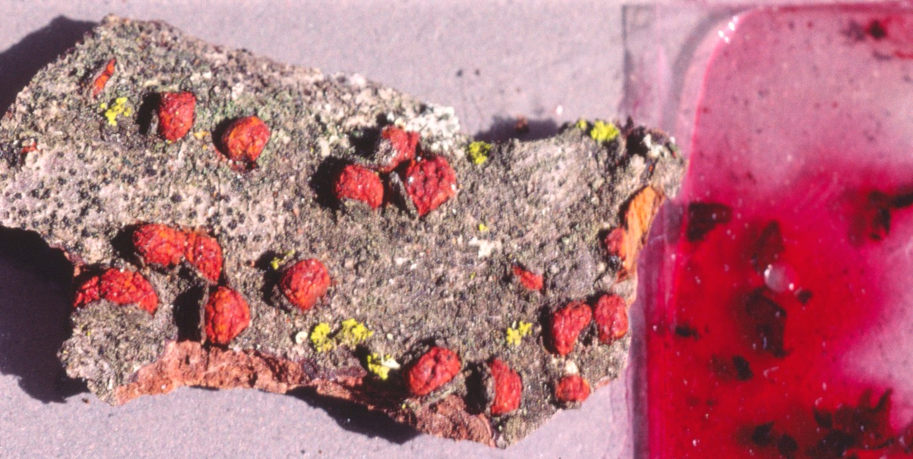
```


#### Agent Description {-}

Stromata that emerge from killed bark initially produce asexual spores (conidia) in irregular chambers.  Conidia of the asexual stage (*Endothiella gyrosa*) are colorless, straight to somewhat curved rods that are 3—4 by 0.75—1.5 μm.  Flask-shaped sexual fruiting structures (perithecia) are produced in the stromata late in the season.  Perithecia are 150—300 μm in diameter, with elongate necks that protrude slightly above the surface of the stroma.  Sexual spores (ascospores) are produced in saclike structures (asci) within the perithecia.  The one-celled, curved ascospores are 7—11 by 1—3 μm.

#### Biology {-}

The biology of this fungus in California has not been studied.  The fungus is reported to infect through wounds, such as those which form naturally through branch breakage, or through pruning cuts or other mechanical wounds.  Moisture favors dispersal of spores, so presumably most infections occur during the rainy season.  Asexual spores are most likely spread by rain splash, and possibly by insects or pruning tools.  Ascospores are probably wind-dispersed.  On many hosts, canker expansion occurs most rapidly on drought stressed trees during summer months.

#### Importance {-}

On coast live oak, *E. gyrosa* is typically a branch pathogen, often affecting suppressed or wounded branches.

#### Citation {-}

Swiecki, T.J.; Bernhardt, E.A. 2025. Orange hobnail canker. In Swiecki, T.J., et al. (Eds.) Field Guide to Insects and Diseases of California Oaks, Online edition 2025.


## Other wood decay fungi {-}


### *Fomitiporia robusta* (formerly Phellinus robustus) {-}


#### Distribution / Hosts {-}

*Fomitiporia robusta* (formerly *Phellinus robustus*) is found across the northern hemisphere in forests which contain oaks. Recent genetic work suggests isolates from the U.S.A. do not match those from Europ (Ref).  Nonetheless, because we have not been able to find a publication with a new suggested species epithet for California isolates from oaks we will continue to use the name *F. robusta* in this publication.  In California, *F. robusta* has been observed on coast live and interior live oak, and probably occurs on other species as well.  

```{r, fig.align='center', fig.asp=.75, fig.cap="California counties with known occurences of *Fomitiporia robusta* (orange shading) and approximate range of native oak species (green).", out.width='30%'}
knitr::include_graphics("images/distributions/M scutellare.gif")
```


#### Symptoms {-}

 *F. robustus* causes a white rot of the trunk and large woody roots of living oaks.  Infections on the trunk or large branches may be associated with canker rot symptoms.  *P. robustus* decay is also associated with stem failure and tree decline. 

#### Agent Description {-}
Fruiting bodies (basidiocarps) are produced at the base of the tree or higher up the stem (figure \@ref(fig:TrDis1D),  \@ref(fig:TrDis2D)).  They are hoof-like, perennial, very hard, often massive (up to 20 cm wide and 11 cm thick), and usually in clusters.  The upper surface is brown to blackish, concentrically zonate, irregularly cracked, and lacks hairs.  The lower surface is covered with fine circular pores (7—9 per mm) and is yellowish to grayish brown.


(ref:TrDis1D) *Fomitiporia robusta* basidiocarps high on the trunk of this coast live oak are associated with a trunk cavity and canker rot symptoms.   Photo: Tedmund J. Swiecki and Elizabeth A. Bernhardt, Phytosphere Research. 

```{r TrDis1D, out.width='75%', fig.asp=.75, fig.align='center', fig.cap = "(ref:TrDis1D)"}
knitr::include_graphics("images/Disease-trunk/FomRob_loc2 11-12-02 Phellinus Qa 2_Phytosphere.jpg")
```


(ref:TrDis2D) *Fomitiporia robusta* basidiocarps at the base of a coast live oak.    Photo: Tedmund J. Swiecki and Elizabeth A. Bernhardt, Phytosphere Research. 


```{r TrDis2D, out.width='75%', fig.asp=.75, fig.align='center', fig.cap = "(ref:TrDis2D)"}
knitr::include_graphics("images/Disease-trunk/FomRob_Phellinus robustus no spores QD Rockville Park Dec 8 2003 g_Phytosphere.jpg")
```


#### Citation {-}

Swiecki, T.J.; Bernhardt, E.A. 2025. *Fomitiporia robusta*. In Swiecki, T.J., et al. (Eds.) Field Guide to Insects and Diseases of California Oaks, Online edition 2025.

 

### *Fuscoporia gilva* (formerly *Phellinus gilvus*) {-}


#### Distribution / Hosts {-}

In California, *Fuscoporia gilva* occurs on coast live, California black, and blue oak and probably other oaks.  It is found on oaks and many other hardwoods throughout much of the U.S.  It decays both living and dead trees, causing a uniform white rot.  In California oaks, *F. gilva* usually colonizes dead wood and severely declining stems.  It is also often found on  coast live and California black oak with advanced symptoms of *Phytophthora ramorum* canker, where it can cause extensive sapwood decay and is associated with an increased likelihood of branch and trunk failures.  *F. gilva* fruiting bodies (basidiocarps) are shelf-like, 5—15 cm wide, 1.5—3 cm thick, corky, annual or perennial, and solitary or in overlapping clusters (figure \@ref(fig:TrDis1C), \@ref(fig:TrDis2C)).  The upper surface is generally dark yellowish brown but is variable in appearance and may be wrinkled, woolly, and/or zonate.  The lower surface is covered with minute round pores (6—8 per mm) and is initially buff-colored becoming dark purplish brown at maturity.  The pores are white within.


```{r, fig.align='center', fig.asp=.75, fig.cap="California counties with known occurences of *Fuscoporia gilva* (orange shading) and approximate range of native oak species (green).", out.width='30%'}
knitr::include_graphics("images/distributions/statewide.png")
```


#### Symptoms {-}

*F. gilva* decays both living and dead trees, causing a uniform white rot.  In California oaks, it  usually colonizes dead wood and severely declining stems.  It is also often found on  coast live and California black oak with advanced symptoms of *Phytophthora ramorum* canker, where it can cause extensive sapwood decay and is associated with an increased likelihood of branch and trunk failures.

#### Agent Description {-}

*F. gilva* fruiting bodies (basidiocarps) are shelf-like, 5—15 cm wide, 1.5—3 cm thick, corky, annual or perennial, and solitary or in overlapping clusters (figure \@ref(fig:TrDis1C), \@ref(fig:TrDis2C)).  The upper surface is generally dark yellowish brown but is variable in appearance and may be wrinkled, woolly, and/or zonate.  The lower surface is covered with minute round pores (6—8 per mm) and is initially buff-colored becoming dark purplish brown at maturity.  The pores are white within.


(ref:TrDis1C) *Fuscoporia gilva* and *Annulohypoxylon thouarsianum* (black stromata on right) fruiting on failed coast live oak.   Photo: Tedmund J. Swiecki and Elizabeth A. Bernhardt, Phytosphere Research. 

```{r TrDis1C, out.width='75%', fig.asp=.75, fig.align='center', fig.cap = "(ref:TrDis1C)"}
knitr::include_graphics("images/Disease-trunk/FusGil_5X346 12-11-02 p gilvus c_Phytosphere.jpg")
```


(ref:TrDis2C) Close-up of *Fuscoporia gilva* basidiocarp on coast live oak showing light pore surface.   Photo: Tedmund J. Swiecki and Elizabeth A. Bernhardt, Phytosphere Research. 

```{r TrDis2C, out.width='75%', fig.asp=.75, fig.align='center', fig.cap = "(ref:TrDis2C)"}
knitr::include_graphics("images/Disease-trunk/FusGil_8-212-4 fail 10-9-03 P gilvus a_Phytosphere.jpg")
```


#### Citation {-}

Swiecki, T.J.; Bernhardt, E.A. 2025. *Fuscoporia gilva*. In Swiecki, T.J., et al. (Eds.) Field Guide to Insects and Diseases of California Oaks, Online edition 2025.


### Hedgehog fungus {-}

#### *Hericium erinaceus* {-}


#### Distribution / Hosts {-}

*Hericium erinaceus* is known by several common names including lion’s mane and hedgehog fungus.  It is widely distributed throughout temperate North America and is also found in Europe and Asia.  It occurs on a variety of oaks and other hardwoods, including maple, ash, and eucalyptus.  In California, *H. erinaceus* f. *erinaceus* has been reported on coast live, canyon live, interior live, California black, blue, and valley oak.


```{r, fig.align='center', fig.asp=.75, fig.cap="California counties with known occurences of *Hericium erinaceus* (orange shading) and approximate range of native oak species (green).", out.width='30%'}
knitr::include_graphics("images/distributions/Tapcae.png")
```


#### Symptoms {-}

The fungus is usually associated with a wound and causes a white pocket rot of living trees.  Decayed tissue becomes spongy and eventually disintegrates to form a cavity.  The distinctive fruiting bodies (basidiocarps) generally appear near the edges of old wounds in the fall (figure \@ref(fig:TrDis1A)).


(ref:TrDis1A) Fresh fruiting body of *Hericium erinaceus* f. *erinaceus* at the edge of a decayed wound on coast live oak. Photo: Photo: Tedmund J. Swiecki and Elizabeth A. Bernhardt, Phytosphere Research. 

```{r TrDis1A, out.width='75%', fig.asp=.75, fig.align='center', fig.cap = "(ref:TrDis1A)"}
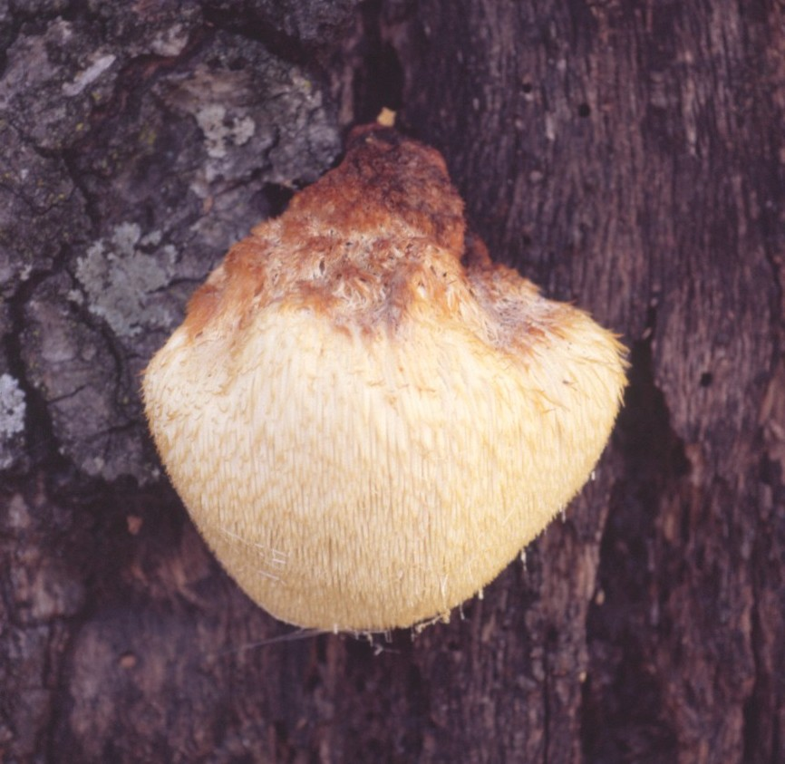
```


#### Agent Description {-}

The basidiocarps are annual, usually solitary, and 10—20 cm across at maturity.  They commonly form on wounds or recently-cut log ends.  The spore-bearing surface consists of many closely-packed, slender, icicle-like teeth that are 2—5 (rarely 1—10) cm long.  The teeth are white when fresh, and become pale yellow, brownish, or rarely reddish with age.  Spores are nearly globose, 5—6 by 4—5.5 µm, and smooth to slightly roughened.  The spore print is white.  Young basidiocarps are edible.

#### Biology {-}

Basidiocarps are formed in the fall months, often at the site of a wound.  Basidiospores are disseminated by air currents.  Infection presumably occurs at wounds such as cracks, fire scars, or branch stubs. 

#### Importance {-}

This fungus has the potential to affect tree health and increase failure in infected trees.  It is not observed as commonly as other decay fungi in most stands.  

#### Citation {-}

Swiecki, T.J.; Bernhardt, E.A. 2025. Hedgehog fungus. In Swiecki, T.J., et al. (Eds.) Field Guide to Insects and Diseases of California Oaks, Online edition 2025.

### Western sulfur shelf fungus {-}

#### *Laetiporus gilbertsonii* {-}


#### Distribution / Hosts {-}

The taxonomy of this fungus in North America was revised by [@burdsall2001].  Fungi previously described as *Laetiporus sulphureus* in the Pacific Coast and southwestern states have been renamed *L. gilbertsonii* if they occur on hardwoods and *L. conifericola* if they occur on conifers.  In California, *L. gilbertsonii* has been observed on blue, valley, California black, coast live, interior live, and canyon live oak, as well as eucalyptus, *Prunus*, and probably other hardwoods.


```{r, fig.align='center', fig.asp=.75, fig.cap="California counties with known occurences of *Laetiporus gilbertsonii* (orange shading) and approximate range of native oak species (green).", out.width='30%'}
knitr::include_graphics("images/distributions/statewide.png")
```


#### Symptoms {-}

This fungus causes a distinctive brown cubical wood decay of living trees, as well as dead trunks and logs (figure \@ref(fig:TrDis2A)).  Wood decayed by *L. gilbertsonii* is a cinnamon to dark brown color and tends to fracture into flat-sided, somewhat cubical pieces.  *Fomitopsis quercina*, which is uncommon in California, is the only other reported cause of brown rot in living oaks in the state.  Brown rot caused by *L. gilbertsonii* commonly leads to failure of large branches or the trunk (figure \@ref(fig:TrDis3A)).  White to pale yellow felt-like masses of fungal tissue (mycelium) are prominent in shrinkage cracks in the decayed wood.  Fruiting bodies (basidiocarps) are initially bright yellow and become orange on top before fading to a pale color. 
The distinctive bright yellow basidiocarps may be the first obvious symptoms of infection by *L. gilbertsonii*.  The presence of basidiocarps indicates that substantial internal decay is present and often presages failures at the root crown, trunk, or major branches.  However, basidiocarps may not form on affected trees until after failure has already occurred.  


(ref:TrDis2A) Brown cubical wood decay of California black oak caused by *Laetiporus gilbertsonii*. Photo: Tedmund J. Swiecki and Elizabeth A. Bernhardt, Phytosphere Research. 

```{r TrDis2A, out.width='75%', fig.asp=.75, fig.align='center', fig.cap = "(ref:TrDis2A)"}
knitr::include_graphics("images/Disease-trunk/LaeSul_3F79 11-11-02e_Phytosphere.jpg")
```


(ref:TrDis3A) This *Laetiporus gilbertsonii* basidiocarp on valley oak developed on the scar left by a large scaffold failure. Photo: Tedmund J. Swiecki and Elizabeth A. Bernhardt, Phytosphere Research. 

```{r TrDis3A, out.width='75%', fig.asp=.75, fig.align='center', fig.cap = "(ref:TrDis3A)"}
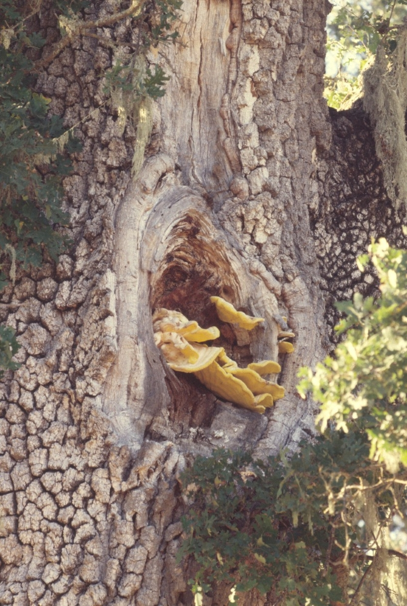
```


#### Agent Description {-}

Basidiocarps are annual and occur singly or in stacked clusters (figure \@ref(fig:TrDis4A)).  Newly emerging basidiocarps may appear as bright yellow lumpy masses, but mature to form a moist, fleshy, shelf-like fruiting body with a lower surface of fine circular pores (3—4 per mm).  Basidiocarps are edible when young but may cause allergic reactions in some individuals.  Mature basidiocarps are yellow with orange to brownish-orange banding on the upper surface; the lower pore surface is a light to intense lemon yellow (figure \@ref(fig:TrDis5A)).  Basidiocarps fade to pale brown or white with age and become dry, chalky, and crumbly.  Individual basidiocarps are variable in size, ranging up to at least 20 cm in diameter.


(ref:TrDis4A) Cluster of *Laetiporus gilbertsonii*  basidiocarps on interior live oak   Photo: Tedmund J. Swiecki and Elizabeth A. Bernhardt, Phytosphere Research. 

```{r TrDis4A, out.width='75%', fig.asp=.75, fig.align='center', fig.cap = "(ref:TrDis4A)"}
knitr::include_graphics("images/Disease-trunk/LAESULQUWI1_Phytosphere.jpg")
```


(ref:TrDis5A) Close-up of fresh L. gilbertsonii basidiocarps on California black oak.   Photo: Tedmund J. Swiecki and Elizabeth A. Bernhardt, Phytosphere Research. 

```{r TrDis5A, out.width='75%', fig.asp=.75, fig.align='center', fig.cap = "(ref:TrDis5A)"}
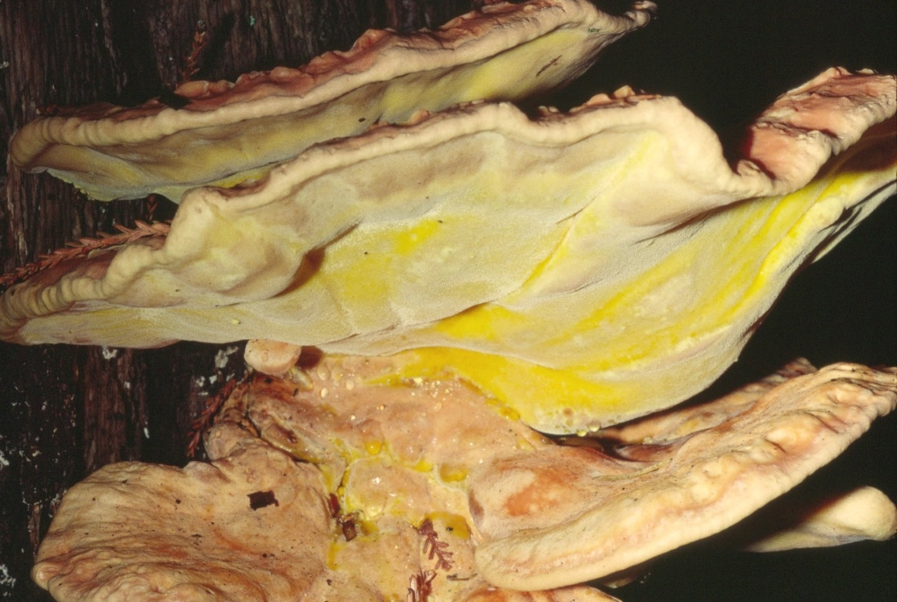
```


#### Biology {-}


Basidiocarps are formed in the fall months, often before the first fall rains, and may form in the same location for multiple years.  These fruiting bodies release basidiospores, which are disseminated by air currents.  Infection presumably occurs most commonly through wounds such as broken branch stubs, pruning cuts, or fire scars.  Basidiocarps are typically formed only after the amount of internal decay is considerable

#### Importance {-}

*L. gilbertsonii*  is the most important brown rot fungus on oaks in California and is a major cause of tree failure and failure-associated tree mortality.
 

#### Citation {-}

Swiecki, T.J.; Bernhardt, E.A. 2025. Western sulfur shelf fungus. In Swiecki, T.J., et al. (Eds.) Field Guide to Insects and Diseases of California Oaks, Online edition 2025.

## Parasitic vascular plants {-}

### Oak mistletoe  {-}

#### *Phoradendron leucarpum* ssp. *tomentosum* {-}


#### Distribution / Hosts {-}

Oak mistletoe occurs from northwestern Oregon, throughout California, and into Mexico.  Reported oak hosts in California include valley, blue, Oregon white, coast live, interior live, canyon live, and California black oak.  *Phoradendron leucarpum* spp. *tomentosum* prefers oaks as a host but is also found on some other hardwoods, including California bay, manzanita, *Adenostoma*, and *Rhus*.  The related *P. leucarpum* ssp. *macrophyllum* (big-leaf mistletoe) attacks other hardwoods such as alder, ash, walnut, sycamore, cottonwood, mesquite, locust, and willow, but not oaks.


```{r, fig.align='center', fig.asp=.75, fig.cap="California counties with known occurences of oak mistletoe (orange shading) and approximate range of native oak species (green).", out.width='30%'}
knitr::include_graphics("images/distributions/statewide.png")
```


#### Symptoms {-}

Oak mistletoe forms spherical to ellipsoidal clumps of light green leafy shoots that emerge from oak branches.  The oak branch is slightly to significantly swollen at the point where clusters of mistletoe shoots emerge.  Over time, the portion of the oak branch beyond the mistletoe clump may decline and die.  Clumps of oak mistletoe are often located in the upper portion of oak canopies (figure \@ref(fig:BrDis6A)).  Mistletoe infections tend to be clustered and multiple clumps commonly occur in individual trees or in groups of adjacent trees.


(ref:BrDis6A) Oak mistletoe clumps in the upper canopy of a dormant blue oak.  Mistletoe infestations are most obvious in deciduous oaks during the winter. Photo: Tedmund J. Swiecki and Elizabeth A. Bernhardt, Phytosphere Research. 
 
```{r BrDis6A, out.width='75%', fig.asp=.75, fig.align='center', fig.cap = "(ref:BrDis6A)"}
knitr::include_graphics("images/Disease-branch/mistletoe_PICT0010_Phytosphere.jpg")
```


#### Agent Description {-}

*P. leucarpum* ssp. *tomentosum* plants are evergreen with thick obovate-elliptic leaves that are 1.5—4.7 cm long by 1—2.5 cm wide (figure \@ref(fig:BrDis7A).  The leaves and young stems are covered with whitish or yellowish hairs, but older stems are hairless (glabrous).  Branches are generally erect, although longer stems, which can be up to 1 m long, may become pendulous under the weight of the foliage.  Flowers are present between July and September with male and female flowers occurring on separate plants.  Fruit are globose, 3—4 mm in diameter, pinkish white, and have short hairs near the tip.


(ref:BrDis7A) Shoots and leaves of oak mistletoe, showing inflorescences in leaf axils.  A few pinkish white mistletoe fruit are visible in the lower half of the photo. Photo: Tedmund J. Swiecki and Elizabeth A. Bernhardt, Phytosphere Research. 
 
```{r BrDis7A, out.width='75%', fig.asp=.75, fig.align='center', fig.cap = "(ref:BrDis7A)"}
knitr::include_graphics("images/Disease-branch/mistletoe_PICT0013_Phytosphere.jpg")
```

#### Biology {-}

Oak mistletoe fruit mature in early winter.  The fruit are eaten by various birds, including robins, bluebirds, thrushes, and cedar waxwings.  Seeds in consumed fruit pass quickly through birds’ digestive systems and are defecated onto the source tree or nearby trees (figure \@ref(fig:BrDis8A).  Seeds are coated with a sticky fluid which helps them adhere to bark surfaces.  Wet conditions favor seed germination.  Germinating seeds produce a root-like structure that grows along the bark surface to a point where it produces a specialized structure (haustorium) that penetrates into the bark.  Within the host branch, the mistletoe plant forms connections between its own phloem and xylem cells and those of the host.  The connections allow the mistletoe plant to absorb water and nutrients from its host.  One or more years may elapse between infection of the host stem and the emergence of green mistletoe shoots.  Although dependent on the host oak for water and mineral nutrients, leafy mistletoe plants meet all of their carbon-based energy and nutritional needs through their own photosynthesis.  Mistletoe plants are perennial and generally live until the branch of the host on which they are situated dies.


(ref:BrDis8A) Clump of oak mistletoe seeds deposited via bird droppings on an oak branch. Photo: Tedmund J. Swiecki and Elizabeth A. Bernhardt, Phytosphere Research.

 
```{r BrDis8A, out.width='75%', fig.asp=.75, fig.align='center', fig.cap = "(ref:BrDis8A)"}
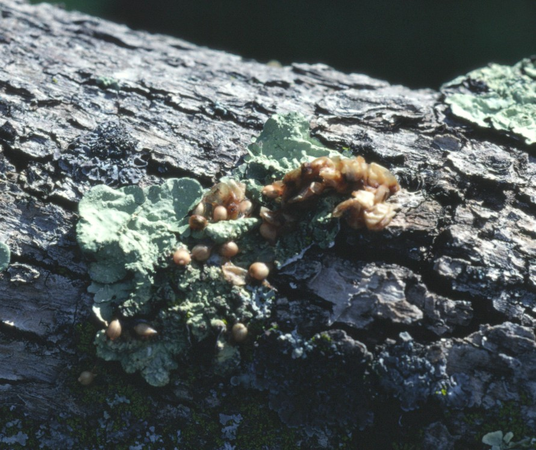
```


#### Importance {-}

Leafy mistletoe usually has little impact on healthy oaks, although it may be unsightly in urban settings.  Swellings on stems may serve as points of entry for wood decay fungi.  *P. leucarpum* ssp. *tomentosum* uses water at a higher rate than its host oaks.  Oaks with heavy mistletoe infestations may therefore deplete available soil moisture reserves earlier in the season.  Earlier and/or more severe water stress levels related to heavy mistletoe infestations can lead to early defoliation in deciduous oaks and may contribute to decline in some trees.

#### Citation {-}

Swiecki, T.J.; Bernhardt, E.A. 2025. Oak mistletoe.  In Swiecki, T.J., et al. (Eds.) Field Guide to Insects and Diseases of California Oaks, Online edition 2025.


