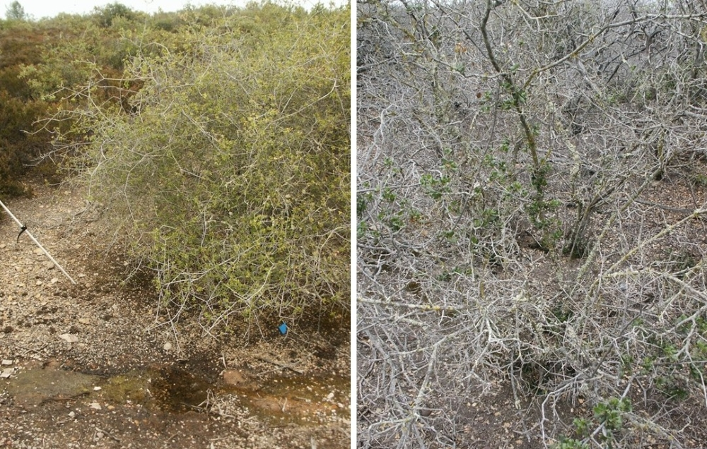
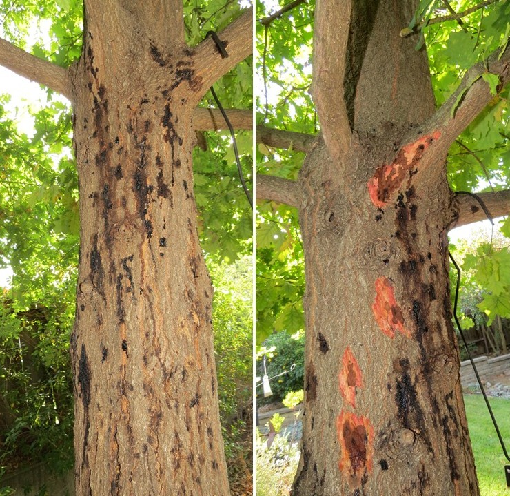
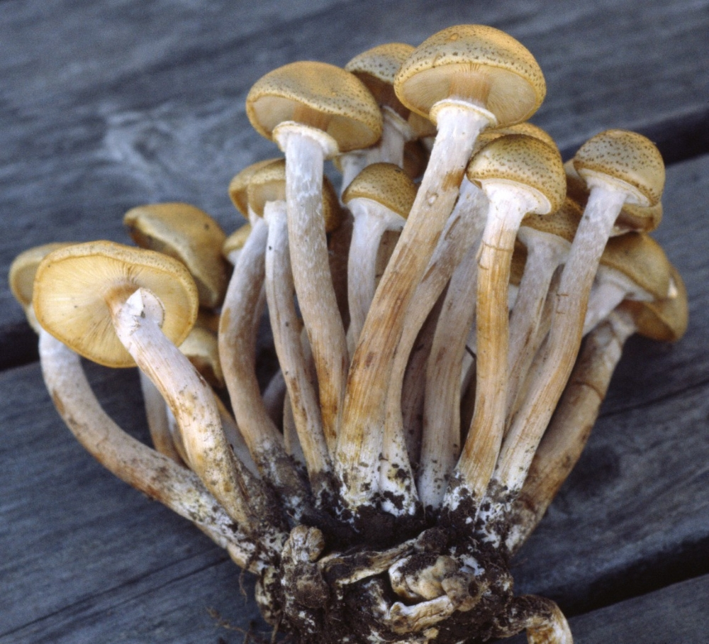
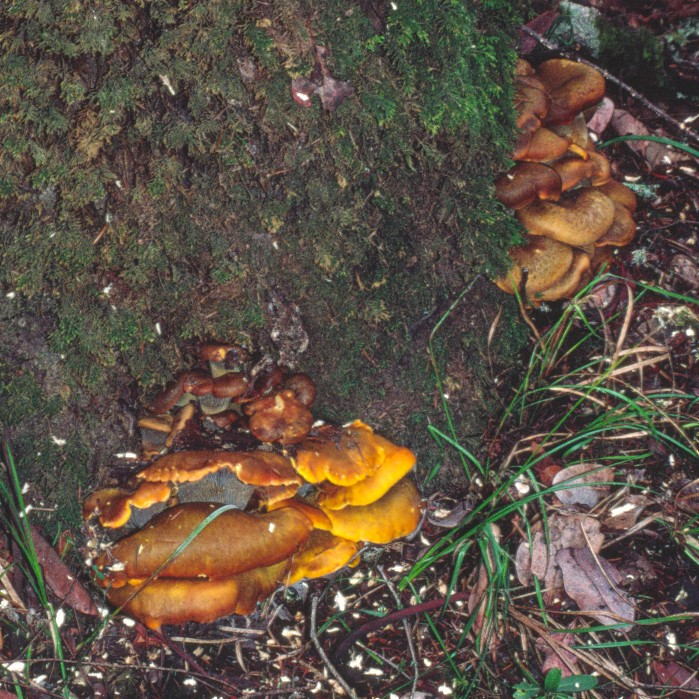
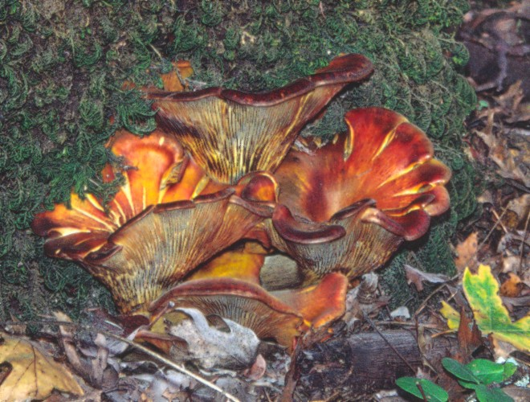

# Root diseases {#rootdis}

## Phytophthora root rot {-}

### *Phytophthora cactorum*, *P. cambivora*, *P. cinnamomi*, *P. mediterranea*, *P. nicotianae*, *P. quercetorum*, *P. quercina*, and others {-}

#### Distribution / Hosts {-}

At least 30 species of soilborne root-rotting *Phytophthora* species have been recovered from root systems or trunk cankers of oaks in California. *Phytophthora* species found in California that infect one or more native oak species include *P. cactorum*, *P. cambivora*, *P. cinnamomi*, *P. citrophthora*, *P. citricola*, *P. kelmanii*, *P. mediterranea*, *P. nicotianae*, *P. quercetorum*, *P. quercina*, and *P.* taxon agrifolia. Native oaks known to be affected by one or more root-rotting *Phytophthora* species include blue, valley, scrub (*Q. berberidifolia*), coast live, and interior live oaks, but susceptibilities of most native oak species to these pathogens have not been assessed. Most of these *Phytophthora* species have been baited from root systems of nursery grown plants in nurseries or in plantings in wildlands or horticultural landscapes. Some species, including *P. cinnamomi*, *P. cactorum*, and *P. cambivora*, have spread into native landscapes far beyond points of introduction. 

*Phytophthora cinnamomi* is a serious pathogen of many plant species in forest ecosystems and other native plant communities as well as in agricultural and horticultural situations.  It affects plants in temperate, subtropical, and tropical regions on all continents except Antarctica.  The known host range is in excess of 900 species, most of which are woody plants.  It was probably introduced into California in the late 19th or early 20th century where it was primarily known here as a pathogen of agricultural crops, including avocados and various orchard trees, and ornamental plants, including nursery stock and Christmas trees.  It commonly affects oaks growing in irrigated landscapes, particularly coast live oak and cork oak, a non-native oak grown horticulturally.  *P. cinnamomi* has been found to be causing decline and mortality of multiple native tree and shrub species in California and has spread widely in some areas. Highly susceptible native species include giant chinquapin, Pacific madrone, California Bay, and native populations of the rare manzanitas *Arctostaphylos myrtifolia* , *A. pallida* and *A. densiflora*. 


```{r, fig.align='center', fig.asp=.75, fig.cap="Counties with known detections of Phytophthora root rot (orange shading) and native oak species (green) in California.", out.width='30%'}
knitr::include_graphics("images/distributions/Phytophthora root rot.gif")
```


#### Symptoms {-}

Root-rotting *Phytophthora* species decay fine roots and can also invade larger woody roots and cause bleeding cankers on the root crown and lower trunk.  In the early stages of infection, no obvious canopy symptoms may be visible. As the percentage of infected roots increases, trees may show little growth, develop small, yellowing leaves, and the canopy may become progressively more thin (figure \@ref(fig:RtDis1B)). Severe root rot alone may cause tree death  or death may be due to cankers that encircle the root crown and/ or lower trunk. *Phytophthora* species attack the inner bark and cambium, causing dark brown discoloration of affected tissues (figure \@ref(fig:RtDis1C)).  Dark brown to black lines are commonly found at the outer margin of the discolored infected tissue in the inner bark.  Reddish brown, dark brown, or black fluid may bleed from fissures in the bark in the cankered area.  Trunk cankers on oaks caused by *P. cinnamomi* and other soil-borne *Phytophthora* species typically originate below the soil or occasionally at the soil line and are normally associated with root rot. *P. cinnamomi* cankers in particular can sometimes extend up the trunk to 1 - 2 m or more above the soil (figure \@ref(fig:RtDis1D)).  Cankers caused by *P. ramorum* are similar in appearance, but *P. ramorum* cankers are initiated above the soil level, seldom extend more than a few cm below the soil level, and are not associated with root rot.


(ref:RtDis1B) Early (left) and advanced (right) decline of scrub oak (*Quercus berberidifolia*) due to *Phytophthora cinnamomi* root rot.  Both photos were taken along a small creek in an area infested with *P. cinnamomi* in Amador County.  Photo: Tedmund J. Swiecki and Elizabeth A. Bernhardt, Phytosphere Research.

```{r RtDis1B, out.width='75%', fig.asp=.75, fig.align='center', fig.cap = "(ref:RtDis1B)"}

```

(ref:RtDis1C) *Phytophthora cinnamomi* canker on coast live oak. Bark has been removed along one edge of canker, note bleeding at bottom of image. Photo: Tedmund J. Swiecki and Elizabeth A. Bernhardt, Phytosphere Research.

```{r RtDis1C, out.width='75%', fig.asp=.75, fig.align='center', fig.cap = "(ref:RtDis1C)"}
knitr::include_graphics("images/Disease-root/Phycin QA Phytosphere Somerset-Atherton _20120615_10.jpg")
```


(ref:RtDis1D) Bleeding *Phytophthora cinnamomi* cankers on this *Quercus robur* (English oak) extended more than 2 m above the soil. In image at right, outer bark has been cut away from some cankers to reveal dark phloem tissue killed by the pathogen. Although outer phloem necrosis is not continuous, vertically aligned cankers are connected by infected inner phloem or xylem tissues.      Photo: Tedmund J. Swiecki and Elizabeth A. Bernhardt, Phytosphere Research.

```{r RtDis1D, out.width='75%', fig.asp=.75, fig.align='center', fig.cap = "(ref:RtDis1D)"}

```


#### Agent Description {-}

*Phytophthora* species fill an ecological niche similar to various plant pathogenic fungi, but are members of the kingdom Chromista, which includes both diatoms and brown algae.  All structures of *Phytophthora* species are microscopic.  *Phytophthora* species reproduce asexually through production of swimming spores (zoospores) which are produced in sporangia (figure \@ref(fig:RtDis3B)).  Species have been distinguished based on the sizes and characteristics of sexually produced spores (oospores), sporangia, thick-walled asexual spores (chlamydospores), and swellings in the vegetative filaments (hyphae).

(ref:RtDis3B) Micrographs of *Phytophthora cinnamomi* showing sporangia (left), sporangium releasing zoospores (center) and chlamydospores (right).   Photos: Tedmund J. Swiecki and Elizabeth A. Bernhardt, Phytosphere Research.

```{r RtDis3B, out.width='75%', fig.asp=.75, fig.align='center', fig.cap = "(ref:RtDis3B)"}
knitr::include_graphics("images/Disease-root/PhyCin_P cinnamomi microscopic structures_Phytosphere.jpg")
```

*P. cinnamomi* produces non-deciduous, nonpapillate sporangia with a slight apical thickening.  Sporangia are formed on stalks that are occasionally branched but more often proliferate through empty sporangia.  It also produces abundant numbers of chlamydospores and has prominent hyphal swellings.  Chlamydospores are rarely produced by *P. cactorum* and *P. citricola*. The closely-related species *P. mediterranea* and *P. parvispora* have some morphological differences from *P. cinnamomi* but are most readily distinguished by comparision of DNA sequences.


#### Biology {-}

Soil-inhabiting *Phytophthora* spp. survive and grow in infected root systems and resistant spores can persist in dead roots and soil for many years. These pathogens are readily moved via infested soil on equipment and shoes and in infected or infested nursery stock.  Disease development is favored by high levels of soil moisture, especially prolonged periods of soil saturation.  Under moist conditions, dormant spores (chlamydospores or oospores) can germinate to produce hyphae that can directly infect roots or may form sporangia.  In the presence of free water, swimming zoospores are released from sporangia. Both sporangia and zoospores can be spread in splashing or flowing water. Zoospores are attracted to substances that exude from roots and swim toward roots. Zoospores become immobile cysts on or near roots. These cysts produce hyphae that penetrate and proliferate through roots, killing root cells. Infected roots may be secondarily colonized by other soil microorganisms. Under favorable conditions, sporangia can be produced on infected roots in as little as one to two days after infection and can release zoospores that disperse to initiate additional infections.  Resistant chlamydospores and/or oospores may be formed in infected roots.  These spores tolerate drying and allow the pathogen to survive for extended periods in the soil.  *P. cinnamomi* and *P. citricola* require warm soil temperatures (optimum about 24—28 C) for significant pathogenic activity.  *P. cactorum* can grow at temperatures as low as 2 C and can cause disease at cool temperatures (10—20 C).

#### Importance {-}

Phytophthora root rots are common causes of decline in transplanted nursery stock and mature trees, especially when soil moisture conditions and temperatures are favorable for disease development. Disease severity can increase quickly in areas that are subject to periods of soil saturation, which commonly occurs in irrigated landscapes or near water bodies and watercourses. Where root systems of susceptible hosts overlap or water can transport inoculum downslope, these pathogens can become widespread and form permanent infestations. Severe root rot or cankers can cause oak mortality directly. Lesser amounts of root rot can induce or increase water stress, increasing susceptibility to other agents that attack stressed trees.

#### Citation {-}

Swiecki, T.J.; Bernhardt, E.A. 2025. Phytophthora root rot. In Swiecki, T.J., et al. (Eds.) Field Guide to Insects and Diseases of California Oaks, Online edition 2025.

## Fungal root diseases {-}

### Armillaria root rot / oak root fungus  {-}

#### *Armillaria mellea* {-}


#### Distribution / Hosts {-}

The name *Armillaria mellea* was previously applied to what is now known to be a number of distinct *Armillaria* species that vary in host and geographic range and pathogenicity.  As currently understood, the range of *A. mellea* (narrow sense) extends throughout California to central Mexico, in the U.S. east of the Rocky Mountains, and to portions of Europe and Asia.  In California forests, *A. mellea* is primarily associated with oaks and other hardwoods but also attacks conifers, especially in mixed conifer-hardwood stands.  *A. mellea* also attacks a wide variety of woody cultivated hosts and is common in California’s urban landscapes and agricultural areas, many of which were formerly oak woodlands.
The related *A. gallica* is also common in California oak woodlands and some conifer forests, but is rare in developed areas.  It is commonly associated with oak roots, but does not appear to cause disease in oaks.


```{r, fig.align='center', fig.asp=.75, fig.cap="Counties in the range of Armillaria root rot (orange shading) and native oak species (green) in California.", out.width='30%'}
knitr::include_graphics("images/distributions/statewide.png")
```


#### Symptoms {-}

Trees with Armillaria root rot show general symptoms of poor root health, such as overall unthriftiness, canopy thinning, and branch dieback.  Under conditions that favor disease, *A. mellea* can kill mature oaks.  Trees with severe root rot also have an elevated risk of toppling due to root failure.  Both woody roots and the lower trunk may be colonized by the fungus, which kills the bark and cambium and causes a white rot of the underlying wood.  The bark of diseased root crown areas or exposed buttress roots may ooze a thick, dark fluid.  White sheet-like mycelial mats or plaques, often fan-shaped, form beneath the bark of diseased roots and the root crown (figure \@ref(fig:RtDis1A)).  These mats have a mushroom odor when fresh.  Affected wood initially has a water-soaked appearance, then becomes light colored and spongy as decay progresses.  Dark, root-like structures (rhizomorphs) are commonly formed by the fungus on the surface of infected roots (figure \@ref(fig:RtDis2A)) and may extend into the soil.  Rhizomorphs can also form under the bark of infected trees, generally late in the infection process.  The combination of root decay coupled with the presence of both mycelial plaques (fans) and rhizomorphs is typically sufficient to diagnose A. mellea root rot in California oaks.  *A. mellea* mushrooms sometimes form in the autumn or winter at the base of infected trees.  *A. gallica* also produces rhizomorphs that may be associated with living oak roots, but is not likely to cause serious root disease in oaks.  


(ref:RtDis1A) Coast live oak with *Armillaria mellea* mycelial plaques (fans) under bark and associated bleeding.  Photo: Tedmund J. Swiecki and Elizabeth A. Bernhardt, Phytosphere Research.

```{r RtDis1A, out.width='75%', fig.asp=.75, fig.align='center', fig.cap = "(ref:RtDis1A)"}
knitr::include_graphics("images/Disease-root/ArmMel_3F92 11-11-02c rhizomorphs_Phytosphere.jpg")
```


(ref:RtDis2A) *Armillaria mellea* rhizomorphs and mycelial plaque (right side) growing on decayed root.  Photo: Tedmund J. Swiecki and Elizabeth A. Bernhardt, Phytosphere Research.

```{r RtDis2A, out.width='75%', fig.asp=.75, fig.align='center', fig.cap = "(ref:RtDis2A)"}
knitr::include_graphics("images/Disease-root/ArmMel_amelleaplatycladus_Phytosphere.jpg")
```


#### Agent Description {-}


Rhizomorphs resemble small dark roots (figure \@ref(fig:RtDis2A)).  Rhizomorphs are cylindrical to flattened in cross-section, up to about 2 mm in diameter, brown or blackish on the outside and white on the inside when fresh.  Rhizomorphs lack any internal fibers and are not firm, whereas roots have a relatively tough, fibrous center of vascular tissue.

The fruiting bodies (basidiocarps) of *A. mellea* are gilled mushrooms (figure \@ref(fig:RtDis3A)), produced in clusters of eight to 10 but sometimes 30 or more (figure \@ref(fig:RtDis4A)).  Clusters of mushrooms arise from a common base , and each stalk in the cluster tapers to a point at the bottom.  Stalks are 5—20 cm tall, usually with a persistent ring on the upper part (figure \@ref(fig:RtDis5A)).  The cap (pileus) is honey colored, 3—13 cm in diameter, with a smooth surface; it lacks the small scales seen in some other *Armillaria* spp.  The spore print is white and spores are 7—9.5 by 5—7 µm.  *A. mellea* is the only *Armillaria* species in North America that lacks a clamp connection (a rounded swelling of the hypha) at the base of the basidium.  This is the most definitive characteristic of *A. mellea*, but can only be determined with a microscope.


(ref:RtDis3A) Close-up *Armillaria mellea* mushroom showing attached, slightly decurrent gills.   Photo: Tedmund J. Swiecki and Elizabeth A. Bernhardt, Phytosphere Research.

```{r RtDis3A, out.width='75%', fig.asp=.75, fig.align='center', fig.cap = "(ref:RtDis3A)"}
knitr::include_graphics("images/Disease-root/Armillaria mellea buckeye Jan 4 04 c_Phytosphere.jpg")
```


(ref:RtDis4A) Young cluster of *Armillaria mellea* mushrooms  Photo: Tedmund J. Swiecki and Elizabeth A. Bernhardt, Phytosphere Research.

```{r RtDis4A, out.width='75%', fig.asp=.75, fig.align='center', fig.cap = "(ref:RtDis4A)"}

```
 

(ref:RtDis5A) Old cluster of  *Armillaria mellea* mushrooms fruiting from buried root, showing clustered habit and ring on central stalk   Photo: Tedmund J. Swiecki and Elizabeth A. Bernhardt, Phytosphere Research.

```{r RtDis5A, out.width='75%', fig.asp=.75, fig.align='center', fig.cap = "(ref:RtDis5A)"}
knitr::include_graphics("images/Disease-root/Armillaria mellea on Buckeye  Rockville Jan 4 04 b_Phytosphere.jpg")
```


#### Biology {-}


*A. mellea* infections are normally restricted to small root lesions in healthy oaks growing in natural stands, but the fungus thoroughly colonizes dead roots and can cause serious disease in oaks that are severely stressed.  Although mushrooms release airborne basidiospores that can initiate new infections, this mode of spread appears to be very rare in California.  Almost all spread of the disease is via spread between infected and noninfected roots that are in direct contact with each other or by growth of rhizomorphs through the soil to noninfected roots.  Rhizomorphs can sometimes extend 1 m or more through the soil away from an infected root.  
The fungus can survive for decades or longer in the soil on dead, decaying roots.  Infections occur when healthy roots contact rhizomorphs or decayed root fragments.  If high levels of inoculum are present in the soil, severe disease may develop even in resistant hosts such as oaks.  High inoculum levels commonly develop on the dead roots of trees that have been cut or killed by other agents.  Consequently, clusters of diseased trees may develop around old stumps or dead trees.  Disease is also favored by warm, wet soils.  Severe Armillaria root rot commonly develops in native oaks that are exposed to prolonged periods of irrigation in the summer.  This typically occurs when irrigated landscaping is installed around existing oaks.  Other factors that stress or damage roots, including soil compaction, addition of fill soil, and cutting or crushing of roots by construction equipment, favor the development of severe *Armillaria* root rot in oaks.  


#### Importance {-}


*A. mellea* is one of the most important pathogens of mature native oaks that are retained in urban developments and become incorporated into irrigated landscapes.  It can also be a major problem in native stands subjected to altered soil moisture regimes, such as in oaks near reservoirs or other water impoundments.  In contrast, *A. mellea* is normally a minor pathogen of undisturbed oaks in natural stands, typically only attacking oaks that are in severe decline due to other factors.

#### Citation {-}

Swiecki, T.J.; Bernhardt, E.A. 2025. Armillaria root rot / oak root fungus. In Swiecki, T.J., et al. (Eds.) Field Guide to Insects and Diseases of California Oaks, Online edition 2025.

### Ganoderma root rot {-}

#### *Ganoderma brownii*, *G. lucidum* {-}


#### Distribution / Hosts {-}

*Ganoderma applanatum* is widely distributed in forests throughout North America and much of the world.  It has a wide host range, occurring on many living hardwoods and conifers.  It also fruits on dead trees and stumps.  In California, *G. applanatum* occurs on coast live, interior live, and California black oak and possibly other oaks, and is common on California bay.  

*G. brownii* is known only from California on living and dead hardwoods including oak, California bay, citrus, *Hakea*, *Prunus*, and *Schinus*.  It appears to be less common in California hardwood forests than *G. applanatum* or *G. lucidum*. 

*G. lucidum* is widely distributed throughout the U.S. in hardwood forests and urban areas, except in the Rocky Mountain and Pacific Northwest regions.  It occurs on a wide variety of living hardwoods, but also fruits on dead trees and stumps.  In California, it has been observed on coast live, interior live, California black, blue, and valley oaks, and probably occurs on oaks throughout the state.

*G. annularis* and *G. lobatum* also occur in California, but these species reportedly only decay dead hardwoods, including oaks.


```{r, fig.align='center', fig.asp=.75, fig.cap="Counties within the range of Ganoderma root rot (orange shading) and native oak species (green) in California.", out.width='30%'}
knitr::include_graphics("images/distributions/statewide.png")
```


#### Symptoms {-}

The presence of the fruiting body (basidiocarp), usually near the base of the tree, is generally the most obvious sign of Ganoderma root rot.  Many trees can tolerate extensive root loss without showing obvious canopy symptoms.  Ganoderma root rot may also cause affected trees to fail at the roots or root crown.  Other symptoms of root and crown rot may be present, including canopy thinning and dieback and affected trees may undergo either a slow or rapid decline.  *G. applanatum* causes a mottled white rot of the roots and lower trunk.  *G. brownii* causes a white rot of the roots and lower trunk.  *G. lucidum* causes a white rot of the heartwood, but can also decay sapwood and kill bark.  

#### Agent Description {-}

Like other polypore fungi (including *Phellinus*, *Inonotus*, and *Laetiporus*), sexual spores (basidiospores) are produced on the inside walls of thin vertical channels that terminate as open pores on the lower surface of the basidiocarp.

*G. applanatum* produces shelf-like, woody to corky, perennial basidiocarps at or near ground level or on the lower trunk (figure \@ref(fig:RtDis6A)).  Basidiocarps may be associated with old wounds.  Basidiocarps are variable in size, ranging from 6—60 cm broad and 5—10 cm thick.  The upper surface is hard, gray-brown to brown.  Basidiospores (6—9 by 4.5—6 μm) are brown and are commonly deposited on the upper surface of the basidiocarp in great numbers, forming a brown dusty layer.  The lower surface is covered with fine circular pores (4—6 per mm) and is white when fresh, quickly bruising brown when handled or inscribed.  The basidiocarp is commonly referred to as the “artist’s conk”.  

*G. brownii* produces perennial basidiocarps up to 20 cm wide and 5 cm thick.  Basidiocarps are similar to those of G. applanatum except that the pore surface has a bright yellowish cast, which persists after drying.  The growing margin of the basidiocarp is also yellowish.  The fresh pore surface bruises dark brown.  Basidiospores are 11—12 by 7—8 μm.

*G. lucidum* basidiocarps are annual, shelf-like or with a short stalk, and leathery to corky when fresh.  They develop singly or in overlapping clusters at or near ground level.  The upper surface is dark reddish brown and has a thin, shiny, varnish-like crust that becomes coated with a layer of dull brown basidiospores (9—12 by 5.5—8 μm) (figure \@ref(fig:RtDis7A)).  The pore surface is creamy white, becoming light buff and bruising dark purple brown (figure \@ref(fig:RtDis8A)).  Pores are circular to angular (4—5 per mm).


(ref:RtDis6A) *Ganoderma applanatum* basidiocarp on coast live oak; brown basidiospores released from the fruiting body are visible both beneath it and on its upper surface.  Photo: Tedmund J. Swiecki and Elizabeth A. Bernhardt, Phytosphere Research.

```{r RtDis6A, out.width='75%', fig.asp=.75, fig.align='center', fig.cap = "(ref:RtDis6A)"}
knitr::include_graphics("images/Disease-root/Ganoderma applanatum on coast live oak MMWD Oct 02_Phytosphere.jpg")
```


(ref:RtDis7A) *Ganoderma lucidum* basidiocarp on California black oak; the coating of brown basidiospores has been rubbed away in one area to show the glossy upper surface.   Photo: Tedmund J. Swiecki and Elizabeth A. Bernhardt, Phytosphere Research.

```{r RtDis7A, out.width='75%', fig.asp=.75, fig.align='center', fig.cap = "(ref:RtDis7A)"}
knitr::include_graphics("images/Disease-root/ganoderma lucidum QK Weston 8-12-04_Phytosphere.jpg")
```


(ref:RtDis8A) Lower surface of *Ganoderma lucidum* basidiocarp; the white pore surface has turned brown where bruised by handling.   Photo: Tedmund J. Swiecki and Elizabeth A. Bernhardt, Phytosphere Research.

```{r RtDis8A, out.width='75%', fig.asp=.75, fig.align='center', fig.cap = "(ref:RtDis8A)"}
knitr::include_graphics("images/Disease-root/ganoderma lucidum QK Weston 8-12-04 pore surface_Phytosphere.jpg")
```


#### Biology {-}

Fruiting bodies produce great numbers of basidiospores which are disseminated by air currents.  New infections appear to be initiated primarily by basidiospores, with wounds being common infection sites.  Extensive wood decay develops over the course of many years.  Decline and mortality associated with *Ganoderma* decay may be more pronounced during periods of environmental stress, such as drought.  In hardwoods, decay commonly extends 1—2 m above and below the location of the basidiocarp on the host.  Although the white rot produced by *Ganoderma* spp. involves the degradation of lignin and cellulose, at least some *Ganoderma* spp., including *G. applanatum* and *G. lucidum*, cause selective delignification of the wood.  Selective delignification, which can cause a mottled appearance in the decayed wood, occurs because lignin is degraded at a faster rate than cellulose and other polysaccharide components of the wood cell wall.  


#### Importance {-}

*G. applanatum* and *G. lucidum* are considered to be important causes of root decay in natural hardwood forests.  Though widely distributed in California, basidiocarps of these fungi are found at relatively low frequencies on oaks in most stands.  Trees with basidiocarps typically have extensive decay and should be considered to have an elevated risk of failure. 


#### Citation {-}

Swiecki, T.J.; Bernhardt, E.A. 2025. Ganoderma root rot. In Swiecki, T.J., et al. (Eds.) Field Guide to Insects and Diseases of California Oaks, Online edition 2025.


### Weeping conk {-}

#### *Pseudoinonotus dryadeus*{-}


#### Distribution / Hosts {-}

*Inonotus dryadeus* is found throughout much of North America and also occurs in Eurasia.  It occurs primarily on oaks and other hardwoods but also occurs on some conifers.  In California, it has been observed on coast live oak, Oregon white oak, and tanoak. 


```{r, fig.align='center', fig.asp=.75, fig.cap="Counties within the likely range of *Inonotus dryadeus* based on known detections (orange shading) and native oak species (green) in California.", out.width='30%'}
knitr::include_graphics("images/distributions/inonotusdryadeus.gif")
```


#### Symptoms {-}

*I. dryadeus* causes a mottled white rot of the roots and root crown of both living and dead trees.  Infections reportedly begin in the roots and spread into the root crown, but decay does not extend much above ground level.  Fruiting bodies (basidiocarps) are annual, but old basidiocarps may persist for several years.  They develop near the base of the trunk at ground level or from roots below the soil surface. 

#### Agent Description {-}

Basidiocarps vary in size, but can be massive, up to 75 cm wide and 15 cm thick (figure \@ref(fig:RtDis9A)).  Fresh basidiocarps are yellowish to brownish above and may be covered with drops of amber liquid, hence the name “weeping conk” (figure \@ref(fig:RtDis10A)).  The lower surface is buff with fine circular to angular pores (4—6 per mm), but tubes can become obscured in older basidiocarps.  Basidiocarps eventually turn blackish and become cracked.


(ref:RtDis9A) Newly emerging basidiocarp of *Inonotus dryadeus* above small basidiocarp formed the previous year.   Photo: Tedmund J. Swiecki and Elizabeth A. Bernhardt, Phytosphere Research.

```{r RtDis9A, out.width='75%', fig.asp=.75, fig.align='center', fig.cap = "(ref:RtDis9A)"}
knitr::include_graphics("images/Disease-root/InoDry_3-149 I dryadeus 10-2-04c_Phytosphere.jpg")
```


(ref:RtDis10A) Large basidiocarp of  *Inonotus dryadeus*. Photo: Tedmund J. Swiecki and Elizabeth A. Bernhardt, Phytosphere Research.

```{r RtDis10A, out.width='75%', fig.asp=.75, fig.align='center', fig.cap = "(ref:RtDis10A)"}
knitr::include_graphics("images/Disease-root/Inonotus  dryadeus tanoak sonoma coast sb 7-16-04b_Phytosphere.jpg")
```


#### Importance {-}

Trees with *I. dryadeus* fruiting bodies have substantial amounts of root decay and an elevated risk of windthrow or root crown failure.

 
#### Citation {-}

Swiecki, T.J.; Bernhardt, E.A. 2025. Weeping conk. In Swiecki, T.J., et al. (Eds.) Field Guide to Insects and Diseases of California Oaks, Online edition 2025.

### Western jack o’lantern fungus {-}

#### *Omphalotus olivescens*{-}


#### Distribution / Hosts {-}

*Omphalotus olivascens* is known only from California and is found on the wood of dead or living hardwoods including coast live and California black oak, tanoak, manzanita, and redbud.

```{r, fig.align='center', fig.asp=.75, fig.cap="Counties in the range of *Omphalotus olivescens* (orange shading) and native oak species (green) in California.", out.width='30%'}
knitr::include_graphics("images/distributions/oakworm.gif")
```


#### Symptoms {-}

The annual basidiocarps are stalked, gilled mushrooms (6—25 cm tall) that usually occur in clusters on or near trunks, stumps, or buried wood in the fall and winter (fig. 143).  


(ref:RtDis11A) Basidiocarps of *Omphalotus olivascens*. Photo: Tedmund J. Swiecki and Elizabeth A. Bernhardt, Phytosphere Research.

```{r RtDis11A, out.width='75%', fig.asp=.75, fig.align='center', fig.cap = "(ref:RtDis11A)"}

```

(ref:RtDis12A) Basidiocarps of *Omphalotus olivascens*, note decurrent gills. Photo: Tedmund J. Swiecki and Elizabeth A. Bernhardt, Phytosphere Research.

```{r RtDis12A, out.width='75%', fig.asp=.75, fig.align='center', fig.cap = "(ref:RtDis12A)"}

```


#### Agent Description {-}

The gills extend down the stalk (decurrent) and are olive to yellow-orange and dimly luminescent when fresh.  The caps are 4—16 (rarely to 25) cm across, bright golden-yellow to orange, brownish, or reddish, often with olive tones.  Basidiocarp caps are initially broadly convex but later become flat to depressed with upturned margins.  The spore print is cream to pale yellow.


#### Importance {-}

Fruiting of this fungus at the base of living oaks suggests that it can attack live trees, but pathogenicity of this species has not been studied.  


#### Citation {-}

Swiecki, T.J.; Bernhardt, E.A. 2025. Western jack o’lantern fungus. In Swiecki, T.J., et al. (Eds.) Field Guide to Insects and Diseases of California Oaks, Online edition 2026.


